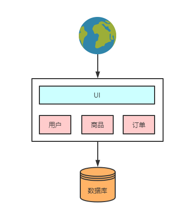
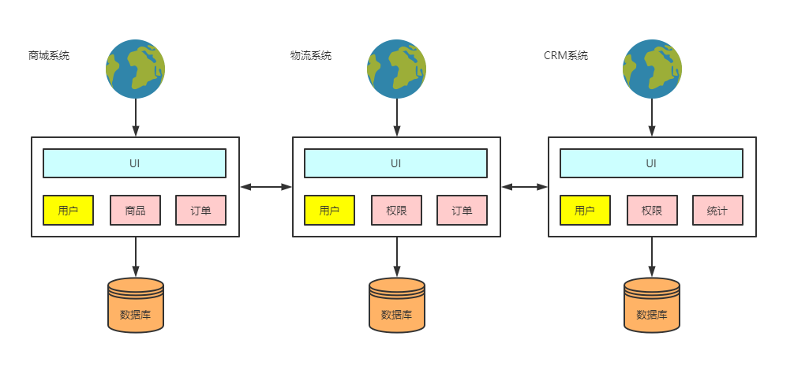
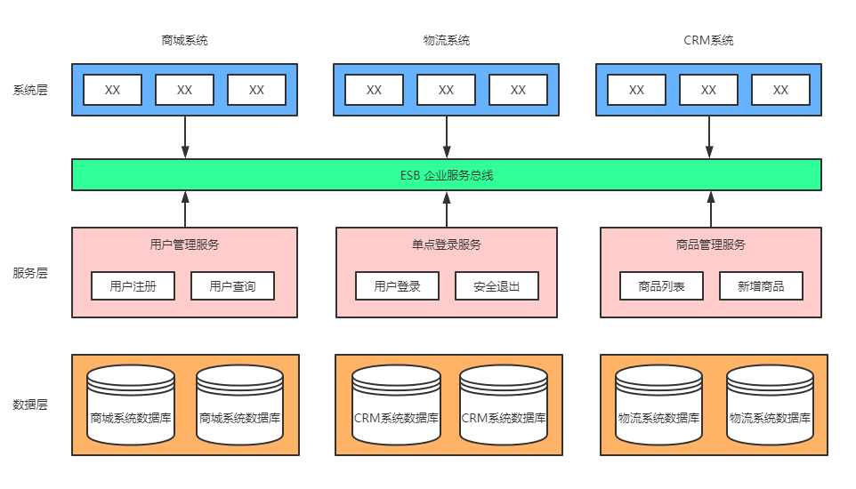
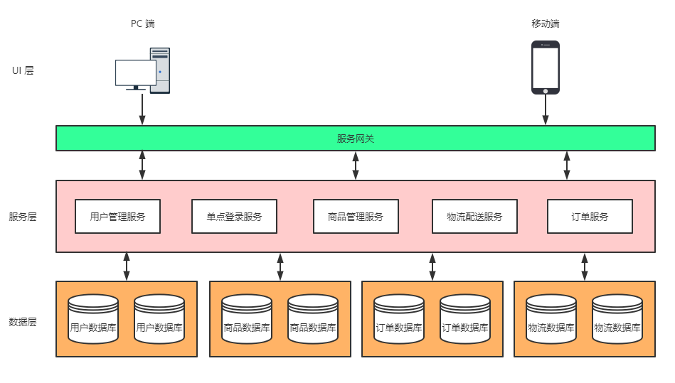

# 微服务的前世今生 

> 整体脉络:
>
> 单体 -> 垂直划分 -> `SOA` -> `micro service` 微服务 -> `services mesh`服务网格 -> `future` 

## 单一应用架构

通俗地讲，“单体应用（`monolith application` ）”就是将应用程序的所有功能都打包成一个独立的单元。当网站流量很小时，只需一个应用，将所有功能都部署在一起，以减少部署节点和成本。

### 特征

- 所有的功能集成在一个项目工程中；
- 所有的功能打一个 war 包部署到服务器；
- 应用与数据库分开部署；
- 通过部署应用集群和数据库集群来提高系统的性能。

### 优点：

- **开发简单**：一个 IDE 就可以快速构建单体应用；
- **便于共享**：单个归档文件包含所有功能，便于在团队之间以及不同的部署阶段之间共享；
- **易于测试**：单体应用一旦部署，所有的服务或特性就都可以使用了，这简化了测试过程，因为没有额外的依赖，每项测试都可以在部署完成后立刻开始；
- **容易部署**：整个项目就一个 war 包，Tomcat 安装好之后，应用扔上去就行了。群化部署也很容易，多个 Tomcat + 一个 Nginx 分分钟搞定。　

### 缺点：

- **妨碍持续交付**：随着时间的推移，单体应用可能会变得比较大，构建和部署时间也相应地延长，不利于频繁部署，阻碍持续交付。在移动应用开发中，这个问题会显得尤为严重；
- **不够灵活**：随着项目的逐渐变大，整个开发流程的时间也会变得很长，即使在仅仅更改了一行代码的情况下，软件开发人员需要花费几十分钟甚至超过一个小时的时间对所有代码进行编译，并接下来花费大量的时间重新部署刚刚生成的产品，以验证自己的更改是否正确。如果多个开发人员共同开发一个应用程序，那么还要等待其他开发人员完成了各自的开发。这降低了团队的灵活性和功能交付频率；
- **受技术栈限制**：项目变得越来越大的同时，我们的应用所使用的技术也会变得越来越多。这些技术有些是不兼容的，就比如在一个项目中大范围地混合使用 C++ 和 Java 几乎是不可能的事情。在这种情况下，我们就需要抛弃对某些不兼容技术的使用，而选择一种不是那么适合的技术来实现特定的功能。
- **可靠性差**：某个环节出现了死循环，导致内存溢出，会影响整个项目挂掉。
- **伸缩性差**：系统的扩容只能针对应用进行扩容，不能做到对某个功能进行扩容，扩容后必然带来资源浪费的问题。
- **技术债务**：假设我的代码库中有一个混乱的模块结构。此时，我需要添加一个新功能。如果这个模块结构清晰，可能我只需要2天时间就可以添加好这个功能，但是如今这个模块的结构很混乱，所以我需要4天时间。多出来的这两天就是债务利息。随着时间推移、人员变动，技术债务必然也会随之增多。

　　

## 垂直应用架构

### 特征

- 以单体结构规模的项目为单位进行垂直划分，就是将一个大项目拆分成一个一个单体结构项目。
- 项目与项目之间存在数据冗余，耦合性较大，比如上图中三个项目都存在用户信息。
- 项目之间的接口多为数据同步功能，如：数据库之间的数据库，通过网络接口进行数据库同步。

　　当访问量逐渐增大，单一应用增加机器带来的加速度越来越小，将应用拆成互不相干的几个应用，以提升效率。

### 优点

- 开发成本低，架构简单；
- 避免单体应用的无限扩大；
- 系统拆分实现了流量分担，解决了并发问题；
- 可以针对不同系统进行扩容、优化；
- 方便水平扩展，负载均衡，容错率提高；
- 不同的项目可采用不同的技术；
- 系统间相互独立。

### 缺点

- 系统之间相互调用，如果某个系统的端口或者 IP 地址发生改变，调用系统需要手动变更；
- 垂直架构中相同逻辑代码需要不断的复制，不能复用。
- 系统性能扩展只能通过扩展集群结点，成本高、有瓶颈。

　　

## `SOA`  面向服务架构

### 特征

- 基于 SOA 的架构思想将重复公用的功能抽取为组件，以服务的形式给各系统提供服务。
- 各项目（系统）与服务之间采用 WebService、RPC 等方式进行通信。
- 使用 ESB 企业服务总线作为项目与服务之间通信的桥梁。

　　当垂直应用越来越多，应用之间交互不可避免，将核心业务抽取出来，作为独立的服务，逐渐形成稳定的服务中心。当服务越来越多，容量的评估，小服务资源的浪费等问题逐渐显现，此时需增加一个调度中心基于访问压力实时管理集群容量，提高集群利用率。

> P.S. 从软件设计的角度上来说，ESB 是一个抽象的间接层，提取了服务调用过程中调用与被调用动态交互中的一些共同的东西，减轻了服务调用者的负担。Java 编程思想里提到：“所有的软件设计的问题都可以通过增加一个抽象的间接层而得到解决或者得到简化！”简单来说 ESB 就是一根管道，用来连接各个服务节点。为了集成不同系统，不同协议的服务，ESB 做了消息的转化解释和路由工作，让不同的服务互联互通。

### 优点

　　

- 将重复的功能抽取为服务，提高开发效率，提高系统的可重用性、可维护性。
- 可以针对不同服务的特点制定集群及优化方案；
- 采用 ESB 减少系统中的接口耦合。

　　

### 缺点

　　

- 系统与服务的界限模糊，不利于开发及维护。
- 虽然使用了 ESB，但是服务的接口协议不固定，种类繁多，不利于系统维护。
- 抽取的服务的粒度过大，系统与服务之间耦合性高。
- 涉及多种中间件，对开发人员技术栈要求高。
- 服务关系复杂，运维、测试部署困难

　　

## 微服务架构

### 特征

- 将系统服务层完全独立出来，并将服务层抽取为一个一个的微服务。
- 微服务中每一个服务都对应唯一的业务能力，遵循单一原则。
- 微服务之间采用 `RESTful ` 等轻量协议传输。

### 优点　　

- 团队独立：每个服务都是一个独立的开发团队，这个小团队可以是 2 到 5 人的开发人员组成；
- 技术独立：采用去中心化思想，服务之间采用 RESTful 等轻量协议通信，使用什么技术什么语言开发，别人无需干涉；
- 前后端分离：采用前后端分离开发，提供统一 Rest 接口，后端不用再为 PC、移动端开发不同接口；
- 数据库分离：每个微服务都有自己的存储能力，可以有自己的数据库。也可以有统一数据库；
- 服务拆分粒度更细，有利于资源重复利用，提高开发效率；
- 一个团队的新成员能够更快投入生产；
- 微服务易于被一个开发人员理解，修改和维护，这样小团队能够更关注自己的工作成果。无需通过合作才能体现价值；
- 可以更加精准的制定每个服务的优化方案（比如扩展），提高系统可维护性；
- 适用于互联网时代，产品迭代周期更短。

### 缺点

- 微服务过多，服务治理成本高，不利于系统维护；
- 分布式系统开发的技术成本高（网络问题、容错问题、调用关系、分布式事务等），对团队挑战大；
- 微服务将原来的函数式调用改为服务调用，不管是用 rpc，还是 http rest 方式，都会增大系统整体延迟。这个是再所难免的，这个就需要我们将原来的串行编程改为并发编程甚至异步编程，增加了技术门槛；
- 多服务运维难度，随着服务的增加，运维的压力也在增大；
- 测试的难度提升。服务和服务之间通过接口来交互，当接口有改变的时候，对所有的调用方都是有影响的，这时自动化测试就显得非常重要了，如果要靠人工一个个接口去测试，那工作量就太大了，所以 API 文档的管理尤为重要。

> 作者：哈喽沃德先生
> 链接：https://juejin.cn/post/6844904078485504008
> 来源：稀土掘金
> 著作权归作者所有。商业转载请联系作者获得授权，非商业转载请注明出处。

