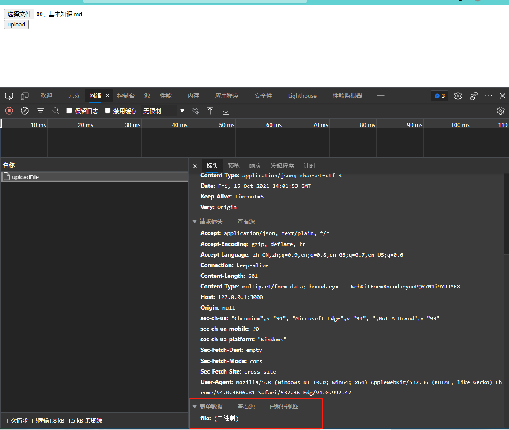
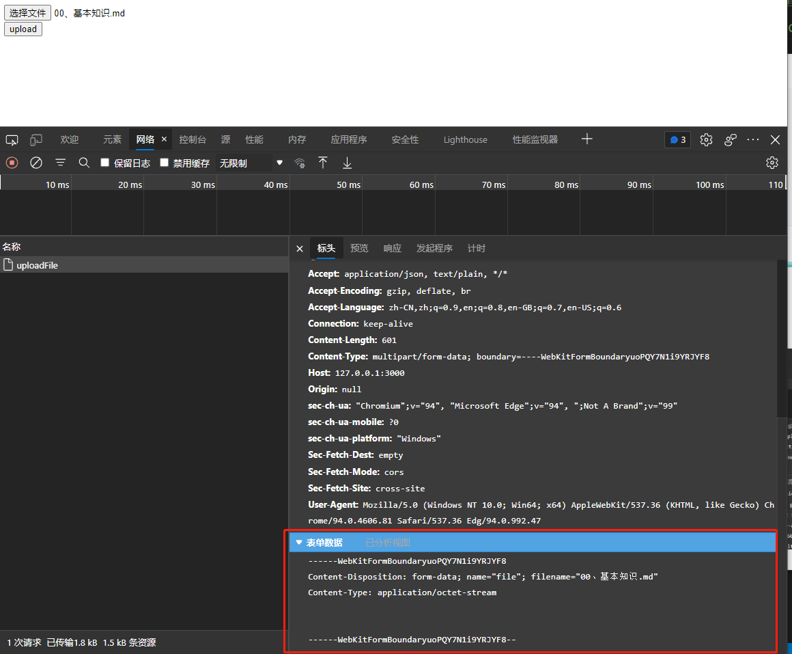

[TOC]


---


# 1. 文件上传的发展史

## 1.1 form表单同步上传的方式

> 在ajax请求出来之前，人们都是直接通过form表单提交文件，或者form配合iframe（已废弃）进行文件上传，form配合input进行文件选择。

那么为了了解清楚他们的工作原理，我们有必要来理解一下`form`以及`input`元素。

### form元素的介绍

> `<form> `标签用于为用户输入创建 HTML 表单。
>
> 表单能够包含 [input 元素](https://www.w3school.com.cn/tags/tag_input.asp)，比如文本字段、复选框、单选框、提交按钮等等。
>
> 表单还可以包含 [menus](https://www.w3school.com.cn/tags/tag_menu.asp)、[textarea](https://www.w3school.com.cn/tags/tag_textarea.asp)、[fieldset](https://www.w3school.com.cn/tags/tag_fieldset.asp)、[legend](https://www.w3school.com.cn/tags/tag_legend.asp) 和 [label 元素](https://www.w3school.com.cn/tags/tag_label.asp)。
>
> 表单用于向服务器传输数据。

#### form的属性

| 属性           | 描述                                     |
| :------------- | :--------------------------------------- |
| accept         | HTML 5 中不支持。                        |
| accept-charset | 规定服务器可处理的表单数据字符集。       |
| action         | 规定当提交表单时向何处发送表单数据。     |
| autocomplete   | 规定是否启用表单的自动完成功能。         |
| enctype        | 规定在发送表单数据之前如何对其进行编码。 |
| method         | 规定用于发送 form-data 的 HTTP 方法。    |
| name           | 规定表单的名称。                         |
| novalidate     | 如果使用该属性，则提交表单时不进行验证。 |
| rel            | 规定链接资源和当前文档之间的关系。       |
| target         | 规定在何处打开 action URL。              |

#### 说明

enctype 属性可能的值：

- application/x-www-form-urlencoded
- multipart/form-data
- text/plain


### `input`元素的介绍

使用 **`type="file"`** 的`input`元素使得用户可以选择一个或多个元素以[提交表单](https://developer.mozilla.org/zh-CN/docs/Learn/Forms)的方式上传到服务器上，或者通过 Javascript 的 [File API](https://developer.mozilla.org/zh-CN/docs/Web/API/File/Using_files_from_web_applications) 对文件进行操作。

#### input 的属性：

| 属性                                                         | 描述                                                         |
| :----------------------------------------------------------- | :----------------------------------------------------------- |
| [accept](https://www.runoob.com/tags/att-input-accept.html)  | 规定通过文件上传来提交的文件的类型。 (只针对type="file")     |
| [align](https://www.runoob.com/tags/att-input-align.html)    | HTML5已废弃，不赞成使用。规定图像输入的对齐方式。 (只针对type="image") |
| [alt](https://www.runoob.com/tags/att-input-alt.html)        | 定义图像输入的替代文本。 (只针对type="image")                |
| [autocomplete](https://www.runoob.com/tags/att-input-autocomplete.html) | autocomplete 属性规定 <input> 元素输入字段是否应该启用自动完成功能。 |
| [autofocus](https://www.runoob.com/tags/att-input-autofocus.html) | 属性规定当页面加载时 <input> 元素应该自动获得焦点。          |
| [checked](https://www.runoob.com/tags/att-input-checked.html) | checked 属性规定在页面加载时应该被预先选定的 <input> 元素。 (只针对 type="checkbox" 或者 type="radio") |
| [disabled](https://www.runoob.com/tags/att-input-disabled.html) | disabled 属性规定应该禁用的 <input> 元素。                   |
| [form](https://www.runoob.com/tags/att-input-form.html)      | form 属性规定 <input> 元素所属的一个或多个表单。             |
| [formaction](https://www.runoob.com/tags/att-input-formaction.html) | 属性规定当表单提交时处理输入控件的文件的 URL。(只针对 type="submit" 和 type="image") |
| [formenctype](https://www.runoob.com/tags/att-input-formenctype.html) | 性规定当表单数据提交到服务器时如何编码(只适合 type="submit" 和 type="image")。 |
| [formmethod](https://www.runoob.com/tags/att-input-formmethod.html) | 定义发送表单数据到 action URL 的 HTTP 方法。 (只适合 type="submit" 和 type="image") |
| [formnovalidate](https://www.runoob.com/tags/att-input-formnovalidate.html) | formnovalidate 属性覆盖 <form> 元素的 novalidate 属性。      |
| [formtarget](https://www.runoob.com/tags/att-input-formtarget.html) | 规定表示提交表单后在哪里显示接收到响应的名称或关键词。(只适合 type="submit" 和 type="image") |
| [height](https://www.runoob.com/tags/att-input-height.html)  | 规定 <input>元素的高度。(只针对type="image")                 |
| [list](https://www.runoob.com/tags/att-input-list.html)      | 属性引用 <datalist> 元素，其中包含 <input> 元素的预定义选项。 |
| [max](https://www.runoob.com/tags/att-input-max.html)        | 属性规定 <input> 元素的最大值。                              |
| [maxlength](https://www.runoob.com/tags/att-input-maxlength.html) | 属性规定 <input> 元素中允许的最大字符数。                    |
| [min](https://www.runoob.com/tags/att-input-min.html)        | 属性规定 <input>元素的最小值。                               |
| [multiple](https://www.runoob.com/tags/att-input-multiple.html) | 属性规定允许用户输入到 <input> 元素的多个值。                |
| [name](https://www.runoob.com/tags/att-input-name.html)      | name 属性规定 <input> 元素的名称。                           |
| [pattern](https://www.runoob.com/tags/att-input-pattern.html) | pattern 属性规定用于验证 <input> 元素的值的正则表达式。      |
| [placeholder](https://www.runoob.com/tags/att-input-placeholder.html) | placeholder 属性规定可描述输入 <input> 字段预期值的简短的提示信息 。 |
| [readonly](https://www.runoob.com/tags/att-input-readonly.html) | readonly 属性规定输入字段是只读的。                          |
| [required](https://www.runoob.com/tags/att-input-required.html) | 属性规定必需在提交表单之前填写输入字段。                     |
| [size](https://www.runoob.com/tags/att-input-size.html)      | size 属性规定以字符数计的 <input> 元素的可见宽度。           |
| [src](https://www.runoob.com/tags/att-input-src.html)        | src 属性规定显示为提交按钮的图像的 URL。 (只针对 type="image") |
| [step](https://www.runoob.com/tags/att-input-step.html)      | step 属性规定 <input> 元素的合法数字间隔。                   |
| [type](https://www.runoob.com/tags/att-input-type.html)      | type 属性规定要显示的 <input> 元素的类型。                   |
| [value](https://www.runoob.com/tags/att-input-value.html)    | 指定 <input> 元素 value 的值。                               |
| [width](https://www.runoob.com/tags/att-input-width.html)    | width 属性规定 <input> 元素的宽度。 (只针对type="image")     |

##### 1. `accept` 

`accept`属性是一个字符串，它定义了文件 input 应该接受的文件类型。这个字符串是一个以逗号为分隔的==唯一文件类型说明符==列表。由于给定的文件类型可以用多种方式指定，因此当你需要给定格式的文件时，提供一组完整的类型指定符是非常有用的。

* 简单的来说，这个属性就是用来限制用户选择的文件类型的
* 来看一下例子吧

```html
<!--
比如我们要选择的是一个`word`文件，就可以这么使用
-->
<input  type='file' accept='.doc, .docx' />


<!--
一个文件选择器需要能被表示成一张图片的内容，包括标准的图片格式和 PDF 文件
-->
<input type="file" accept="image/*,.pdf">

```

##### 2.`file`属性

[`FileList`](https://developer.mozilla.org/zh-CN/docs/Web/API/FileList) 对象每个已选择的文件。如果 [`multiple`](https://developer.mozilla.org/zh-CN/docs/Web/HTML/Element/Input/file#attr-multiple) 属性没有指定，则这个列表只有一个成员。

##### 3. `multiple`

当指定布尔类型属性， 文件 input 允许用户选择多个文件。

```html
<input type="file" multiple name="uploads" id="uploads">
<!-- 表示可以选择多个文件-->
```

##### 4. name

指定上传的文件名。

## 1.2 文件的异步上传

借助`ajax + formData`实现

# 2. 开始实现文件上传

`talk is cheap, show me the code`

## 2.1直接使用form表单同步上传

* 前端

```html
<!DOCTYPE html>
<html lang="en">
<head>
    <meta charset="UTF-8">
    <meta http-equiv="X-UA-Compatible" content="IE=edge">
    <meta name="viewport" content="width=device-width, initial-scale=1.0">
    <title>Form 文件上传 </title>
</head>
<body>
    <form action='http://127.0.0.1:3000/formData/uploadFile' method='POST' enctype='multipart/form-data' >
        <input type='file' name='file' />
        <br />
        <input type='submit' value='上传文件' />
    </form>
</body>
</html>
```

* 后端

```js
'use strict';
const koa = require('koa')
const router = require('koa-router')();
const path = require('path')
const cors = require('koa2-cors')
const multer = require('koa-multer')
const app = new koa()

app.use(cors())
const storage = multer.diskStorage({
    // 存储的位置
    destination: path.join(process.cwd(), "upload"),
    // 文件名
    filename(req, file, cb) {
        const filename = file.originalname.split(".")
        //   利用时间戳来命名接收到的文件
        cb(null, `${Date.now()}.${filename[filename.length - 1]}`)
    }
})
const upload = multer({ storage });

// const upload = multer({ dest: 'uploads/' })
// 使用简版的，只能保存文件，却不能保持文件格式，或者说接收到文件的保存命名自定义

router.post('/formData/uploadFile', upload.single("file"), async ctx => {
    console.log(ctx.req.file)
    // req是node原生的request对象
    ctx.status = 201
    ctx.body = {
        file: ctx.req.file,
        request: ctx.request
    }
})

app.use(router.routes()).use(router.allowedMethods())
app.listen(3000, () => {
    console.log('server is running at:\r\nhttp://localhost:3000')
})
```

> 这里使用的是`koa, koa-multer`实现文件的上传，注意`koa-multer`其实就是封装了`express`版本的`multer`，这也可以看出来`koa2`的很多中间间都是直接封装`express`的，在使用的时候，可能要注意`ctx.req`跟`ctx.request`的区别。

此外，该方式仅适用于较小文件的上传，大文件一般使用断点上传，避免传输中断，重新传输，浪费资源。

> Multer 是一个 node.js 中间件，用于处理 `multipart/form-data` 类型的表单数据，它主要用于上传文件。它是写在 [busboy](https://github.com/mscdex/busboy) 之上非常高效。
>
> **注意**: Multer 不会处理任何非 `multipart/form-data` 类型的表单数据。
>
> [multer/README-zh-cn.md at master · expressjs/multer (github.com)](https://github.com/expressjs/multer/blob/master/doc/README-zh-cn.md)

* 比如说，这个时候，我们给后端发一个js创建的`FormData`数据时，上面写的`node`服务就会报错


* 这个时候就要使用到下面的方法了。

## 2.2 通过`FormData ajax`方式

* 前端

```html
<!DOCTYPE html>
<html lang="en">
  <head>
    <meta charset="UTF-8" />
    <meta http-equiv="X-UA-Compatible" content="IE=edge" />
    <meta name="viewport" content="width=device-width, initial-scale=1.0" />
    <script src="https://cdn.bootcdn.net/ajax/libs/axios/0.21.1/axios.js"></script>
    <title>formdata文件上传</title>
  </head>
  <body>
    <form>
      <input type="file" id="uploadFile" />
      <br />
      <button onclick="upload(event)">upload</button>
    </form>

    <script>
      const uploadFileEle = document.querySelector("#uploadFile");
      const $http = axios.create({
        baseURL: "http://127.0.0.1:3000/ajax/",
        timeout: 60000,
      });

      async function upload(event) {
        event.preventDefault();
        if (!uploadFileEle.files.length) return;
        const file = uploadFileEle.files[0]; // 获取单个文件
        console.log(file);
        let formData = new FormData()
        
        // 注意这里的key要跟后端的一致
        formData.set('file', file)
        console.log(formData.entries())
        $http.post('/uploadFile', formData).then(r=>{
            console.log(r)
        }).catch(e=>{
            console.error(e)
        })

      }

    </script>
  </body>
</html>

```

> 上传表单的样子
>
> 
>
> 查看源
>
> 

* 后端

```js
'use strict';
const koa       =       require('koa')
const koaBody   =       require('koa-body')
const router    =       require('koa-router')();
const fs        =       require('fs')
const path      =       require('path')
const cors      =       require('koa2-cors')

const app = new koa()

app.use(koaBody({
    multipart: true,    // 支持文件格式
    formidable: {
        maxFileSize: 200*1024*1024	// 设置上传文件大小最大限制，默认2M
    }
}))

app.use(cors())

router.get('/', async(ctx)=>{
    ctx.body = 'hello'
})
// 上传一个文件
router.post('/ajax/uploadFile', async(ctx)=>{
    // 上传单个文件
    // console.log(ctx.request)
    const { files } = ctx.request;
    const { file } = files // 获取上传文件
    // 这里的file是前端formData文件的key

     // 读取文件的二进制数据
    const fileData = fs.readFileSync(file.path);
    const prefix = path.join(__dirname, `/upload/`)
    const filePath = prefix + file.name
    
    // 创建目录，不然会报错呜呜
    !fs.existsSync(prefix) && fs.mkdirSync(prefix)
    // 写文件

    const writer = fs.createWriteStream(filePath, {
        flags:'w'
    })
    
    writer.write(fileData);

    ctx.status = 201
    ctx.body = {
        file: fileData
    }

})

app.use(router.routes()).use(router.allowedMethods())
app.listen(3000,()=>{
    console.log('server is running at:\r\n http://localhost:3000')
})
```

* 后端使用的是`koa2, koa-body`

## 2.3 大文件的断点上传


* 再说吧，休息一下


# 附：

## [唯一文件类型说明符](https://developer.mozilla.org/zh-CN/docs/Web/HTML/Element/Input/file#唯一文件类型说明符)

**唯一文件类型说明符**是一个字符串，表示在 `file` 类型的`input`元素中用户可以选择的文件类型。每个唯一文件类型说明符可以采用下列形式之一：

- 一个以英文句号（"."）开头的合法的不区分大小写的文件名扩展名。例如： `.jpg`，`.pdf` 或 `.doc`。
- 一个不带扩展名的 MIME 类型字符串。
- 字符串 `audio/*`， 表示“任何音频文件”。
- 字符串 `video/*`，表示 “任何视频文件”。
- 字符串 `image/*`，表示 “任何图片文件”。


# . 参考

1. [漫谈前端进化史之从Form表单到文件上传 | 一个人的孤落时辰 (qinyuanpei.github.io)](https://qinyuanpei.github.io/posts/2463121881/#从Form表单说起)
2. [HTML  标签 (w3school.com.cn)](https://www.w3school.com.cn/tags/tag_form.asp)
3. [ - HTML（超文本标记语言） | MDN (mozilla.org)](https://developer.mozilla.org/zh-CN/docs/Web/HTML/Element/Input/file#unique_file_type_specifiers)
4. [HTML input 标签 | 菜鸟教程 (runoob.com)](https://www.runoob.com/tags/tag-input.html)