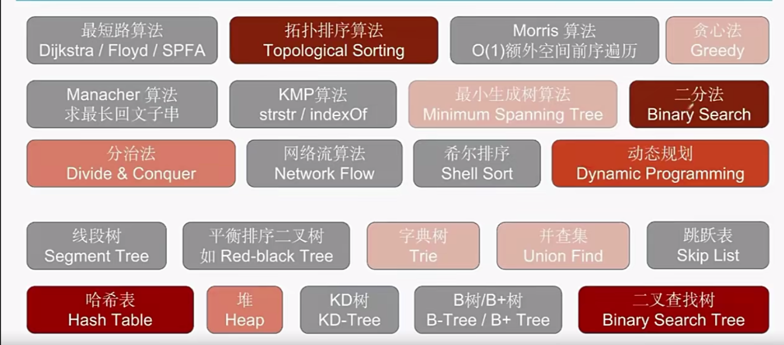
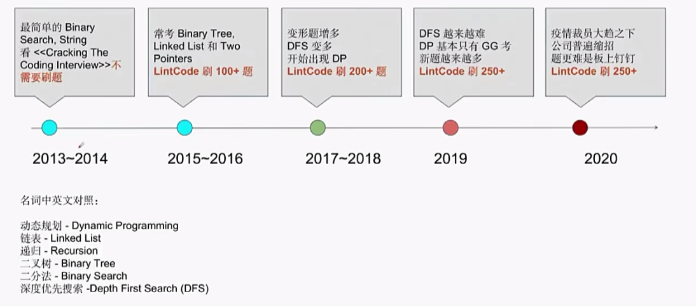
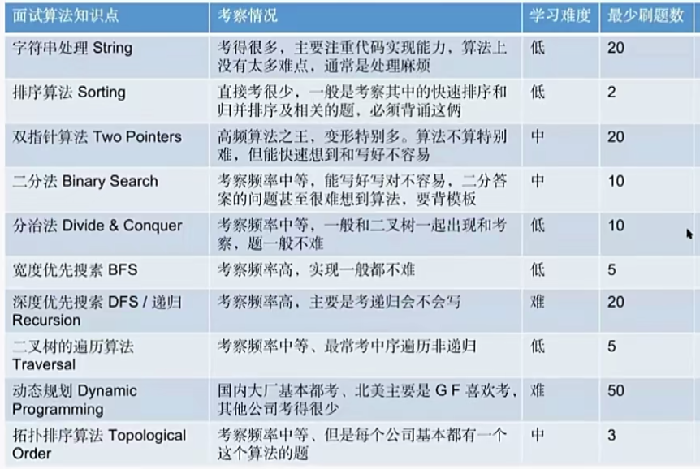
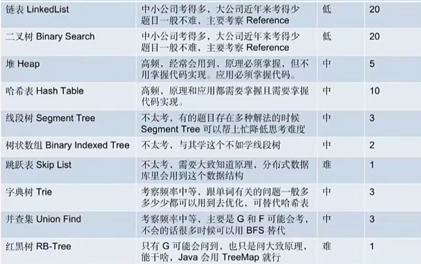
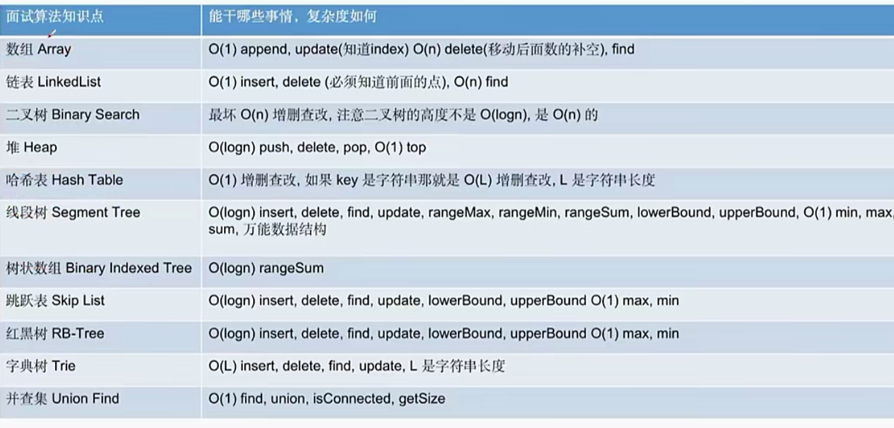
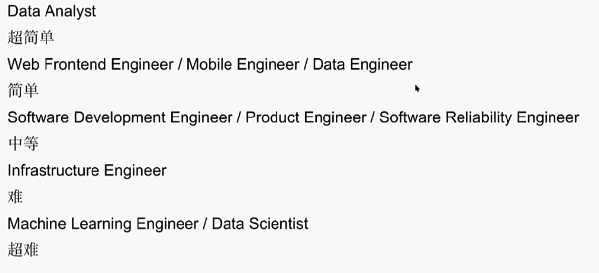

---

---

# 简介

本页主要是我学习数据结构与算法的打卡点。

:::details 代码技巧

1. 架构优于逻辑;
2. 工程化，解耦合;
3. 代码可读性优于代码量;

    * 使用含义清晰的变量名
    * 使用简单易读的处理逻辑

4. 注重`code review`;
5. 模块化开发；
6. 缩进层数尽量少于3；

    * 因为代码的缩进，会增加代码的理解难度。

:::

::: tip 算法可视化网站

* [数据结构和算法动态可视化](https://visualgo.net/zh)   
* [数据结构可视化（全英文）](https://www.cs.usfca.edu/~galles/visualization/Algorithms.html)   
* [算法可视化（有源码） ](https://algorithm-visualizer.org/) 
:::

* 面试官的注重点

:::details 
* 代码到底写完没有
* 代码风格好不好
    - 可读性
    - 变量名，函数名
    - 空格以及换行的正确使用

* 异常检测
* `BUG FREE`

:::

:::details 考察范围

* 一个判断算法考不考的技巧

> 带人名的一般不考，因为他们一般用来解决特定的问题。

* 面试难度的变化

* 考察频率

* 常见数据结构的时间复杂度

* 面试难度

> 相对而言，越接近核心数据越难，或者说越后端越难。

:::

学习方向主要分以下几个阶段:
    

* 基本数据结构
    - 链表
    - 栈
    - 队列
    - 字典
* 基本算法
    - 排序算法
    - 查找算法

* 中级算法

* 高级算法

## 基本知识

* [基本数据结构](.//basic_struct.md)
* [排序算法](./sort.md)

## 算法体系

## 刷题

> ⚠️ Leetcode 灵神

[周赛模版题](./leetcode/周赛模版.md)
