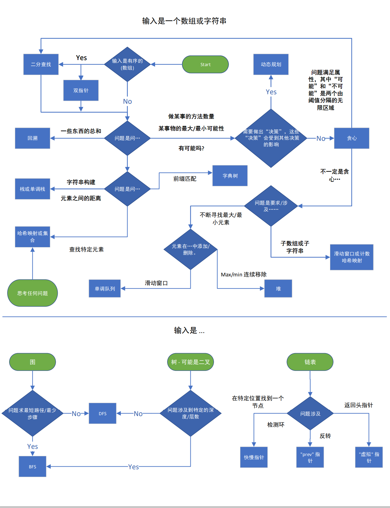

# 常用的leetcode 模版

::: tip 声明
该部分内容大部分来源网络，包括但不限于以下链接

* https://leetcode.cn/leetbook/

辅以个人学习感悟并编码验证。
:::




## 磨刀不误砍柴工

[分享｜从集合论到位运算，常见位运算技巧分类总结！](https://leetcode.cn/circle/discuss/CaOJ45/)


## 双指针

### 1. 双指针: 只有一个输入, 从两端开始遍历

```java
public int fn(int[] arr) {
    int left = 0;
    int right = arr.length - 1;
    int ans = 0;

    while (left < right) {
        // 一些根据 letf 和 right 相关的代码补充
        if (CONDITION) {
            left++;
        } else {
            right--;
        }
    }

    return ans;
}
```


### 2. 双指针: 有两个输入, 两个都需要遍历完

```java
public int fn(int[] arr1, int[] arr2) {
    int i = 0, j = 0, ans = 0;

    while (i < arr1.length && j < arr2.length) {
        // 根据题意补充代码
        if (CONDITION) {
            i++;
        } else {
            j++;
        }
    }

    while (i < arr1.length) {
        // 根据题意补充代码
        i++;
    }

    while (j < arr2.length) {
        // 根据题意补充代码
        j++;
    }

    return ans;
}
```

### 3. 滑动窗口

```java
public int fn(int[] arr) {
    int left = 0, ans = 0, curr = 0;

    for (int right = 0; right < arr.length; right++) {
        // 根据题意补充代码来将 arr[right] 添加到 curr

        while (WINDOW_CONDITION_BROKEN) {
            // 从 curr 中删除 arr[left]
            left++;
        }

        // 更新 ans
    }

    return ans;
}
```


### 4. 快慢指针

```java
public int fn(ListNode head) {
    ListNode slow = head;
    ListNode fast = head;
    int ans = 0;

    while (fast != null && fast.next != null) {
        // 根据题意补充代码
        slow = slow.next;
        fast = fast.next.next;
    }

    return ans;
}
```


## 前缀和

```java
public int[] fn(int[] arr) {
    int[] prefix = new int[arr.length];
    prefix[0] = arr[0];

    for (int i = 1; i < arr.length; i++) {
        prefix[i] = prefix[i - 1] + arr[i];
    }

    return prefix;
}
```


## 字符串

### 1. 高效的字符串构建

```java
public String fn(char[] arr) {
    StringBuilder sb = new StringBuilder();
    for (char c: arr) {
        sb.append(c);
    }

    return sb.toString();
}

```


## 链表

### 1. 反转链表

```java
public ListNode fn(ListNode head) {
    ListNode curr = head;
    ListNode prev = null;
    while (curr != null) {
        ListNode nextNode = curr.next;
        curr.next = prev;
        prev = curr;
        curr = nextNode;
    }

    return prev;
}
```


## 数组

### 1. 找到符合确切条件的子数组数

```java
public int fn(int[] arr, int k) {
    Map<Integer, Integer> counts = new HashMap<>();
    counts.put(0, 1);
    int ans = 0, curr = 0;

    for (int num: arr) {
        // 根据题意补充代码来改变 curr
        ans += counts.getOrDefault(curr - k, 0);
        counts.put(curr, counts.getOrDefault(curr, 0) + 1);
    }

    return ans;
}
```


## 单调栈

```java
public int fn(int[] arr) {
    Deque<Integer> st = new LinkedList<>();
    int ans = 0;

    for (int num: arr) {
        // 对于单调递减的情况，只需将 > 翻转到 <
        while (!stack.empty() && stack.peek() > num) {
            // 根据题意补充代码
            stack.pop();
        }

        stack.push(num);
    }

    return ans;
}
```

:::details 739.每日温度 

给定一个整数数组 `temperatures` ，表示每天的温度，返回一个数组 `answer` ，其中 `answer[i]` 是指对于第 `i` 天，下一个更高温度出现在几天后。如果气温在这之后都不会升高，请在该位置用 `0` 来代替。

 

**示例 1:**

```
输入: temperatures = [73,74,75,71,69,72,76,73]
输出: [1,1,4,2,1,1,0,0]
```

**示例 2:**

```
输入: temperatures = [30,40,50,60]
输出: [1,1,1,0]
```

**示例 3:**

```
输入: temperatures = [30,60,90]
输出: [1,1,0]
```

 

**提示：**

- `1 <= temperatures.length <= 105`
- `30 <= temperatures[i] <= 100`


```java
class Solution {
    public int[] dailyTemperatures(int[] temperatures) {
        Deque<Integer> st = new LinkedList<>();
            int n = temperatures.length;
            int[] ans = new int[n];
            int reg;
            for(int i=0; i<n; i++ ) {
                reg = temperatures[i];
                // 栈顶元素温度小于当前温度，更新栈顶元素的答案
                while (!st.isEmpty() && temperatures[st.peek()] < reg) {
                    Integer pop = st.pop();
                    ans[pop] = i-pop;
                }
                st.push(i);
            }
            return ans;
    }
}
```


:::

## 二叉树

### DFS 递归

```java
public int dfs(TreeNode root) {
    if (root == null) {
        return 0;
    }
    int ans = 0;
    // 根据题意补充代码
    dfs(root.left);
    dfs(root.right);
    return ans;
}

```

### DFS 迭代

```java
public int dfs(TreeNode root) {
    Stack<TreeNode> stack = new Stack<>();
    stack.push(root);
    int ans = 0;

    while (!stack.empty()) {
        TreeNode node = stack.pop();
        // 根据题意补充代码
        if (node.left != null) {
            stack.push(node.left);
        }
        if (node.right != null) {
            stack.push(node.right);
        }
    }

    return ans;
}

```


### BFS

```java 
public int fn(TreeNode root) {
    Queue<TreeNode> queue = new LinkedList<>();
    queue.add(root);
    int ans = 0;
    while (!queue.isEmpty()) {
        int currentLength = queue.size();
        // 做一些当前层的操作
        for (int i = 0; i < currentLength; i++) {
            TreeNode node = queue.remove();
            // 根据题意补充代码
            if (node.left != null) {
                queue.add(node.left);
            }
            if (node.right != null) {
                queue.add(node.right);
            }
        }
    }

    return ans;
}
```


## 贪心

::: details [2835. 使子序列的和等于目标的最少操作次数](https://leetcode.cn/problems/minimum-operations-to-form-subsequence-with-target-sum/)

给你一个下标从 **0** 开始的数组 `nums` ，它包含 **非负** 整数，且全部为 `2` 的幂，同时给你一个整数 `target` 。

一次操作中，你必须对数组做以下修改：

- 选择数组中一个元素 `nums[i]` ，满足 `nums[i] > 1` 。
- 将 `nums[i]` 从数组中删除。
- 在 `nums` 的 **末尾** 添加 **两个** 数，值都为 `nums[i] / 2` 。

你的目标是让 `nums` 的一个 **子序列** 的元素和等于 `target` ，请你返回达成这一目标的 **最少操作次数** 。如果无法得到这样的子序列，请你返回 `-1` 。

数组中一个 **子序列** 是通过删除原数组中一些元素，并且不改变剩余元素顺序得到的剩余数组。

 

**示例 1：**

```
输入：nums = [1,2,8], target = 7
输出：1
解释：第一次操作中，我们选择元素 nums[2] 。数组变为 nums = [1,2,4,4] 。
这时候，nums 包含子序列 [1,2,4] ，和为 7 。
无法通过更少的操作得到和为 7 的子序列。
```

**示例 2：**

```
输入：nums = [1,32,1,2], target = 12
输出：2
解释：第一次操作中，我们选择元素 nums[1] 。数组变为 nums = [1,1,2,16,16] 。
第二次操作中，我们选择元素 nums[3] 。数组变为 nums = [1,1,2,16,8,8] 。
这时候，nums 包含子序列 [1,1,2,8] ，和为 12 。
无法通过更少的操作得到和为 12 的子序列。
```

**示例 3：**

```
输入：nums = [1,32,1], target = 35
输出：-1
解释：无法得到和为 35 的子序列。
```

 

**提示：**

- `1 <= nums.length <= 1000`
- `1 <= nums[i] <= 230`
- `nums` 只包含非负整数，且均为 2 的幂。
- `1 <= target < 231`


---

由于一个数可以一分为二，所以整个数组可以全部变成1。因此如果数组和小于target，则无解。否则一定有解。

然后target从低位到高位进行贪心。

* 如果i位是0则跳过；
* 如果 target 的第 i 位是 1 
    * 那么先看看所有 $\leq{2^i} $ 的元素和能否 $\geq{target \& mask}$， 其中 $mask=2^{i+1} -1 $。 如果能，那么必然可以合并出$target \& mask $, 无需拆。
    
  * 如果不能，需要把一个更大的数（设他是$2^j$）不断地一分为二，直到分出 $2^i$ 为止。分解完之后$2^i, 2^{i+1}, 2^{i+2},... , 2^{j-1} $这些2的幂我们都有了，所以后面$i+1, i+2, .. j-1$ 这些比特位就可以无需判断，所以可以直接从第 $j$ 个比特位开始判断。


---

实现

```java
class Solution {
    public int minOperations(List<Integer> nums, int target) {
        long s = 0;
        long[] cnt = new long[31];
        for(int i: nums) {
            s += i;
            /**
            低位连续0的个数
             */
            cnt[Integer.numberOfTrailingZeros(i)]++;
        }
        if(s < target) return -1;
        int ans = 0, i = 0;
        s = 0;

        while((1L << i) <= target ) {
            s += cnt[i] << i;  // 2^i
            int mask = (int)((1L << ++i) - 1);// 2^(i+1) - 1 =》 100 -> 011 
            if(s >= (target & mask)) {
                // 如果当前总和s已经大于等于target的低i位，继续下一轮操作
                continue; 
            }
            ans++; // 一定要找更大的数操作
            for(; cnt[i] == 0; i++) {
                ans++; // 从i开始，找到下一个出现次数不为0的数字，需要进行操作，将操作次数ans加1
            }
        }
        return ans;

    }
}
```


:::


## 图论


### DFS 递归

以下图模板假设节点编号从 0 到 n - 1 ，并且图是以邻接表的形式给出的。根据问题的不同，您可能需要在使用模板之前将输入转换为等效的**邻接表**。

```java
Set<Integer> seen = new HashSet<>();

public int fn(int[][] graph) {
    seen.add(START_NODE);
    return dfs(START_NODE, graph);
}

public int dfs(int node, int[][] graph) {
    int ans = 0;
    // 根据题意补充代码
    for (int neighbor: graph[node]) {
        if (!seen.contains(neighbor)) {
            seen.add(neighbor);
            ans += dfs(neighbor, graph);
        }
    }

    return ans;
}
```

### DFS 迭代

以下图模板假设节点编号从 0 到 n - 1 ，并且图是以邻接表的形式给出的。根据问题的不同，您可能需要在使用模板之前将输入转换为等效的**邻接表**。

```java
public int fn(int[][] graph) {
    Stack<Integer> stack = new Stack<>();
    Set<Integer> seen = new HashSet<>();
    stack.push(START_NODE);
    seen.add(START_NODE);
    int ans = 0;

    while (!stack.empty()) {
        int node = stack.pop();
        // 根据题意补充代码
        for (int neighbor: graph[node]) {
            if (!seen.contains(neighbor)) {
                seen.add(neighbor);
                stack.push(neighbor);
            }
        }
    }

    return ans;
}
```


### BFS

以下图模板假设节点编号从 0 到 n - 1 ，并且图是以邻接表的形式给出的。根据问题的不同，您可能需要在使用模板之前将输入转换为等效的**邻接表**。

```java
public int fn(int[][] graph) {
    Queue<Integer> queue = new LinkedList<>();
    Set<Integer> seen = new HashSet<>();
    queue.add(START_NODE);
    seen.add(START_NODE);
    int ans = 0;

    while (!queue.isEmpty()) {
        int node = queue.remove();
        // 根据题意补充代码
        for (int neighbor: graph[node]) {
            if (!seen.contains(neighbor)) {
                seen.add(neighbor);
                queue.add(neighbor);
            }
        }
    }

    return ans;
}
```


### 树上倍增

::: details


```java
```


:::


## 堆

### 前 k 个元素

```java
public int[] fn(int[] arr, int k) {
    PriorityQueue<Integer> heap = new PriorityQueue<>((a,b)->a-b);
    for (int num: arr) {
        heap.add(num);
        if (heap.size() > k) {
            heap.poll();
        }
    }

    int[] ans = new int[k];
    for (int i = 0; i < k; i++) {
        ans[i] = heap.poll();
    }

    return ans;
}
```

```shell
offer：加入元素
clear：删除所有元素
isEmpty：判断队列是否为空
poll：检索并删除此队列的头，如果此队列为空，则返回 null 
peek：检索但不删除此队列的头，如果此队列为空，则返回null
remove：检索并删除此队列的头，如果此队列为空会出现异常
comparator：返回用于排序此队列中元素的比较器，如果此队列是根据其元素的自然顺序排序的，则返回null
contains：返回队列中是否包含所给元素
size：返回所含的元素数量

```


## 二分

⚠️二分需要有序

```java
public int fn(int[] arr) {
    int left = MINIMUM_POSSIBLE_ANSWER;
    int right = MAXIMUM_POSSIBLE_ANSWER;
    while (left <= right) {
        int mid = left + (right - left) / 2;
        if (check(mid)) {
            right = mid - 1;
        } else {
            left = mid + 1;
        }
    }

    return left;
}

public boolean check(int x) {
    // 这个函数的具体实现取决于问题
    return BOOLEAN;
}
```


## 回溯

```java
public int backtrack(STATE curr, OTHER_ARGUMENTS...) {
    if (BASE_CASE) {
        // 修改答案
        return 0;
    }
    int ans = 0;
    for (ITERATE_OVER_INPUT) {
        // 修改当前状态
        ans += backtrack(curr, OTHER_ARGUMENTS...)
        // 撤消对当前状态的修改
    }
}
```


## 动态规划

### 自顶向下

```java
Map<STATE, Integer> memo = new HashMap<>();

public int fn(int[] arr) {
    return dp(STATE_FOR_WHOLE_INPUT, arr);
}

public int dp(STATE, int[] arr) {
    if (BASE_CASE) {
        return 0;
    }

    if (memo.contains(STATE)) {
        return memo.get(STATE);
    }

    int ans = RECURRENCE_RELATION(STATE);
    memo.put(STATE, ans);
    return ans;
}
```


## 字典树

```java
// 注意:只有需要在每个节点上存储数据时才需要使用类。
// 否则，您可以只使用哈希映射实现一个前缀树。
class TrieNode {
    // 你可以将数据存储在节点上
    int data;
    Map<Character, TrieNode> children;
    TrieNode() {
        this.children = new HashMap<>();
    }
}

public TrieNode buildTrie(String[] words) {
    TrieNode root = new TrieNode();
    for (String word: words) {
        TrieNode curr = root;
        for (char c: word.toCharArray()) {
            if (!curr.children.containsKey(c)) {
                curr.children.put(c, new TrieNode());
            }

            curr = curr.children.get(c);
        }

        // 这个位置上的 curr 已经有一个完整的单词
        // 如果你愿意，你可以在这里执行更多的操作来给 curr 添加属性
    }

    return root;
}

```


