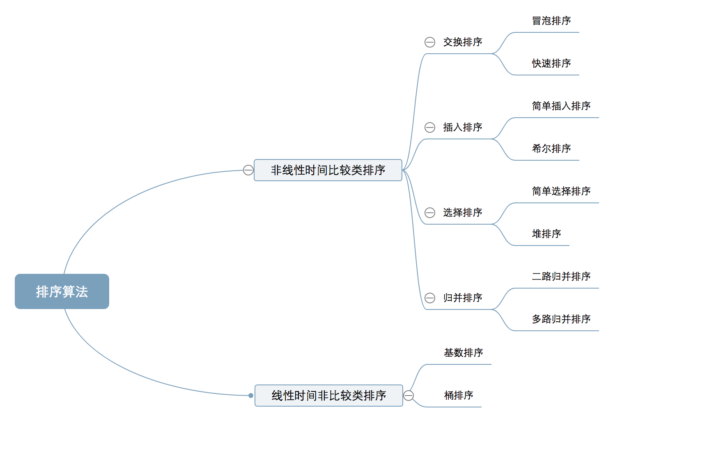
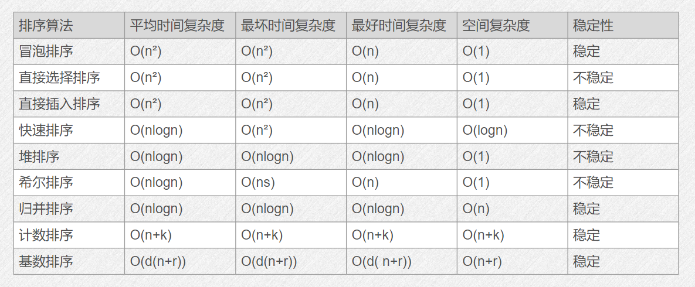
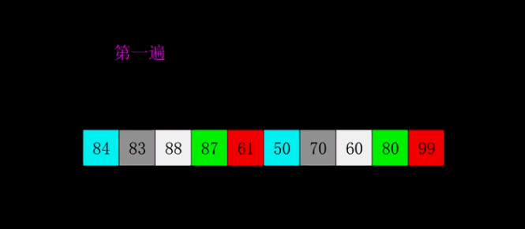
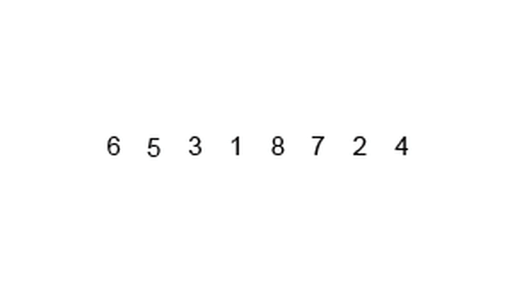
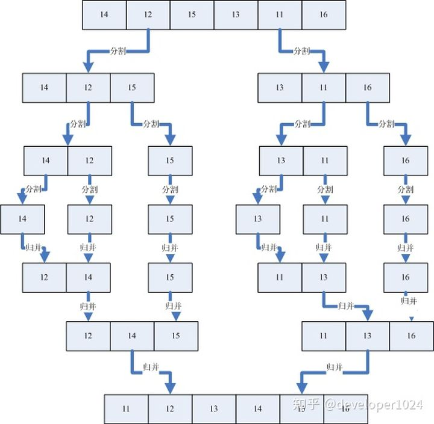

# 排序



## 什么是排序




以下部分动图来自[CSDN](https://blog.csdn.net/king9666/article/details/87433486)

::: tip 稳定性的概念

定义：能保证两个相等的数，经过排序之后，其在序列的前后位置顺序不变。（A1=A2，排序前A1在A2前面，排序后A1还在A2前面）

意义：稳定性本质是维持具有相同属性的数据的插入顺序，如果后面需要使用该插入顺序排序，则稳定性排序可以避免这次排序。
:::

## 排序的分类

### 1. 冒泡

#### 1.1 冒泡排序

* 一个一个往上冒


:::details 查看代码

<CodeGroup>
  <CodeGroupItem title='Go' active>

```go
func BubbleSort(arr []int) []int {
	n := len(arr)
	for i := 0; i < n-1; i++ {
		for j := i + 1; j < n; j++ {
			if arr[i] > arr[j] {
				arr[i], arr[j] = arr[j], arr[i]
			}
		}
	}
	return arr
}

```

  </CodeGroupItem>

  <CodeGroupItem title='C++'>

```c++
for(int i=0; i<k-1; i++)
    for(int j=i+1; j<k; j++){
        if(arr[j]<arr[i]){ // 从小到大
            arr[i] ^= arr[j];
            arr[j] ^= arr[i];
            arr[i] ^=arr[j];
        }
    }
```

  </CodeGroupItem>
</CodeGroup>

:::

#### 1.2. 快速排序

* 升级版冒泡（`递归`）


* 基本思想

> 通过一趟排序将待排的数据分割成两部分，其中一部分的数据均比另一部分的数据要小，对两组数据进行排序。

:::details 查看代码

<CodeGroup>
<CodeGroupItem title='Go借助其他切片（数组）版 | ' active>

```go
func QuickSort(a []int) []int {
	n := len(a)
	if n <= 1 {
		return a
	}
	left := make([]int, 0)
	right := make([]int, 0)
	guard := a[0]
	for i := 1; i < n; i++ {
		if a[i] < guard {
			left = append(left, a[i]) // 比哨兵小入左队
		} else {
			right = append(right, a[i]) // 其他入大队
		}
	}
	left, right = QuickSort(left), QuickSort(right)
	res := append(append(left, guard), right...)
	return res
}
```
</CodeGroupItem>
<CodeGroupItem title='Go不使用其他切片 | ' active>

```go
// 左闭右开
func QuickSort1(a []int, left, right int) {
	if left >= right-1 {
		return
	}
	low := left
	high := right - 1
	guard := a[low]

	for low < high {
		/*
			小的往左，大的往右
		*/
		for low < high && a[high] >= guard {
			high--
		}
		a[low] = a[high]

		for low < high && a[low] <= guard {
			low++
		}
		a[high] = a[low]
	}
	a[low] = guard

	QuickSort1(a, left, low)
	QuickSort1(a, low+1, right)
}
```
</CodeGroupItem>
<CodeGroupItem title='C++'>


```c++

void q_sort(int a[], int left, int right){
// left, right 左闭右开， low、high闭区间
// a[left] 即左边第一个元素为哨兵
    if(left >= right-1 ) return;
    int low = left, high = right-1, center = a[low];
    // 直到low==high 确保左边的元素都比右边的小
    while( low < high ){
         // 从右边开始往回搜索，找到第一个比哨兵小的元素,比哨兵大则跳过
        while( low<high && a[high] >= center ) high --;
        // 将比哨兵小的元素移动到左边
        a[low] = a[high];
        // 从左边往右边搜索， 找到第一个比哨兵大的元素，比哨兵小则跳过
        while( low< high && a[low] <= center) low++;
        // 将比哨兵大的元素移动到右边
        a[high] = a[low];
    }
    // 把哨兵存入分界线位置
    a[low] = center;			// == a[high] = center;
    // 开始递归快排
    q_sort(a, left, low);		// 左边
    q_sort(a, low+1, right );	// 右边
}
```
</CodeGroupItem>
</CodeGroup>


:::

### 2. 选择

#### 2.1 简单选择排序

* 选择最小的往前放
* 

:::details 查看代码

<CodeGroup>
  <CodeGroupItem title="Go">

```go
func SelectSort(a []int) []int {
	n := len(a)
	for i := 0; i < n-1; i++ {
		minIndex := i
		for j := i + 1; j < n; j++ {
			if a[j] < a[minIndex] {
				minIndex = j
			}
		}
		if minIndex != i {
			a[minIndex], a[i] = a[i], a[minIndex]
		}
	}
	return a
}

```

  </CodeGroupItem>
  <CodeGroupItem  title="C++">

```c++
// 从小到大 
for(int i=0; i<length-1; i++){
    minIndex=i;
    for(int j=i+1; j<length{
        if(arr[j]<arr[minIndex]) minIndex=j; // 选择最小的元素的下标
    }
    if( minIndex != i){
        arr[i]^=arr[minIndex];
        arr[minIndex] ^=arr[i];
        arr[i] ^= arr[minIndex];
    }
}

```
  </CodeGroupItem>
</CodeGroup>

* 这里有一个小小的优化技巧
> 在搜索最小数下标的时候，同时搜索最大数的下标，可以使得复杂度减半。

:::

#### 2.2 堆排序


*  先来了解下堆的相关概念：

堆是具有以下性质的完全二叉树：

>  每个结点的值都大于或等于其左右孩子结点的值，称为`大顶堆`；
>
> 或者每个结点的值都小于或等于其左右孩子结点的值，称为小顶堆。

如下图：


同时，我们对堆中的结点按层进行编号，将这种逻辑结构映射到数组中就是下面这个样子


该数组从逻辑上讲就是一个堆结构，我们用简单的公式来描述一下堆的定义就是：

**大顶堆：arr[i] >= arr[2i+1] && arr[i] >= arr[2i+2]**  (小到大排序)

**小顶堆：arr[i] <= arr[2i+1] && arr[i] <= arr[2i+2]**  （大到小排序）

了解了这些定义。接下来看看堆排序的基本思想及基本步骤：

* 堆排序基本思想及步骤

》 基于选择排序

> 　　堆排序的基本思想是：将待排序序列构造成一个大顶堆，此时，整个序列的最大值就是堆顶的根节点。将其与末尾元素进行交换，此时末尾就为最大值。然后将剩余n-1个元素重新构造成一个堆，这样会得到n个元素的次小值。如此反复执行，便能得到一个有序序列了

:::details 查看代码
```c++
// 构建小顶堆， 大到小排序
#include<iostream>
using namespace std;

void display(int a[], int len){
  cout<<len<<" ";
  for(int i=1; i<=len; i++){
    cout<<a[i]<<" ";
  }
  cout<<endl;
}

// 交互a数组中的x跟y
void swap(int a[], int x, int y){
  int temp = a[x];
  a[x] = a[y];
  a[y] = temp;
}

// 调整堆
void heapAdjust(int a[], int i, int len){
  int flag = a[i];
  for(int j=2*i; j<=len; j*=2 ){
    if( j<len && a[j]>a[j+1] ) ++j;
    if( flag < a[j] ) break;
    a[i] = a[j]; i=j;
  }
  a[i] = flag;
}

// 堆排序
void heapSort(int a[], int len){
  for(int i=len/2; i>0; --i){
    heapAdjust(a, i, len);
  }
  display(a,len);
  for(int i=len; i>1; i--){
    swap(a, 1, i);
    heapAdjust(a, 1, i-1);
    display(a,len);
  }
}

int main(){
  int n;
  cin>>n;
  int *a = new int[n+5];
  for(int i=1; i<=n; i++){
    cin>>a[i];
  }
  heapSort(a,n);
  delete []a;
  return 0;
}
```
:::

### 3. 插入

::: tip 与现实场景的联系
存在一个已经排好的队伍（从矮到高），这时，来了个还没排的家伙，他需要去找他需要站的位置。

:::

#### 3.1 直接插入


* 从后往前， 默认前面已排好序
* 假设`j`前面`j-1`的元素已经是有序的，接下来要对`a[j]` 的位置查找

:::details 查看代码

<CodeGroup>
  <CodeGroupItem title='Go' active>

```go
func InsertSort(a []int) []int {
	n := len(a)
	for i := 1; i < n; i++ {
		for j := i; j > 0 && a[j] < a[j-1]; j-- {
			a[j-1], a[j] = a[j], a[j-1]
		}
	}
	return a
}
```
  </CodeGroupItem>
  <CodeGroupItem title='C++'>

  ```c++
// 从小到大
for(int i=1; i<length; i++){
        for(int j=i; (j>0) && ( arr[j]<arr[j-1] ); j--){
            arr[j]^=arr[j-1];
            arr[j-1] ^= arr[j];
            arr[j] ^=arr[j-1];
        }
}


  ```
  </CodeGroupItem>
</CodeGroup>


:::

#### 3.2 折半插入

> 从1开始，对后面的元素进行折半查找插入


:::details 查看代码

<CodeGroup>
  <CodeGroupItem title='Go' active>

```go
func BinarySearchInsertSort(a []int) []int {
	n := len(a)
	var low, high, mid, reg int

	for i := 1; i < n; i++ {
		low = 0
		high = i - 1
		reg = a[i]
		for low <= high {
			mid = (low + high) >> 1
			if reg > a[mid] {
				low = mid + 1
			} else {
				high = mid - 1
			}
		}
		/*
			low是还没排序的元素应该去的位置，所以low后面已排序的元素都要往后站
		*/
		for j := i; j > low; j-- {
			a[j] = a[j-1]
		}
		a[low] = reg

	}
	return a
}
```
  </CodeGroupItem>
  <CodeGroupItem title='C++'>

```c++
// 降序（从大到小）
void z_sort(int a[], int len){
    int low = 0,high = 0,mid;
    int temp = 0;
    for (int i=1; i<len; i++) {
        low=0;
        high=i-1;
        temp=a[i];		// 要插入的元素
        while (low<=high) {
            mid=(low+high)>>1;
            // 决定顺序的位置
            if (a[mid]<temp) {
                high=mid-1;
            }else{
                low=mid+1;
            }
        }
        // 把元素后移
        for (int j=i; j>low; j--) {
            a[j]=a[j-1];
        }
        a[low]=temp;//插入元素
    }
}
```

  </CodeGroupItem>
</CodeGroup>

:::

#### 3.3 希尔排序

::: tip 百度百科
希尔排序(Shell's Sort)是插入排序的一种又称“缩小增量排序”（Diminishing Increment Sort），是直接插入排序算法的一种更高效的改进版本。希尔排序是非稳定排序算法。该方法因 D.L.Shell 于 1959 年提出而得名。
希尔排序是把记录按下标的一定增量分组，对每组使用直接插入排序算法排序；随着增量逐渐减少，每组包含的关键词越来越多，当增量减至 1 时，整个文件恰被分成一组，算法便终止。

---

希尔排序是基于插入排序的以下两点性质而提出改进方法的：
* 插入排序在对几乎已经排好序的数据操作时，效率高，即可以达到线性排序的效率。
* 但插入排序一般来说是低效的，因为插入排序每次只能将数据移动一位。
:::




> 希尔排序是把记录按下标的一定增量`分组`，对每组使用直接插入排序算法排序；随着增量逐渐减少，每组包含的关键词越来越多，当增量减至`1`时，整个文件恰被分成一组，算法便终止。

* 重点：注意对每个子序列进行插入排序


:::details 查看代码

<CodeGroup>
<CodeGroupItem title='Go' active>

```go
func shellSort(a []int) []int {
	n := len(a)
	/*
		@gap: 增量每次减半
	*/
	for gap := n >> 1; gap >= 1; gap >>= 1 {
		for i := gap; i < n; i += gap {
			for j := i; j > 0 && a[j] < a[j-gap]; j -= gap {
				a[j-gap], a[j] = a[j], a[j-gap]
			}
		}
	}
	return a
}
```
</CodeGroupItem>
<CodeGroupItem title='C++'>

```c++
void shellSort(int* a, int n)
{
    int i,gap,j;

    // gap为步长，每次减为原来的一半。
    for (gap = n / 2; gap >=1 ; gap /= 2)
    {
        // 组内排序
        for (i = gap ;i < n; i+= gap) {
			for(j = i; j>0 && a[j] < a[j-gap]; j-= gap) {
				swap(a[j-gap], a[j]);
			}
		}
    }
}
```

</CodeGroupItem>
</CodeGroup>

:::


### 4. 归并排序

* 基本思想

归并排序是用分治思想，分治模式在每一层**递归**上有三个步骤：

- **分解（Divide）**：将n个元素分成个含n/2个元素的子序列。
- **解决（Conquer）**：用合并排序法对两个子序列递归的排序。
- **合并（Combine）**：合并两个已排序的子序列已得到排序结果。

* 实现逻辑

**2.1 迭代法**

> ① 申请空间，使其大小为两个已经排序序列之和，该空间用来存放合并后的序列<br/>
> ② 设定两个指针，最初位置分别为两个已经排序序列的起始位置<br/>
> ③ 比较两个指针所指向的元素，选择相对小的元素放入到合并空间，并移动指针到下一位置<br/>
> ④ 重复步骤③直到某一指针到达序列尾<br/>
> ⑤ 将另一序列剩下的所有元素直接复制到合并序列尾

**2.2 递归法**

> ① 将序列每相邻两个数字进行归并操作，形成floor(n/2)个序列，排序后每个序列包含两个元素<br/>
> ② 将上述序列再次归并，形成floor(n/4)个序列，每个序列包含四个元素<br/>
> ③ 重复步骤②，直到所有元素排序完毕

* 动图演示



* 归并排序演示

具体的我们以一组无序数列｛14，12，15，13，11，16｝为例分解说明，如下图所示：



上图中首先把一个未排序的序列从中间分割成2部分，再把2部分分成4部分，依次分割下去，直到分割成一个一个的数据，再把这些数据两两归并到一起，使之有序，不停的归并，最后成为一个排好序的序列。

* 文字版

:::details
```shell
有序数组A：[3 8 9 11 13]
有序数组B：[1 5 8 10 17 19 20 23]
[] 表示比较的范围。

因为 1 < 3，所以 1 加入辅助数组
有序数组A：[3 8 9 11 13]
有序数组B：1 [5 8 10 17 19 20 23] 
辅助数组：1

因为 3 < 5，所以 3 加入辅助数组
有序数组A：3 [8 9 11 13]
有序数组B：1 [5 8 10 17 19 20 23] 
辅助数组：1 3

因为 5 < 8，所以 5 加入辅助数组
有序数组A：3 [8 9 11 13]
有序数组B：1 5 [8 10 17 19 20 23] 
辅助数组：1 3 5
因为 8 == 8，所以 两个数都 加入辅助数组

有序数组A：3 8 [9 11 13]
有序数组B：1 5 8 [10 17 19 20 23] 
辅助数组：1 3 5 8 8
因为 9 < 10，所以 9 加入辅助数组

有序数组A：3 8 9 [11 13]
有序数组B：1 5 8 [10 17 19 20 23] 
辅助数组：1 3 5 8 8 9

因为 10 < 11，所以 10 加入辅助数组
有序数组A：3 8 9 [11 13]
有序数组B：1 5 8 10 [17 19 20 23] 
辅助数组：1 3 5 8 8 9 10

因为 11 < 17，所以 11 加入辅助数组
有序数组A：3 8 9 11 [13]
有序数组B：1 5 8 10 [17 19 20 23] 
辅助数组：1 3 5 8 8 9 10 11

因为 13 < 17，所以 13 加入辅助数组
有序数组A：3 8 9 11 13
有序数组B：1 5 8 10 [17 19 20 23] 
辅助数组：1 3 5 8 8 9 10 11 13

因为数组A已经没有比较元素，将数组B剩下的元素拼接在辅助数组后面。
结果：1 3 5 8 8 9 10 11 13 17 19 20 23
```
:::

#### 代码实现

*  自顶向下归并(递归)

:::details 查看代码

<CodeGroup>
<CodeGroupItem title='Go' active>

```go
// 二路归并
func MergeSort(a []int) []int {
	n := len(a)
	if n <= 1 {
		return a
	}
	mid := n >> 1
	left, right := MergeSort(a[:mid]), MergeSort(a[mid:])
	return merge(left, right)
}

func merge(left, right []int) (res []int) {
	l, r := 0, 0
	len_l, len_r := len(left), len(right)
	for l < len_l && r < len_r {
		if left[l] < right[r] {
			res = append(res, left[l])
			l++
		} else {
			res = append(res, right[r])
			r++
		}
	}
	// 把两个子切片的剩余元素直接入队
	res = append(append(res, left[l:]...), right[r:]...)
	return
}

```
</CodeGroupItem>
<CodeGroupItem title='C++'>

```c++
// 归并排序（C-递归版）

void merge_sort_recursive(int arr[], int reg[], int start, int end) {
    if (start >= end)
        return;
    int len = end - start, mid = (len / 2) + start;
    int start1 = start, end1 = mid;
    int start2 = mid + 1, end2 = end;
    merge_sort_recursive(arr, reg, start1, end1);
    merge_sort_recursive(arr, reg, start2, end2);

    int k = start;

    // 决定是降序还是升序
    while (start1 <= end1 && start2 <= end2)
        reg[k++] = arr[start1] < arr[start2] ? arr[start1++] : arr[start2++];
    while (start1 <= end1)
        reg[k++] = arr[start1++];
    while (start2 <= end2)
        reg[k++] = arr[start2++];
    for (k = start; k <= end; k++)
        arr[k] = reg[k];
}
void merge_sort(int arr[], const int len) {
    int *reg = new int[len+1];
    merge_sort_recursive(arr, reg, 0, len - 1);
    delete[] reg;
}
```
</CodeGroupItem>
</CodeGroup>


:::

*  自底向上归并（迭代）

:::details 查看代码

```c++
// 自底向上归并
/****
 * 分而治之
 * 
 ***/ 
#include<iostream>
#include<cstring>
#include<string>
#include<algorithm>
using namespace std;
int length;
void display( string a[]){
  for(int i=0; i<length; i++){
    cout<<a[i];
    if(i!=length-1){
      cout<<" ";
    }
  }
  cout<<endl;
}

// 治 【闭区间】
void merge(string a[], string reg[],  int l, const int mid, const int r){
  // if( l>r || l>mid || mid>r ) return ;
  int start = l;
  int end = r;
  int j = mid+1;
  int i = l;
  while( i<= mid &&  j<= r ){
          reg[l++] = a[i]>=a[j]   ? a[i++] : a[j++];
  }
  while(i<=mid) reg[l++] = a[i++];
  while(j<=r) reg[l++] = a[j++];
  for(int ii=start; ii<=end; ii++){
    a[ii] = reg[ii];
  }
}
void mergeSort_re(string a[], string reg[], const int end){
  // 分
  for(int step=1; step<end; step*=2){
    for(int j=0; j < end; j += step*2 ){
      int low = j, mid = j+step-1, high = min(j+2*step-1, end-1);
      // cout << "low=" << low << " mid=" << mid << " high=" << high << endl;
      // void merge(string a[], string reg[],  int l, int mid, int r)
       merge(a, reg, low, mid, high );
    }
    display(a);
  }

}
void mergeSort(string a[], const int len){
  string * reg = new string[len+10];
  mergeSort_re( a, reg, len);
  delete []reg;
}

int main(){
  int t; cin>>t;
  while(t--){
    int l ; cin>>l;
    length = l;
    string *s =  new string[l+10];

    for(int i=0; i<l; i++) cin>>s[i];    
    if(l==1){ // 注意这个bug我卡了两天
      cout<<s[0]<<endl;
    }
    else mergeSort(s, l);
    cout<<endl;
    delete []s;
  }
  return 0;
}

```

:::


### 5. 基数排序


:::details 查看代码

```c++
#include<iostream>
using namespace std;

int maxbit(int data[], int n) //辅助函数，求数据的最大位数
{
    int d = 1; //保存最大的位数
    int p = 10;
    for(int i = 0; i < n; ++i)
    {
        while(data[i] >= p)
        {
            p *= 10;
            ++d;
        }
    }
    return d;
}
void radixsort(int data[], int n) //基数排序
{
    // d 位
    int d = maxbit(data, n);
    int *tmp = new int[n+5];

    int *count = new int[10]; //计数器 --> 排序桶
    int *flag = new int[10];
    int i, j, k;
    int radix = 1;

    for(i = 1; i <= d; i++) //进行d次排序
    {
        for(j = 0; j < 10; j++){
          count[j] = 0; //每次分配前清空计数器（清桶）
          tmp[j] = -1;
          flag[j] = 0;
        }
        
        for(j = 0; j < n; j++)
        { 
            // k 是当前数字位置中的数字
            k = (data[j] / radix) % 10; //统计每个桶中的记录数
            count[k]++;
        }
        for(int jj=0; jj<10; jj++){
          // cout<<"jj="<<jj<<"count[jj]="<<count[jj]<<endl;
          flag[jj] = count[jj];
        }
        for(j = 1; j < 10; j++)
            count[j] = count[j - 1] + count[j]; //将tmp中的位置依次分配给每个桶
        for(j = n - 1; j >= 0; j--) //将所有桶中记录依次收集到tmp中
        {
            k = (data[j] / radix) % 10;
            tmp[count[k] - 1] = data[j];
            count[k]--;
        }
        /**** 看每一位的收集器
        for(int ii=0, kk=0; ii<10; ii++){
          cout << ii <<":";
          if(flag[ii]==0){
            cout << "NULL"<<endl;
            continue;
          }
          for( int jk=flag[ii]+1; jk>0; jk-- ){
            if(jk==1){
              cout<<"->^"<<endl;
            }else{
              cout<<"->"<<tmp[kk];
              kk++;
            }
            
          }
        }
        ***/
        // for( int ii=0; ii<10; ii++){
        //   cout<<"ii="<< ii << " temp[ii]="<<tmp[ii]<<endl;
        // }
        for(j = 0; j < n; j++){//将临时数组的内容复制到data中
          data[j] = tmp[j];
        } 
        for(int ii=0; ii<n; ii++){
          cout<<data[ii]<<" ";
        }   
        cout<<endl;
        radix = radix * 10;
    }
    delete[]tmp;
    delete[]count;
}

int main(){
  int t;
  cin>>t;
  while(t--){
    int l;
    cin >> l;
    int *a = new int[l+5];
    for(int i=0; i<l; i++){
      cin>>a[i];
    }
    radixsort(a,l);
    cout<<endl;
    delete []a;
  }
  return 0;
}
```

:::


