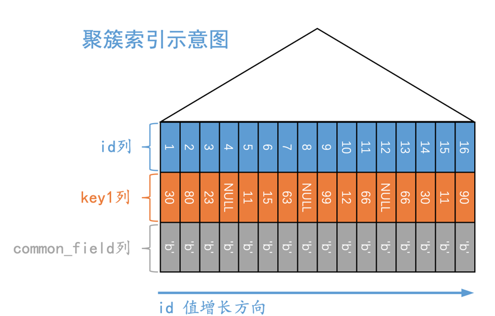
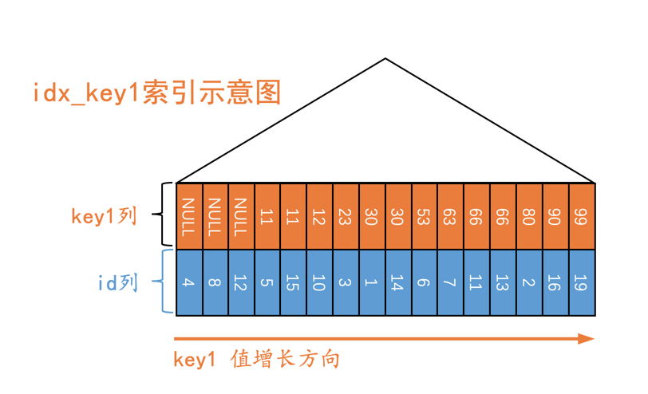
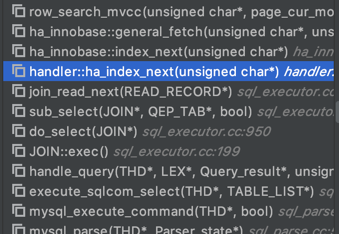
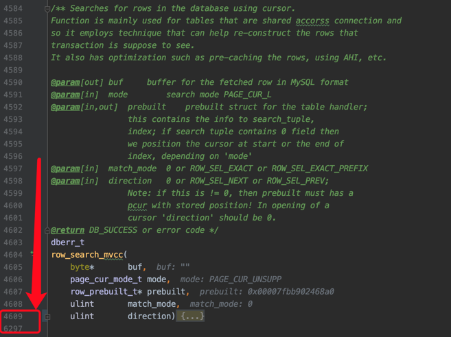
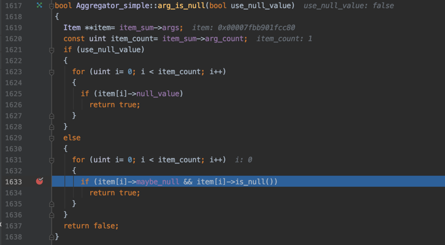
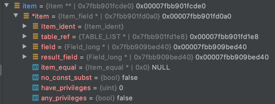

# MySQL的COUNT是怎么执行的

:::tip

本文源于[MySQL的COUNT是怎么执行的 (qq.com)](https://mp.weixin.qq.com/s/_z7BnFlm4gEAOGTVWTcsWA)，复制下来只是为了微调利于自己理解

:::


众多开发小伙伴在写业务逻辑的时候都会有一个统计行数的需求，此时COUNT函数便成为了首选。但是大家发现，随着数据量的增长，COUNT执行的越来越慢，本文从源码的角度来帮助小伙伴们分析一下MySQL中的COUNT函数是如何执行的。

需要声明一点，本文所使用的MySQL源码版本是5.7.22，并且只针对InnoDB存储引擎。在深入介绍之前需要大家具有一些前置知识，才可以顺利讨论。

## 前置知识1——InnoDB的B+树索引

为了故事的顺利发展，我们引入一个表：

```mysql
CREATE TABLE t (
    id INT UNSIGNED NOT NULL AUTO_INCREMENT,
    key1 INT,
    common_field VARCHAR(100),
    PRIMARY KEY (id),
    KEY idx_key1 (key1)
) Engine=InnoDB CHARSET=utf8;
```


这个表就包含2个索引（也就是2棵B+树）：

•以`id`列为主键对应的聚簇索引。

•为`key1`列建立的二级索引`idx_key1`。

我们向表中插入一些记录：

```mysql
INSERT INTO t VALUES
    (1, 30, 'b'),
    (2, 80, 'b'),
    (3, 23, 'b'),
    (4, NULL, 'b'),
    (5, 11, 'b'),
    (6, 53, 'b'),
    (7, 63, 'b'),
    (8, NULL, 'b'),
    (9, 99, 'b'),
    (10, 12, 'b'),
    (11, 66, 'b'),
    (12, NULL, 'b'),
    (13, 66, 'b'),
    (14, 30, 'b'),
    (15, 11, 'b'),
    (16, 90, 'b');
```

所以现在`t`表的聚簇索引示意图就是这样：



`t`表的二级索引示意图就是这样：



> 小贴士：
>
> 原谅我们画了一个极度简化版的B+树：我们省略了B+树中的页面节点，省略了每层页面节点之间的双向链表，省略了页面中记录的单向链表，省略了页面中的页目录结构，还有省略了好多东西。但是我们保留B+树最为核心的一个特点：记录是**按照键值大小进行排序的**。即对于聚簇索引来说，记录是按照id列进行排序的；对于二级索(idx_key1)来说，记录是按照key1列进行排序的，在key1列相同时再按照id列进行排序。

从上边聚簇索引和二级索引的结构中大家可以发现：**每一条聚簇索引记录都可以在二级索引中找到唯一的一条二级索引记录与其相对应。**

## 前置知识2——server层和存储引擎的交互

以下边这个查询为例：

```mysql
SELECT * FROM t WHERE key1 > 70 AND common_field != 'a';
```

假设优化器认为通过扫描二级索引idx_key1中key1值在(70, +∞)这个区间中的二级索引记录的成本更小，那么查询将以下述方式执行：

•server层先让InnoDB去查在key1值在(70, +无穷)区间中的第一条记录。

•InnoDB通过二级索引idx_key1对应的B+树，从B+树根页面一层一层向下定位，快速找到(70, +无穷)区间的第一条二级索引记录，然后根据该二级索引记录进行回表操作，找到完整的聚簇索引记录，然后返回给server层。

•server层判断InnoDB返回的记录符不符合搜索条件`key1 > 70 AND common_field != 'a'`，如果不符合的话就跳过该记录，否则将其发送到客户端。

> 小贴士：
>
> 此处将记录发送给客户端其实是发送到本地的网络缓冲区，缓冲区大小由net_buffer_length控制，默认是16KB大小。等缓冲区满了才真正发送网络包到客户端。

•然后server层向InnoDB要下一条记录。

•InnoDB根据上一次找到的二级索引记录的next_record属性，获取到下一条二级索引记录，回表后将完整的聚簇索引记录返回给server层。

•server继续判断，不符合搜索条件即跳过该记录，否则发送到客户端。

•... 一直循环上述过程，直到InnoDB找不到下一条记录，则向server层报告查询完毕。

•server层收到InnoDB报告的查询完毕请求，停止查询。

可见，一般情况下server层和存储引擎层是以记录为单位进行交互的。

我们看一下源码中读取一条记录的函数调用栈：



其中的`handler::ha_index_next`便是server层向存储引擎要下一条记录的接口。

其中的`row_search_mvcc`是读取一条记录最重要的函数，这个函数长的吓人，有一千多行：



每读取一条记录，都要做非常多的工作，**诸如进行多版本的可见性判断，要不要对记录进行加锁的判断，要是加锁的话加什么锁的选择，完成记录从InnoDB的存储格式到server层存储格式的转换**等等等等十分繁杂的工作。

> 小贴士：
>
> 不知道你们公司有没有写这么长函数的同学，如果有的话你想不想打他。

## 前置知识3——COUNT是个啥

COUNT是一个汇总函数（聚集函数），它接收1个表达式作为参数：

```mysql
COUNT(expr)
```

COUNT函数用于统计在符合搜索条件的记录中，指定的表达式`expr`不为NULL的行数有多少。这里需要特别注意的是，`expr`不仅仅可以是列名，其他任意表达式都是可以的。

比方说：

```mysql
SELECT COUNT(key1) FROM t;
```

这个语句是用于统计在single_table表的所有记录中，key1列不为NULL的行数是多少。

再看这个：

```mysql
SELECT COUNT('abc') FROM t;
```

这个语句是用于统计在single_table表的所有记录中，'abc'这个表达式不为NULL的行数是多少。很显然，'abc'这个表达式永远不是NULL，所以上述语句其实就是统计single_table表里有多少条记录。

再看这个：

```mysql
SELECT COUNT(*) FROM t;
```

这个语句就是直接统计single_table表有多少条记录。

总结+注意：**COUNT函数的参数可以是任意表达式，该函数用于统计在符合搜索条件的记录中，指定的表达式不为NULL的行数有多少**。

## MySQL中COUNT是怎样执行的

做了那么多铺垫，终于到了MySQL中COUNT是怎样执行的了。

以下边这个语句为例：

```mysql
SELECT COUNT(*) FROM t;
```

这个语句是要去查询表t中共包含多少条记录。由于聚簇索引和二级索引中的记录是一一对应的，而二级索引记录中包含的列是少于聚簇索引记录的，所以同样数量的二级索引记录可以比聚簇索引记录占用更少的存储空间。如果我们使用二级索引执行上述查询，即数一下idx_key1中共有多少条二级索引记录，是比直接数聚簇索引中共有多少聚簇索引记录可以节省很多I/O成本。所以优化器会决定使用idx_key1执行上述查询：

```mysql
mysql> EXPLAIN SELECT COUNT(*) FROM t;
+----+-------------+-------+------------+-------+---------------+----------+---------+------+------+----------+-------------+
| id | select_type | table | partitions | type  | possible_keys | key      | key_len | ref  | rows | filtered | Extra       |
+----+-------------+-------+------------+-------+---------------+----------+---------+------+------+----------+-------------+
|  1 | SIMPLE      | t     | NULL       | index | NULL          | idx_key1 | 5       | NULL |   16 |   100.00 | Using index |
+----+-------------+-------+------------+-------+---------------+----------+---------+------+------+----------+-------------+
1 row in set, 1 warning (0.02 sec)
```

在执行上述查询时，server层会维护一个名叫count的变量，然后：

•server层向InnoDB要第一条记录。

•InnoDB找到idx_key1的第一条二级索引记录，并返回给server层（**注意：由于此时只是统计记录数量，所以并不需要回表**）。

•由于COUNT函数的参数是`*`，MySQL会将`*`当作常数0处理。由于0并不是NULL，server层给count变量加1。

•server层向InnoDB要下一条记录。

•InnoDB通过二级索引记录的next_record属性找到下一条二级索引记录，并返回给server层。

•server层继续给count变量加1。

•... 重复上述过程，直到InnoDB向server层返回没记录可查的消息。

•server层将最终的count变量的值发送到客户端。

我们看一下源码里给count变量加1的代码是怎么写的：


其大意就是判断一下COUNT里的表达式是不是NULL，如果不是NULL的话就给count变量加1。

我们再来看一下arg_is_null的实现：



其中最重要的是我们标蓝的那一行，item[i]表示的就是COUNT函数中的参数，我们调试一下对于`COUNT(*)`来说，表达式`*`的值是什么：


可以看到，`*`表达式的类型其实是`Item_int`，这表示MySQL其实会把`*`当作一个整数处理，它的值是0（见图中箭头）。也就是说我们在判断表达式`*`是不是为NULL，也就是在判断整数`0`是不是为NULL，很显然不为NULL。

## 那COUNT(1)，COUNT(id)，COUNT(非主键列)呢？

那在执行COUNT(1)呢？比方说下边这个语句：

```mysql
SELECT COUNT(1) FROM t;
```

我们看一下：


可以看到，常数`1`对应的类型其实是`PTI_num_literal_num`，它其实是`Item_int`的一个包装类型，本质上还是代表一个整数，它的值是`1`（见图中箭头）。也就是说我们其实是在判断表达式`1`是不是为NULL，很显然不为NULL。

再看一下COUNT(id)：

```mysql
SELECT COUNT(id) FROM t;
```

我们看一下：



可以看到，`id`对应的类型是`Item_field`，代表一个字段。

对于`COUNT(*)`、`COUNT(1)`或者任意的`COUNT(常数)`来说，读取哪个索引的记录其实并不重要，因为server层只关心存储引擎是否读到了记录，而并不需要从记录中提取指定的字段来判断是否为NULL。所以优化器会使用占用存储空间最小的那个索引来执行查询。

对于`COUNT(id)`来说，由于id是主键，不论是聚簇索引记录，还是任意一个二级索引记录中都会包含主键字段，所以其实读取任意一个索引中的记录都可以获取到id字段，此时优化器也会选择占用存储空间最小的那个索引来执行查询。

而对于`COUNT(非主键列)`来说，我们指定的列可能并不会包含在每一个索引中。这样优化器只能选择包含我们指定的列的索引去执行查询，这就**可能**导致优化器选择的索引并不是最小的那个。

## 总结一下

对于`COUNT(*)`、`COUNT(常数)`、`COUNT(主键)`形式的COUNT函数来说，优化器可以选择最小的索引执行查询，从而提升效率，它们的执行过程是一样的，只不过在判断表达式是否为NULL时选择不同的判断方式，这个判断为NULL的过程的代价可以忽略不计，所以我们可以认为`COUNT(*)`、`COUNT(常数)`、`COUNT(主键)`所需要的代价是相同的。

而对于`COUNT(非主键列)`来说，server层必须要从InnoDB中读到包含`非主键列`的记录，所以优化器并不能随心所欲的选择最小的索引去执行。

## 我想改进一下？

我们知道，InnoDB的记录都是存储在数据页中的（页面大小默认为16KB），而每个数据页的`Page Header`部分都有一个统计当前页面中记录数量的属性`PAGE_N_RECS`。那有的同学说了：在执行COUNT函数的时候直接去把各个页面的这个`PAGE_N_RECS`属性加起来不就好了么？

答案是：行不通的！**对于普通的SELECT语句来说，每次查询都要从记录的版本链上找到可见的版本才算是读到了记录；对于加了FOR UPDATE或LOCK IN SHARE MODE后缀的SELECT语句来说，每次查询都要给记录添加合适的锁**。所以这个读取每一条记录的过程（就是上边给出的row_search_mvcc函数）在InnoDB的目前实现中是无法跳过的，InnoDB还是得老老实实的读一条记录，返给server层一条记录。

那如果我的业务中有COUNT需求，但是由于数据量太大导致即使优化器即使通过扫描二级索引记录的方式也还是太慢怎么办？既然业务上有需求，当然还是业务第一喽，我们可以在另一个地方存储一份待统计数据的行数，每次增删改记录都维护一下。

这样的解决方案显著增加了开发小伙伴的工作量，部分开发小伙伴肯定不太乐意，那就去怼你的产品经理吧：这么大数据量要TM什么精确值，你来告诉我这么大数据量要TM什么的TM的精确值？