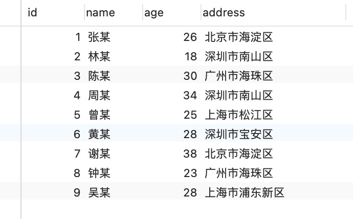
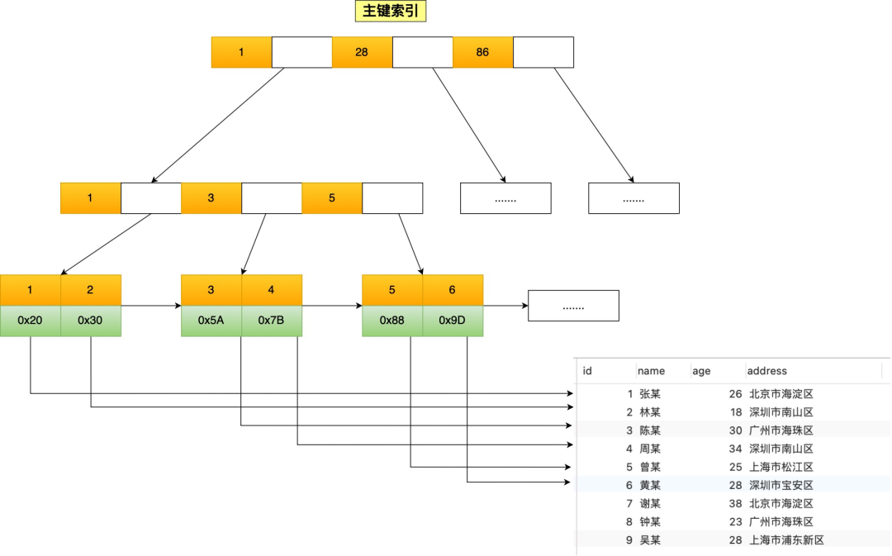
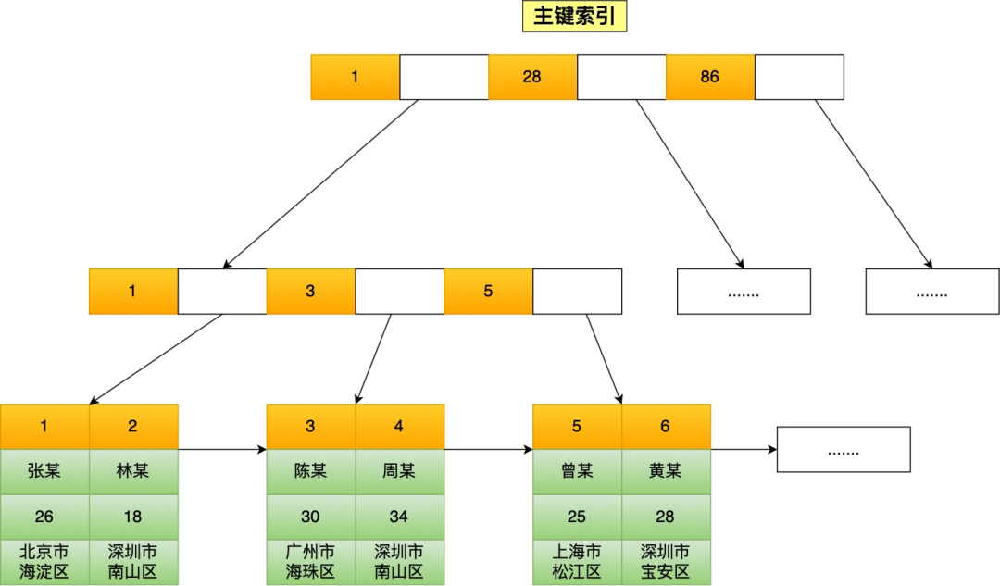
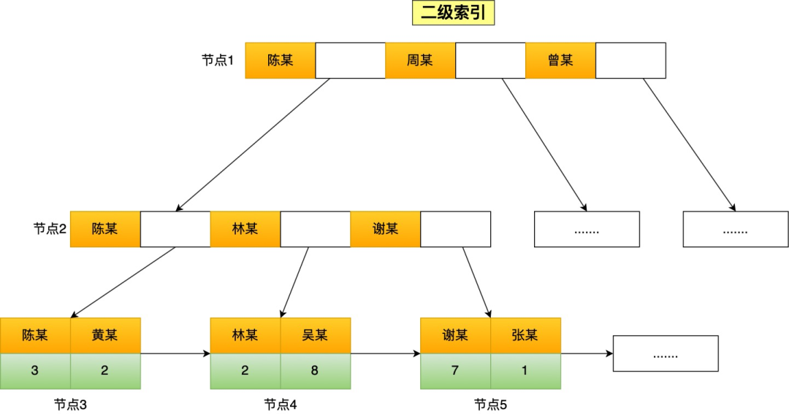
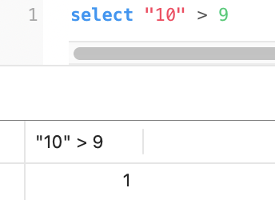

# 索引失效有哪些？

在工作中，如果我们想提高一条语句查询速度，通常都会想对字段建立索引。

但是索引并不是万能的。建立了索引，并不意味着任何查询语句都能走索引扫描。

稍不注意，可能你写的查询语句是会导致索引失效，从而走了全表扫描，虽然查询的结果没问题，但是查询的性能大大降低。

今天就来跟大家盘一盘，常见的 6 种会发生索引失效的场景。

**不仅会用实验案例给大家说明，也会清楚每个索引失效的原因**。

发车！


## 索引存储结构长什么样？

我们先来看看索引存储结构长什么样？因为只有知道索引的存储结构，才能更好的理解索引失效的问题。

索引的存储结构跟 MySQL 使用哪种存储引擎有关，因为存储引擎就是负责将数据持久化在磁盘中，而不同的存储引擎采用的索引数据结构也会不相同。

MySQL 默认的存储引擎是 `InnoDB`，它采用 `B+Tree` 作为索引的数据结构，至于为什么选择 B+ 树作为索引的数据结构 ，详细的分析可以看我这篇文章：[为什么 MySQL 喜欢 B+ 树？(opens new window)](https://mp.weixin.qq.com/s?__biz=MzUxODAzNDg4NQ==&mid=2247502168&idx=1&sn=ff63afcea1e8835fca3fe7a97e6922b4&scene=21#wechat_redirect)

在创建表时，`InnoDB` 存储引擎默认会创建一个主键索引，也就是聚簇索引，其它索引都属于二级索引。

MySQL 的 `MyISAM` 存储引擎支持多种索引数据结构，比如 B+ 树索引、R 树索引、Full-Text 索引。MyISAM 存储引擎在创建表时，创建的主键索引默认使用的是 B+ 树索引。

虽然，InnoDB 和 MyISAM 都支持 B+ 树索引，但是它们数据的存储结构实现方式不同。不同之处在于：

- InnoDB 存储引擎：B+ 树索引的叶子节点保存数据本身；
- MyISAM 存储引擎：B+ 树索引的叶子节点保存数据的物理地址；

:::details 接下来，我举个例子，给大家展示下这两种存储引擎的索引存储结构的区别。

这里有一张 t_user 表，其中 id 字段为主键索引，其他都是普通字段。



如果使用的是 MyISAM 存储引擎，B+ 树索引的叶子节点保存数据的物理地址，即用户数据的指针，如下图：



如果使用的是 InnoDB 存储引擎， B+ 树索引的叶子节点保存数据本身，如下图所示：



InnoDB 存储引擎根据索引类型不同，分为聚簇索引（上图就是聚簇索引）和二级索引。它们区别在于，聚簇索引的叶子节点存放的是实际数据，所有完整的用户数据都存放在聚簇索引的叶子节点，而二级索引的叶子节点存放的是主键值，而不是实际数据。

如果将 name 字段设置为普通索引，那么这个二级索引长下图这样，叶子节点仅存放主键值。


:::


知道了 InnoDB 存储引擎的聚簇索引和二级索引的存储结构后，接下来举几个查询语句，说下查询过程是怎么选择用哪个索引类型的。

在我们使用「主键索引」字段作为条件查询的时候，如果要查询的数据都在「聚簇索引」的叶子节点里，那么就会在「聚簇索引」中的 B+ 树检索到对应的叶子节点，然后直接读取要查询的数据。如下面这条语句：

```mysql
; id 字段为主键索引
select * from t_user where id=1;
```

在我们使用「二级索引」字段作为条件查询的时候，如果要查询的数据都在「聚簇索引」的叶子节点里，那么需要检索两颗B+树：

- 先在「二级索引」的 B+ 树找到对应的叶子节点，获取主键值；
- 然后用上一步获取的主键值，在「聚簇索引」中的 B+ 树检索到对应的叶子节点，然后获取要查询的数据。

上面这个过程叫做**回表**，如下面这条语句：

```text
// name 字段为二级索引
select * from t_user where name="林某";
```

在我们使用「二级索引」字段作为条件查询的时候，如果要查询的数据在「二级索引」的叶子节点，那么只需要在「二级索引」的 B+ 树找到对应的叶子节点，然后读取要查询的数据，这个过程叫做**覆盖索引**。如下面这条语句：

```text
// name 字段为二级索引
select id from t_user where name="林某";
```

上面这些查询语句的条件都用到了索引列，所以在查询过程都用上了索引。

但是并不意味着，查询条件用上了索引列，就查询过程就一定都用上索引，接下来我们再一起看看哪些情况会导致索引失效，而发生全表扫描。


首先说明下，下面的实验案例，我使用的 MySQL 版本为 `8.0.26`。

## 对索引使用左或者左右模糊匹配

当我们使用左或者左右模糊匹配的时候，也就是 `like %xx` 或者 `like %xx%` 这两种方式都会造成索引失效。

比如下面的 like 语句，查询 name 后缀为「林」的用户，执行计划中的 type=ALL 就代表了全表扫描，而没有走索引。

```text
// name 字段为二级索引
select * from t_user where name like '%林';
```


如果是查询 name 前缀为林的用户，那么就会走索引扫描，执行计划中的 type=range 表示走索引扫描，key=index_name 看到实际走了 index_name 索引：

```text
// name 字段为二级索引
select * from t_user where name like '林%';
```


### 为什么 like 关键字左或者左右模糊匹配无法走索引呢？

**因为索引 B+ 树是按照「索引值」有序排列存储的，只能根据前缀进行比较。**

举个例子，下面这张二级索引图，是以 name 字段有序排列存储的。



假设我们要查询 name 字段前缀为「林」的数据，也就是 `name like '林%'`，扫描索引的过程：

- 首节点查询比较：林这个字的拼音大小比首节点的第一个索引值中的陈字大，但是比首节点的第二个索引值中的周字小，所以选择去节点2继续查询；
- 节点 2 查询比较：节点2的第一个索引值中的陈字的拼音大小比林字小，所以继续看下一个索引值，发现节点2有与林字前缀匹配的索引值，于是就往叶子节点查询，即叶子节点4；
- 节点 4 查询比较：节点4的第一个索引值的前缀符合林字，于是就读取该行数据，接着继续往右匹配，直到匹配不到前缀为林的索引值。

如果使用 `name like '%林'` 方式来查询，因为查询的结果可能是「陈林、张林、周林」等之类的，所以不知道从哪个索引值开始比较，于是就只能通过全表扫描的方式来查询。

## 对索引使用函数

有时候我们会用一些 MySQL 自带的函数来得到我们想要的结果，这时候要注意了，如果查询条件中对索引字段使用函数，就会导致索引失效。

比如下面这条语句查询条件中对 name 字段使用了 LENGTH 函数，执行计划中的 type=ALL，代表了全表扫描：

```mysql
// name 为二级索引
select * from t_user where length(name)=6;
```

### 为什么对索引使用函数，就无法走索引了呢？

因为索引保存的是索引字段的原始值，而不是经过函数计算后的值，自然就没办法走索引了。

不过，从 MySQL 8.0 开始，索引特性增加了函数索引，即可以针对函数计算后的值建立一个索引，也就是说该索引的值是函数计算后的值，所以就可以通过扫描索引来查询数据。

举个例子，我通过下面这条语句，对 length(name) 的计算结果建立一个名为 idx_name_length 的索引。

```text
alter table t_user add key idx_name_length ((length(name)));
```

然后我再用下面这条查询语句，这时候就会走索引了。


## 对索引进行表达式计算

在查询条件中对索引进行表达式计算，也是无法走索引的。

比如，下面这条查询语句，执行计划中 type = ALL，说明是通过全表扫描的方式查询数据的：

```text
explain select * from t_user where id + 1 = 10;
```


但是，如果把查询语句的条件改成 where id = 10 - 1，这样就不是在索引字段进行表达式计算了，于是就可以走索引查询了。


### 为什么对索引进行表达式计算，就无法走索引了呢？

原因跟对索引使用函数差不多。

因为索引保存的是索引字段的原始值，而不是` id + 1 `表达式计算后的值，所以无法走索引，只能通过把索引字段的取值都取出来，然后依次进行表达式的计算来进行条件判断，因此采用的就是全表扫描的方式。

有的同学可能会说，这种对索引进行简单的表达式计算，在代码特殊处理下，应该是可以做到索引扫描的，比方将 `id + 1 = 10 `变成 `id = 10 - 1`。

是的，是能够实现，但是 MySQL 还是偷了这个懒，没有实现。

我的想法是，可能也是因为，表达式计算的情况多种多样，每种都要考虑的话，代码可能会很臃肿，所以干脆将这种索引失效的场景告诉程序员，让程序员自己保证在查询条件中不要对索引进行表达式计算。

## 对索引隐式类型转换

如果索引字段是字符串类型，但是在条件查询中，输入的参数是整型的话，你会在执行计划的结果发现这条语句会走全表扫描。

我在原本的 t_user 表增加了 phone 字段，是二级索引且类型是 varchar。


然后我在条件查询中，用整型作为输入参数，此时执行计划中 type = ALL，所以是通过全表扫描来查询数据的。

```text
select * from t_user where phone = 1300000001;
```


但是如果索引字段是整型类型，查询条件中的输入参数即使字符串，是不会导致索引失效，还是可以走索引扫描。

我们再看第二个例子，id 是整型，但是下面这条语句还是走了索引扫描的。

```text
 explain select * from t_user where id = '1';
```


### 为什么第一个例子会导致索引失效，而第二例子不会呢？

要明白这个原因，首先我们要知道 MySQL 的数据类型转换规则是什么？就是看 MySQL 是会将字符串转成数字处理，还是将数字转换成字符串处理。

我在看《mysql45讲的时候》看到一个简单的测试方式，就是通过 select “10” > 9 的结果来知道MySQL 的数据类型转换规则是什么：

- 如果规则是 MySQL 会将自动「字符串」转换成「数字」，就相当于 select 10 > 9，这个就是数字比较，所以结果应该是 1；
- 如果规则是 MySQL 会将自动「数字」转换成「字符串」，就相当于 select "10" > "9"，这个是字符串比较，字符串比较大小是逐位从高位到低位逐个比较（按ascii码） ，那么"10"字符串相当于 “1”和“0”字符的组合，所以先是拿 “1” 字符和 “9” 字符比较，因为 “1” 字符比 “9” 字符小，所以结果应该是 0。

在 MySQL 中，执行的结果如下图：



上面的结果为 1，说明 **MySQL 在遇到字符串和数字比较的时候，会自动把字符串转为数字，然后再进行比较**。

前面的例子一中的查询语句，我也跟大家说了是会走全表扫描：

```text
//例子一的查询语句
select * from t_user where phone = 1300000001;
```

这是因为 phone 字段为字符串，所以 MySQL 要会自动把字符串转为数字，所以这条语句相当于：

```text
select * from t_user where CAST(phone AS signed int) = 1300000001;
```

可以看到，**CAST 函数是作用在了 phone 字段，而 phone 字段是索引，也就是对索引使用了函数！而前面我们也说了，对索引使用函数是会导致索引失效的**。

例子二中的查询语句，我跟大家说了是会走索引扫描：

```text
//例子二的查询语句
select * from t_user where id = "1";
```

这时因为字符串部分是输入参数，也就需要将字符串转为数字，所以这条语句相当于：

```text
select * from t_user where id = CAST("1" AS signed int);
```

可以看到，索引字段并没有用任何函数，CAST 函数是用在了输入参数，因此是可以走索引扫描的。

## 联合索引非最左匹配

对主键字段建立的索引叫做聚簇索引，对普通字段建立的索引叫做二级索引。

那么**多个普通字段组合在一起创建的索引就叫做联合索引**，也叫组合索引。

创建联合索引时，我们需要注意创建时的顺序问题，因为联合索引 (a, b, c) 和 (c, b, a) 在使用的时候会存在差别。

联合索引要能正确使用需要遵循**最左匹配原则**，也就是按照最左优先的方式进行索引的匹配。

比如，如果创建了一个 `(a, b, c)` 联合索引，如果查询条件是以下这几种，就可以匹配上联合索引：

- where a=1；
- where a=1 and b=2 and c=3；
- where a=1 and b=2；

需要注意的是，因为有查询优化器，所以 a 字段在 where 子句的顺序并不重要。

但是，如果查询条件是以下这几种，因为不符合最左匹配原则，所以就无法匹配上联合索引，联合索引就会失效:

- where b=2；
- where c=3；
- where b=2 and c=3；

有一个比较特殊的查询条件：where a = 1 and c = 3 ，符合最左匹配吗？

这种其实严格意义上来说是属于索引截断，不同版本处理方式也不一样。

MySQL 5.5 的话，前面 a 会走索引，在联合索引找到主键值后，开始回表，到主键索引读取数据行，然后再比对 c 字段的值。

从 MySQL5.6 之后，有一个**索引下推功能**，可以在索引遍历过程中，对索引中包含的字段先做判断，直接过滤掉不满足条件的记录，减少回表次数。

大概原理是：截断的字段会被下推到存储引擎层进行条件判断（因为 c 字段的值是在 `(a, b, c)` 联合索引里的），然后过滤出符合条件的数据后再返回给 Server 层。由于在引擎层就过滤掉大量的数据，无需再回表读取数据来进行判断，减少回表次数，从而提升了性能。

比如下面这条 where a = 1 and c = 0 语句，我们可以从执行计划中的 Extra=Using index condition 使用了索引下推功能。

### 为什么联合索引不遵循最左匹配原则就会失效？

原因是，在联合索引的情况下，数据是按照索引第一列排序，第一列数据相同时才会按照第二列排序。

也就是说，如果我们想使用联合索引中尽可能多的列，查询条件中的各个列必须是联合索引中从最左边开始连续的列。如果我们仅仅按照第二列搜索，肯定无法走索引。

## WHERE 子句中的 OR

在 WHERE 子句中，如果在 OR 前的条件列是索引列，而在 OR 后的条件列不是索引列，那么索引会失效。

举个例子，比如下面的查询语句，id 是主键，age 是普通列，从执行计划的结果看，是走了全表扫描。

```text
select * from t_user where id = 1 or age = 18;
```


这是因为 OR 的含义就是两个只要满足一个即可，因此只有一个条件列是索引列是没有意义的，只要有条件列不是索引列，就会进行全表扫描。

要解决办法很简单，将 age 字段设置为索引即可。


可以看到 type=index merge， index merge 的意思就是对 id 和 age 分别进行了扫描，然后将这两个结果集进行了合并，这样做的好处就是避免了全表扫描。

## 总结

今天给大家介绍了 6 种会发生索引失效的情况：

- 当我们使用左或者左右模糊匹配的时候，也就是 `like %xx` 或者 `like %xx%`这两种方式都会造成索引失效；
- 当我们在查询条件中对索引列使用函数，就会导致索引失效。
- 当我们在查询条件中对索引列进行表达式计算，也是无法走索引的。
- MySQL 在遇到字符串和数字比较的时候，会自动把字符串转为数字，然后再进行比较。如果字符串是索引列，而条件语句中的输入参数是数字的话，那么索引列会发生隐式类型转换，由于隐式类型转换是通过 CAST 函数实现的，等同于对索引列使用了函数，所以就会导致索引失效。
- 联合索引要能正确使用需要遵循最左匹配原则，也就是按照最左优先的方式进行索引的匹配，否则就会导致索引失效。
- 在 WHERE 子句中，如果在 OR 前的条件列是索引列，而在 OR 后的条件列不是索引列，那么索引会失效。