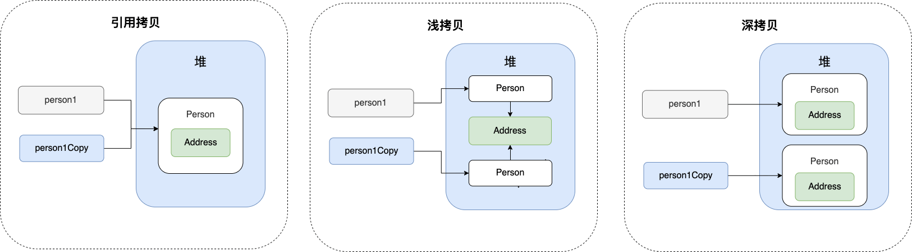
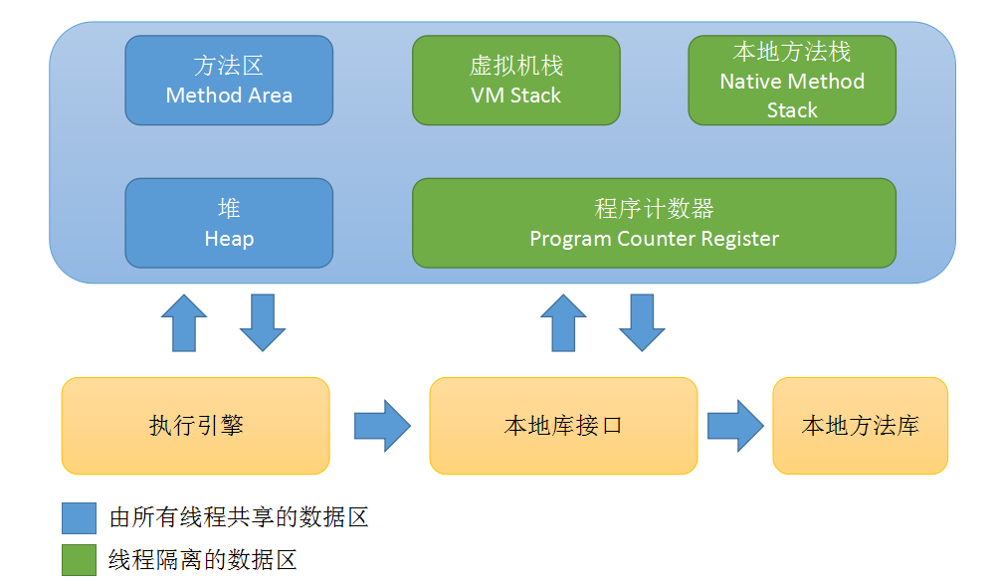
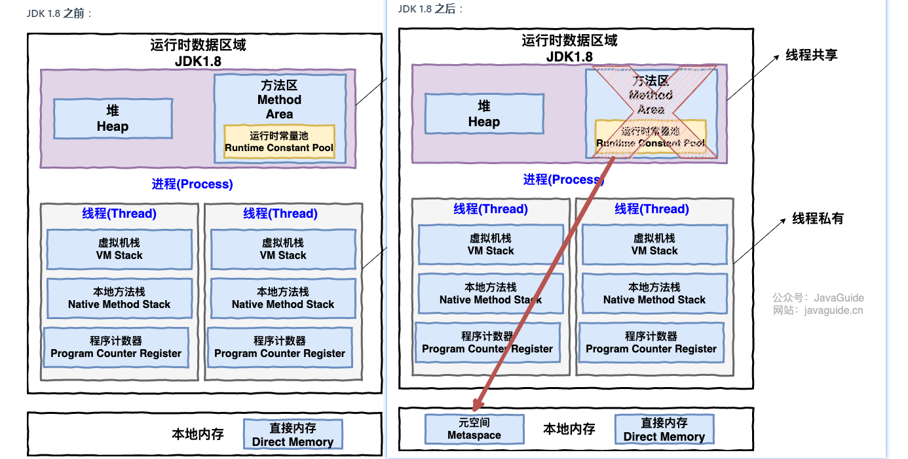
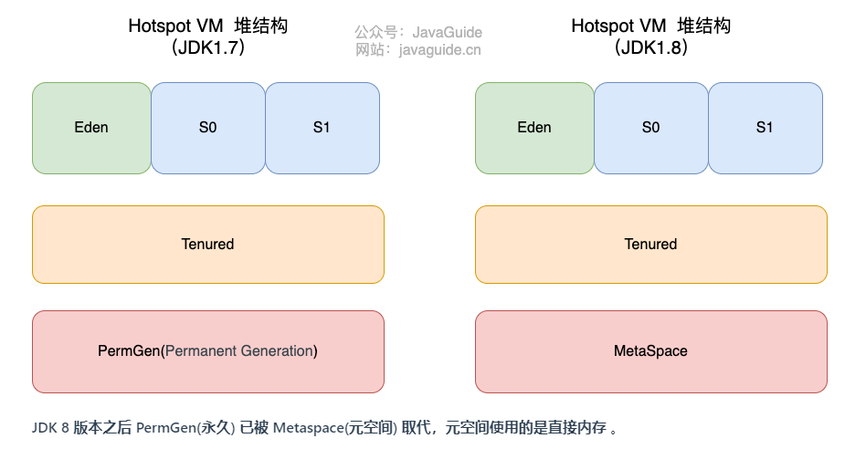
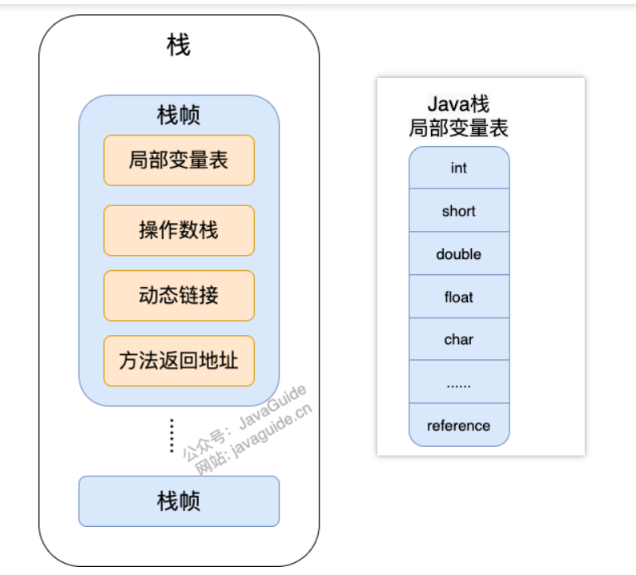
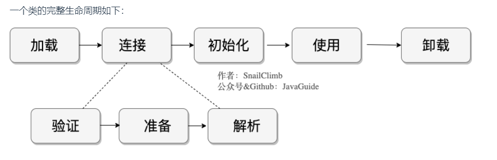
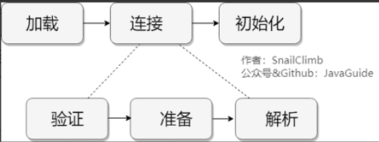
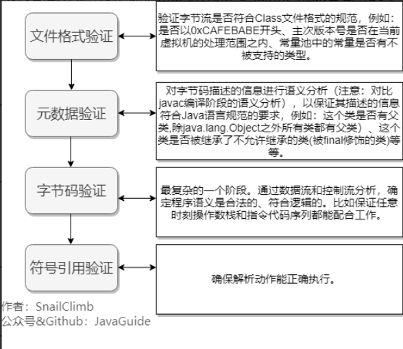
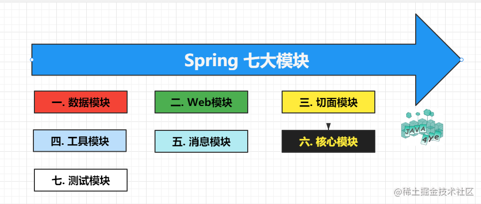
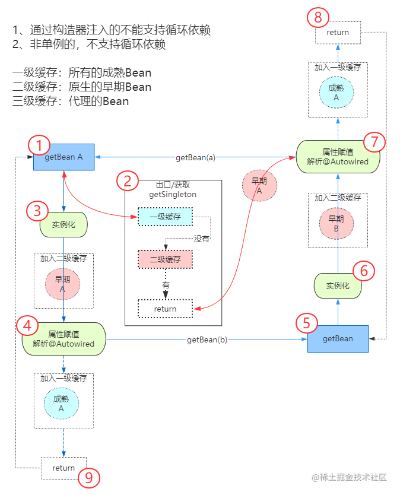

# 基础
## 1. java 语言有什么特点
> 个人答案：
> 在之前 java 宣传的特点是 一次编写到处运行（Write Once, Run Anywhere），也就是跨平台性，但是在现在看来的话，跨平台已经不能算做一门编程语言的特点了，因为后面出来的语言也能做到，比如说 Go ，所以我觉得 java 语言的最大的特点就是，它具有编程界最强大的生态，无论是做什么项目，都可以找到现有的方案，对于新手学习特别友好。

1. 简单易学；
2. 面向对象（封装，继承，多态）；
3. 平台无关性（ Java 虚拟机实现平台无关性）；
4. 支持多线程（ C++ 语言没有内置的多线程机制，因此必须调用操作系统的多线程功能来进行多线程程序设计，而 Java 语言却提供了多线程支持）；
5. 可靠性；
6. 安全性；
7. 支持网络编程并且很方便（ Java 语言诞生本身就是为简化网络编程设计的，因此 Java 语言不仅支持网络编程而且很方便）；
8. 编译与解释并存；

## 2. JDK、JRE 与 JVM 有什么区别

- JDK 是 Java Development Kit 缩写，它是功能齐全的 Java SDK。它拥有 JRE 所拥有的一切，还有编译器（javac）和工具（如 javadoc 和 jdb）。它能够创建和编译程序。
- JRE 是 Java 运行时环境。它是运行已编译 Java 程序所需的所有内容的集合，包括 Java 虚拟机（JVM），Java 类库，java 命令和其他的一些基础构件。但是，它不能用于创建新程序。
- JVM 是运行 Java 字节码的虚拟机。JVM 有针对不同系统的特定实现（Windows，Linux，macOS），目的是使用相同的字节码，它们都会给出相同的结果。字节码和不同系统的 JVM 实现是 Java 语言“一次编译，随处可以运行”的关键所在。

## 3. 什么是字节码?采用字节码的好处是什么
在 Java 中，JVM 可以理解的代码就叫做字节码（即扩展名为 .class 的文件），它不面向任何特定的处理器，只面向虚拟机。Java 语言通过字节码的方式，在一定程度上解决了传统解释型语言执行效率低的问题，同时又保留了解释型语言可移植的特点。所以， Java 程序运行时相对来说还是高效的（不过，和 C++，Rust，Go 等语言还是有一定差距的），而且，由于字节码并不针对一种特定的机器，因此，Java 程序无须重新编译便可在多种不同操作系统的计算机上运行。
> **Java 程序从源代码到运行的过程如下图所示：**


> 我们需要格外注意的是 .class->机器码 这一步。在这一步 JVM 类加载器首先加载字节码文件，然后通过解释器逐行解释执行，这种方式的执行速度会相对比较慢。而且，有些方法和代码块是经常需要被调用的(也就是所谓的热点代码)，所以后面引进了 JIT（just-in-time compilation） 编译器，而 JIT 属于运行时编译。当 JIT 编译器完成第一次编译后，其会将字节码对应的机器码保存下来，下次可以直接使用。而我们知道，机器码的运行效率肯定是高于 Java 解释器的。这也解释了我们为什么经常会说 **Java 是编译与解释共存的语言** 。

> HotSpot 采用了惰性评估(Lazy Evaluation)的做法，根据二八定律，消耗大部分系统资源的只有那一小部分的代码（热点代码），而这也就是 JIT 所需要编译的部分。JVM 会根据代码每次被执行的情况收集信息并相应地做出一些优化，因此执行的次数越多，它的速度就越快。JDK 9 引入了一种新的编译模式 AOT(Ahead of Time Compilation)，它是直接将字节码编译成机器码，这样就避免了 JIT 预热等各方面的开销。JDK 支持分层编译和 AOT 协作使用。


## 4. 为什么说 Java 语言“编译与解释并存”？
因为 Java 程序要经过先编译，后解释两个步骤，由 Java 编写的程序需要先经过编译步骤，生成字节码（.class 文件），这种字节码必须由 Java 解释器来解释执行。

## 5. Oracle JDK 与 OpenJDK 有什么区别

1. 更新时间不同。Oracle JDK 大概每 6 个月发一次主要版本，而 OpenJDK 版本大概每三个月发布一次；
2. OpenJDK 是一个参考模型并且是完全开源的，而 Oracle JDK 是 OpenJDK 的一个实现，并不是完全开源的；
3. Oracle JDK 比 OpenJDK 更稳定。

## 6. Java 与 C++ 的区别

- Java 不提供指针来直接访问内存，程序内存更加安全
- Java 的类是单继承的，C++ 支持多重继承；虽然 Java 的类不可以多继承，但是接口可以多继承。
- Java 有自动内存管理垃圾回收机制(GC)，不需要程序员手动释放无用内存。
- C ++同时支持方法重载和操作符重载，但是 Java 只支持方法重载。

## 7. 静态方法和实例方法有何不同？

- 调用方式不同。在外部调用静态方法时，可以使用 `类名.方法名` 的方式，也可以使用 `对象.方法名` 的方式，而实例方法只有后面这种方式。也就是说，**调用静态方法可以无需创建对象** 。
- 访问权限不同。静态方法在访问本类的成员时，只允许访问静态成员（即静态成员变量和静态方法），不允许访问实例成员（即实例成员变量和实例方法），而实例方法不存在这个限制。

## 8. 重载和重写的区别

- 重载就是同样的一个方法能够根据输入数据的不同，做出不同的处理
- 重写就是当子类继承自父类的相同方法，输入数据一样，但要做出有别于父类的响应时，你就要覆盖父类方法。
| 区别点 | 重载方法 | 重写方法 |
| --- | --- | --- |
| 发生范围 | 同一个类 | 子类 |
| 参数列表 | 必须修改 | 一定不能修改 |
| 返回类型 | 可修改 | 子类方法返回值类型应比父类方法返回值类型更小或相等 |
| 异常 | 可修改 | 子类方法声明抛出的异常类应比父类方法声明抛出的异常类更小或相等； |
| 访问修饰符 | 可修改 | 一定不能做更严格的限制（可以降低限制） |
| 发生阶段 | 编译期 | 运行期 |

## 9. Java 中的几种基本数据类型了解么
Java 中有 8 种基本数据类型，分别为：

- 6 种数字类型：
   - 4 种整数型：byte、short、int、long
   - 2 种浮点型：float、double
- 1 种字符类型：char
- 1 种布尔型：boolean。

## 10. 基本类型和包装类型的区别？

- 成员变量包装类型不赋值就是 null ，而基本类型有默认值且不是 null。
- 包装类型可用于泛型，而基本类型不可以。
- 基本数据类型的局部变量存放在 Java 虚拟机栈中的局部变量表中，基本数据类型的成员变量（未被 static 修饰 ）存放在 Java 虚拟机的堆中。包装类型属于对象类型，我们知道几乎所有对象实例都存在于堆中。
- 相比于对象类型， 基本数据类型占用的空间非常小。
> **为什么说是几乎所有对象实例呢？** 
> 这是因为 HotSpot 虚拟机引入了 JIT 优化之后，会对对象进行逃逸分析，如果发现某一个对象并没有逃逸到方法外部，那么就可能通过标量替换来实现栈上分配，而避免堆上分配内存。

## 11. 包装类型的缓存机制了解么？
Java 基本数据类型的包装类型的大部分都用到了缓存机制来提升性能。
Byte,Short,Integer,Long 这 4 种包装类默认创建了数值 `**[-128，127]**` 的相应类型的缓存数据，Character 创建了数值在 `**[0,127]**` 范围的缓存数据，Boolean 直接返回 `True or False`。

## 12. 自动装箱与拆箱了解吗？原理是什么？
**什么是自动拆装箱？**

- **装箱**：将基本类型用它们对应的引用类型包装起来；
- **拆箱**：将包装类型转换为基本数据类型；
```java
Integer i = 10;  //装箱
int n = i;   //拆箱
```
上面这两行代码对应的字节码为：
```java
   L1

    LINENUMBER 8 L1

    ALOAD 0

    BIPUSH 10

    INVOKESTATIC java/lang/Integer.valueOf (I)Ljava/lang/Integer;

    PUTFIELD AutoBoxTest.i : Ljava/lang/Integer;

   L2

    LINENUMBER 9 L2

    ALOAD 0

    ALOAD 0

    GETFIELD AutoBoxTest.i : Ljava/lang/Integer;

    INVOKEVIRTUAL java/lang/Integer.intValue ()I

    PUTFIELD AutoBoxTest.n : I

    RETURN

```
从字节码中，我们发现装箱其实就是调用了 包装类的`valueOf()`方法，拆箱其实就是调用了 `xxxValue()`方法。
因此，

- `Integer i = 10` 等价于 `Integer i = Integer.valueOf(10)`
- `int n = i` 等价于 `int n = i.intValue()`;

## 13. 超过 long 整型的数据应该如何表示？
基本数值类型都有一个表达范围，如果超过这个范围就会有数值溢出的风险。
在 Java 中，64 位 long 整型是最大的整数类型。
```java
long l = Long.MAX_VALUE;
System.out.println(l + 1); // -9223372036854775808
System.out.println(l + 1 == Long.MIN_VALUE); // true
```
BigInteger 内部使用 int[] 数组来存储任意大小的整形数据。
相对于常规整数类型的运算来说，BigInteger 运算的效率会相对较低。

## 14. 面向对象和面向过程的区别

- 面向过程把解决问题的过程拆成一个个方法，通过一个个方法的执行解决问题，比如说 C 语言，就是纯面向过程的语言。
- 面向对象会先抽象出对象，然后用对象执行方法的方式解决问题，比如说 Java，就是纯面向对象的语言。
## 15. 创建一个对象用什么运算符? 谈谈你对创建对象的理解
Java 使用 `new` 运算符，创建存放在堆中的对象实例。
```java
Object obj = new Object();
```
简单的一句话，包含了四个动作：

1. `new Object` 在堆内存中创建了一个 `Object` 类型对象实体；
2. 末尾的 `()`意味着，在对象创建后，立即调用类的构造函数，对刚生成的对象进行初始化。
3. `Object obj` 在栈内存中创建了一个名为 `obj` 的 `Object` 类型引用变量，它可以指向 `Object` 类型的对象实体；
4. 最后用一个“=”将对象引用 `obj` 指向对象实体 new Object()。
> `String s="abce"`是一种非常特殊的形式,和 new 有本质的区别。它是 java 中唯一不需要new 就可以产生对象的途径。以`String s="abce";`形式赋值在java中叫直接量,它是在常量池中而不是像 new 一样放在压缩堆中。这种形式的字符串，在JVM内部发生字符串拘留，即当声明这样的一个字符串后，JVM会在常量池中先查找有有没有一个值为"abcd"的对象，如果有，就会把它赋给当前引用，即原来那个引用和现在这个引用指点向了同一对象；如果没有，则在常量池中新创建一个"abcd"，下一次如果有String s1 = "abcd"，又会将s1指向"abcd"这个对象，即以这形式声明的字符串，只要值相等,任何多个引用都指向同一对象。
而 `String s = new String("abcd");`和其它任何对象一样，每调用一次就产生一个对象，只要它们调用。
> 


---

> 也可以这么理解: `String str = "hello";` 先在内存中找是不是有`"hello"`这个对象,如果有，就让str 指向那个 "hello" ；如果内存里没有 "hello"，就创建一个新的对象保存"hello"。
> `String str=new String ("hello");` 就是不管内存里是不是已经有"hello"这个对象，都新建一个对象保存"hello"。

## 16. 对象实体与对象引用有何不同?
对象引用就是一个变量，有名字，我们可以直接访问，它存储的是一个地址，这个地址指向堆内存中某一个该类型的对象实体；
而对象实体没有名字，我们只能通过对象引用来间接访问它。
最后，只有 new 才会创建对象实体，才会在堆内存中开辟新的空间。

## 17. 对象的相等和引用相等的区别

- 对象的相等一般比较的是内存中存放的内容是否相等。
- 引用相等一般比较的是他们指向的内存地址是否相等。

## 18. 类的构造方法的作用是什么?
构造方法是一种特殊的方法，主要作用是完成对象的初始化工作。

## 19. 如果一个类没有声明构造方法，该程序能正确执行吗?
如果一个类没有声明构造方法，也可以执行！
因为一个类即使没有声明构造方法也会有默认的不带参数的构造方法。但是，如果我们自己添加了类的构造方法（无论是否有参），Java 就不会再添加默认的无参数的构造方法了，我们一直在不知不觉地使用构造方法，这也是为什么我们在创建对象的时候后面要加一个括号（因为要调用无参的构造方法）。

## 20. 构造方法有哪些特点？是否可被 override ?
构造方法特点如下：

- 名字与类名相同。
- 没有返回值，但不能用 void 声明构造函数。
- 生成类的对象时自动执行，无需调用。

构造方法不能被 override（重写），但是可以 overload（重载），所以你可以看到一个类中有多个构造函数的情况。

## 21. 面向对象三大特征

- 封装。封装是指把一个对象的状态信息（也就是属性）隐藏在对象内部，不允许外部对象直接访问对象的内部信息。但是可以提供一些可以被外界访问的方法来操作属性。
- 继承。继承是使用已存在的类的定义作为基础建立新类的技术，新类的定义可以增加新的数据或新的功能，也可以用父类的功能，但不能选择性地继承父类。通过使用继承，可以快速地创建新的类，可以提高代码的重用，程序的可维护性，节省大量创建新类的时间 ，提高我们的开发效率。
> **关于继承如下 3 点请记住：**
> 1. 子类拥有父类对象所有的属性和方法（包括私有属性和私有方法），但是父类中的私有属性和方法子类是无法访问，**只是拥有**。
> 2. 子类可以拥有自己属性和方法，即子类可以对父类进行扩展。
> 3. 子类可以用自己的方式实现父类的方法。。

- 多态。顾名思义，表示一个对象具有多种的状态，具体表现为父类的引用指向子类的实例。
> **多态的特点:**
> - 对象类型和引用类型之间具有继承（类）/实现（接口）的关系；
> - 引用类型变量发出的方法调用的到底是哪个类中的方法，必须在程序运行期间才能确定；
> - 多态不能调用“只在子类存在但在父类不存在”的方法；
> - 如果子类重写了父类的方法，真正执行的是子类覆盖的方法，如果子类没有覆盖父类的方法，执行的是父类的方法。


## 22. 接口和抽象类有什么共同点和区别？
**共同点** ：

- 都不能被实例化。
- 都可以包含抽象方法。
- 都可以有默认实现的方法（Java 8 可以用 default 关键字在接口中定义默认方法）。

**区别** ：

- 接口主要用于对类的行为进行约束，你实现了某个接口就具有了对应的行为。抽象类主要用于代码复用，强调的是所属关系。
- 一个类只能继承一个类，但是可以实现多个接口。
- 接口中的成员变量只能是 `public static final` 类型的，不能被修改且必须有初始值，而抽象类的成员变量默认 default，可在子类中被重新定义，也可被重新赋值。
## 23. 深拷贝、浅拷贝和引用拷贝的区别？

- **浅拷贝**：浅拷贝会在堆上创建一个新的对象（区别于引用拷贝的一点），如果原对象内部的属性是引用类型的话，浅拷贝会直接复制内部对象的引用地址，也就是说拷贝对象和原对象共用同一个内部对象。
- **深拷贝** ：深拷贝会完全复制整个对象，包括这个对象所包含的内部对象。
- **引用拷贝：**简单来说，引用拷贝就是两个不同的引用指向同一个对象。

我专门画了一张图来描述浅拷贝、深拷贝、引用拷贝：


# 常见的类
## 1. Object
Object 类是一个特殊的类，是所有类的父类。它主要提供了以下 11 个方法：
```java
/**
 * native 方法，用于返回当前运行时对象的 Class 对象，使用了 final 关键字修饰，故不允许子类重写。
 */
public final native Class<?> getClass()
/**
 * native 方法，用于返回对象的哈希码，主要使用在哈希表中，比如 JDK 中的HashMap。
 */
public native int hashCode()
/**
 * 用于比较 2 个对象的内存地址是否相等，String 类对该方法进行了重写以用于比较字符串的值是否相等。
 */
public boolean equals(Object obj)
/**
 * naitive 方法，用于创建并返回当前对象的一份拷贝。
 */
protected native Object clone() throws CloneNotSupportedException
/**
 * 返回类的名字实例的哈希码的 16 进制的字符串。建议 Object 所有的子类都重写这个方法。
 */
public String toString()
/**
 * native 方法，并且不能重写。唤醒一个在此对象监视器上等待的线程(监视器相当于就是锁的概念)。如果有多个线程在等待只会任意唤醒一个。
 */
public final native void notify()
/**
 * native 方法，并且不能重写。跟 notify 一样，唯一的区别就是会唤醒在此对象监视器上等待的所有线程，而不是一个线程。
 */
public final native void notifyAll()
/**
 * native方法，并且不能重写。暂停线程的执行。注意：sleep 方法没有释放锁，而 wait 方法释放了锁 ，timeout 是等待时间。
 */
public final native void wait(long timeout) throws InterruptedException
/**
 * 多了 nanos 参数，这个参数表示额外时间（以毫微秒为单位，范围是 0-999999）。 所以超时的时间还需要加上 nanos 毫秒。。
 */
public final void wait(long timeout, int nanos) throws InterruptedException
/**
 * 跟之前的2个wait方法一样，只不过该方法一直等待，没有超时时间这个概念
 */
public final void wait() throws InterruptedException
/**
 * 实例被垃圾回收器回收的时候触发的操作
 */
protected void finalize() throws Throwable { }

```

### 1-1. `==`与`equals`的区别

- `**==** `对于基本类型和引用类型的作用效果是不同的：
   - 对于基本数据类型来说，`==` 比较的是值。
   - 对于引用数据类型来说，`==` 比较的是对象的内存地址。
> 因为 Java 只有值传递，所以，对于 == 来说，不管是比较基本数据类型，还是引用数据类型的变量，其本质比较的都是值，只是引用类型变量存的值是对象的地址。

- **equals()** 不能用于判断基本数据类型的变量，只能用来判断两个对象是否相等。equals()方法存在于Object类中，而Object类是所有类的直接或间接父类，因此所有的类都有equals()方法。

### 1-2. hashCode() 有什么用？
hashCode() 的作用是获取哈希码（int 整数），也称为散列码。这个哈希码的作用是确定该对象在哈希表中的索引位置。
`hashCode()`定义在 JDK 的 Object 类中，这就意味着 Java 中的任何类都包含有 hashCode() 函数。另外需要注意的是： Object 的 hashCode() 方法是本地方法，也就是用 C 语言或 C++ 实现的，该方法通常用来将对象的内存地址转换为整数之后返回。
```java
public native int hashCode();
```
> 散列表存储的是键值对(key-value)，它的特点是：**能根据“键”快速的检索出对应的“值”。这其中就利用到了散列码！（可以快速找到所需要的对象）**


### 1-3. 为什么重写 equals() 时必须重写 hashCode() 方法？
因为两个相等的对象的 hashCode 值必须是相等。也就是说如果 equals 方法判断两个对象是相等的，那这两个对象的 hashCode 值也要相等。
如果重写 equals() 时没有重写 hashCode() 方法的话就可能会导致 equals 方法判断是相等的两个对象，hashCode 值却不相等。

## 2. String
### 2-1. String、StringBuffer、StringBuilder 的区别？
>  String、StringBuffer、StringBuilder 最大的不同是 String 不可变，后者可变。StringBuffer 是线程安全的，StringBuilder 线程不安全速度较快。  

**可变性**
String 是不可变的
StringBuilder 与 StringBuffer 都继承自 AbstractStringBuilder 类，在 AbstractStringBuilder 中也是使用字符数组保存字符串，不过没有使用 final 和 private 关键字修饰，最关键的是这个 AbstractStringBuilder 类还提供了很多修改字符串的方法比如 append 方法。
```java
abstract class AbstractStringBuilder implements Appendable, CharSequence {
    char[] value;
    public AbstractStringBuilder append(String str) {
        if (str == null)
            return appendNull();
        int len = str.length();
        ensureCapacityInternal(count + len);
        str.getChars(0, len, value, count);
        count += len;
        return this;
    }
  	//...
}

```

**线程安全性**
String 中的对象是不可变的，也就可以理解为常量，线程安全。AbstractStringBuilder 是 StringBuilder 与 StringBuffer 的公共父类，定义了一些字符串的基本操作，如 expandCapacity、append、insert、indexOf 等公共方法。StringBuffer 对方法加了同步锁或者对调用的方法加了同步锁，所以是线程安全的。StringBuilder 并没有对方法进行加同步锁，所以是非线程安全的。
**性能**
每次对 String 类型进行改变的时候，都会生成一个新的 String 对象，然后将指针指向新的 String 对象。StringBuffer 每次都会对 StringBuffer 对象本身进行操作，而不是生成新的对象并改变对象引用。相同情况下使用 StringBuilder 相比使用 StringBuffer 仅能获得 10%~15% 左右的性能提升，但却要冒多线程不安全的风险。
> **对于三者使用的总结：**
> 1. 操作少量的数据: 适用 String
> 2. 单线程操作字符串缓冲区下操作大量数据: 适用 StringBuilder
> 3. 多线程操作字符串缓冲区下操作大量数据: 适用 StringBuffer

### 2-2. 字符串拼接用“+” 还是 StringBuilder?
Java 语言本身并不支持运算符重载，“+”和“+=”是专门为 String 类重载过的运算符，也是 Java 中仅有的两个重载过的运算符。
```java
String str1 = "he";
String str2 = "llo";
String str3 = "world";
String str4 = str1 + str2 + str3;

```
上面的代码对应的字节码如下：

可以看出，字符串对象通过“+”的字符串拼接方式，实际上是通过 StringBuilder 调用 append() 方法实现的，拼接完成之后调用 toString() 得到一个 String 对象 。

### 2-3. String#equals() 和 Object#equals() 有何区别？

- String 中的 equals 方法是被重写过的，比较的是 String 字符串的值是否相等。 
- Object 的 equals 方法是比较的对象的内存地址。
### 2-4. 字符串常量池的作用了解吗？
**字符串常量池** 是 JVM 为了提升性能和减少内存消耗针对字符串（String 类）专门开辟的一块区域，主要目的是为了避免字符串的重复创建。
```java
// 在堆中创建字符串对象”ab“
// 将字符串对象”ab“的引用保存在字符串常量池中
String aa = "ab";
// 直接返回字符串常量池中字符串对象”ab“的引用
String bb = "ab";
System.out.println(aa==bb);// true

```

### 2-5 String 是基本数据类型吗？是否可变？
String 不是基本数据类型，且不可变。
### 2-6 switch 可以使用 String 吗？
 jdk7+ 中的 switch 可以使用 String 类型。  

### 2-7  String str = new String("abc");创建了几个对象，为什么？  
 创建了两个，"abc"本身创建在常量池，通过 new 又创建在堆中。  

### 2-8  String 可以被子类继承吗  
 String 是 final 的，所以不能被继承。  

## 2-9  String 与 byte[]两者相互之间如何转换？  

- `String > byte[]` 通过 String 类的 getBytes 方法；
- `byte[] > String` 通过 new String(byte[])构造器  
# 集合
Java 集合， 也叫作容器，主要是由两大接口派生而来：一个是 Collection接口，主要用于存放单一元素；另一个是 Map 接口，主要用于存放键值对。对于Collection 接口，下面又有三个主要的子接口：List、Set 和 Queue。
Java 集合框架如下图所示：

注：图中只列举了主要的继承派生关系，并没有列举所有关系。比方省略了AbstractList, NavigableSet等抽象类以及其他的一些辅助类，如想深入了解，可自行查看源码。

## 1. 说说 List, Set, Queue, Map 四者的区别？

- `List`(对付顺序的好帮手): 存储的元素是有序的、可重复的。
- `Set`(注重独一无二的性质): 存储的元素是无序的、不可重复的。
- `Queue`(实现排队功能的叫号机): 按特定的排队规则来确定先后顺序，存储的元素是有序的、可重复的。
- `Map`(用 key 来搜索的专家): 使用键值对（key-value）存储，类似于数学上的函数 y=f(x)，"x" 代表 key，"y" 代表 value，key 是无序的、不可重复的，value 是无序的、可重复的，每个键最多映射到一个值。
## 2. 说一下集合底层用到的数据结构
先来看一下 Collection 接口下面的集合。
### List

- ArrayList： Object[] 数组
- Vector：Object[] 数组
- LinkedList： 双向链表(JDK1.6 之前为循环链表，JDK1.7 取消了循环)
### Set

- HashSet(无序，唯一): 基于 HashMap 实现的，底层采用 HashMap 来保存元素
- LinkedHashSet: LinkedHashSet 是 HashSet 的子类，并且其内部是通过 LinkedHashMap 来实现的。有点类似于我们之前说的 LinkedHashMap 其内部是基于 HashMap 实现一样，不过还是有一点点区别的
- TreeSet(有序，唯一)：红黑树(自平衡的排序二叉树)
### Queue

- PriorityQueue: Object[] 数组来实现二叉堆
- ArrayQueue: Object[] 数组 + 双指针
### Map

- HashMap： JDK1.8 之前 HashMap 由数组+链表组成的，数组是 HashMap 的主体，链表则是主要为了解决哈希冲突而存在的（“拉链法”解决冲突）。
- LinkedHashMap： LinkedHashMap 继承自 HashMap，所以它的底层仍然是基于拉链式散列结构即由数组和链表组成。另外，LinkedHashMap 在上面结构的基础上，增加了一条双向链表，使得上面的结构可以保持键值对的插入顺序。同时通过对链表进行相应的操作，实现了访问顺序相关逻辑。详细可以查看：[《LinkedHashMap 源码详细分析（JDK1.8）》open in new window](https://www.imooc.com/article/22931)
- Hashtable： 数组+链表组成的，数组是 Hashtable 的主体，链表则是主要为了解决哈希冲突而存在的
- TreeMap： 红黑树（自平衡的排序二叉树）

## 3. 如何选用集合?
主要根据集合的特点来选用，比如我们需要根据键值获取到元素值时就选用 Map 接口下的集合，需要排序时选择 TreeMap，不需要排序时就选择 HashMap,需要保证线程安全就选用 ConcurrentHashMap。
当我们只需要存放元素值时，就选择实现 Collection 接口的集合，需要保证元素唯一时选择实现 Set 接口的集合比如 TreeSet 或 HashSet，不需要就选择实现 List 接口的比如 ArrayList 或 LinkedList，然后再根据实现这些接口的集合的特点来选用。

## 4. List 接口
### 4-1. ArrayList 与 LinkedList 区别?
#### 是否保证线程安全： 
ArrayList 和 LinkedList 都是不同步的，也就是不保证线程安全；
#### 底层数据结构：

-  ArrayList 底层使用的是 **Object 数组**；
- LinkedList 底层使用的是 **双向链表** 数据结构（JDK1.6 之前为循环链表，JDK1.7 取消了循环。注意双向链表和双向循环链表的区别，下面有介绍到！）
> **双向链表：** 包含两个指针，一个 prev 指向前一个节点，一个 next 指向后一个节点。
> 
> **双向循环链表：** 最后一个节点的 next 指向 head，而 head 的 prev 指向最后一个节点，构成一个环。
> 

#### 插入和删除是否受元素位置的影响：

- ArrayList 采用数组存储，所以插入和删除元素的时间复杂度受元素位置的影响。 
- LinkedList 采用链表存储，所以，如果是在头尾插入或者删除元素不受元素位置的影响，时间复杂度 `O(1)`，如果是要在指定位置 i 插入和删除元素的话， 时间复杂度为 `O(n)` ，因为需要先移动到指定位置再插入。
#### 是否支持快速随机访问：

-  LinkedList 不支持高效的随机元素访问，而 ArrayList 支持。
> 快速随机访问就是通过元素的序号快速获取元素对象(对应于get(int index)方法)。

#### 内存空间占用：

-  ArrayList 的空间浪费主要体现在在 list 列表的结尾会预留一定的容量空间；
- 而 LinkedList 的空间花费则体现在它的每一个元素都需要消耗比 ArrayList 更多的空间（因为要存放直接后继和直接前驱以及数据）。

### 4-2. ArrayList 
#### 1. ArrayList 与 数组的区别
ArrayList 的底层是数组队列，相当于动态数组。与 Java 中的数组相比，它的容量能动态增长。在添加大量元素前，应用程序可以使用ensureCapacity操作来增加 ArrayList 实例的容量。这可以减少递增式再分配的数量。
#### 2 ArrayList 的初始化容量
```java
// 默认容量是10
private static final int DEFAULT_CAPACITY = 10;
// 如果容量为0的时候，就返回这个数组
private static final Object[] EMPTY_ELEMENTDATA = {};
// 使用默认容量10时，返回这个数组
private static final Object[] DEFAULTCAPACITY_EMPTY_ELEMENTDATA = {};
// 元素存放的数组
transient Object[] elementData;
// 元素的个数
private int size;

// 记录被修改的次数
protected transient int modCount = 0;
// 数组的最大值
private static final int MAX_ARRAY_SIZE = Integer.MAX_VALUE - 8

```
ArrayList有三个构造方法，不同的构造方法的容量是不一样的，具体可以查看JDK 源码。

- 如果不传入初始容量，就使用默认容量，并设置 `elementData`为`DEFAULTCAPACITY_EMPTY_ELEMENTDATA`
- 如果传入初始容量，会判断这个传入的值，如果大于0，就 `new`一个新的Object数组，如果等于0，就直接设置 `elementData`为 `EMPTY_ELEMENTDATA`。
- 如果传入一个 `Collection`，则会调用`toArray()`方法把它变成一个数组并赋值给`elementData`。同样会判断它的长度是否为0，如果为0，设置`elementData`为`EMPTY_ELEMENTDATA`。
#### 3. ArrayList  的扩容具体指什么
`ArrayList`里面有两个概念，一个是`capacity`，它表示的就是“容量”，其实质是数组`elementData`的长度。而`size`则表示的“存放的元素的个数”。
因为 Java 中，数组操作不能越界，所以我们必须要保证在插入操作的时候，不会抛出数组越界异常。
#### 4. ArrayList是如何实现扩容的？
扩容主要分两种，自动扩容和手动扩容。
自动扩容底层主要是三个私有方法：

```java
// 扩容一个
private Object[] grow() {
	return grow(size + 1);
}

// 保证扩容到期望容量minCapacity及以上
private Object[] grow(int minCapacity) {
    return elementData = Arrays.copyOf(elementData,
                                       newCapacity(minCapacity));
}

// 根据期望容量minCapacity计算实际需要扩容的容量
private int newCapacity(int minCapacity) {
    // overflow-conscious code
    int oldCapacity = elementData.length; // 得到旧容量
    int newCapacity = oldCapacity + (oldCapacity >> 1); // 设置新容量为旧容量的1.5倍
    if (newCapacity - minCapacity <= 0) { // 如果新容量仍然小于期望容量
        if (elementData == DEFAULTCAPACITY_EMPTY_ELEMENTDATA) // 如果是使用的默认容量
            return Math.max(DEFAULT_CAPACITY, minCapacity); // 取默认容量和期望容量较大值返回
        if (minCapacity < 0) // overflow // 检查期望容量是否越界（int 的范围）
            throw new OutOfMemoryError();
        return minCapacity; // 返回期望容量
    }
    // 如果新容量大于期望容量，判断一下新容量是否越界
    return (newCapacity - MAX_ARRAY_SIZE <= 0)
        ? newCapacity
        : hugeCapacity(minCapacity);
}
```
可以看到，底层其实是调用了`Arrays.copyOf`方法来进行扩充数组容量的。这里我们主要看一下最后一个方法`newCapacity(int minCapacity)`的实现。
**默认情况下，新的容量会是原容量的1.5倍，这里用了位运算提高效率**。一般情况下，如果扩容1.5倍后就大于期望容量，那就返回这个1.5倍旧容量的值。而如果小于期望容量，那就返回期望容量。这里对默认容量10做了特殊处理。
**使用1.5倍这个数值而不是直接使用期望容量，是为了防止频繁扩容影响性能**。试想如果每次add操作都要扩容一次，那性能将会非常低下。
手动扩容主要是一个公有方法`ensureCapacity`：
```java
public void ensureCapacity(int minCapacity) {
    if (minCapacity > elementData.length
        && !(elementData == DEFAULTCAPACITY_EMPTY_ELEMENTDATA
             && minCapacity <= DEFAULT_CAPACITY)) {
        modCount++;
        grow(minCapacity);
    }
}

```

#### 5. ArrayList有缩容吗？
ArrayList没有缩容。无论是remove方法还是clear方法，它们都不会改变现有数组elementData的长度。但是它们都会把相应位置的元素设置为null，以便垃圾收集器回收掉不使用的元素，节省内存。
## 5. Set 接口
### hashset 的底层底层实现
```java
public boolean add(E e){
    /*
    这里我们可以发现我们使用HashSet中的add()方法其实在底层是使用了HashMap中的put()方法,这个时候将我们add()方法的参数作为put()方法的key进行存储的,而我们的value其实就是一个常量,这个常量 PRESENT 其实就是 private static final Object RESENT = new Object();
    */
    return map.put(e,PRESENT) == null;
}

```
从这个源码中我们可以发现HashSet中存储的数据底层是通过使用HashMap进行存储的,并且我们的存放到了HashMap中的key中,HashMap中的value都是存储的一样的,都是同一个Object对象(底层源码中:PRESENT),
private static final Object RESENT = new Object();
也就是所有的key都指向了同一个value
### 为什么HashSet底层使用同一个Object对象来作为HashMap中的value?
为了防止出现空指针异常
我们的Hashtable中无法存放为null的数据


## 6. Queue 接口
### Queue 与 Deque 的区别
Queue 是单端队列，只能从一端插入元素，另一端删除元素，实现上一般遵循 **先进先出（FIFO）** 规则。
Queue 扩展了 Collection 的接口，根据 **因为容量问题而导致操作失败后处理方式的不同** 可以分为两类方法: 一种在操作失败后会抛出异常，另一种则会返回特殊值。

| Queue 接口 | 抛出异常 | 返回特殊值 |
| --- | --- | --- |
| 插入队尾 | add(E e) | offer(E e) |
| 删除队首 | remove() | poll() |
| 查询队首元素 | element() | peek() |

Deque 是双端队列，在队列的两端均可以插入或删除元素。
Deque 扩展了 Queue 的接口, 增加了在队首和队尾进行插入和删除的方法，同样根据失败后处理方式的不同分为两类：

| Deque 接口 | 抛出异常 | 返回特殊值 |
| --- | --- | --- |
| 插入队首 | addFirst(E e) | offerFirst(E e) |
| 插入队尾 | addLast(E e) | offerLast(E e) |
| 删除队首 | removeFirst() | pollFirst() |
| 删除队尾 | removeLast() | pollLast() |
| 查询队首元素 | getFirst() | peekFirst() |
| 查询队尾元素 | getLast() | peekLast() |

事实上，Deque 还提供有 push() 和 pop() 等其他方法，可用于模拟栈。


## 7. Map 接口
### HashMap 和 Hashtable 的区别

- **线程是否安全：**HashMap 是非线程安全的，Hashtable 是线程安全的,因为 Hashtable 内部的方法基本都经过synchronized 修饰。（如果你要保证线程安全的话就使用 ConcurrentHashMap 吧！）；
- **效率：** 因为线程安全的问题，HashMap 要比 Hashtable 效率高一点。另外，Hashtable 基本被淘汰，不要在代码中使用它；
- **对 Null key 和 Null value 的支持：**HashMap 可以存储 null 的 key 和 value，但 null 作为键只能有一个，null 作为值可以有多个；Hashtable 不允许有 null 键和 null 值，否则会抛出 NullPointerException。
- **初始容量大小和每次扩充容量大小的不同 ：** 

① 创建时如果不指定容量初始值，Hashtable 默认的初始大小为 11，之后每次扩充，容量变为原来的 2n+1。HashMap 默认的初始化大小为 16。之后每次扩充，容量变为原来的 2 倍。
② 创建时如果给定了容量初始值，那么 Hashtable 会直接使用你给定的大小，而 HashMap 会将其扩充为 2 的幂次方大小（HashMap 中的tableSizeFor()方法保证，下面给出了源代码）。也就是说 HashMap 总是使用 2 的幂作为哈希表的大小,后面会介绍到为什么是 2 的幂次方。

- **底层数据结构：** JDK1.8 以后的 HashMap 在解决哈希冲突时有了较大的变化，当链表长度大于阈值（默认为 8）时，将链表转化为红黑树（将链表转换成红黑树前会判断，如果当前数组的长度小于 64，那么会选择先进行数组扩容，而不是转换为红黑树），以减少搜索时间（后文中我会结合源码对这一过程进行分析）。Hashtable 没有这样的机制。

**HashMap 中带有初始容量的构造函数：**
```java
    public HashMap(int initialCapacity, float loadFactor) {
        if (initialCapacity < 0)
            throw new IllegalArgumentException("Illegal initial capacity: " +
                                               initialCapacity);
        if (initialCapacity > MAXIMUM_CAPACITY)
            initialCapacity = MAXIMUM_CAPACITY;
        if (loadFactor <= 0 || Float.isNaN(loadFactor))
            throw new IllegalArgumentException("Illegal load factor: " +
                                               loadFactor);
        this.loadFactor = loadFactor;
        this.threshold = tableSizeFor(initialCapacity);
    }
     public HashMap(int initialCapacity) {
        this(initialCapacity, DEFAULT_LOAD_FACTOR);
    }
```
下面这个方法保证了 HashMap 总是使用 2 的幂作为哈希表的大小。
```java
  /**
     * Returns a power of two size for the given target capacity.
     */
static final int tableSizeFor(int cap) {
    int n = cap - 1;
    n |= n >>> 1;
    n |= n >>> 2;
    n |= n >>> 4;
    n |= n >>> 8;
    n |= n >>> 16;
    return (n < 0) ? 1 : (n >= MAXIMUM_CAPACITY) ? MAXIMUM_CAPACITY : n + 1;
}
```

### HashMap 和 TreeMap 区别

比于HashMap来说 TreeMap 主要多了对集合中的元素根据键排序的能力以及对集合内元素的搜索的能力。


# IO
## 1. IO 流简介
IO 即 `Input/Output`，输入和输出。数据输入到计算机内存的过程即输入，反之输出到外部存储（比如数据库，文件，远程主机）的过程即输出。数据传输过程类似于水流，因此称为 IO 流。IO 流在 Java 中分为输入流和输出流，而根据数据的处理方式又分为字节流和字符流。
Java IO 流的 40 多个类都是从如下 4 个抽象类基类中派生出来的。

- `InputStream/Reader`: 所有的输入流的基类，前者是字节输入流，后者是字符输入流。
- `OutputStream/Writer`: 所有输出流的基类，前者是字节输出流，后者是字符输出流。

## 2. 字节流
### 2.1 InputStream（字节输入流）
`InputStream `用于从源头（通常是文件）读取数据（字节信息）到内存中，`java.io.InputStream`抽象类是所有字节输入流的父类。
`InputStream` 常用方法 ：

- `read()` ：返回输入流中下一个字节的数据。返回的值介于 0 到 255 之间。如果未读取任何字节，则代码返回 -1 ，表示文件结束。
- `read(byte b[ ])` : 从输入流中读取一些字节存储到数组 b 中。如果数组 b 的长度为零，则不读取。如果没有可用字节读取，返回 -1。如果有可用字节读取，则最多读取的字节数最多等于 `b.length` ， 返回读取的字节数。这个方法等价于 `read(b, 0, b.length)`。
- `read(byte b[], int off, int len)` ：在read(byte b[ ]) 方法的基础上增加了 off 参数（偏移量）和 len 参数（要读取的最大字节数）。
- `skip(long n)` ：忽略输入流中的 n 个字节 ,返回实际忽略的字节数。
- `available()` ：返回输入流中可以读取的字节数。
- `close()` ：关闭输入流释放相关的系统资源。

从 Java 9 开始，InputStream 新增加了多个实用的方法：

- `readAllBytes()` ：读取输入流中的所有字节，返回字节数组。
- `readNBytes(byte[] b, int off, int len) `：阻塞直到读取 len 个字节。
- `transferTo(OutputStream out)` ： 将所有字节从一个输入流传递到一个输出流。

### 2.2 OutputStream（字节输出流）
`OutputStream`用于将数据（字节信息）写入到目的地（通常是文件），`java.io.OutputStream`抽象类是所有字节输出流的父类。
`OutputStream` 常用方法 ：

- `write(int b)` ：将特定字节写入输出流。
- `write(byte b[ ])` : 将数组b 写入到输出流，等价于 `write(b, 0, b.length)` 。
- `write(byte[] b, int off, int len)` : 在write(byte b[ ]) 方法的基础上增加了 off 参数（偏移量）和 len 参数（要读取的最大字节数）。
- `flush() `：刷新此输出流并强制写出所有缓冲的输出字节。
- `close() `：关闭输出流释放相关的系统资源。
## 3. 字符流
### 3.1 Reader（字符输入流）
Reader用于从源头（通常是文件）读取数据（字符信息）到内存中，java.io.Reader抽象类是所有字符输入流的父类。
Reader 用于读取文本， InputStream 用于读取原始字节。
Reader 常用方法 ：

- read() : 从输入流读取一个字符。
- read(char[] cbuf) : 从输入流中读取一些字符，并将它们存储到字符数组 cbuf中，等价于 read(cbuf, 0, cbuf.length) 。
- read(char[] cbuf, int off, int len) ：在read(char[] cbuf) 方法的基础上增加了 off 参数（偏移量）和 len 参数（要读取的最大字节数）。
- skip(long n) ：忽略输入流中的 n 个字符 ,返回实际忽略的字符数。
- close() : 关闭输入流并释放相关的系统资源。
### 3.2 Writer（字符输出流）
Writer用于将数据（字符信息）写入到目的地（通常是文件），java.io.Writer抽象类是所有字符输出流的父类。
Writer 常用方法 ：

- write(int c) : 写入单个字符。
- write(char[] cbuf) ：写入字符数组 cbuf，等价于write(cbuf, 0, cbuf.length)。
- write(char[] cbuf, int off, int len) ：在write(char[] cbuf) 方法的基础上增加了 off 参数（偏移量）和 len 参数（要读取的最大字节数）。
- write(String str) ：写入字符串，等价于 write(str, 0, str.length()) 。
- write(String str, int off, int len) ：在write(String str) 方法的基础上增加了 off 参数（偏移量）和 len 参数（要读取的最大字节数）。
- append(CharSequence csq) ：将指定的字符序列附加到指定的 Writer 对象并返回该 Writer 对象。
- append(char c) ：将指定的字符附加到指定的 Writer 对象并返回该 Writer 对象。
- flush() ：刷新此输出流并强制写出所有缓冲的输出字符。
- close():关闭输出流释放相关的系统资源。

## 4. 字节缓冲流
IO 操作是很消耗性能的，缓冲流将数据加载至缓冲区，一次性读取/写入多个字节，从而避免频繁的 IO 操作，提高流的传输效率。
字节缓冲流这里采用了装饰器模式来增强 InputStream 和OutputStream子类对象的功能。

## 5. 字符缓冲流
BufferedReader （字符缓冲输入流）和 BufferedWriter（字符缓冲输出流）类似于 BufferedInputStream（字节缓冲输入流）和BufferedOutputStream（字节缓冲输入流），内部都维护了一个字节数组作为缓冲区。不过，前者主要是用来操作字符信息。

## 6. 打印流
System.out 实际是用于获取一个 PrintStream 对象，print方法实际调用的是 PrintStream 对象的 write 方法。
PrintStream 属于字节打印流，与之对应的是 PrintWriter （字符打印流）。PrintStream 是 OutputStream 的子类，PrintWriter 是 Writer 的子类。

```java
public class PrintStream extends FilterOutputStream
    implements Appendable, Closeable {
}
public class PrintWriter extends Writer {
}

```
# JUC
## 1.  现在有 T1、T2、T3 三个线程，你怎样保证 T2 在 T1 执行完后执行，T3 在 T2 执行完后执行 。
可以使用 join 等待线程结束。
```java
package thread;


public class JoinTest {

    public static void main(String[] args) throws InterruptedException {
        Thread t1 = new Thread(()->{
            try {
                Thread.sleep((long) (Math.random() * 1000));
                System.out.println("T1---");
            } catch (InterruptedException e) {
                e.printStackTrace();
            }
        });
        Thread t2 = new Thread(()->{
            try {
                Thread.sleep((long) (Math.random() * 1000));
                System.out.println("T2---");
            } catch (InterruptedException e) {
                e.printStackTrace();
            }
        });
        Thread t3 = new Thread(()->{
            try {
                Thread.sleep((long) (Math.random() * 1000));
                System.out.println("T3---");
            } catch (InterruptedException e) {
                e.printStackTrace();
            }
        });
        System.out.println("t1 start");
        t1.start();
        t1.join();
        System.out.println("t2 start");
        t2.start();
        t2.join();
        System.out.println("t3 start");
        t3.start();
        t3.join();
    }
}
```

## 2. 说一下 volatie 
在Java中，`volatile` 关键字用于修饰变量，表示该变量是易变的，其值可能会被不同的线程修改。使用volatile关键字声明的变量具有两个特性：

1. 原子性：`volatile` 变量的读写操作都是原子性的，即所有线程对该变量的读写操作都是互相独立的，不会发生竞态条件。
2. 可见性：`volatile` 变量具有可见性，即当一个线程对该变量进行了更新后，其他线程能够立即看到该变量的最新值。

需要注意的是，虽然 volatile 变量保证了它们的读写操作是原子性的，但它并不保证多个操作的组合是原子性的。如果需要保证多个操作的组合是原子性的，可以考虑使用 `synchronized` 或者 `Lock` 来进行加锁。
另外，在 Java 中，使用 volatile 关键字还可以防止 JVM 对指令进行重新排序，这样可以避免出现由于指令重排导致的线程安全问题。

## 3. 说一下 synchronized
在Java中，synchronized 关键字用于实现线程同步，确保在多线程环境下对共享资源的安全访问。使用synchronized 关键字时，可以将同步范围限定到方法或代码块。
当一个线程进入 synchronized 代码块或方法时，它会尝试获得锁。如果锁没有被其他线程占用，则该线程会获取到锁并执行相应的操作；否则，该线程就会阻塞等待，直到获得锁为止。当一个线程执行完 synchronized 代码块或方法后，它会释放锁，这样其他线程才有机会获取锁并执行相应的操作。
synchronized关键字的作用：

1. 实现线程同步：确保多个线程对共享资源的安全访问，避免竞态条件和不一致性问题。
2. 保证可见性：在synchronized代码块或方法中对变量的修改对所有线程可见，从而保证了可见性。

需要注意的是，使用synchronized关键字会对程序性能产生一定影响，因为每次进入synchronized代码块或方法都需要获得锁，这可能导致线程之间的竞争和等待。另外，在使用synchronized关键字时，还需要注意死锁和饥饿等线程安全问题。

# JVM
## 1. 请谈谈你对 JVM 的理解？
 Java虚拟机规范中规定的JVM如下图所示：

可以看出，JVM由JVM运行时数据区（图示中蓝色框包含部分)、执行引擎、本地库接口、本地方法库组成。

## 2. jdk1.8 虚拟机与之前的版本有什么区别
1.8 之前存在永久代，1.8中没有永久代，替换它的是元空间，元空间所占的内存不是在虚拟机内部，而是本地内存空间，这么做的原因是，不管是永久代还是元空间，他们都是方法区的具体实现，之所以元空间所占的内存改成本地内存，官方的说法是为了和 JRockit 统一，不过额外还有一些原因，比如方法区所存储的类信息通常是比较难确定的，所以对于方法区的大小是比较难指定的，太小了容易出现方法区溢出，太大了又会占用了太多虚拟机的内存空间，而转移到本地内存后则不会影响虚拟机所占用的内存



## 3. JVM 的常用调优参数有哪些

- `-Xms2g`：初始化推大小为 2g；
- `-Xmx2g`：堆最大内存为 2g；
- `-XX:NewRatio=4`：设置年轻的和老年代的内存比例为 1:4；
- `-XX:SurvivorRatio=8`：设置新生代 Eden 和 Survivor 比例为 8:2；
- `–XX:+UseParNewGC`：指定使用 ParNew + Serial Old 垃圾回收器组合；
- `-XX:+UseParallelOldGC`：指定使用 ParNew + ParNew Old 垃圾回收器组合；
- `-XX:+UseConcMarkSweepGC`：指定使用 CMS + Serial Old 垃圾回收器组合；
- `-XX:+PrintGC`：开启打印 gc 信息；
- `-XX:+PrintGCDetails`：打印 gc 详细信息。
## 4. 垃圾回收 （`garbage collection`）
垃圾回收，顾名思义就是释放垃圾占用的空间，从而提升程序性能，防止内存泄露。当一个对象不再被需要时，该对象就需要被回收并释放空间。
Java 内存运行时数据区域包括程序计数器、虚拟机栈、本地方法栈、堆等区域。其中，程序计数器、虚拟机栈和本地方法栈都是线程私有的，当线程结束时，这些区域的生命周期也结束了，因此不需要过多考虑回收的问题。而堆是虚拟机管理的内存中最大的一块，堆中的内存的分配和回收是动态的，垃圾回收主要关注的是堆空间。
### 4.1 内存分配原则
主要有一下 3 条原则。
#### 1. 对象优先在 Eden 区分配
大多数情况下，对象在新生代中 Eden 区分配。当 Eden 区没有足够空间进行分配时，虚拟机将发起一次 Minor GC。执行 Minor GC 后，后面分配的对象如果能够存在 Eden 区的话，还是会在 Eden 区分配内存。
#### 2. 大对象直接进入老年代
大对象就是需要大量连续内存空间的对象（比如：字符串、数组）。
大对象直接进入老年代主要是为了避免为大对象分配内存时由于分配担保机制带来的复制而降低效率。
#### 3. 长期存活的对象将进入老年代
既然虚拟机采用了分代收集的思想来管理内存，那么内存回收时就必须能识别哪些对象应放在新生代，哪些对象应放在老年代中。为了做到这一点，虚拟机给每个对象一个对象年龄（Age）计数器。
大部分情况，对象都会首先在 Eden 区域分配。如果对象在 Eden 出生并经过第一次 Minor GC 后仍然能够存活，并且能被 Survivor 容纳的话，将被移动到 Survivor 空间（s0 或者 s1）中，并将对象年龄设为 1(Eden 区->Survivor 区后对象的初始年龄变为 1)。
对象在 `Survivor` 中每熬过一次 `MinorGC`，年龄就增加 1 岁，当它的年龄增加到一定程度（默认为 15 岁），就会被晋升到老年代中。对象晋升到老年代的年龄阈值，可以通过参数 `-XX:MaxTenuringThreshold` 来设置。

### 4.2 内存回收原则
针对 `HotSpot VM` 的实现，它里面的 GC 其实准确分类只有两大种：
部分收集 (·`Partial GC`)：

- 新生代收集（`Minor GC / Young GC`）：只对新生代进行垃圾收集；
- 老年代收集（`Major GC / Old GC`）：只对老年代进行垃圾收集。需要注意的是 Major GC 在有的语境中也用于指代整堆收集；
- 混合收集（`Mixed GC`）：对整个新生代和部分老年代进行垃圾收集。

整堆收集 (`Full GC`)：收集整个 Java 堆和方法区。

### 4.3 空间分配担保的目的是什么
空间分配担保是为了确保在 Minor GC 之前老年代本身还有容纳新生代所有对象的剩余空间。

### 4.4 与垃圾回收有关的方法
#### 1. `gc`
调用垃圾回收器的方法是 gc，该方法在 System 类和 Runtime 类中都存在。

- 在 Runtime 类中，方法 gc 是实例方法，方法 System.gc 是调用该方法的一种传统而便捷的方法。
- 在 System 类中，方法 gc 是静态方法，该方法会调用 Runtime 类中的 gc 方法。

其实，java.lang.System.gc 等价于 java.lang.Runtime.getRuntime.gc 的简写，都是调用垃圾回收器。
方法 gc 的作用是提示 Java 虚拟机进行垃圾回收，该方法由系统自动调用，不需要人为调用。该方法被调用之后，由 Java 虚拟机决定是立即回收还是延迟回收。
> jdk8 System 类的部分源码

```java
public final class System {
   ...
    /**
     * Runs the garbage collector.
     * <p>
     * Calling the <code>gc</code> method suggests that the Java Virtual
     * Machine expend effort toward recycling unused objects in order to
     * make the memory they currently occupy available for quick reuse.
     * When control returns from the method call, the Java Virtual
     * Machine has made a best effort to reclaim space from all discarded
     * objects.
     * <p>
     * The call <code>System.gc()</code> is effectively equivalent to the
     * call:
     * <blockquote><pre>
     * Runtime.getRuntime().gc()
     * </pre></blockquote>
     *
     * @see     java.lang.Runtime#gc()
     */
    public static void gc() {
        Runtime.getRuntime().gc();
    }
}
```
#### 2. `finalize`
 与垃圾回收有关的另一个方法是 `finalize` 方法。该方法在 Object 类中被定义，在释放对象占用的内存之前会调用该方法。该方法的默认实现不做任何事，如果必要，子类应该重写该方法，一般建议在该方法中释放对象持有的资源。

### 4.5 如何判断对象是否可回收
垃圾回收器在对堆进行回收之前，首先需要确定哪些对象是可回收的。常用的算法有两种，引用计数算法和根搜索算法。
#### 1. 引用计数算法
引用计数算法给每个对象添加引用计数器，用于记录对象被引用的计数，引用计数为 0 的对象即为可回收的对象。
> 虽然引用计数算法的实现简单，判定效率也很高，但是引用计数算法无法解决对象之间循环引用的情况。如果多个对象之间存在循环引用，则这些对象的引用计数永远不为 0，无法被回收。因此 Java 语言没有使用引用计数算法。

#### 2. 根搜索算法（也称，可达性分析法）
主流的商用程序语言都是使用根搜索算法判断对象是否可回收。根搜索算法的思路是，从若干被称为 GC Roots 的对象开始进行搜索，不能到达的对象即为可回收的对象。
在 Java 中，GC Roots 一般包含下面几种对象：

- 虚拟机栈中引用的对象；
- 本地方法栈中的本地方法引用的对象；
- 方法区中的类静态属性引用的对象；
- 方法区中的常量引用的对象。

### 4.6 引用的分类
引用计数算法和根搜索算法都需要通过判断引用的方式判断对象是否可回收。
> JDK1.2 之前，Java 中引用的定义很传统：如果 reference 类型的数据存储的数值代表的是另一块内存的起始地址，就称这块内存代表一个引用。

在 JDK 1.2 之后，Java 将引用分成四种，按照引用强度从高到低的顺序依次是：强引用、软引用、弱引用、虚引用。

- 强引用是指在程序代码中普遍存在的引用。垃圾回收器永远不会回收被强引用关联的对象。（类似于**必不可少的生活用品**）
- 软引用描述还有用但并非必需的对象。只有在系统将要发生内存溢出异常时，被软引用关联的对象才会被回收。在 JDK 1.2 之后，提供了 `SoftReference` 类实现软引用。（类似于**可有可无的生活用品**）
- 弱引用描述非必需的对象，其强度低于软引用。被弱引用关联的对象只能存活到下一次垃圾回收发生之前，当垃圾回收器工作时，被弱引用关联的对象一定会被回收。在 JDK 1.2 之后，提供了 `WeakReference` 类实现弱引用。（类似于**可有可无的生活用品**）
- 虚引用是最弱的引用关系。一个对象是否有虚引用的存在，完全不会对其生存时间构成影响，也无法通过虚引用取得一个对象实例。为一个对象设置虚引用关联的唯一目的就是能在这个对象被回收时收到一个系统通知。在 JDK 1.2 之后，提供了` PhantomReference `类实现虚引用。

### 4.7 **对象可以被回收，就代表一定会被回收吗？**
即使在可达性分析法中不可达的对象，也并非是“非死不可”的，这时候它们暂时处于“缓刑阶段”，要真正宣告一个对象死亡，至少要经历两次标记过程；

1. 可达性分析法中不可达的对象被第一次标记并且进行一次筛选，筛选的条件是此对象是否有必要执行 finalize 方法。当对象没有覆盖 finalize 方法，或 finalize 方法已经被虚拟机调用过时，虚拟机将这两种情况视为没有必要执行。
2. 被判定为需要执行的对象将会被放在一个队列中进行第二次标记，除非这个对象与引用链上的任何一个对象建立关联，否则就会被真的回收。
### 4.8 方法 finalize 在哪个类中定义，以及它的默认实现是什么？该方法的作用是什么？
方法 finalize 在 Object 类中被定义，该方法的默认实现不做任何事。在释放对象占用的内存之前会调用该方法，如果必要，子类应该重写该方法，一般建议在该方法中释放对象持有的资源。
### 4.9 判断对象是否可回收，有哪两种算法？Java 使用的是哪一种算法？另一种算法有什么不足之处？
判断对象是否可回收的两种算法是引用计数算法和根搜索算法，Java 使用的是根搜索算法。引用计数算法虽然实现简单，判定效率高，但是缺点是无法解决对象之间循环引用的情况，当存在循环引用时，使用引用计数算法会导致无法堆循环引用的对象进行回收。

### 4.10 新生代和老年代分别适合使用哪种垃圾回收算法？

- 在新生代中，大多数对象的生命周期都很短，因此选用复制算法。
- 在老生代中，对象存活率高，因此选用标记—清除算法或标记—整理算法。

### 4.11 在分配内存空间时，为什么大对象直接在老年代中分配？
将大对象直接在老年代中分配的目的是避免在 Eden 区和 Survivor 区之间出现大量内存复制。

### 4.12 垃圾回收算法（重要）
#### 1. 标记—清除算法
标记—清除算法是最基础的垃圾回收算法，后续的垃圾收集算法都是基于标记—清除算法进行改进而得到的。标记—清除算法分为“标记”和“清除”两个阶段，首先标记出所有需要回收的对象，在标记完成后统一回收所有被标记的对象。
##### 标记—清除算法有两个主要缺点：

1. 效率问题，标记和清除的效率都不高；
2. 空间问题，标记清除之后会产生大量不连续的内存碎片，导致程序在之后的运行过程中无法为较大对象找到足够的连续内存。


#### 2. 复制算法
复制算法是将可用内存分成大小相等的两块，每次只使用其中的一块，当用完一块内存时，将还存活着的对象复制到另外一块内存，然后把已使用过的内存空间一次清理掉。
复制算法解决了效率问题。由于每次都是对整个半区进行内存回收，因此在内存分配时不需要考虑内存碎片等复杂情况，只要移动堆顶指针，按顺序分配内存即可。
复制算法的优点是实现简单，运行高效，缺点是将内存缩小为了原来的一半，以及在对象存活率较高时复制操作的次数较多，导致效率降低。


#### 3. 标记—整理算法
标记—整理算法是根据老年代的特点提出的。标记过程与标记—清除算法一样，但后续步骤不是直接回收被标记的对象，而是让所有存活的对象都向一端移动，然后清除边界以外的内存。


#### 4. 分代收集算法
分代收集算法根据对象的存活周期不同将内存划分为多个区域，对每个区域选用不同的垃圾回收算法。
一般把 Java 堆分为新生代和老年代。

- 在新生代中，大多数对象的生命周期都很短，因此选用复制算法。
- 在老年代中，对象存活率高，因此选用标记—清除算法或标记—整理算法。
> Java 堆可以分成新生代和老年代，新生代又可以细分成 Eden 区、From Survivor 区、To Survivor 区等。

## 5. 数据区域
Java 虚拟机在执行 Java 程序的过程中会把它管理的内存划分成若干个不同的数据区域。这些区域有不同的用途。


### 线程私有的数据区域
#### 1. 程序计数器
程序计数器是一块较小的内存空间，可以看作当前线程所执行的字节码的行号指示器。字节码解释器工作时，通过改变程序计数器的值选取下一条需要执行的字节码指令，分支、循环、跳转、异常处理、线程恢复等功能都需要依赖程序计数器完成。
**为了线程切换后能恢复到正确的执行位置，每个线程都需要有独立的程序计数器。**由于每个线程的程序计数器是独立存储的，因此各线程之间的程序计数器互不影响，这类内存区域被称为线程私有的内存区域。
程序计数器是唯一不会出现 OutOfMemoryError 的内存区域。
#### 2. Java 虚拟机栈
和程序计数器一样，Java 虚拟机栈也是线程私有的，它的生命周期与线程相同。
虚拟机栈描述的是 Java 方法执行的内存模型，每个方法被执行的时候会创建一个栈帧，用于存储局部变量表、操作栈、动态链接、方法出口等信息。一个方法被调用直至执行完成的过程对应一个栈帧在虚拟机中从入栈到出栈的过程。
> - 局部变量表主要存放了编译期可知的各种数据类型（boolean、byte、char、short、int、float、long、double）、对象引用（reference 类型，它不同于对象本身，可能是一个指向对象起始地址的引用指针，也可能是指向一个代表对象的句柄或其他与此对象相关的位置）。
> - **操作数栈** 主要作为方法调用的中转站使用，用于存放方法执行过程中产生的中间计算结果。另外，计算过程中产生的临时变量也会放在操作数栈中。
> - **动态链接** 主要服务一个方法需要调用其他方法的场景。在 Java 源文件被编译成字节码文件时，所有的变量和方法引用都作为符号引用（Symbilic Reference）保存在 Class 文件的常量池里。当一个方法要调用其他方法，需要将常量池中指向方法的符号引用转化为其在内存地址中的直接引用。动态链接的作用就是为了将符号引用转换为调用方法的直接引用。


Java 虚拟机栈会出现两种异常。

- 如果虚拟机栈不可以动态扩展，当线程请求的栈深度大于虚拟机所允许的深度时，将抛出 `StackOverflowError` 异常；
- 如果虚拟机栈可以动态扩展，当无法申请到足够的内存时，将抛出 `OutOfMemoryError` 异常。
> 
> 

#### 3. 本地方法栈
本地方法栈和虚拟机栈的作用相似。区别在于，虚拟机栈为虚拟机执行 Java 方法服务，本地方法栈为虚拟机使用到的本地方法服务(Native)。有的虚拟机（如 HotSpot 虚拟机）把本地方法栈和虚拟机栈合二为一。
本地方法被执行的时候，在本地方法栈也会创建一个栈帧，用于存放该本地方法的局部变量表、操作数栈、动态链接、出口信息。
和虚拟机栈一样，本地方法栈也会出现 `StackOverflowError` 和 `OutOfMemoryError` 两种异常。

### 线程共享的数据区域
#### 1. Java 堆
对于大多数应用而言，Java 堆是 Java 虚拟机管理的内存中最大的一块。Java 堆是被所有线程共享的内存区域，其目的是存放对象实例，几乎所有的对象实例都在堆中分配内存。
Java 堆是垃圾回收器管理的主要内存，因此也称为 GC 堆（Garbage Collected Heap）。从垃圾回收的角度，由于现代编译器基本都采用分代垃圾回收算法，所以 Java 堆还可以分成新生代和老年代，新生代又可以细分成 Eden 区、From Survivor 区、To Survivor 区等。细分成多个空间的目的是更好地回收内存或者更快地分配内存。
#### 2. 方法区
和 Java 堆一样，方法区也是被所有线程共享的内存区域。方法区用于存储已经被虚拟机加载的类信息、常量、静态变量、即时编译器编译后的代码等数据。
当方法区无法满足内存分配需求时，将抛出 `OutOfMemoryError` 异常。
**JDK 1.8 将方法区彻底移除，取而代之的是元空间，元空间使用的是直接内存。**
#### 3.  运行时常量池
运行时常量池是方法区的一部分。Class 文件中除了有类的版本、字段、方法、接口等描述信息外，还有常量池信息，用于存放编译器生成的字面量和符号引用，这些信息将在类加载后存放到方法区的运行时常量池中。
运行时常量池也受到方法区内存的限制，当常量池无法再申请到内存时将抛出 `OutOfMemoryError` 异常。
#### 4. 直接内存
直接内存不是虚拟机运行时数据区域的一部分，也不是虚拟机规范中定义的内存区域，但是这部分也被频繁地使用，而且也可能导致 OutOfMemoryError 异常出现。

本机直接内存的分配不受到 Java 堆大小的限制，但是直接内存仍然受到本机总内存地大小及处理器寻址空间的限制。如果各个内存区域的总和大于物理内存限制，就会导致动态扩展时出现 `OutOfMemoryError` 异常。

## 6. 哪一块内存区域不会出现 OutOfMemoryError？
程序计数器是唯一不会出现 OutOfMemoryError 的内存区域。

## 7. 虚拟机栈描述的是什么？存放什么内容？
虚拟机栈描述的是 Java 方法执行的内存模型。当一个方法被执行时会创建栈帧存入栈内，栈帧用于存储局部变量表、操作栈、动态链接、方法出口等信息。

## 8. Java 怎么进行对象的创建
对象的创建从虚拟机遇到 new 指令开始，
1. 检查指令参数是否能在常量池中定位到一个类的符号引用，并检查该类是否已被加载初始化，如果没有则进行类加载；
2. 为新生对象分配内存；（分配内存的方式取决与堆内存是否规整，本质上就是取决于 GC 算法，规整用指针碰撞，否则用空闲列表）；
3. 考虑对象的并发创建的两种处理方式（a. 使用 CAS + 失败重试保证更新操作原子性。b. 采用分而治之的思想，分线程分配独立内存TLAB，在分配 TLAB 时使用同步锁，加速性能）
4. 内存空间赋初始零值；
5. 虚拟机对对象进行收尾工作（设置对象元信息等）

## 9. 类的生命周期


## 10. 类的加载过程
系统加载 Class 类型的文件主要三步：**加载->连接->初始化**。连接过程又可分为三步：**验证->准备->解析**。
通过全限定名来加载生成 class 对象到内存中，然后进行验证这个 class 文件，包括文件格式校验、元数据验证，字节码校验等。准备是对这个对象分配内存。解析是将符号引用转化为直接引用（指针引用），初始化就是开始执行构造器的代码 。


### 1. 加载
类加载过程的第一步，主要完成下面 3 件事情：

1. 通过全类名获取定义此类的二进制字节流
2. 将字节流所代表的静态存储结构转换为方法区的运行时数据结构
3. 在内存中生成一个代表该类的 Class 对象，作为方法区这些数据的访问入口
### 2. 验证
主要验证文件格式、元数据、字节码以及符号引用。


### 3. 准备
**准备阶段是正式为类变量分配内存并设置类变量初始值的阶段。**
### 4. 解析
#### 解析阶段是虚拟机将常量池内的符号引用替换为直接引用的过程。解析动作主要针对类或接口、字段、类方法、接口方法、方法类型、方法句柄和调用限定符 7 类符号引用进行。
符号引用就是一组符号来描述目标，可以是任何字面量。**直接引用**就是直接指向目标的指针、相对偏移量或一个间接定位到目标的句柄。

### 5. 初始化 
初始化阶段是执行初始化方法` <clinit> ()`方法的过程，是类加载的最后一步，这一步 JVM 才开始真正执行类中定义的 Java 程序代码(字节码)。


## 11.  堆里面的分区：Eden，survivor （from+ to），老年代，各自的特点。  
 堆里面分为新生代和老生代（java8 取消了永久代，采用了 Metaspace），新生代包含 Eden+Survivor 区，survivor 区里面分为 from 和 to 区。
内存回收时，如果用的是复制算法，从 from 复制到 to，当经过一次或者多次 GC 之后，存活下来的对象会被移动到老年区，当 JVM 内存不够用的时候，会触发 Full GC，清理 JVM 老年区。
当新生区满了之后会触发 YGC,先把存活的对象放到其中一个 Survivor 区，然后进行垃圾清理。因为如果仅仅清理需要删除的对象，这样会导致内存碎片，因此一般会把 Eden 进行完全的清理，然后整理内存。那么下次 GC 的时候， 就会使用下一个 Survivor，这样循环使用。如果有特别大的对象，新生代放不下， 就会使用老年代的担保，直接放到老年代里面。因为 JVM 认为，一般大对象的存活时间一般比较久远。 
## 12.  GC 的两种判定方法  
 引用计数法：指的是如果某个地方引用了这个对象就+1，如果失效了就-1，当为 0 就 会回收但是 JVM 没有用这种方式，因为无法判定相互循环引用（A 引用 B,B 引用 A） 的情况。
引用链法： 通过一种 GC ROOT 的对象（方法区中静态变量引用的对象等-static 变 量）来判断，如果有一条链能够到达 GC ROOT 就说明，不能到达 GC ROOT 就说明可以回收。  
## 13.  SafePoint 是什么  

1. 循环的末尾 (防止大循环的时候一直不进入 safepoint，而其他线程在等待它进入 safepoint)
2. 方法返回前
3. 调用方法的 call 之后
4. 抛出异常的位置
## 14.  GC 的三种收集方法：标记清除、标记整理、复制算法的原理与特点，分别用在什么地方，如果让你优化收集方法，有什么思路？  

- 标记清除： 先标记，标记完毕之后再清除，效率不高，会产生碎片 。
- 复制： 是将可用内存分成大小相等的两块，每次只使用其中的一块，当用完一块内存时，将还存活着的对象复制到另外一块内存，然后把已使用过的内存空间一次清理掉。使用简单，运行高效，用在新生代的GC。
- 标记整理： 标记完毕之后，让所有存活的对象向一端移动。
> 优化的话，暂时想到的就是通过减少 GC 的次数来优化，下次再补吧。

## 15.  Minor GC 与 Full GC 分别在什么时候发生？  
 新生代内存不够用时候发生 MGC 也叫 YGC（`Minor GC / Young GC`），JVM 内存不够的时候发生 FGC 。
## 16.  简述 java 垃圾回收机制?  
 在 java 中，程序员是不需要显式地去释放一个对象的内存的，而是由虚拟机自行执行。在 JVM 中，有一个垃圾回收线程，它是低优先级的，在正常情况下是不会执行的，只有在虚拟机空闲或者当前堆内存不足时，才会触发执行，扫描那些没有被任何引用的对象，并将它们添加到要回收的集合中，进行回收。  
## 17.  简述 java 类加载机制  
 虚拟机把描述类的数据从 Class 文件加载到内存，并对数据进行校验，解析和初始化，最终形成可以被虚拟机直接使用的 java 类型。  
## 18.  类加载器双亲委派模型机制  
 当一个类收到了类加载请求时，不会自己先去加载这个类，而是将其委派给父类，由父类去加载，如果此时父类不能加载，反馈给子类，由子类去完成类的加载。  
### jdk1.7 的双亲委派的实现
```java
   protected synchronized Class<?> loadClass(String name, boolean resolve) throws
ClassNotFoundException
   {
       //首先，检查请求的类是否已经被加载过了
       Class c = findLoadedClass(name);
       if (c == null) {
           try {
           if (parent != null) {
               c = parent.loadClass(name, false);
           } else {
               c = findBootstrapClassOrNull(name);
           }
           } catch (ClassNotFoundException e) {
               //如果父类加载器抛出ClassNotFoundException
               //说明父类加载器无法完成加载请求
           }
           if (c == null) {
               //在父类加载器无法加载的时候
               //再调用本身的findClass方法来进行类加载
               c = findClass(name);
           }
       }
       if (resolve) {
           resolveClass(c);
       }
       return c;
       
   }
```
### 双亲委派机制的优点
简单地说，双亲委派可以避免类重复加载以及保护jdk定义的核心类。
> Java类随着它的类加载器一起具备了一种带有优先级的层次关系，通过这种层级关可以避免类的重复加载，当父亲已经加载了该类时，就没有必要子ClassLoader再加载一次。其次是考虑到安全因素，java核心api中定义类型不会被随意替换，假设通过网络传递一个名为java.lang.Integer的类，通过双亲委托模式传递到启动类加载器，而启动类加载器在核心Java API发现这个名字的类，发现该类已被加载，并不会重新加载网络传递的过来的java.lang.Integer，而直接返回已加载过的Integer.class，这样便可以防止核心API库被随意篡改。


## 19.  什么是类加载器，类加载器有哪些?  
实现通过类的权限定名获取该类的二进制字节流的代码块叫做类加载器。
主要有一下四种类加载器:

1. 启动类加载器(Bootstrap ClassLoader)：用来加载 java 核心类库，无法被 java 程序直接
引用。
2. 扩展类加载器(extensions class loader)：它用来加载 Java 的扩展库。Java 虚拟机的
实现会提供一个扩展库目录。该类加载器在此目录里面查找并加载 Java 类。
3. 系统类加载器（system class loader）：它根据 Java 应用的类路径（`CLASSPATH`）
来加载 Java 类。一般来说，Java 应用的类都是由它来完成加载的。可以通过
`ClassLoader.getSystemClassLoader()` 来获取它。
4. 用户自定义类加载器，通过继承 `java.lang.ClassLoader` 类的方式实现。

## 20. 什么时候会触发生命周期中的加载？
Java虚拟机规范中并没有进行强制约束，这点可以交给虚拟机的具体实现来自由把握。

## 21. 什么时候会触发初始化？
对于初始化阶段，虚拟机规范则是严格规定了有且只有5种情况必须立即对类进行“初始化”。

1. 遇到new、getstatic、putstatic或invokestatic这4条字节码指令时，如果类没有进行过初始化，则需要先触发其初始化。

生成这4条指令的最常见的Java代码场景是：使用new关键字实例化对象的时候、读取或设置一个类的静态字段（被final修饰、已在编译期把结果放入常量池的静态字段除外）的时候，以及调用一个类的静态方法的时候。

2. 使用java.lang.reflect包的方法对类进行反射调用的时候，如果类没有进行过初始化，则需要先触发其初始化。
3. 当初始化一个类的时候，如果发现其父类还没有进行过初始化，则需要先触发其父类的初始化。
4. 当虚拟机启动时，用户需要指定一个要执行的主类（包含main()方法的那个类），虚拟机会先初始化这个主类。
5. 当使用JDK 1.7的动态语言支持时，如果一个java.lang.invoke.MethodHandle实例最后的解析结果REF_getStatic、REF_putStatic、REF_invokeStatic的方法句柄，并且这个方法句柄所对应的类没有进行过初始化，则需要先触发其初始化。

简单地说，就是当使用到类的信息时，如果没有初始化，则必须进行初始化。

# 22. JMM
Java内存模型（Java Memory Model，JMM）是一种规范，用于定义Java虚拟机（JVM）在多线程环境下如何访问共享内存。JMM定义了线程之间的通信方式和操作之间的happen-before关系，以及在多处理器系统中如何处理内存缓存和数据同步等问题。
JMM规定，在多线程环境下，每个线程都有自己的工作内存和主内存。工作内存是线程独立的内存区域，用于存储该线程使用的变量。主内存是所有线程共享的内存区域，用于存储所有变量的最新值。
JMM定义了一组规则，用于指导JVM如何在多线程环境下处理内存访问。其中比较重要的规则包括：

1. 线程解锁操作happen-before于后续的线程加锁操作。
2. 对一个volatile变量的写操作happen-before于后续的对这个volatile变量的读操作。
3. 一个普通的变量的写操作happen-before于后续的对这个普通变量的读操作。
4. 在一个线程中，按照程序顺序，前面的操作happen-before于后续的任何操作。
5. 如果操作A先于操作B执行，那么操作A的执行结果对操作B可见。

JMM提供了一套严格的内存访问约束机制，保证多线程程序的正确性和稳定性。然而，需要注意的是，由于JMM只规定了内存访问的最小保证，因此在实际编程中，仍需要开发者根据具体情况对多线程程序进行合理的设计和优化。


# Servlet
## servlet 简介
Servlet 实质上就是按 Servlet 规范编写的 Java 类，但它可以处理 Web 应用中的相关请求。Servlet 是一个标准，其具体细节由Servlet容器进行实现，如Tomcat、JBoss等。
## servlet 的生命周期

- 对应 servlet 的三个方法，`init(), service(), destroy()`三个方法。

## servlet 的初始化时机

- 默认情况下，在容器接收到第一个请求时， servlet 进行唯一一次实例化和初始化，此后每一个请求到来，只会调用 `service`方法。也就是说 servlet 采用的是单例模式。
- 我们可以通过设置 `load-on-startup`这个 `xml`配置选项来设置不同 `servlet` 的启动顺序。

## servlet 的继承关系


### 


# 框架
## Spring
### 1. 什么是 Spring 
 Spring 框架是一个为 Java 应用程序的开发提供了综合、广泛的基础性支持的 Java 平台。 
Spring 帮助开发者解决了开发中基础性的问题，使得开发人员可以专注于应用程序的开发。  

### 2. Spring 框架有哪些主要的模块？
Spring 是一个轻量级框架，有七大模块，分别为 **数据，Web，切面，工具，消息，核心，测试**
总共 20 几个小模块

- 核心模块有 **Beans，Core，Context，Expression** ， **IOC 和 DI⭐**
- 切面模块主要有 **AOP** ，涉及到这个 **AOP 编程 ⭐**
- Web模块有 **Web，WebMVC, WebSocket, WebFlux**
- 数据模块主要有 **ORM ，TX**


[Spring的这七大模块你了解吗 - 掘金](https://juejin.cn/post/6997930907227127838)

### 3.  使用 Spring 框架能带来哪些好处？  

1. Dependency Injection(DI) 方法使得构造器和 JavaBean properties 文件中的依赖关系一目了然。
2. IoC 容器更加趋向于轻量级。这样一来IoC容器在有限的内存和CPU资源的情况下进行应用程序的开发和发布就变得十分有利。
3. Spring 并没有闭门造车，Spring利用了已有的技术比如ORM框架、logging框架、J2EE、Quartz和JDK Timer，以及其他视图技术。
4. Spring 框架是按照模块的形式来组织的。由包和类的编号就可以看出其所属的模块，开发者仅仅需要选用他们需要的模块即可。
5. 要测试一项用 Spring 开发的应用程序十分简单，因为测试相关的环境代码都已经囊括在框架中了。更加简单的是，利用JavaBean形式的POJO类，可以很方便的利用依赖注入来写入测试数据。
6. Spring 的Web框架亦是一个精心设计的Web MVC框架，为开发者们在web框架的选择上提供了一个除了主流框架比如Struts、过度设计的、不流行web框架的以外的有力选项。
7. Spring 提供了一个便捷的事务管理接口，适用于小型的本地事物处理(比如在单DB的环境下)和复杂的共同事物处理(比如利用JTA的复杂DB环境)。

### 4. 什么是控制反转
**控制反转**（英语：`Inversion of Control`，缩写为**IoC**），是面向对象编程中的一种设计原则，可以用来减低计算机代码之间的耦合度。其中最常见的方式叫做**依赖注入**（Dependency Injection，简称**DI**），还有一种方式叫“依赖查找”（Dependency Lookup）。
> 通俗地讲，IOC 就是把对象的创建、初始化、销毁交给 spring 来管理，而不是由开发者控制，实现控制反转。  


### 5. 什么是依赖注入

- “依赖”是指接收方所需的对象。
- “注入”是指将“依赖”传递给接收方的过程。在“注入”之后，接收方才会调用该“依赖”。

依赖注入是控制反转最常见的设计原则，目的是为了分离关注点，分离接收方和依赖，从而提供松耦合以及代码重用性。

### 6. 为什么使用依赖注入
> 传统编程方式，需要手动创建一个实例并使用它。这带来的缺点和问题是：
> - 如果使用不同类型的服务对象，就需要修改、重新编译。
> - 客户类需要通过配置来适配服务类及服务类的依赖。如果程序有多个类都使用同一个服务类，这些配置就会变得复杂并分散在程序各处。
> - 难以单元测试。本来需要使用服务类的 mock 或 stub，在这种方式下不太可行。

因为依赖注入有以下优点：

- 使用接口或抽象基类，来抽象化依赖实现。
- 依赖在一个服务容器中注册。客户类构造函数被注入服务实例。框架负责创建依赖实例并在没有使用者时销毁它。

### 7. 在 Java 中依赖注入有哪几种方式
 主要有以下三种实现方式： 
1.  构造器注入 
2.  Setter 方法注入 
3.  接口注入  

### 8. 请解释下 Spring 框架中的 IoC？ 

- Spring 中的 `org.springframework.beans`  包和 `org.springframework.context` 包 构成了 Spring 框架 IoC 容器的基础。 
- `BeanFactory` 是 Spring IoC 容器的核心接口，提供了一个先进的配置机制，使得任何类型的对象的配置成为可能。 
- `ApplicationContex` 接口对 BeanFactory（是一个子接口）进行了扩展，在 BeanFactory 的基础上添加了其他功能，比如与 Spring 的 AOP 更容易集成，也提供了处理 message resource 的机制（用于国际化）、事件传播以及应用层的特别配置，比如针对 Web 应用的 WebApplicationContext。 
- `org.springframework.beans.factory.BeanFactory` 是 Spring IoC 容器的具体实现， 用来包装和管理前面提到的各种 bean。

### 9.  BeanFactory 和 ApplicationContext 有什么区别  

- BeanFactory 可以理解为含有 bean 集合的工厂类，包含了各种 bean 的定义，以便在 接收到客户端请求时将对应的 bean 实例化。  
- BeanFactory 还能在实例化对象的时生成协作类之间的关系。可以将 bean 自身与 bean 客户端的配置中解放出来。BeanFactory 还包含 了 bean 生命周期的控制，调用客户端的初始化方法 （initialization methods）和销毁方法（destruction methods）。  
-  从表面上看，application context 如同 bean factory 一样具有 bean 定义、bean 关联关系的设置， 根据请求分发 bean 的功能。但 applicationcontext 在此基础上还提供了其他的功能。  
1. 提供了支持国际化的文本消息  
2. 统一的资源文件读取方式  
3. 已在监听器中注册的 bean 的事件  

### 10. ApplicationContext 的常见实现方式

1. ClassPathXmlApplicationContext：从 classpath 的 XML 配置文件中读取上下文，并生成上 下文定义。应用程序上下文从程序环境变量中。
```java
ApplicationContext context = new ClassPathXmlApplicationContext("bean.xml"); 
```

2.  FileSystemXmlApplicationContext ：由文件系统中的 XML 配置文件读取上下文。  
```java
ApplicationContext context = new FileSystemXmlApplicationContext("bean.xml"); 
```

3.  XmlWebApplicationContext：由 Web 应用的 XML 文件读取上下文。  
4.  AnnotationConfigApplicationContext(基于 Java 配置启动容器)  

### 11.  Spring 有几种配置方式？  
 将 Spring 配置到应用开发中有以下三种方式： 

1. 基于 XML 的配置 
2. 基于注解的配置 
3. 基于 Java 的配置  

### 12.  如何用基于 Java 配置的方式配置 Spring？  
 Spring 对 Java 配置的支持是由 `@Configuration` 注解和 `@Bean` 注解来实现的。

- 有 `@Bean` 注解的 方法将会实例化、配置和初始化一个 新对象，这个对象将由 Spring 的 IoC 容器来管理。`@Bean` 声明所起到的作用与 `<bean/>` 元素类似。
- 被 `@Configuration` 所注解的类则表示这个类的主要目的是作为 bean 定义的资源。被@Configuration 声明的类可以通过在同一个类的内部调用 `@bean` 方法来设置嵌入 bean 的依赖关系。 

例如： 最简单的 `@Configuration` 声明类请参考下面的代码：  
```java
@Configuration 
public class AppConfig{ 
 @Bean 
 public MyService myService() { 
 return new MyServiceImpl(); 
 } 
} 
```
 对于上面的@Beans 配置文件相同的 XML 配置文件如下：  
```xml
<beans> 
 <bean id="myService" class="com.somnus.services.MyServiceImpl"/> 
</beans>

```
 上述配置方式的实例化方式如下：利用 AnnotationConfigApplicationContext 类进行实例化  
```java
public static void main(String[] args) { 
 ApplicationContext ctx = new AnnotationConfigApplicationContext(AppConfig.class); 
 MyService myService = ctx.getBean(MyService.class); 
 myService.doStuff(); 
} 
```
 要使用组件组建扫描，仅需用@Configuration 进行注解即可：  
```java
@Configuration 
@ComponentScan(basePackages = "com.somnus") 
public class AppConfig { 
 ... 
} 
```
 在上面的例子中，com.acme 包首先会被扫到，然后再容器内查找被 @Component 声明的类，找到后将这些类按照 Sring bean 定义进行注册。  

### 13.  怎样用注解的方式配置 Spring？  
Spring 在 2.5 版本以后开始支持用注解的方式来配置依赖注入。可以用注解的方式来替代 XML 方
式的 bean 描述，可以将 bean 描述转移到组件类的内部，只需要在相关类上、方法上或者字段声
明上使用注解即可。
注解注入将会被容器在 XML 注入之前被处理，所以后者会覆盖掉前者对于同一个属性的处理结果。
注解装配在 Spring 中是默认关闭的。所以需要在 Spring 文件中配置一下才能使用基于注解的装配
模式。如果你想要在你的应用程序中使用关于注解的方法的话，请参考如下的配置。
```xml
<beans> 
 <context:annotation-config/> 
 <!-- bean definitions go here --> 
</beans> 
```
 在 标签配置完成以后，就可以用注解的方式在 Spring 中向属性、 方法和构造方法中自动装配变量。 
下面是几种比较重要的注解类型：

1. @Required：该注解应用于设值方法。
2. @Autowired：该注解应用于有值设值方法、非设值方法、构造方法和变量。
3. @Qualifier：该注解和 @Autowired  注解搭配使用，用于消除特定 bean 自动装配的歧义 

### 14.  请解释 Spring Bean 的生命周期  

- Spring Bean 的生命周期简单易懂。在一个 bean 实例被初始化时，需要执行一系列的初始化操作以达到可用的状态。同样的，当一个 bean 不在被调用时需要进行相关的析构操作，并从 bean 容器 中移除。
- `Spring bean factory` 负责管理在 spring 容器中被创建的 bean 的生命周期。
- Bean 的生命周期由两组回调（call back）方法组成。  
1. 初始化之后调用的回调方法。
2. 销毁之前调用的回调方法。

### 15.  Spring 框架中的单例 Beans 是线程安全的么？  
 Spring 框架并没有对单例 bean 进行任何多线程的封装处理。关于单例 bean 的线程安全和并发问题需要开发者自行去搞定。
但实际上，大部分的 Spring bean 并没有可变的状态(比如 Service 类 和 DAO 类)，所以在某种程度上说 Spring 的单例 bean 是线程安全的。如果你的 bean 有多种状态 的话（比如 View Model 对象），就需要自行保证线程安全。 最浅显的解决办法就是将多态 bean 的作用域由“singleton”变更为“prototype”。  

### 16.  请举例说明如何在 Spring 中注入一个 Java Collection？  
```xml
<beans> 
 <!-- Definition for javaCollection --> 
 <bean id="javaCollection" class="com.howtodoinjava.JavaCollection"> 
 <!-- java.util.List --> 
   <property name="customList"> 
     <list> 
       <value>INDIA</value> 
       <value>Pakistan</value> 
       <value>USA</value> 
       <value>UK</value> 
     </list> 
   </property> 
 
   <!-- java.util.Set --> 
   <property name="customSet"> 
     <set> 
       <value>INDIA</value> 
       <value>Pakistan</value> 
       <value>USA</value> 
       <value>UK</value> 
     </set> 
   </property> 
 
   <!-- java.util.Map --> 
   <property name="customMap"> 
     <map> 
       <entry key="1" value="INDIA"/> 
       <entry key="2" value="Pakistan"/> 
       <entry key="3" value="USA"/> 
       <entry key="4" value="UK"/> 
     </map> 
   </property> 
  <!-- java.util.Properties --> 
   <property name="customProperies"> 
     <props> 
       <prop key="admin">admin@nospam.com</prop> 
       <prop key="support">support@nospam.com</prop> 
     </props> 
   </property> 
 
 </bean> 
</beans>

```
### 17.  请解释自动装配模式的区别？  
在 Spring 框架中共有 5 种自动装配。

1. no：这是 Spring 框架的默认设置，在该设置下自动装配是关闭的，开发者需要自行在 bean 定义中
用标签明确的设置依赖关系。
2. byName：该选项可以根据 bean 名称设置依赖关系。当向一个 bean 中自动装配一个属性时，容器
将根据 bean 的名称自动在在配置文件中查询一个匹配的 bean。如果找到的话，就装配这个属性，
如果没找到的话就报错。
3. byType：该选项可以根据 bean 类型设置依赖关系。当向一个 bean 中自动装配一个属性时，容器
将根据 bean 的类型自动在在配置文件中查询一个匹配的 bean。如果找到的话，就装配这个属性，
如果没找到的话就报错。
4. constructor：造器的自动装配和 byType 模式类似，但是仅仅适用于与有构造器相同参数的 bean，
如果在容器中没有找到与构造器参数类型一致的 bean，那么将会抛出异常。
5. autodetect：该模式自动探测使用构造器自动装配或者 byType 自动装配。首先，首先会尝试找合
适的带参数的构造器，如果找到的话就是用构造器自动装配，如果在 bean 内部没有找到相应的构造
器或者是无参构造器，容器就会自动选择 byTpe 的自动装配方式。

### 18.  Spring 框架中都用到了哪些设计模式  
 Spring 框架中使用到了大量的设计模式，下面列举了比较有代表性的： 

1. 代理模式—在 AOP 和 remoting 中被用的比较多。 
2. 单例模式—在 spring 配置文件中定义的 bean 默认为单例模式。 
3. 模板方法—用来解决代码重复的问题。比如. RestTemplate, JmsTemplate, JpaTempl ate。
4. 工厂模式—BeanFactory 用来创建对象的实例  

### 19. Spring 如何解决循环依赖问题（不太理解）
Spring在实例化一个bean的时候，是首先递归实例化其所依赖的所有bean，直到某个bean没有依赖其他bean，此时就会将该实例返回，然后反递归的将获取到的bean设置为各个上层bean的属性的。
通俗地说，就是设置两个池子：一个成品池子，一个半成品池子。能解决循环依赖的前提是：spring开启了allowCircularReferences，那么一个正在被创建的bean才会被放在半成品池子里。在注入bean，向容器获取bean的时候，优先向成品池子要，要不到，再去向半成品池子要。


## SpringBoot
###  1. 什么是 Spring Boot？ 
Spring Boot 是 Spring 开源组织下的子项目，是 Spring 组件一站式解决方案，主要是简化了使用 Spring 的难度，简省了繁重的配置，提供了各种启动器，开发者能快速上手。  
###  2. 为什么要用 Spring Boot？
 Spring Boot 优点非常多，如： 

- 独立运行 
- 简化配置与自动配置 
- 无代码生成和 XML 配置 
- 应用监控 
- 上手容易  

### 3.  Spring Boot 的核心配置文件有哪几个？它们的区别是什么？  
 Spring Boot 的核心配置文件是 application 和 bootstrap 配置文件。 

- application 配置文件这个容易理解，主要用于 Spring Boot 项目的自动化配置。 
- bootstrap 配置文件有以下几个应用场景。 
   - 使用 Spring Cloud Config 配置中心时，这时需要在 bootstrap 配置文件中添加 连接到配置中心的配置属性来加载外部配置中心的配置信息； 
   - 一些固定的不能被覆盖的属性； 
   - 一些加密/解密的场景； 

###  4.  Spring Boot 的配置文件有哪几种格式？它们有什么区别？  
` .properties `和 `.yml`，它们的区别主要是书写格式不同。  

###  5. Spring Boot 的核心注解是哪个？它主要由哪几个注解组成的？  
 Spring Boot 的核心注解是`@SpringBootApplication`，主要包含了以下 3 个注解：  

- `@SpringBootConfiguration`：组合了 `@Configuration` 注解，实现配置文件的功能。 
- `@EnableAutoConfiguration`：打开自动配置的功能，也可以关闭某个自动配置的选项， 如关闭数据源自动配置功能： `@SpringBootApplication(exclude = { DataSourceAutoConfiguration.class })`。 
- `@ComponentScan`：Spring 组件扫描。  
###  6. 开启 Spring Boot 特性有哪几种方式？
1）继承 `spring-boot-starter-parent` 项目 
2）导入 `spring-boot-dependencies` 项目依赖  

### 7. Spring Boot 需要独立的容器运行吗？ 
可以不需要，内置了 Tomcat/ Jetty 等容器。  

### 8. 运行 Spring Boot 有哪几种方式？ 
1）打包用命令或者放到容器中运行 
2）用 Maven/ Gradle 插件运行 
3）直接执行 main 方法运行  

### 9. Spring Boot 自动配置原理是什么？ 
注解 `@EnableAutoConfiguration`, `@Configuration`, `@ConditionalOnClass` 就是自动配置的核心，首先它得是一个配置文件，其次根据类路径下是否有这个类去自动配置。  

### 10. 你如何理解 Spring Boot 中的 Starters？ 
`Starters` 可以理解为启动器，它包含了一系列可以集成到应用里面的依赖包，你可以一站式集成 `Spring` 及其他技术，而不需要到处找示例代码和依赖包。如你想使用 `Spring JPA` 访问数据库，只要加入 `spring-boot-starter-data-jpa` 启动器依赖就能使用了。 `Starters` 包含了许多项目中需要用到的依赖，它们能快速持续的运行，都是一系列得到支持的管理传递性依赖。
### 11. 如何在 Spring Boot 启动的时候运行一些特定的代码？ 
可以实现接口 `ApplicationRunner`  或者 `CommandLineRunner`，这两个接口实现方式一 样，它们都只提供了一个 `run` 方法。

### 12. SpringBoot 实现热部署有哪几种方式？  
主要有两种方式： 

- Spring Loaded 
- Spring-boot-devtools( [Spring Boot实现热部署](https://mp.weixin.qq.com/s/uv8jIztilO_QvGc7qGhSAA) )

### 13. SpringBoot 如何使用多套环境
 提供多套配置文件，如： 
```shell
applcation.properties 
application-dev.properties 
application-test.properties 
application-prod.properties 
```
运行时指定具体的配置文件。
[Spring Boot - Profile不同环境配置](https://mp.weixin.qq.com/s/K0kdQwoo2t5FDsTUJttSAA)

### 20.  Spring Boot 可以兼容老 Spring 项目吗，如何做？  
 可以兼容，使用 `@ImportResource` 注解导入老 Spring 项目配置文件。 

### 21. SpringBoot 读取配置文件的方式有哪几种
 Spring Boot 可以通过 `@PropertySource,@Value,@Environment, @ConfigurationProperties` 来绑定变量。
[Spring Boot读取配置的几种方式](https://mp.weixin.qq.com/s/aen2PIh0ut-BSHad-Bw7hg)

### 22. 说一下 SpringBoot 的自动装配原理
springboot 的自动装配的起点是 `@**SpringBootApplication**`复合注解，它包含 **@Configuration**、**@EnableAutoConfiguration**、**@ComponentScan** 三个注解，其中

- **@EnableAutoConfiguration**：启用 SpringBoot 的自动配置机制。
- **@Configuration**：允许在上下文中注册额外的 bean 或导入其他配置类。
- **@ComponentScan**： 扫描被**@Component** , **@Service**, **@Controller** 注解的 bean，注解默认会扫描启动类所在的包下所有的类 ，也可以使用 `basepackages` 指定包可以自定义不扫描某些 bean。如下图所示，容器中将排除**TypeExcludeFilter**和**AutoConfigurationExcludeFilter**。

Spring Boot 通过@EnableAutoConfiguration开启自动装配，通过 SpringFactoriesLoader 最终加载META-INF/spring.factories中的自动配置类实现自动装配，自动配置类其实就是通过@Conditional按需加载的配置类，想要其生效必须引入spring-boot-starter-xxx包实现起步依赖。

## MyBatis
### 1.  什么是 MyBatis？  
 MyBatis 是一个可以自定义 SQL、存储过程和高级映射的持久层框架。  

### 2.  讲下 MyBatis 的缓存  
 MyBatis 的缓存分为一级缓存和二级缓存。
一级缓存放在 session 里面，默认就有；
二级缓存 放在它的命名空间里，默认是不打开的。使用二级缓存属性类需要实现 Serializable 序列化接口 (可用来保存对象的状态)，可在它的映射文件中配置。

### 3.  Mybatis 动态 sql 是做什么的？都有哪些动态 sql？能简述一下动态 sql 的执行原理不？  

1. Mybatis 动态 sql 可以让我们在 Xml 映射文件内，以标签的形式编写动态 sql，完成逻辑 判断和动态拼接 sql 的功能。
2. Mybatis提供了9种动态sql标签：`trim|where|set|foreach|if|choose|when|otherwise|bind`。  
3.  其执行原理为，使用 OGNL 从 sql 参数对象中计算表达式的值，根据表达式的值动态拼接 sql，以此来完成动态 sql 的功能。  
### 4.  #{}和${}的区别是什么？  

1. `#{}`是预编译处理，`${}`是字符串替换；
2. Mybatis 在处理`#{}`时，会将 sql 中的`#{}`替换为`?`号，调用 PreparedStatement 的 set 方法来赋值；
3. Mybatis 在处理`${}`时，就是把`${}`替换成变量的值。 
4. 使用`#{}`可以有效的防止 SQL 注入，提高系统安全性。  

### 5.  为什么说 Mybatis 是半自动 ORM 映射工具？它与全自动的区别在哪里？  
 Hibernate 属于全自动 ORM 映射工具，使用 Hibernate 查询关联对象或者关联集合对象 时，可以根据对象关系模型直接获取，所以它是全自动的。而 Mybatis 在查询关联对象或关 联集合对象时，需要手动编写 sql 来完成，所以，称之为半自动 ORM 映射工具。  

### 6.  Mybatis 是否支持延迟加载？如果支持，它的实现原理是什么？  
 1. Mybatis 仅支持 association 关联对象和 collection 关联集合对象的延迟加载，association 指的就是一对一，collection 指的就是一对多查询。在 Mybatis 配置文件中，可以配置是否启用延迟加载`lazyLoadingEnabled=true|false`。 
它的原理是，使用 CGLIB 创建目标对象的代理对象，当调用目标方法时，进入拦截器方法，比如调用 `a.getB().getName()`，拦截器 invoke() 方法发现 `a.getB()` 是 null 值，那么就会单独发送事先保存好的查询关联 B 对象的 sql，把 B 查询上来，然后调用 `a.setB(b)`，于是 a 的对象 b 属性就有值了，接着完成`a.getB().getName()`方法的调用。这就是延迟加载的基本原理。  
###  7. MyBatis 的好处是什么？  
 1）MyBatis 把 sql 语句从 Java 源程序中独立出来，放在单独的 XML 文件中编写，给程序的维护带来了很大便利。 
2）MyBatis 封装了底层 `JDBC API` 的调用细节，并能自动将结果集转换成 Java Bean 对象，大大简化了 Java 数据库编程的重复工作。 
3）因为 MyBatis 需要程序员自己去编写 sql 语句，程序员可以结合数据库自身的特点灵活控 制 sql 语句，因此能够实现比 Hibernate 等全自动 orm 框架更高的查询效率，能够完成复杂查询。  

### 8.  什么是 MyBatis 的接口绑定,有什么好处？  
 接口映射就是在 MyBatis 中任意定义接口，然后把接口里面的方法和 SQL 语句绑定，我们直接调用接口方法就可以，这样比起原来的 `SqlSession` 提供的方法我们可以有更加灵活的选择和设置。
### 9.  接口绑定有几种实现方式,分别是怎么实现的
 接口绑定有两种实现方式。

- 一种是通过注解绑定，就是在接口的方法上面加上 `@Select@Update` 等注解里面包含 Sql 语句来绑定；
- 另外一种就是通过 xml 里面写 SQL 来绑定，在这种情况，要指定 xml 映射文件里面的 `namespace` 必须为接口的全路径名.  

### 10.  什么情况下用注解绑定,什么情况下用 xml 绑定？  
 当 Sql 语句比较简单时候，用注解绑定；
当 SQL 语句比较复杂时候，用 xml 绑定，一般用 xml 绑定的比较多。


## SpringCloud


# 安全性问题
## 1. java 的反序列化的安全问题怎么解决（百度春招）
> 首先得了解 java 反序列化有什么安全性问题，怎么产生的，怎么去检测这些漏洞，怎么去修复漏洞。

### 1.1反序列化的过程
Java程序中类ObjectInputStream的`readObject`方法被用来将数据流反序列化为对象，如果流中的对象是class，则它的ObjectStreamClass描述符会被读取，并返回相应的class对象，ObjectStreamClass包含了类的名称及serialVersionUID。
如果类描述符是动态代理类，则调用resolveProxyClass方法来获取本地类。如果不是动态代理类则调用resolveClass方法来获取本地类。如果无法解析该类，则抛出ClassNotFoundException异常。
如果反序列化对象不是String、array、enum类型，ObjectStreamClass包含的类会在本地被检索，如果这个本地类没有实现java.io.Serializable或者externalizable接口，则抛出InvalidClassException异常。因为只有实现了Serializable和Externalizable接口的类的对象才能被序列化。

