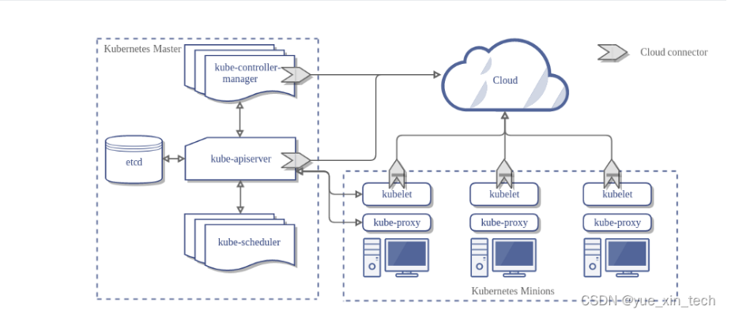
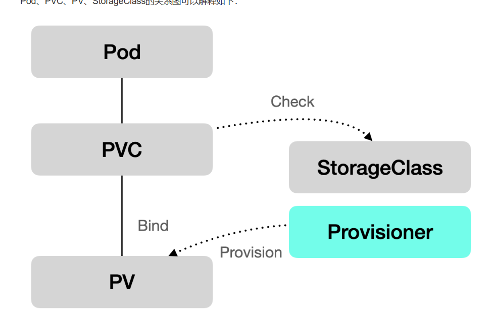
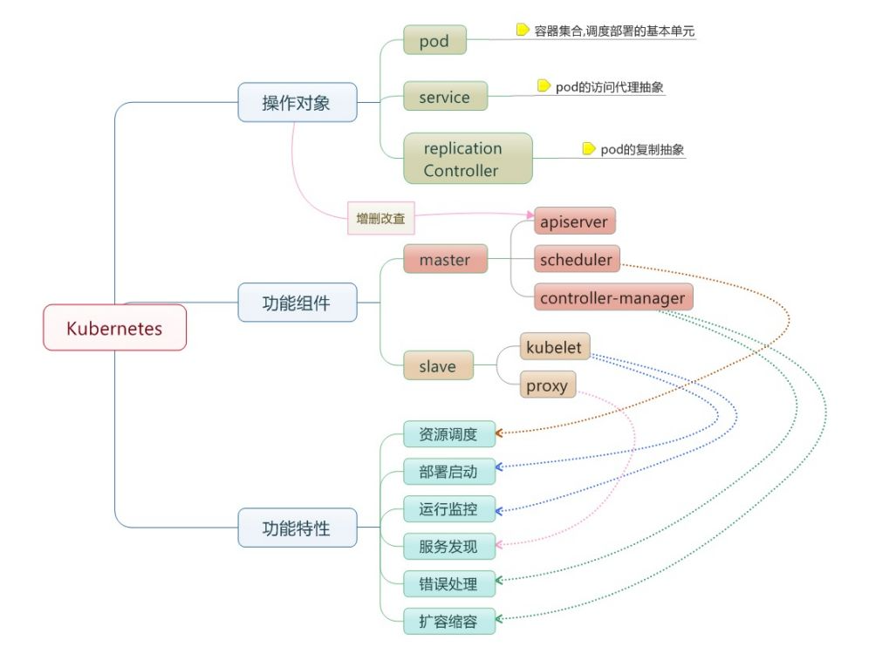

# 基础概念
## 1. k8s 是什么
k8s 是一个容器管理平台，负责容器的编排、管理、调度， 支持故障转移/重启、自动扩缩容、服务发现/负载均衡、配置管理等功能，使得应用服务能从打包到部署再到监控能有一条完整的自动化流程。

## 2. Container
即容器，通过镜像包含软件的运行环境，加上 namespace 的隔离功能，使得容器可以很方便的在任何地方运行。
## 3. Pod
k8s 使用 Pod 来管理容器，一个 Pod 可以包含一个或多个容器。它是一组紧密关联的容器集合，共享 PID、IPC、Network 和 UTS namespace，是 Kubernetes 调度的基本单位。
Pod 内的多个容器共享网络和文件系统，可以通过进程间通信和文件共享这种简单高效的方式组合完成服务。
Pod 每次重启或者重新部署，其 IP 地址都会产生变化，这使得 pod 间通信和 pod 与外部通信变得困难，这时候，就需要 Service 为 pod 提供一个固定的入口。
Service 的 Endpoint 列表通常绑定了一组相同配置的 pod，通过负载均衡的方式把外界请求分配到多个 pod 上
## 4. Node
Node 是 Pod 真正运行的主机，可以是物理机，也可以是虚拟机。为了管理 Pod，每个 Node 节点上至少要运行 container runtime（比如 docker 或者 rkt）、kubelet 和 kube-proxy 服务。
## 5. Namespace
Namespace 是对一组资源和对象的抽象集合，比如可以用来将系统内部的对象划分为不同的项目组或用户组。常见的 pods, services, replication controllers 和 deployments 等都是属于某一个 namespace 的（默认是 default），而 node, persistentVolumes 等则不属于任何 namespace。
## 6. Service
Service 是应用服务的抽象，通过 labels 为应用提供负载均衡和服务发现。匹配 labels 的 Pod IP 和端口列表组成 endpoints，由 kube-proxy 负责将服务 IP 负载均衡到这些 endpoints 上。
每个 Service 都会自动分配一个 cluster IP（仅在集群内部可访问的虚拟地址）和 DNS 名，其他容器可以通过该地址或 DNS 来访问服务，而不需要了解后端容器的运行。

## 7. Label
Label 是识别 Kubernetes 对象的标签，以 key/value 的方式附加到对象上。Label 不提供唯一性，并且实际上经常是很多对象（如 Pods）都使用相同的 label 来标志具体的应用。

## 8. Replica Set（副本集) 
Pod只是单个应用实例的抽象，要构建高可用应用，通常需要构建多个同样的副本，提供同一个服务。Kubernetes为此抽象出副本集 Replica Set，其允许用户定义 Pod 的副本数，每一个Pod都会被当作一个无状态的成员进行管理，Kubernetes保证总是有用户期望的数量的Pod 正常运行。当某个副本宕机以后，控制器将会创建一个新的副本。当因业务负载发生变更而需要调整扩缩容时，可以方便地调整副本数量。

## 9. Deployment
Deployment在内部使用了RS来实现目的，Deployment相当于RC的一次升级，其最大的特色为可以随时获知当前Pod 的部署进度。

## 10. Volume
 Volume是 Pod中能够被多个容器访问的共享目录，Kubernetes 中的Volume是定义在Pod上，可以被一个或多个Pod中的容器挂载到某个目录下。
## 11. Namespace
 Namespace用于实现多租户的资源隔离，可将集群内部的资源对象分配到不同的Namespace 中，形成逻辑上的不同项目、小组或用户组，便于不同的Namespace在共享使用整个集群的资源的同时还能被分别管理。
## 12. PV 和 PVC
PV是集群中的一块存储，一般可以由集群的管理员事先供应，或者使用storage class的方式来动态供应。pv属于集群资源，它们的生命周期跟使用它们的pod时相互独立。
PVC表达的是用户对存储的请求（persistant volume claim），也是kubernetes中独立存在的API资源。Pod 会耗用节点资源，而 PVC 申领会耗用 PV 资源。Pod 可以请求特定数量的资源（CPU 和内存）；同样PVC也可以请求特定的大小和访问模式。
> 当用户创建一个PVC，kubernetes中的volume controller会监测到PVC的对象，寻到集群中与之匹配的PV资源，将二者进行绑定。如果没有匹配的PV资源，PVC则会处理未绑定的状态一直持续等待，直到集群中出现满足条件的PV资源后进行绑定。PVC和PV之间的绑定是一种一对一的映射。

# 基础问题
## 1. 删除 pod 流程
`Kube-apiserver` 会接受到用户的删除指令，默认有 30 秒时间等待优雅退出，超过 30 秒会被标记为死亡状态，此时 Pod 的状态 `Terminating`，kubelet 看到 pod 标记为 `Terminating` 就开始了关闭 Pod 的工作；

## 2. k8s 有哪些组件
Kubernetes是一套分布式系统， 与大多数分布式系统类似，包含控制节点（master node）与工作节点（worker node）。

### master node
控制节点就是指挥官，负责发号施令的，其上运行一些管理服务来对整个系统进行管理与控制，包括

1. apiserver：作为整个系统的对外接口，提供一套Restful API供客户端调用，任何的资源请求/调用操作都是通过 kube-apiserver 提供的接口进行，如kubectl、kubernetes dashboard等管理工具就是通过 apiserver 来实现对集群的管理
2. kube-scheduler：资源调度器，负责将容器组分配到哪些节点上
3. kube-controller-manager：管理控制器，集群中处理常规任务的后台线程，包括节点控制器（负责监听节点停机的事件并作出对应响应）、endpoint-controller（刷新服务与容器组的关联信息）、replication-controller（维护容器组的副本数为指定的数值）、Service Account & Token控制器（负责为新的命名空间创建默认的 Service Account 以及 API Access Token）
4. etcd：数据存储，存储集群所有的配置信息
5. coredns：实现集群内部通过服务名称进行容器组访问的功能

### worker node
工作节点就是具体干活的小兵，其上也运行一些服务来执行指挥官分派的任务，包括

1. kubelet：是工作节点上执行操作的代理程序，负责容器的生命周期管理，定期执行容器健康检查，并上报容器的运行状态
2. kube-proxy：是一个具有负载均衡能力的简单的网络访问代理，负责将访问某个服务的请求分配到工作节点的具体某个容器上（kube-proxy也运行于master node上）
3. Docker Daemon：这个不难理解，所有服务或容器组都要以Docker容器的形式来运行（但Kubernetes其实不局限于Docker，它支持任何实现了Kubernetes容器引擎接口的容器引擎，如containerd、rktlet）
## 3. k8s 和 docker 的关系
Docker 提供容器的生命周期管理和，Docker 镜像构建运行时容器。它的主要优点是将将软件/应用程序运行所需的设置和依赖项打包到一个容器中，从而实现了可移植性等优点。
Kubernetes用于关联和编排在多个主机上运行的容器。

## 4. 简述Kubernetes中什么是 Minikube、Kubectl、Kubelet?
Minikube是一种可以在本地轻松运行一个单节点Kubernetes群集的工具。
Kubectl是一个命令行工具，可以使用该工具控制Kubernetes集群管理器，如检查群集资源，创建、删除和更新组件，查看应用程序。
Kubelet是一个代理服务，它在每个节点上运行，并使从服务器与主服务器通信。

## 5. 简述Kubernetes常见的部署方式?
常见的Kubernetes部署方式有:

- kubeadm:也是推荐的一种部署方式;
- 二进制:
- minikube:在本地轻松运行一个单节点Kubernetes群集的工具。

## 6. 简述Kubernetes如何实现集群管理?
在集群管理方面，Kubernetes将集群中的机器划分为一个Master节点和一群工作节点Node。其中，在Master节点运行着集群管理相关的一组进程`kube-apiserver、kube-controller-manager和kube-scheduler`，这些进程实现了整个集群的资源管理、Pod调度、弹性伸缩、安全控制、系统监控和纠错等管理能力，并且都
是全自动完成的。

## 7. 简述Kubernetes的优势、适应场景及其特点?
Kubernetes作为一个完备的分布式系统支撑平台，其主要优势:

- 容器编排
- 轻量级
- 开源
- 弹性伸缩
- 负载均衡

Kubernetes常见场景:

- 快速部署应用
- 快速扩展应用
- 无缝对接新的应用功能
- 节省资源，优化硬件资源的使用

Kubernetes相关特点:

- 可移植:支持公有云、私有云、混合云、多重云（ multi-cloud)。
- 可扩展:模块化,、插件化、可挂载、可组合。
- 自动化:自动部署、自动重启、自动复制、自动伸缩/扩展。

## 8. service 的类型

- `ClusterIP`：默认值，k8s系统给service自动分配的虚拟IP，只能在集群内部访问。一个Service可能对应多个EndPoint(Pod)，client访问的是Cluster IP，通过iptables规则转到Real Server，从而达到负载均衡的效果
- `NodePort`：service 通过 cluster 的静态端口对外提供服务。cluster 外部可以通过 `<NodeIp:NodePort:>`访问 service;
- `LoadBalancer`：在 NodePort 的基础上，借助 cloud provider 创建一个外部的负载均衡器，并将请求转发到 service，此模式只能在云服务器上使用。

## 9. k8s 中常用的卷有哪些
emptyDir：卷最初是空的，在pod在节点运行时创建，pod删除时数据也会永久删除；
configMap：可以将configMap中的数据作为卷挂在到pod中；
secret：可以将secret中的数据作为卷挂载到pod中；
downwardAPI：将pod的元数据信息注入到pod中；
hostPath：能将主机节点文件系统上的文件或目录挂载到 Pod 中；
nfs：将 NFS (网络文件系统) 挂载到 Pod，可以多挂；

## 10. k8s 创建一个 pod 流程
1） 客户端提交 Pod 的配置信息（可以是 yaml 文件定义好的信息）到 kube-apiserver；
2） Apiserver 收到指令后，通知给 controller-manager 创建一个资源对象；
3） Controller-manager 通过 api-server 将 pod 的配置信息存储到 ETCD 数据中心中；
4） Kube-scheduler 检测到 pod 信息会开始调度预选，会先过滤掉不符合 Pod 资源配置要求的节点，然后开始调度调优，主要是挑选出更适合运行 pod 的节点，然后将 pod 的资源配置单发送到 node 节点上的 kubelet 组件上。
5） Kubelet 根据 scheduler 发来的资源配置单运行 pod，运行成功后，将 pod 的运行信息返回给 scheduler，scheduler 将返回的 pod 运行状况的信息存储到 etcd 数据中心。

## 11. 简述kube-proxy 作用?
kube-proxy运行在所有节点上，它监听 apiserver 中 service 和 endpoint 的变化情况，创建路由规则以提供服务IP和负载均衡功能。
简单理解此进程是Service的透明代理兼负载均衡器，其核心功能是将到某个Service的访问请求转发到后端的多个Pod实例上。
## 12. 简述kube-proxy iptables原理?
答:Kubernetes 从1.2版本开始，将iptables作为kube-proxy的默认模式。
iptables模式下的kube-proxy不再起到Proxy的作用，其核心功能:通过APIServer的 Watch 接口实时跟踪Service 与 Endpoint的变更信息，并更新对应的 iptables 规则，Client的请求流量则通过iptables的NAT机制“直接路由”到目标Pod。

# 原理相关
