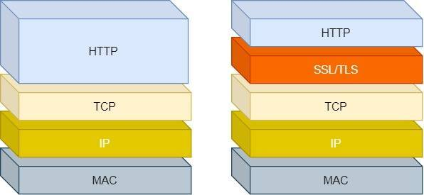
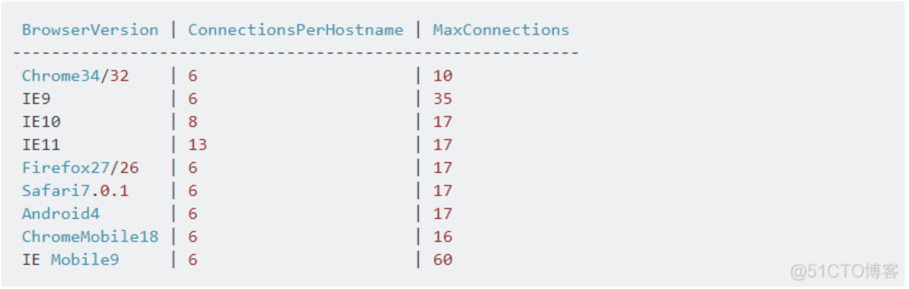

# 一、HTTP
## 1. 解释一下 HTTP 协议吧
HTTP 协议是基于 TCP 协议实现的，它是一个超文本传输协议，其实就是一个简单的请求-响应协议，它指定了客户端可能发送给服务器什么样的消息以及得到什么样的响应。
## 2. HTTP 的基本概念
### HTTP主要特点

- 简单快速 每个资源固定的(每张图片每个地址)访问只需输入uri
- 灵活 通过一个http协议可以传输不同数据类型
- 无连接 连接一次就会断开，**不会保持连接**
- 无状态 无法判断每次连接都是谁
### HTTP 请求方法

- GET 获取资源
- POST 传输资源
- PUT 更新资源
- DELETE 删除资源
- HEAD 获取报文首部
- OPTIONS 获取目的资源所支持的通信选项。
可以对指定的URL使用该方法，也可以对整站使用。一般不会主动发起这个OPTIONS请求，这里扯出一个新概念：简单请求和复杂请求，复杂请求浏览器会自动发起OPTIONS请求（比如跨域请求就是一个复杂请求）

## 3. HTTP 常见的状态码
[RFC 2068 - Hypertext Transfer Protocol -- HTTP/1.1](https://datatracker.ietf.org/doc/html/rfc2068#section-10.3.3)

[HTTP 响应状态码 - HTTP | MDN](https://developer.mozilla.org/zh-CN/docs/Web/HTTP/Status)
### 1. 1xx 信息，服务器收到请求，需要请求者继续执行操作
#### 100 continue

- 继续，客户端应继续其请求
#### 101 switching protocols

- 切换协议。
- 服务器根据客户端的请求切换协议。只能切换到更高级的协议，例如，切换到HTTP的新版本协议
### 2. 2xx 成功，操作被成功接收并处理
#### 200 ok

- 请求成功
- 一般用于GET与POST请求
#### 201 created

- 已创建
- 成功请求并创建了新的资源
#### 202 accepted

- 已接受
- 已经接受请求，但未处理完成

#### 203 Non_Authoritative information

- 非授权信息，请求成功
- 但返回的meta信息不在原始的服务器，而是一个副本

#### 204  No Content

- 无内容
- 服务器成功处理，但未返回内容
#### 205 Reset Content

- 重置内容
- 服务器处理成功，用户终端（例如：浏览器）应重置文档视图。可通过此返回码清除浏览器的表单域
#### 206 Partial Content

- 部分内容
- 服务器成功处理了部分GET请求
### 3. 3xx 重定向，需要进一步的操作以完成请求
#### 300 Multiple Choices

- 被请求的资源有一系列可供选择的回馈信息，每个都有自己特定的地址和浏览器驱动的商议信息。
- 用户或浏览器能够自行选择一个首选的地址进行重定向。

#### 301 Move Permanently

- 永久移动
- 信息会包括新的URI，浏览器会自动定向到新URI。今后任何新的请求都应使用新的URI代替
- 请求方法改为GET
-  When automatically redirecting a POST request after receiving a 301 status code, some existing HTTP/1.0 user agents will erroneously change it into a GET request.

#### 302 Found

- 临时移动
- 资源只是临时被移动。客户端应继续使用原有URI
- 如果请求方法不是GET或者HEAD,就不能在用户不知情的情况下，进行重定向
- 请求方法改为GET
-  automatically redirecting a POST request after receiving a 302 status code, some existing HTTP/1.0 user agents will erroneously change it into a GET request.

#### 303 See Other

- 查看其它地址。
- 通常作为 [PUT](https://developer.mozilla.org/zh-CN/docs/Web/HTTP/Methods/PUT) 或 [POST](https://developer.mozilla.org/zh-CN/docs/Web/HTTP/Methods/POST) 操作的返回结果，它表示重定向链接指向的不是新上传的资源，而是另外一个页面，比如消息确认页面或上传进度页面。而请求重定向页面的方法要总是使用 [GET](https://developer.mozilla.org/zh-CN/docs/Web/HTTP/Methods/GET)。

#### 304 Not Modified

- 1. 如果客户端已经执行了一个有条件的GET请求并且访问是允许，但文档没有被修改，服务器应该用这个状态代码响应。响应绝对不能包含消息体。
- 2. The response MUST include the following header fields:
   - 1. Date
   - 2. ETag and/or Content-Location, if the header would have been sent in a 200 response to the same request
   - 3. Expires, Cache-Control, and/or Vary, if the field-value might differ from that sent in any previous response for the same variant
#### 307 Temporary Redirect

- 如果使用 302 响应状态码，一些旧客户端会错误地将请求方法转换为 [GET](https://developer.mozilla.org/zh-CN/docs/Web/HTTP/Methods/GET)：也就是说，在 Web 中，如果使用了 GET 以外的请求方法，且返回了 302 状态码，则重定向后的请求方法是不可预测的；但如果使用 307 状态码，之后的请求方法就是可预测的。
- 状态码 307 与 [302](https://developer.mozilla.org/zh-CN/docs/Web/HTTP/Status/302) 之间的唯一区别在于，当发送重定向请求的时候，307 状态码可以确保请求方法和消息主体不会发生变化。
#### 308 Permanent Redirect

- 在重定向过程中，请求方法和消息主体不会发生改变，然而在返回 [301](https://developer.mozilla.org/zh-CN/docs/Web/HTTP/Status/301) 状态码的情况下，请求方法有时候会被客户端错误地修改为 [GET](https://developer.mozilla.org/zh-CN/docs/Web/HTTP/Headers/GET) 方法。

### 4. 4xx 客户端错误，请求包含语法错误或无法完成请求
#### 400 Bad Request

- 1. 请求参数有误
- 2. 语义有误，当前请求无法被服务器理解

#### 401 Unauthorized

- token

#### 403 Forbidden

- 服务器已经理解请求，但是拒绝执行它

#### 405 Method Not Allowed
#### 408  Request Timeout

- 请求超时。
- 客户端没有在服务器预备等待的时间内完成一个请求的发送。

### 5. 5xx 服务器错误，服务器在处理请求的过程中发生了错误
#### 500

- [500 Internal Server Error - HTTP | MDN](https://developer.mozilla.org/zh-CN/docs/Web/HTTP/Status/500)
- 服务器遇到了不知道如何处理的情况。

#### 501

- [501 Not Implemented - HTTP | MDN](https://developer.mozilla.org/zh-CN/docs/Web/HTTP/Status/501)

- 此请求方法不被服务器支持且无法被处理。只有GET和HEAD是要求服务器支持的，它们必定不会返回此错误代码。

#### 502

- [502 Bad Gateway - HTTP | MDN](https://developer.mozilla.org/zh-CN/docs/Web/HTTP/Status/502)
- 从上游服务器（如tomcat、php-fpm）中接收到的响应是无效的。
- 502 错误通常不是客户端能够修复的，而是需要由途径的Web服务器或者代理服务器对其进行修复。
#### 503

- [503 Service Unavailable - HTTP | MDN](https://developer.mozilla.org/zh-CN/docs/Web/HTTP/Status/503)
- 服务器没有准备好处理请求。
- 常见原因是服务器因维护或重载而停机。
-  请注意，与此响应一起，应发送解释问题的用户友好页面。 这个响应应该用于临时条件和 Retry-After：如果可能的话，HTTP头应该包含恢复服务之前的估计时间。 网站管理员还必须注意与此响应一起发送的与缓存相关的标头，因为这些临时条件响应通常不应被缓存。

#### 504

- [504 Gateway Timeout - HTTP | MDN](https://developer.mozilla.org/zh-CN/docs/Web/HTTP/Status/504)
- 当服务器作为网关，不能及时得到响应时返回此错误代码。
- 表示扮演网关或者代理的服务器无法在规定的时间内获得想要的响应
- 504 错误通常不是在客户端可以修复的，而是需要由途径的Web服务器或者代理服务器对其进行修复。

#### 505

- [505 HTTP Version Not Supported - HTTP | MDN](https://developer.mozilla.org/zh-CN/docs/Web/HTTP/Status/505)
- 服务器不支持请求中所使用的HTTP协议版本。

## 4. HTTP 头部常见字段
### Host 字段
客户端发送请求时，用来指定服务器的域名。


有了 Host 字段，就可以将请求发往「同一台」服务器上的不同网站。

### Content-Length 字段  


服务器在返回数据时，会有 Content-Length 字段，表明本次回应的数据长度。


如上面则是告诉浏览器，本次服务器回应的数据长度是 1000 个字节，后面的字节就属于下一个回应了。

### Connection 字段


Connection 字段最常用于客户端要求服务器使用 TCP 持久连接，以便其他请求复用。


HTTP/1.1 版本的默认连接都是持久连接，但为了兼容老版本的 HTTP，需要指定 Connection 首部字段的值为 Keep-Alive。

一个可以复用的 TCP 连接就建立了，直到客户端或服务器主动关闭连接。但是，这不是标准字段。

### Content-Type/Accept  字段


Content-Type 字段用于服务器回应时，告诉客户端，本次数据是什么格式。

`Content-Type: text/html; charset=utf-8`

上面的类型表明，发送的是网页，而且编码是UTF-8。

客户端请求的时候，可以使用 Accept 字段声明自己可以接受哪些数据格式。

`Accept: */*`

上面代码中，客户端声明自己可以接受任何格式的数据。

### Content-Encoding / Accept-Encoding 字段

Content-Encoding 字段说明数据的压缩方法。表示服务器返回的数据使用了什么压缩格式


`Content-Encoding: gzip`

上面表示服务器返回的数据采用了 gzip 方式压缩，告知客户端需要用此方式解压。

客户端在请求时，用 Accept-Encoding 字段说明自己可以接受哪些压缩方法。

`Accept-Encoding: gzip, deflate`

## 5. GET 与 POST 的区别
如果遵循 restful 标准来设计的接口，那么GET 的语义是请求获取指定的资源。GET 方法是安全、幂等、可被缓存的。
POST 的语义是根据请求负荷（报文主体）对指定的资源做出处理，具体的处理方式视资源类型而不同。POST 不安全，不幂等，（大部分实现）不可缓存。

## 6. 缓存
### 强缓存
强缓存指的是只要浏览器判断缓存没有过期，则直接使用浏览器的本地缓存，决定是否使用缓存的主动性在于浏览器这边。
如下图中，返回的是 200 状态码，但在 size 项中标识的是 from disk cache，就是使用了强制缓存。


强缓存是利用下面这两个 HTTP 响应头部（Response Header）字段实现的，它们都用来表示资源在客户端缓存的有效期：

- `Cache-Control`， 是一个相对时间；
- `Expires`，是一个绝对时间；

如果 HTTP 响应头部同时有 Cache-Control 和 Expires 字段的话，**Cache-Control的优先级高于 Expires** 。
Cache-control 选项更多一些，设置更加精细，所以建议使用 Cache-Control 来实现强缓存。具体的实现流程如下：

- 当浏览器第一次请求访问服务器资源时，服务器会在返回这个资源的同时，在 Response 头部加上 Cache-Control，Cache-Control 中设置了过期时间大小；
- 浏览器再次请求访问服务器中的该资源时，会先**通过请求资源的时间与 Cache-Control 中设置的过期时间大小，来计算出该资源是否过期**，如果没有，则使用该缓存，否则重新请求服务器；
- 服务器再次收到请求后，会再次更新 Response 头部的 Cache-Control。

### 协商缓存
当我们在浏览器使用开发者工具的时候，你可能会看到过某些请求的响应码是 `304`，这个是告诉浏览器可以使用本地缓存的资源，通常这种通过服务端告知客户端是否可以使用缓存的方式被称为协商缓存。


上图就是一个协商缓存的过程，所以**协商缓存就是与服务端协商之后，通过协商结果来判断是否使用本地缓存**。
协商缓存可以基于两种头部来实现。
#### If-Modified-Since / Last-Modified
第一种：请求头部中的 `If-Modified-Since` 字段与响应头部中的 `Last-Modified` 字段实现，这两个字段的意思是：

- 响应头部中的 `Last-Modified`：标示这个响应资源的最后修改时间；
- 请求头部中的 `If-Modified-Since`：当资源过期了，发现响应头中具有 Last-Modified 声明，则再次发起请求的时候带上 Last-Modified 的时间，服务器收到请求后发现有 If-Modified-Since 则与被请求资源的最后修改时间进行对比（Last-Modified），如果最后修改时间较新（大），说明资源又被改过，则返回最新资源，HTTP 200 OK；如果最后修改时间较旧（小），说明资源无新修改，响应 HTTP 304 走缓存。
#### If-None-Match / ETag
第二种：请求头部中的 `If-None-Match` 字段与响应头部中的 `ETag` 字段，这两个字段的意思是：

- 响应头部中 `Etag`：唯一标识响应资源；
- 请求头部中的 `If-None-Match`：当资源过期时，浏览器发现响应头里有 Etag，则再次向服务器发起请求时，会将请求头If-None-Match 值设置为 Etag 的值。服务器收到请求后进行比对，如果资源没有变化返回 304，如果资源变化了返回 200。
#### 小结

第一种实现方式是基于时间实现的，第二种实现方式是基于一个唯一标识实现的，相对来说后者可以更加准确地判断文件内容是否被修改，避免由于时间篡改导致的不可靠问题。
如果 HTTP 响应头部同时有 Etag 和 Last-Modified 字段的时候， Etag 的优先级更高，也就是先会判断 Etag 是否变化了，如果 Etag 没有变化，然后再看  Last-Modified。

注意，**协商缓存这两个字段都需要配合强制缓存中 Cache-control 字段来使用，只有在未能命中强制缓存的时候，才能发起带有协商缓存字段的请求**。


使用 ETag 字段实现的协商缓存的过程如下；

- 当浏览器第一次请求访问服务器资源时，服务器会在返回这个资源的同时，在 Response 头部加上 ETag 唯一标识，这个唯一标识的值是根据当前请求的资源生成的；
- 当浏览器再次请求访问服务器中的该资源时，首先会先检查强制缓存是否过期，如果没有过期，则直接使用本地缓存；如果缓存过期了，会在 Request 头部加上 If-None-Match 字段，该字段的值就是 ETag 唯一标识；
- 服务器再次收到请求后，**会根据请求中的 If-None-Match 值与当前请求的资源生成的唯一标识进行比较**： 
   - **如果值相等，则返回 304 Not Modified，不会返回资源**；
   - 如果不相等，则返回 200 状态码和返回资源，并在 Response 头部加上新的 ETag 唯一标识；
- 如果浏览器收到 304 的请求响应状态码，则会从本地缓存中加载资源，否则更新资源。

## 7. HTTP 版本相关
### HTTP 1.1 与 1.0 有什么差别
#### 1.长链接
早期 HTTP1.0 的每一次请求都伴随着一次三次握手的过程，并且是串行的请求，增加了不必要的性能开销
HTTP1.1 新增了长链接的通讯方式，减少了性能损耗
#### 2.管道
HTTP1.0 只有串行发送，没有管道
HTTP1.1 增加了管道的概念，客户端在没有得到响应之前可以提前发出下一个请求。将队头堵塞问题转移到服务端。
#### 3.断点续传
HTTP1.0 不支持断点续传
HTTP1.1 新增了 range 字段，用来指定数据字节位置，开启了断点续传的时代
#### 4.Host头处理
HTTP1.0 任务主机只有一个节点，所以并没有传 HOST
HTTP1.1 时代，虚拟机技术越来越发达，一台机器上也有可能有很多节点，故增加了 HOST 信息
#### 5.缓存处理
在HTTP1.0中只有强缓存 `Expires`。
HTTP1.1则引入了协商缓存，并且为了细化了强缓存的控制引入了 `Cache-Control`， 
#### 6.错误状态响应码
增加了很多响应码。

### HTTP 2 与 HTTP 1.x 有什么区别
#### 1. 头部压缩
在 HTTP2 当中，如果你发出了多个请求，并且它们的头部(header)是相同的，那么 HTTP2 协议会帮你消除同样的部分。(其实就是在客户端和服务端维护一张索引表来实现)
#### 2. 二进制格式
HTTP1.1 采用明文的形式
HTTP/2 全⾯采⽤了⼆进制格式，头信息和数据体都是⼆进制
#### 3. 数据流
HTTP/2 的数据包不是按顺序发送的，同⼀个连接⾥⾯连续的数据包，可能属于不同的回应。(对数据包做了标记，标志其属于哪一个请求，其中规定客户端发出的数据流编号为奇数，服务器发出的数据流编号为偶数。客户端还可以指定数据流的优先级，优先级⾼的请求，服务器就先响应该请求)
#### 4. IO多路复用
如:在⼀个连接中，服务器收到了客户端 A 和 B 的两个请求，但是发现在处理 A 的过程中⾮常耗时，索性就先回应 A 已经处理好的部分，再接着回应 B 请求，最后再回应 A 请求剩下的部分。
HTTP/2 可以在⼀个连接中并发多个请求或回应。
#### 5.服务器推送
服务器可以主动向客户端发送请求

### HTTP 3 与 HTTP 2 有什么区别
#### 1. 协议不同
HTTP2 是基于 TCP 协议实现的
HTTP3 是基于 UDP 协议实现的
#### 2. QUIC
HTTP3 新增了 QUIC 协议来实现可靠性的传输
#### 3. 握手次数
HTTP2 是基于 HTTPS 实现的，建立连接需要先进行 TCP 3次握手，然后再进行 TLS 3次握手，总共6次握手。
HTTP3 只需要 QUIC 的3次握手
### HTTP/1.1 相比 HTTP/1.0 提高了什么性能？
HTTP/1.1 相比 HTTP/1.0 性能上的改进：

- 使用长连接的方式改善了 HTTP/1.0 短连接造成的性能开销。
- 支持管道（pipeline）网络传输，只要第一个请求发出去了，不必等其回来，就可以发第二个请求出去，可以减少整体的响应时间。

但 HTTP/1.1 还是有性能瓶颈：

- 请求 / 响应头部（Header）未经压缩就发送，首部信息越多延迟越大。只能压缩 Body 的部分；
- 发送冗长的首部。每次互相发送相同的首部造成的浪费较多；
- 服务器是按请求的顺序响应的，如果服务器响应慢，会招致客户端一直请求不到数据，也就是队头阻塞；
- 没有请求优先级控制；
- 请求只能从客户端开始，服务器只能被动响应。

### HTTP2 的帧和流
#### 帧（frame）
HTTP/2 中**数据传输的最小单位**，因此帧不仅要细分表达 HTTP/1.x 中的各个部份，也优化了 HTTP/1.x 表达得不好的地方，同时还增加了 HTTP/1.x 表达不了的方式。 
每一帧都包含几个字段，有**length、type、flags、stream identifier、frame playload**等，其中type 代表帧的类型，在 HTTP/2 的标准中定义了 10 种不同的类型，包括上面所说的 HEADERS frame 和 DATA frame。此外还有： PRIORITY（设置流的优先级） RST_STREAM（终止流） SETTINGS（设置此连接的参数） PUSH_PROMISE（服务器推送） PING（测量 RTT） GOAWAY（终止连接） WINDOW_UPDATE（流量控制） CONTINUATION（继续传输头部数据）
在 HTTP 2.0 中，它把数据报的两大部分分成了 header frame 和 data frame。也就是头部帧和数据体帧。
#### 流（stream）
流： 存在于连接中的一个虚拟通道。流可以承载双向消息，每个流都有一个唯一的整数 ID。 HTTP/2 长连接中的数据包是不按请求-响应顺序发送的，一个完整的请求或响应(称一个数据流 stream，每个数据流都有一个独一无二的编号)可能会分成非连续多次发送。它具有如下几个特点：

- **双向性：同一个流内，可同时发送和接受数据**。
- **并发性：**每个单独的http2连接都可以包含多个并发的流，这些流中交错的包含着来自两端的帧**，无需按顺序等待**。
- **流的创建：流可以被客户端或服务器单方面建立, 使用或共享**。
- **流的关闭：流也可以被任意一方关闭**。
- **HEADERS 帧在 DATA 帧前面**。
- **流的 ID 都是奇数，说明是由客户端发起的，这是标准规定的，那么服务端发起的就是偶数了**。

### HTTP/2 做了什么优化？
谷歌跟火狐浏览器实现的HTTP/2 协议都是基于 TLS 的，所以 HTTP/2 的安全性也是有保障的。

那 HTTP/2 相比 HTTP/1.1 性能上的改进：

- 头部压缩
- 二进制格式
- 并发传输
- 服务器主动推送资源
#### 1. 头部压缩
HTTP/2 会**压缩头**（Header）如果你同时发出多个请求，他们的头是一样的或是相似的，那么，协议会帮你**消除重复的部分**。
这就是所谓的 HPACK 算法：在客户端和服务器同时维护一张头信息表，所有字段都会存入这个表，生成一个索引号，以后就不发送同样字段了，只发送索引号，这样就**提高速度**了。
#### 2. 二进制格式
HTTP/2 不再像 HTTP/1.1 里的纯文本形式的报文，而是全面采用了**二进制格式**，头信息和数据体都是二进制，并且统称为帧（frame）：**头信息帧（Headers Frame）和数据帧（Data Frame）**。

这样虽然对人不友好，但是对计算机非常友好，因为计算机只懂二进制，那么收到报文后，无需再将明文的报文转成二进制，而是直接解析二进制报文，这**增加了数据传输的效率**。
比如状态码 200 ，在 HTTP/1.1 是用 '2''0''0' 三个字符来表示（二进制：00110010 00110000 00110000），共用了 3 个字节，如下图

在 HTTP/2 对于状态码 200 的二进制编码是 10001000，只用了 1 字节就能表示，相比于 HTTP/1.1 节省了 2 个字节，如下图：

Header: :status: 200 OK 的编码内容为：1000 1000，那么表达的含义是什么呢？


1. 最前面的 1 标识该 Header 是静态表中已经存在的 KV。（至于什么是静态表，可以看这篇：[HTTP/2 牛逼在哪？(opens new window)](https://xiaolincoding.com/network/2_http/http2.html)）
2. 在静态表理，“:status: 200 ok” 静态表编码是 8，二进制即是 1000。

因此，整体加起来就是 1000 1000。
#### 3. 并发传输
我们都知道 HTTP/1.1 的实现是基于请求-响应模型的。虽然使用长连接+管道技术，但是服务端还是要处理完上一个请求，才能处理另一个请求。也就是存在服务端 **队头阻塞 **的问题。
而 HTTP/2 引出了 Stream 概念，多个 Stream 复用在一条 TCP 连接。

从上图可以看到，1 个 TCP 连接包含多个 Stream，Stream 里可以包含 1 个或多个 Message，Message 对应 HTTP/1 中的请求或响应，由 HTTP 头部和包体构成。Message 里包含一条或者多个 Frame，Frame 是 HTTP/2 最小单位，以二进制压缩格式存放 HTTP/1 中的内容（头部和包体)。
**针对不同的 HTTP 请求用独一无二的 Stream ID 来区分，接收端可以通过 Stream ID 有序组装成 HTTP 消息，不同 Stream 的帧是可以乱序发送的，同一个 Stream 的帧必须是按序发送，因此可以并发不同的 Stream ，也就是 HTTP/2 可以并行交错地发送请求和响应**。
比如下图，服务端**并行交错地**发送了两个响应： Stream 1 和 Stream 3，这两个 Stream 都是跑在一个 TCP 连接上，客户端收到后，会根据相同的 Stream ID 有序组装成 HTTP 消息。


#### 4、服务器推送
HTTP/2 还在一定程度上改善了传统的「请求 - 应答」工作模式，服务端不再是被动地响应，可以**主动**向客户端发送消息。
客户端和服务器**双方都可以建立 Stream**， Stream ID 也是有区别的，客户端建立的 Stream 必须是奇数号，而服务器建立的 Stream 必须是偶数号。

### 讲一下你对 HTTP2 的多路复用的理解
首先，我认为 HTTP2 中的多路复用，属于是 时分复用，对同一个域名只建立一条连接，充分压榨 tcp 全双工的特性，存在两个流方向，流中并发传输数据帧，最后根据 流id, 帧id 以及控制位复原流，解决 http1.x 的队头堵塞问题，将单一请求的时延，转化成为多个请求的时延，降低用户对单一时延的感知。 
注意：http2 rfc 提到 2 出现的历史背景有 目前浏览器的请求响应数量日益增多。

## 8. HTTP请求1.0/ 1.1/ 2.0 在并发请求上有什么主要区别？
HTTP1.0 中每个连接只能发送一个请求，当服务器响应后就会关闭这次连接，下一个请求需要再次建立连接。
HTTP1.1 中采用长连接和管道技术，客户端不用等待服务端响应，就可以发起另一个请求，但是存在队头堵塞问题。
HTTP2.0 加了全双工模式，不仅客户端能够同时发送多个请求，服务端也能同时处理多个请求，解决了队头堵塞的问题。使用了多路复用的技术，做到同一个连接并发处理多个请求，解决次序问题，而且并发请求的数量比1.1 多了几个数量级。
## 9. HTTP1.1的长链接和HTTP2.0的多路复用有什么区别？

- 1.1 同一时间，一个TCP只能处理一个请求，采用一问一答的形式，在响应完上一个请求之后才能处理下一个请求。由于浏览器最大TCP连接数的限制，所以有了最大并发请求数的限制。
- 2.0 同域名上的所有通信都在单个链接上完成，单个连接上可以并行交错的进行请求和响应，之间互不干扰。

## 10. 如何解决HTTP 1.1 中的队头堵塞问题？
#### 什么是 HTTP 队头阻塞？

- HTTP 传输是基于请求-应答的模式进行的，报文必须是一发一收，但值得注意的是，里面的任务被放在一个任务队列中串行执行，一旦队首的请求处理太慢，就会阻塞后面请求的处理。这就是著名的 HTTP队头阻塞 问题。
#### 解决方案
##### 并发连接

- 对于一个域名允许分配多个长连接，那么相当于增加了任务队列，不至于一个队伍的任务阻塞其它所有任务。在RFC2616规定过客户端最多并发 2 个连接，不过事实上在现在的浏览器标准中，这个上限要多很多，Chrome 中是 6 个。
- 但其实，即使是提高了并发连接，还是不能满足人们对性能的需求。
##### 域名分片

- 一个域名不是可以并发 6 个长连接吗？那我就多分几个域名。比如 static1.test.com 、static2.test.com。这样一个test.com域名下可以分出非常多的二级域名，而它们都指向同样的一台服务器，能够并发的长连接数更多了，事实上也更好地解决了队头阻塞的问题。
## 11. http怎么标识同一台计算机中的每一个窗口的链接呢？
现代浏览器一般都是属于多进程架构的应用，每个标签页都是一个子进程，标签页里面创建的链接，只属于当前标签页，当内核收到数据成功解包后，会根据链接的端口会传给特定的某个应用。


# 二、HTTPS
## 1. HTTP 与 HTTPS 有什么区别

- HTTP 是超文本传输协议，信息是明文传输，存在安全风险的问题。HTTPS 则解决 HTTP 不安全的缺陷，在 TCP 和 HTTP 网络层之间加入了 SSL/TLS 安全协议，使得报文能够加密传输。
- HTTP 连接建立相对简单， TCP 三次握手之后便可进行 HTTP 的报文传输。而 HTTPS 在 TCP 三次握手之后，还需进行 SSL/TLS 的握手过程，才可进入加密报文传输。
- 两者的默认端口不一样，HTTP 默认端口号是 80，HTTPS 默认端口号是 443。
- HTTPS 协议需要向 CA（证书权威机构）申请数字证书，来保证服务器的身份是可信的。

## 2. HTTPS 解决 HTTP 的哪些问题
HTTP 由于是明文传输，所以安全上存在以下三个风险：

- **窃听风险**，比如通信链路上可以获取通信内容，用户号容易没。
- **篡改风险**，比如强制植入垃圾广告，视觉污染，用户眼容易瞎。
- **冒充风险**，比如冒充淘宝网站，用户钱容易没。


HTTP**S** 在 HTTP 与 TCP 层之间加入了 SSL/TLS 协议，可以很好的解决了上述的风险：

- **信息加密**：交互信息无法被窃取，但你的号会因为「自身忘记」账号而没。
- **校验机制**：无法篡改通信内容，篡改了就不能正常显示，但百度「竞价排名」依然可以搜索垃圾广告。
- **身份证书**：证明淘宝是真的淘宝网，但你的钱还是会因为「剁手」而没。
## 3. HTTPS 是怎么解决窃听、篡改、冒充风险的

- **混合加密**的方式实现信息的**机密性**，解决了窃听的风险。
- **摘要算法**的方式来实现**完整性**，它能够为数据生成独一无二的「指纹」，指纹用于校验数据的完整性，解决了篡改的风险。
- 将服务器公钥放入到**数字证书**中，解决了冒充的风险。
### 混合加密
HTTPS 采用的是**对称加密**和**非对称加密**结合的「混合加密」方式：

- 在通信建立前采用**非对称加密**的方式交换「会话秘钥」，后续就不再使用非对称加密。
- 在通信过程中全部使用**对称加密**的「会话秘钥」的方式加密明文数据。

采用「混合加密」的方式的原因：

- **对称加密**只使用一个密钥，运算速度快，密钥必须保密，无法做到安全的密钥交换。
- **非对称加密**使用两个密钥：公钥和私钥，公钥可以任意分发而私钥保密，解决了密钥交换问题但速度慢。

### 摘要算法
在计算机里会**用摘要算法（哈希函数）来计算出内容的哈希值**，也就是内容的「指纹」，这个**哈希值是唯一的，且无法通过哈希值推导出内容**。
通过哈希算法可以确保内容不会被篡改，**但是并不能保证「内容 + 哈希值」不会被中间人替换，因为这里缺少对客户端收到的消息是否来源于服务端的证明**。

### 数字证书
数字证书的工作流程，我也画了一张图，方便大家理解：

通过数字证书的方式保证服务器公钥的身份，解决冒充的风险。

## 4. HTTPS 的握手过程是怎样的？其间交互了什么？
TLS 的「握手阶段」涉及**四次**通信，使用不同的密钥交换算法，TLS 握手流程也会不一样的，现在常用的密钥交换算法有两种：RSA 算法和 ECDHE 算法。
> RSA 的基础是数论的欧拉定理，他的安全性依赖于大整数的因子分解的困难性。
> ECDHE 密钥协商算法是 DH 算法演进过来的，所以我们先从 DH 算法说起。
> DH 算法是非对称加密算法， 因此它可以用于密钥交换，该算法的核心数学思想是**离散对数**。


### RSA
_1. ClientHello_
首先，由客户端向服务器发起加密通信请求，也就是 ClientHello 请求。
在这一步，客户端主要向服务器发送的信息包括一个随机数（**Client Random**）以及支持的密码套件、协议版本等。
_2. SeverHello_
服务器收到客户端请求后，向客户端发出响应，也就是 SeverHello。服务器回应的内容包括一个随机数（**Server Random**）、确认使用的密码、协议版本以及证书。
_3.客户端回应_
客户端收到服务器的回应之后，首先通过浏览器或者操作系统中的 CA 公钥，确认服务器的数字证书的真实性。
如果证书没有问题，客户端会**从数字证书中取出服务器的公钥**，然后使用它加密报文，向服务器发送如下信息：
（1）一个随机数（pre-master key）。该随机数会被服务器公钥加密。
（2）加密通信算法改变通知，表示随后的信息都将用「会话秘钥」加密通信。
（3）客户端握手结束通知，表示客户端的握手阶段已经结束。这一项同时把之前所有内容的发生的数据做个摘要，用来供服务端校验。
**服务器和客户端有了这三个随机数（Client Random、Server Random、pre-master key），接着就用双方协商的加密算法，各自生成本次通信的「会话秘钥」**。
_4. 服务器的最后回应_
服务器收到客户端的第三个随机数（pre-master key）之后，通过协商的加密算法，计算出本次通信的「会话秘钥」。
然后，向客户端发送最后的信息：
（1）加密通信算法改变通知，表示随后的信息都将用「会话秘钥」加密通信。
（2）服务器握手结束通知，表示服务器的握手阶段已经结束。这一项同时把之前所有内容的发生的数据做个摘要，用来供客户端校验。
至此，整个 TLS 的握手阶段全部结束。接下来，客户端与服务器进入加密通信，就完全是使用普通的 HTTP 协议，只不过用「会话秘钥」加密内容。
> 基于 RSA 算法的 HTTPS 存在「前向安全」的问题：如果服务端的私钥泄漏了，过去被第三方截获的所有 TLS 通讯密文都会被破解。


## 5. HTTPS 的应用数据是如何保证完整性的？
TLS 在实现上分为**握手协议**和**记录协议**两层，其中，TLS 记录协议负责保护应用程序数据并验证其完整性和来源。
TLS 记录协议具体过程如下：


- 首先，消息被分割成多个较短的片段,然后分别对每个片段进行压缩。
- 接下来，经过压缩的片段会被**加上消息认证码（MAC 值，这个是通过哈希算法生成的），这是为了保证完整性，并进行数据的认证**。通过附加消息认证码的 MAC 值，可以识别出篡改。与此同时，为了防止重放攻击，在计算消息认证码时，还加上了片段的编码。
- 再接下来，经过压缩的片段再加上消息认证码会一起通过对称密码进行加密。
- 最后，上述经过加密的数据再加上由数据类型、版本号、压缩后的长度组成的报头就是最终的报文数据。

记录协议完成后，最终的报文数据将传递到传输控制协议 (TCP) 层进行传输。
# 三、TCP与UDP相关
## 1. TCP与UDP的区别
### TCP跟UDP有什么不同？

1. udp是无连接的，不保证可靠交付，面向报文。tcp是面向链接的，且保证可靠传输，面向字节流
2.  udp支持一对一，一对多，多对一，多对多等通信方式，但是tcp仅支持一对一
3. udp的首部只有8字节，tcp至少20个字节
4. 此外，tcp提供的是全双工通信

### 为什么 UDP 头部没有「首部长度」字段，而 TCP 头部有「首部长度」字段呢？
原因是 TCP 有**可变长**的「选项」字段，而 UDP 头部长度则是**不会变化**的，无需多一个字段去记录 UDP 的首部长度。
### 为什么 UDP 头部有「包长度」字段，而 TCP 头部则没有「包长度」字段呢？
先说说 TCP 是如何计算负载数据长度：

其中 IP 总长度 和 IP 首部长度，在 IP 首部格式是已知的。TCP 首部长度，则是在 TCP 首部格式已知的，所以就可以求得 TCP 数据的长度。
大家这时就奇怪了问：“ UDP 也是基于 IP 层的呀，那 UDP 的数据长度也可以通过这个公式计算呀？ 为何还要有「包长度」呢？”
在 《TCP/ip 详解卷1》有提到 udp 的首部长度确实是冗余的，可能是像小林说的那样，是为了兼容底层设备，所以将首部凑成 4 的整数倍。


## 2. 如何在 Linux 系统中查看 TCP 状态？
TCP 的连接状态查看，在 Linux 可以通过 netstat -napt 命令查看。


## 3. 如何唯一确定一个TCP连接
TCP 四元组可以唯一的确定一个连接，四元组包括如下：

源地址和目的地址的字段（32位）是在 IP 头部中，作用是通过 IP 协议发送报文给对方主机。
源端口和目的端口的字段（16位)是在 TCP 头部中，作用是告诉 TCP 协议应该把报文发给哪个进程。
注：确定一个连接需要 <协议，源地址，源端口，目的地址，目的端口> 才能确定。


## 4. 有一个 IP 的服务器监听了一个端口，它的 TCP 的最大连接数是多少？
服务器通常固定在某个本地端口上监听，等待客户端的连接请求。
因此，客户端 IP 和 端口是可变的，其理论值计算公式如下:

对 IPv4，客户端的 IP 数最多为 2 的 32 次方，客户端的端口数最多为 2 的 16 次方，也就是服务端单机最大 TCP 连接数，约为 2 的 48 次方。
当然，服务端最大并发 TCP 连接数远不能达到理论上限，会受以下因素影响：

- **文件描述符限制**，每个 TCP 连接都是一个文件，如果文件描述符被占满了，会发生 too many open files。Linux 对可打开的文件描述符的数量分别作了三个方面的限制：
   - **系统级**：当前系统可打开的最大数量，通过 cat /proc/sys/fs/file-max 查看；
   - **用户级**：指定用户可打开的最大数量，通过 cat /etc/security/limits.conf 查看；
   - **进程级**：单个进程可打开的最大数量，通过 cat /proc/sys/fs/nr_open 查看；
- **内存限制**，每个 TCP 连接都要占用一定内存，操作系统的内存是有限的，如果内存资源被占满后，会发生 OOM。

## 5. 为什么出现 TCP 延迟确认机制
> 注意，tcp 延迟确认机制是在 tcp 连接状态下整个过程的，而不是只在挥手环节。

主要是因为发送没有携带数据的 ACK，网络效率极低的，因为它有 40 个字节的头部，但却没有携带数据报文。 
为了解决 ACK 传输效率低问题，所以就衍生出了 **TCP 延迟确认**。 TCP 延迟确认的策略：

- 当有响应数据要发送时，ACK 会随着响应数据一起立刻发送给对方。
- 当没有响应数据要发送时，ACK 将会延迟一段时间，以等待是否有响应数据可以一起发送。
- 如果在延迟等待发送 ACK 期间，对方的第二个数据报文又到达了，这时就会立刻发送 ACK。


##  6. TCP 链接的建立与释放
### 1. 三次握手

#### 说一下三次握手的过程
第 1 次握手建立连接时，客户端向服务器发送 SYN 报文（SEQ=x，SYN=1），并进入 SYN_SENT 状态，等待服务器确认。
第 2 次握手实际上是分两部分来完成的，即 SYN+ACK（请求和确认）报文。

- 服务器收到了客户端的请求，向客户端回复一个确认信息（ACK=x+1）。
- 服务器再向客户端发送一个 SYN 包（SEQ=y）建立连接的请求，此时服务器进入 SYN_RECV 状态。

第 3 次握手，是客户端收到服务器的回复（SYN+ACK 报文）。此时，客户端也要向服务器发送确认包（ACK）。此包发送完毕客户端和服务器进入 ESTABLISHED 状态，完成 3 次握手。
而且值得注意的是，只有报文中的大`ACK=1`（确认 ACK `ACKnowledgment`），小`ack`才有效。

#### 为什么是三次握手
这个问题的本质原因就是,信道不可靠, 因此通信双发需要就某个问题达成一致。而要解决这个问题, 无论你在消息中包含什么信息, 三次通信是理论上的最小值。所以三次握手是为了满足 "在不可靠信道上进行可靠传输" 这一需求所导致的。

- 「两次握手」：无法防止历史连接的建立，会造成双方资源的浪费，也无法可靠的同步双方序列号；
- 「四次握手」：三次握手就已经理论上最少可靠连接建立，所以不需要使用更多的通信次数。
#### 为什么不能是两次


如果只有两次，为了双方都能进入连接态，只能丢弃 `SYN_RCVD`中间状态。这样的话，当堵塞于网络中的旧初始化连接请求到来时，服务端会误认为旧连接是正常连接，而进入 `established`连接状态，导致套接字空等，造成资源浪费。

### 2. 四次挥手

#### 说一下四次挥手的过程
假设存在 `client`  跟 `server` 端，挥手请求由 `client`发起。

- **第一次挥手**： Client 端发起挥手请求，向 Server 端发送标志位是FIN报文段，设置序列号 seq，此时，Client  端进入FIN_WAIT_1状态。表示Client端没有数据要发送给Server端了。
- **第二次挥手**：Server 端收到了 Client 端发送的 FIN 报文段，向 Client 端返回一个标志位是 ACK 的报文段，ack 设为 seq 加1，Client 端进入FIN_WAIT_2状态。表示 Server 端知道 Clent 端关闭连接。
- **第三次挥手**： Server 端向 Client 端发送标志位是 FIN 的报文段，请求关闭连接，同时 Client 端进入LAST_ACK状态。表示 Server 端也没有数据要发送给 Client 了。
- **第四次挥手** ： Client 端收到 Server 端发送的 FIN 报文段，向 Server 端发送确认报文，然后Client端进入TIME_WAIT状态。Server端收到Client端的ACK报文段以后，就关闭连接。Client端等待 **2MSL **的时间后依然没有收到回复，则证明Server端已正常关闭，Client 端关闭连接。

#### 为什么需要四次挥手
因为 TCP 是一个全双工的通信协议，也就是说双方可以同时传输数据。而断开连接需要有人发起，有人确认，所以双方都断开连接就需要四次挥手了。

#### 有可能出现三次挥手吗，什么时候会出现呢？
在 Linux 环境开发的时候，通过 tcpdump 进行抓包，可以发现经常会出现 第二次挥手跟第三次挥手合并成为一个报文发送的情况。主要是因为现在 TCP 有延迟确认的机制，且是默认开启的。

#### 为什么 TIME_WAIT 等待的时间是 2MSL？
主要有两个原因，
第一，为了保证最后一个断开连接的报文( 包括超时重传的 ) 可以到达对端。
第二，防止已失效的连接请求报文出现在本连接。因为发送完最后一个 ACK 报文后，再经过 2MSL ，理论上就可以使得本链接所产生的所有报文都从网络中消失。
> MSL(Maximum Segment Lifetime)，最长报文段寿命。也就是说 MSL 时间内，报文没有到达对端，就认为报文已丢失。
> 2MSL 可以保证可以接收到重传报文。


#### 为什么需要 TIME_WAIT 状态？
主动发起关闭连接的一方，才会有 TIME-WAIT 状态。
需要 TIME-WAIT 状态，主要是两个原因：

- 防止历史连接中的数据，被后面相同四元组的连接错误的接收；
- 保证「被动关闭连接」的一方，能被正确的关闭；

[4.1 TCP 三次握手与四次挥手面试题](https://xiaolincoding.com/network/3_tcp/tcp_interview.html#%E4%B8%BA%E4%BB%80%E4%B9%88-time-wait-%E7%AD%89%E5%BE%85%E7%9A%84%E6%97%B6%E9%97%B4%E6%98%AF-2msl)

#### TIME_WAIT 过多有什么危害？
> 注意:
> 只有先发起 Fin 报文的端点才会有 TIME_WAIT 状态。

过多的 TIME-WAIT 状态主要的危害有两种：

- 第一是占用系统资源，比如文件描述符、内存资源、CPU 资源、线程资源等；
- 第二是占用端口资源，端口资源也是有限的，一般可以开启的端口为 32768～61000，也可以通过 net.ipv4.ip_local_port_range参数指定范围。

客户端和服务端 TIME_WAIT 过多，造成的影响是不同的。
**如果客户端（主动发起关闭连接方）的 TIME_WAIT 状态过多**，占满了所有端口资源，那么就无法对「目的 IP+ 目的 PORT」都一样的服务器发起连接了，但是被使用的端口，还是可以继续对另外一个服务器发起连接的。具体可以看我这篇文章：[客户端的端口可以重复使用吗？(opens new window)](https://xiaolincoding.com/network/3_tcp/port.html#%E5%AE%A2%E6%88%B7%E7%AB%AF%E7%9A%84%E7%AB%AF%E5%8F%A3%E5%8F%AF%E4%BB%A5%E9%87%8D%E5%A4%8D%E4%BD%BF%E7%94%A8%E5%90%97)
因此，客户端（发起连接方）都是和「目的 IP+ 目的 PORT 」都一样的服务器建立连接的话，当客户端的 TIME_WAIT 状态连接过多的话，就会受端口资源限制，如果占满了所有端口资源，那么就无法再跟「目的 IP+ 目的 PORT」都一样的服务器建立连接了。
不过，即使是在这种场景下，只要连接的是不同的服务器，端口是可以重复使用的，所以客户端还是可以向其他服务器发起连接的，这是因为内核在定位一个连接的时候，是通过四元组（源IP、源端口、目的IP、目的端口）信息来定位的，并不会因为客户端的端口一样，而导致连接冲突。
**如果服务端（主动发起关闭连接方）的 TIME_WAIT 状态过多**，并不会导致端口资源受限，因为服务端只监听一个端口，而且由于一个四元组唯一确定一个 TCP 连接，因此理论上服务端可以建立很多连接，但是 TCP 连接过多，会占用系统资源，比如文件描述符、内存资源、CPU 资源、线程资源等。

#### 如何优化 TIME_WAIT？
这里给出优化 TIME-WAIT 的几个方式，都是有利有弊：

- 打开 net.ipv4.tcp_tw_reuse 和 net.ipv4.tcp_timestamps 选项；
- net.ipv4.tcp_max_tw_buckets
- 程序中使用 SO_LINGER ，应用强制使用 RST 关闭。
##### 方式一：net.ipv4.tcp_tw_reuse 和 tcp_timestamps
如下的 Linux 内核参数开启后，则可以**复用处于 TIME_WAIT 的 socket 为新的连接所用**。
有一点需要注意的是，**tcp_tw_reuse 功能只能用客户端（连接发起方），因为开启了该功能，在调用 connect() 函数时，内核会随机找一个 time_wait 状态超过 1 秒的连接给新的连接复用。**
net.ipv4.tcp_tw_reuse = 1 
使用这个选项，还有一个前提，需要打开对 TCP 时间戳的支持，即
net.ipv4.tcp_timestamps=1（默认即为 1） 
这个时间戳的字段是在 TCP 头部的「选项」里，它由一共 8 个字节表示时间戳，其中第一个 4 字节字段用来保存发送该数据包的时间，第二个 4 字节字段用来保存最近一次接收对方发送到达数据的时间。
由于引入了时间戳，我们在前面提到的 2MSL 问题就不复存在了，因为重复的数据包会因为时间戳过期被自然丢弃。
##### 方式二：net.ipv4.tcp_max_tw_buckets
这个值默认为 18000，**当系统中处于 TIME_WAIT 的连接一旦超过这个值时，系统就会将后面的 TIME_WAIT 连接状态重置**，这个方法比较暴力。
##### 方式三：程序中使用 SO_LINGER
我们可以通过设置 socket 选项，来设置调用 close 关闭连接行为。
```cpp
struct linger so_linger; 
so_linger.l_onoff = 1; 
so_linger.l_linger = 0; 
setsockopt(s, SOL_SOCKET, SO_LINGER, &so_linger,sizeof(so_linger)); 
```
如果l_onoff为非 0， 且l_linger值为 0，那么调用close后，会立该发送一个RST标志给对端，该 TCP 连接将跳过四次挥手，也就跳过了TIME_WAIT状态，直接关闭。
但这为跨越TIME_WAIT状态提供了一个可能，不过是一个非常危险的行为，不值得提倡。
前面介绍的方法都是试图越过 TIME_WAIT状态的，这样其实不太好。虽然 TIME_WAIT 状态持续的时间是有一点长，显得很不友好，但是它被设计来就是用来避免发生乱七八糟的事情。
《UNIX网络编程》一书中却说道：**TIME_WAIT 是我们的朋友，它是有助于我们的，不要试图避免这个状态，而是应该弄清楚它**。
**如果服务端要避免过多的 TIME_WAIT 状态的连接，就永远不要主动断开连接，让客户端去断开，由分布在各处的客户端去承受 TIME_WAIT**。
### 3. 报文丢失会怎么样
> 源于 [小林coding]

#### 第一次握手报文丢失
当客户端想和服务端建立 TCP 连接的时候，首先第一个发的就是 SYN 报文，然后进入到 SYN_SENT 状态。
在这之后，如果客户端迟迟收不到服务端的 SYN-ACK 报文（第二次握手），就会触发「超时重传」机制，重传 SYN 报文，而且**重传的 SYN 报文的序列号都是一样的**。
不同版本的操作系统可能超时时间不同，有的 1 秒的，也有 3 秒的，这个超时时间是写死在内核里的，如果想要更改则需要重新编译内核，比较麻烦。
当客户端在 1 秒后没收到服务端的 SYN-ACK 报文后，客户端就会重发 SYN 报文，那到底重发几次呢？
在 Linux 里，客户端的 SYN 报文最大重传次数由 tcp_syn_retries内核参数控制，这个参数是可以自定义的，默认值一般是 5。
```shell
# cat /proc/sys/net/ipv4/tcp_syn_retries

```

> centos 7.x 是6

通常，第一次超时重传是在 1 秒后，第二次超时重传是在 2 秒，第三次超时重传是在 4 秒后，第四次超时重传是在 8 秒后，第五次是在超时重传 16 秒后。没错，**每次超时的时间是上一次的 2 倍**。
当第五次超时重传后，会继续等待 32 秒，如果服务端仍然没有回应 ACK，客户端就不再发送 SYN 包，然后断开 TCP 连接。
所以，总耗时是 1+2+4+8+16+32=63 秒，大约 1 分钟左右。


#### 第二次握手报文丢失
当服务端收到客户端的第一次握手后，就会回 SYN-ACK 报文给客户端，这个就是第二次握手，此时服务端会进入 SYN_RCVD 状态。
第二次握手的 SYN-ACK 报文其实有两个目的 ：

- 第二次握手里的 ACK， 是对第一次握手的确认报文；
- 第二次握手里的 SYN，是服务端发起建立 TCP 连接的报文；

所以，如果第二次握手丢了，就会发生比较有意思的事情，具体会怎么样呢？
因为第二次握手报文里是包含对客户端的第一次握手的 ACK 确认报文，所以，如果客户端迟迟没有收到第二次握手，那么客户端就觉得可能自己的 SYN 报文（第一次握手）丢失了，于是**客户端就会触发超时重传机制，重传 SYN 报文**。
然后，因为第二次握手中包含服务端的 SYN 报文，所以当客户端收到后，需要给服务端发送 ACK 确认报文（第三次握手），服务端才会认为该 SYN 报文被客户端收到了。
那么，如果第二次握手丢失了，服务端就收不到第三次握手，于是**服务端这边会触发超时重传机制，重传 SYN-ACK 报文**。
在 Linux 下，SYN-ACK 报文的最大重传次数由 tcp_synack_retries内核参数决定，默认值是 5。
```shell
# cat /proc/sys/net/ipv4/tcp_synack_retries 
```
因此，当第二次握手丢失了，客户端和服务端都会重传：

- 客户端会重传 SYN 报文，也就是第一次握手，最大重传次数由 tcp_syn_retries内核参数决定；
- 服务端会重传 SYN-ACK 报文，也就是第二次握手，最大重传次数由 tcp_synack_retries 内核参数决定。
> 注：`tcp_syn_retries` 一般比  `tcp_synack_retries`稍微大一点。

#### 第三次握手报文丢失
客户端收到服务端的 SYN-ACK 报文后，就会给服务端回一个 ACK 报文，也就是第三次握手，此时客户端状态进入到 ESTABLISH 状态。
因为这个第三次握手的 ACK 是对第二次握手的 SYN 的确认报文，所以当第三次握手丢失了，如果服务端那一方迟迟收不到这个确认报文，就会触发超时重传机制，重传 SYN-ACK 报文，直到收到第三次握手，或者达到最大重传次数。
注意，**ACK 报文是不会有重传的，当 ACK 丢失了，就由对方重传对应的报文**。

#### 第一次挥手报文丢失
当客户端（主动关闭方）调用 close 函数后，就会向服务端发送 FIN 报文，试图与服务端断开连接，此时客户端的连接进入到 FIN_WAIT_1 状态。
正常情况下，如果能及时收到服务端（被动关闭方）的 ACK，则会很快变为 FIN_WAIT_2 状态。
如果第一次挥手丢失了，那么客户端迟迟收不到被动方的 ACK 的话，也就会触发超时重传机制，重传 FIN 报文，重发次数由 tcp_orphan_retries 参数控制。
```shell
# cat /proc/sys/net/ipv4/tcp_orphan_retries
```
当客户端重传 FIN 报文的次数超过 tcp_orphan_retries 后，就不再发送 FIN 报文，则会在等待一段时间（时间为上一次超时时间的 2 倍），如果还是没能收到第二次挥手，那么直接进入到 close 状态。

#### 第二次挥手报文丢失
当服务端收到客户端的第一次挥手后，就会先回一个 ACK 确认报文，此时服务端的连接进入CLOSE_WAIT 状态。
在前面我们也提了，ACK 报文是不会重传的，所以如果服务端的第二次挥手丢失了，客户端就会触发超时重传机制，重传 FIN 报文，直到收到服务端的第二次挥手，或者达到最大的重传次数。
#### 第三次挥手报文丢失
当服务端（被动关闭方）收到客户端（主动关闭方）的 FIN 报文后，内核会自动回复 ACK，同时连接处于 CLOSE_WAIT 状态，顾名思义，它表示等待应用进程调用 close 函数关闭连接。
此时，内核是没有权利替代进程关闭连接，必须由进程主动调用 close 函数来触发服务端发送 FIN 报文。
服务端处于 CLOSE_WAIT 状态时，调用了 close 函数，内核就会发出 FIN 报文，同时连接进入 LAST_ACK 状态，等待客户端返回 ACK 来确认连接关闭。
如果迟迟收不到这个 ACK，服务端就会重发 FIN 报文，重发次数仍然由 tcp_orphan_retries 参数控制，这与客户端重发 FIN 报文的重传次数控制方式是一样的。

#### 第四次挥手报文丢失
当客户端收到服务端的第三次挥手的 FIN 报文后，就会回 ACK 报文，也就是第四次挥手，此时客户端连接进入 TIME_WAIT 状态。
在 Linux 系统，TIME_WAIT 状态会持续 2MSL 后才会进入关闭状态。
然后，服务端（被动关闭方）没有收到 ACK 报文前，还是处于 LAST_ACK 状态。
如果第四次挥手的 ACK 报文没有到达服务端，服务端就会重发 FIN 报文，重发次数仍然由前面介绍过的 tcp_orphan_retries 参数控制。

#### 报文丢失重传达到最大次数之后，会发生什么？
假设重传的最大次数是3.
如果重传三次后还未收到该报文的确认，那么就不再尝试重传，直接发送 reset 报文重置该TCP连接，但有些要求很高的业务应用系统，则会不断的重传被丢弃的报文，以尽最大可能保证业务数据的正常交互。

### 4. 为什么每次建立 TCP 连接时，初始化的序列号都要求不一样呢？
主要原因有两个方面：

- 为了防止历史报文被下一个相同四元组的连接接收（主要方面）；
- 为了安全性，防止黑客伪造的相同序列号的 TCP 报文被对方接收；
### 5. 初始序列号 ISN 是如何随机产生的？
起始 ISN 是基于时钟的，每 4 微秒 + 1，转一圈要 4.55 个小时。
RFC793 提到初始化序列号 ISN 随机生成算法：ISN = M + F(localhost, localport, remotehost, remoteport)。

- M 是一个计时器，这个计时器每隔 4 微秒加 1。
- F 是一个 Hash 算法，根据源 IP、目的 IP、源端口、目的端口生成一个随机数值。要保证 Hash 算法不能被外部轻易推算得出，用 MD5 算法是一个比较好的选择。

可以看到，随机数是会基于时钟计时器递增的，基本不可能会随机成一样的初始化序列号。

### 6. 什么是 SYN 攻击？如何避免 SYN 攻击？
我们都知道 TCP 连接建立是需要三次握手，假设攻击者短时间伪造不同 IP 地址的 SYN 报文，服务端每接收到一个 SYN 报文，就进入SYN_RCVD 状态，但服务端发送出去的 ACK + SYN 报文，无法得到未知 IP 主机的 ACK 应答，久而久之就会**占满服务端的半连接队列**，使得服务器不能为正常用户服务。


#### 避免 SYN 攻击方式，可以有以下四种方法：

- 调大 netdev_max_backlog；
- 增大 TCP 半连接队列；
- 开启 tcp_syncookies；
- 减少 SYN+ACK 重传次数
##### 方式一：调大 netdev_max_backlog
当网卡接收数据包的速度大于内核处理的速度时，会有一个队列保存这些数据包。控制该队列的最大值如下参数，默认值是 1000，我们要适当调大该参数的值，比如设置为 10000：
```shell
net.core.netdev_max_backlog = 10000 
```
##### 方式二：增大 TCP 半连接队列
增大 TCP 半连接队列，要同时增大下面这三个参数：

- 增大 net.ipv4.tcp_max_syn_backlog
- 增大 listen() 函数中的 backlog
- 增大 net.core.somaxconn

具体为什么是三个参数决定 TCP 半连接队列的大小，可以看这篇：可以看这篇：[TCP 半连接队列和全连接队列满了会发生什么？又该如何应对？(opens new window)](https://xiaolincoding.com/network/3_tcp/tcp_queue.html)
##### 方式三：开启 net.ipv4.tcp_syncookies
开启 syncookies 功能就可以在不使用 SYN 半连接队列的情况下成功建立连接，相当于绕过了 SYN 半连接来建立连接。

具体过程：

- 当 「 SYN 队列」满之后，后续服务器收到 SYN 包，不会丢弃，而是根据算法，计算出一个 cookie 值；
- 将 cookie 值放到第二次握手报文的「序列号」里，然后服务端回第二次握手给客户端；
- 服务端接收到客户端的应答报文时，服务器会检查这个 ACK 包的合法性。如果合法，将该连接对象放入到「 Accept 队列」。
- 最后应用程序通过调用 accpet() 接口，从「 Accept 队列」取出的连接。

可以看到，当开启了 tcp_syncookies 了，即使受到 SYN 攻击而导致 SYN 队列满时，也能保证正常的连接成功建立。
net.ipv4.tcp_syncookies 参数主要有以下三个值：

- 0 值，表示关闭该功能；
- 1 值，表示仅当 SYN 半连接队列放不下时，再启用它；
- 2 值，表示无条件开启功能；

那么在应对 SYN 攻击时，只需要设置为 1 即可。
```shell
$ echo 1 > /proc/sys/net/ipv4/tcp_syncookies 
```
##### 方式四：减少 SYN+ACK 重传次数
当服务端受到 SYN 攻击时，就会有大量处于 SYN_REVC 状态的 TCP 连接，处于这个状态的 TCP 会重传 SYN+ACK ，当重传超过次数达到上限后，就会断开连接。
那么针对 SYN 攻击的场景，我们可以减少 SYN-ACK 的重传次数，以加快处于 SYN_REVC 状态的 TCP 连接断开。
SYN-ACK 报文的最大重传次数由 tcp_synack_retries内核参数决定（默认值是 5 次），比如将 tcp_synack_retries 减少到 2 次：
```shell
$ echo 2 > /proc/sys/net/ipv4/tcp_synack_retries 
```
### 7. 如果已经建立了连接，但是客户端突然出现故障了怎么办？
TCP 有一个机制是**保活机制**。这个机制的原理是这样的：
定义一个时间段，在这个时间段内，如果没有任何连接相关的活动，TCP 保活机制会开始作用，每隔一个时间间隔，发送一个探测报文，该探测报文包含的数据非常少，如果连续几个探测报文都没有得到响应，则认为当前的 TCP 连接已经死亡，系统内核将错误信息通知给上层应用程序。
> 注意： 
> 我们也可以像websocket 通信那样，自己实现心跳机制来实现。

在 Linux 内核可以有对应的参数可以设置保活时间、保活探测的次数、保活探测的时间间隔，以下都为默认值：

- tcp_keepalive_time=7200：表示保活时间是 7200 秒（2小时），也就 2 小时内如果没有任何连接相关的活动，则会启动保活机制
- tcp_keepalive_intvl=75：表示每次检测间隔 75 秒；
- tcp_keepalive_probes=9：表示检测 9 次无响应，认为对方是不可达的，从而中断本次的连接。

注意，应用程序若想使用 TCP 保活机制需要通过 socket 接口设置 SO_KEEPALIVE 选项才能够生效，如果没有设置，那么就无法使用 TCP 保活机制。
如果开启了 TCP 保活，需要考虑以下几种情况：

- 第一种，对端程序是正常工作的。当 TCP 保活的探测报文发送给对端, 对端会正常响应，这样 **TCP 保活时间会被重置**，等待下一个 TCP 保活时间的到来。
- 第二种，对端程序崩溃并重启。当 TCP 保活的探测报文发送给对端后，对端是可以响应的，但由于没有该连接的有效信息，**会产生一个 RST 报文**，这样很快就会发现 TCP 连接已经被重置。
- 第三种，是对端程序崩溃，或对端由于其他原因导致报文不可达。当 TCP 保活的探测报文发送给对端后，石沉大海，没有响应，连续几次，达到保活探测次数后，**TCP 会报告该 TCP 连接已经死亡**。
### 8. 如果已经建立了连接，但是服务端的进程崩溃会发生什么？
TCP 的连接信息是由内核维护的，所以当服务端的进程崩溃后，内核需要回收该进程的所有 TCP 连接资源，于是内核会发送第一次挥手 FIN 报文，后续的挥手过程也都是在内核完成，并不需要进程的参与，所以即使服务端的进程退出了，还是能与客户端完成 TCP四次挥手的过程。
我自己做了个实验，使用 kill -9 来模拟进程崩溃的情况，发现**在 kill 掉进程后，服务端会发送 FIN 报文，与客户端进行四次挥手**。

### 9. TCP 连接一端崩溃或者宕机会发生什么？
如果「**客户端进程崩溃**」，客户端的进程在发生崩溃的时候，内核会发送 FIN 报文，与服务端进行四次挥手。
但是，「**客户端主机宕机**」，那么是不会发生四次挥手的，具体后续会发生什么？还要看服务端会不会发送数据？

- 如果服务端会发送数据，由于客户端已经不存在，收不到数据报文的响应报文，服务端的数据报文会超时重传，当重传总间隔时长达到一定阈值（内核会根据 tcp_retries2 设置的值计算出一个阈值）后，会断开 TCP 连接；
- 如果服务端一直不会发送数据，再看服务端有没有开启 TCP keepalive 机制？
   - 如果有开启，服务端在一段时间没有进行数据交互时，会触发 TCP keepalive 机制，探测对方是否存在，如果探测到对方已经消亡，则会断开自身的 TCP 连接；
   - 如果没有开启，服务端的 TCP 连接会一直存在，并且一直保持在 ESTABLISHED 状态。

## 7. 使用 TCP 一定不会造成丢包吗？

- 数据从发送端到接收端，链路很长，任何一个地方都可能发生丢包，几乎可以说丢包不可避免。
- 平时没事也不用关注丢包，大部分时候TCP的重传机制保证了消息可靠性。
- 当你发现服务异常的时候，比如接口延时很高，总是失败的时候，可以用ping或者mtr命令看下是不是中间链路发生了丢包。
- TCP只保证传输层的消息可靠性，并不保证应用层的消息可靠性。如果我们还想保证应用层的消息可靠性，就需要应用层自己去实现逻辑做保证。
## 8. TCP 中的数据结构
### 队列
#### 半连接和全连接队列
在 TCP 三次握手的时候，Linux 内核会维护两个队列，分别是：

- 半连接队列，也称 SYN 队列；
- 全连接队列，也称 accept 队列；

服务端收到客户端发起的 SYN 请求后，**内核会把该连接存储到半连接队列**，并向客户端响应 SYN+ACK，接着客户端会返回 ACK，服务端收到第三次握手的 ACK 后，**内核会把连接从半连接队列移除，然后创建新的完全的连接，并将其添加到 accept 队列，等待进程调用 accept 函数时把连接取出来。**

不管是半连接队列还是全连接队列，都有最大长度限制，超过限制时，内核会直接丢弃，或返回 RST 包。<!---->

### 链表
#### 双向链表
[Linux内核网络数据结构sk_buff_51CTO博客_Linux内核网络](https://blog.51cto.com/u_13045346/4553142)

## 9. Socket 编程
### 针对 TCP 应该如何 Socket 编程？


- 服务端和客户端初始化 socket，得到文件描述符；
- 服务端调用 bind，将 socket 绑定在指定的 IP 地址和端口;
- 服务端调用 listen，进行监听；
- 服务端调用 accept，等待客户端连接；
- 客户端调用 connect，向服务器端的地址和端口发起连接请求；
- 服务端 accept 返回用于传输的 socket 的文件描述符；
- 客户端调用 write 写入数据；服务端调用 read 读取数据；
- 客户端断开连接时，会调用 close，那么服务端 read 读取数据的时候，就会读取到了 EOF，待处理完数据后，服务端调用 close，表示连接关闭。

这里需要注意的是，服务端调用 accept 时，连接成功了会返回一个已完成连接的 socket，后续用来传输数据。
所以，监听的 socket 和真正用来传送数据的 socket，是「两个」 socket，一个叫作**监听 socket**，一个叫作**已完成连接 socket**。
成功连接建立之后，双方开始通过 read 和 write 函数来读写数据，就像往一个文件流里面写东西一样。
### listen 的时候参数 backlog 的意义？
Linux内核中会维护两个队列：

- 半连接队列（SYN 队列）：接收到一个 SYN 建立连接请求，处于 SYN_RCVD 状态；
- 全连接队列（Accpet 队列）：已完成 TCP 三次握手过程，处于 ESTABLISHED 状态；


```cpp
int listen (int socketfd, int backlog) 
```

- 参数一 socketfd 为 socketfd 文件描述符
- 参数二 backlog，这参数在历史版本有一定的变化

在早期 Linux 内核 backlog 是 SYN 队列大小，也就是未完成的队列大小。
在 Linux 内核 2.2 之后，backlog 变成 accept 队列，也就是已完成连接建立的队列长度，**所以现在通常认为 backlog 是 accept 队列。**
**但是上限值是内核参数 somaxconn 的大小，也就说 accpet 队列长度 = min(backlog, somaxconn)。**
### accept 发生在三次握手的哪一步？
我们先看看客户端连接服务端时，发送了什么？


- 客户端的协议栈向服务器端发送了 SYN 包，并告诉服务器端当前发送序列号 client_isn，客户端进入 SYN_SENT 状态；
- 服务器端的协议栈收到这个包之后，和客户端进行 ACK 应答，应答的值为 client_isn+1，表示对 SYN 包 client_isn 的确认，同时服务器也发送一个 SYN 包，告诉客户端当前我的发送序列号为 server_isn，服务器端进入 SYN_RCVD 状态；
- 客户端协议栈收到 ACK 之后，使得应用程序从 connect 调用返回，表示客户端到服务器端的单向连接建立成功，客户端的状态为 ESTABLISHED，同时客户端协议栈也会对服务器端的 SYN 包进行应答，应答数据为 server_isn+1；
- ACK 应答包到达服务器端后，服务器端的 TCP 连接进入 ESTABLISHED 状态，同时服务器端协议栈使得 accept 阻塞调用返回，这个时候服务器端到客户端的单向连接也建立成功。至此，客户端与服务端两个方向的连接都建立成功。

从上面的描述过程，我们可以得知**客户端 connect 成功返回是在第二次握手，服务端 accept 成功返回是在三次握手成功之后。**
### 客户端调用 close 了，连接是断开的流程是什么？
我们看看客户端主动调用了 close，会发生什么？


- 客户端调用 close，表明客户端没有数据需要发送了，则此时会向服务端发送 FIN 报文，进入 FIN_WAIT_1 状态；
- 服务端接收到了 FIN 报文，TCP 协议栈会为 FIN 包插入一个文件结束符 EOF 到接收缓冲区中，应用程序可以通过 read 调用来感知这个 FIN 包。这个 EOF 会被**放在已排队等候的其他已接收的数据之后**，这就意味着服务端需要处理这种异常情况，因为 EOF 表示在该连接上再无额外数据到达。此时，服务端进入 CLOSE_WAIT 状态；
- 接着，当处理完数据后，自然就会读到 EOF，于是也调用 close 关闭它的套接字，这会使得服务端发出一个 FIN 包，之后处于 LAST_ACK 状态；
- 客户端接收到服务端的 FIN 包，并发送 ACK 确认包给服务端，此时客户端将进入 TIME_WAIT 状态；
- 服务端收到 ACK 确认包后，就进入了最后的 CLOSE 状态；
- 客户端经过 2MSL 时间之后，也进入 CLOSE 状态；

## 10. TCP 可靠传输的工作原理
> tcp 发送的报文段是交给 ip 层传送的，但是 IP 层只能提供尽最大努力服务（不可靠）。

首先，可靠传输意味着 无差错，不丢失，不重复，不乱序。那么接下来我也会从这几个方面来介绍可靠传输的工作原理。

1. 为了解决数据差错问题，TCP 的校验数据部分包含首部和数据，而 ip 层只校验首部。
2. 为了解决数据丢失问题，TCP 数据时，会设置一个超时计时器，超时没有收到确认报文则会重传当前报文。
3. 为了解决数据重复问题，TCP 有确认迟到的机制，也就是说，当 TCP 收到重复报文的同时，还会发送确认报文。
4. 为了解决数据乱序问题， TCP 首部存在每个报文唯一的4字节序号。

总的来说，就是 TCP 采用了 数据报唯一编号+确认+重传 的机制，在不可靠的信道上，利用人为的算法协议确保可靠传输。
而在这基本思想的发展上，tcp 出现了一系列的可靠传输协议，比如说：停止等待协议，连续 ARQ 协议。
> 停止等待”就是每发送完一个分组就停止发送，等待对方的确认。在收到确认后再发送下一个分组。
> 连续 ARQ 采用的是滑动窗口的算法思想，达到累积确认的目的。


## 11. TCP 可靠传输的实现
数据报的唯一编号是基于操作系统的时钟生成的。
以字节为单位的滑动窗口 + 超时重传的时间选择 + 选择确认(SACK)(可选的，需要双方商定)。

## 12. 聊聊 tcp 的流量控制


流量控制，属于点对点问题，在 tcp 主要是利用滑动窗口的思想，双方就窗口的大小进行协商，避免数据包传输过快或过慢。
## 13. tcp 的拥塞控制的常用方法
首先，拥塞代表着对资源的总需求量大于可用资源，而且拥塞导致丢包引起的重传会加剧拥塞程度，拥塞控制的目的就是避免过多的数据包注入到网络中。而TCP中为了减少拥塞带来的损失，采用以下四种方法。

- 1. 慢开始

每个传输轮次，加倍

- 2. 拥塞避免

传输轮次＋1

- 3. 快重传

发送方连续收到三个某个报文的确认，就认为该报文没有被接收方收到，立即进行重传。

- 4. 快恢复

缩小拥塞窗口门限后立即执行拥塞避免。


## 14. TCP 与 UDP 的分片发生在哪里
首先，提到分片，我们需要聊一聊 MTU，它是链路层中的网络对数据帧的一个限制，以以太网为例，MTU为1500个字节。一个IP数据报在以太网中传输，如果它的长度大于该MTU值，就要进行分片传输，使得每片数据报的长度小于MTU。分片传输的IP数据报不一定按序到达，但IP首部中的信息能让这些数据报片按序组装。IP数据报的分片与重组是在网络层进完成的。
UDP数据报，由于UDP数据报不会自己进行分片，当UDP数据长度超过了MTU时，会在网络层进行IP分片。
对于TCP来说，它是尽量避免分片的，为什么？因为如果在IP层进行分片了话，如果其中的某片的数据丢失了，对于保证可靠性的TCP协议来说，会增大重传数据包的机率，而且只能重传整个TCP分组。因此当TCP数据大于MTU时，会在传输层进行分段，然后再进入网络层。
TCP 报文里面有个长度可变的选项字段，其最初只有一个 `MSS(Maxiumum Segment Size)`，是每个 TCP 报文段里的数据字段的最大长度。

# 四、分层协议相关
# 
## 1. 解释一下什么是二层网络以及三层网络
这里的二层、三层是按照逻辑拓扑结构进行的分类，并不是 OSI 七层模型中的数据链路层和网络层，而是指核心层、汇聚层和接入层。这三层都部署的就是三层网络结构，二层网络结构没有汇聚层。
> 核心层是整个网络的支撑脊梁和数据传输通道，重要性不言而喻，因此在整个三层网络结构中，核心层的设备要求是最高的，必须配备高性能的数据冗余转接设备和防止负载过剩的均衡负载的设备，以降低各核心层交换机所需承载的数据量。（网络的高速交换主干）
> 汇聚层是连接网络的核心层和各个接入的应用层，在两层之间承担“媒介传输”的作用。
> 汇聚层应该具备以下功能：实施安全功能（划分 VLAN和配置 ACL）、工作组整体接入功能、虚拟网络过滤功能。
> 因此，汇聚层设备应采用三层交换机。（提供基于策略的连接）
> 接入层的面向对象主要是终端客户，为终端客户提供接入功能。（将工作站接入网络）
> 交换机如下图。
> 

### 二层
只有核心层和接入层的二层网络结构模式运行简便，交换机根据MAC地址表进行数据包的转发，有则转发，无则泛洪（ 即将数据包广播发送到所有端口，如果目的终端收到给出回应，那么交换机就可以将该MAC地址添加到地址表中，这是交换机对MAC地址进行建立的过程 ）。
但这样频繁的对未知的MAC目标的数据包进行广播，在大规模的网络架构中形成的网络风暴是非常庞大的，这也很大程度上限制了二层网络规模的扩大，因此二层网络的组网能力非常有限，所以一般只是用来搭建小局域网。
### 三层
二层网络仅仅通过MAC寻址即可实现通讯，但仅仅是同一个冲突域内；三层网络则需要通过IP路由实现跨网段的通讯，可以跨多个冲突域。
三层交换机在一定程度上可以替代路由器，但是应该清醒的认识到三层交换机出现最重要的目的是加快大型局域网内部的数据交换，所具备的路由功能也多是围绕这一目的而展开的，所以他的路由功能没有同一档次的专业路由器强，在安全、协议支持等方面还有许多欠缺，并不能完全取代路由器工作。
在实际应用过程中，典型的做法是：处于同一个局域网中的各个子网的互联以及局域网中VLAN间的路由，用三层交换机来代替路由器，而只有局域网与公网互联之间要实现跨地域的网络访问时，才通过专业路由器。

## 2. 五层协议是什么

- 5. 应用层
- 4. 运输层
- 3. 网络层
- 2. 数据链路层
- 1. 物理层
## 3. 七层协议是什么


- 7. 应用层
- 6. 表示层
- 5. 会话层
- 4. 运输层
- 3. 网络层
- 2. 数据链路层
- 1. 物理层

## 4. 数据链路层的三个基本问题
### 1. 封装成帧
> 封装成帧就是在一段数据前后分别添加首部和尾部。接收端以便从收到的比特流中识别帧的开始与结束，帧定界是分组交换的必然要求；
> `(SOH(0b0000,0001),EOT(0b0000,0100))` 两个控制字符，分别界定帧的开始与结束，只有收到 `SOH,EOT`的帧，才是一个完整帧，否则不是，需要丢弃。


### 2. 透明传输
> 透明传输避免消息符号与帧定界符号相混淆；
> 使用字节填充的办法，避免数据错误中断。
> - 转义字符 `ESC(0b0001,1011)`即`1B`。


### 3. 差错检测
> 差错检测防止差错的无效数据帧，浪费网络资源。

# 五、浏览器相关
## 1. 浏览器的最大并发数是多少？

​     - 


## 2. 为什么要限制浏览器的最大并发请求？
### 服务端
#### 对资源的考虑
每一个连接都需要从服务器上分配一些资源。而且，服务器需要维持每一个连接请求的信息，因此过多的连接数意味着服务器的负担很大。
#### 对操作系统端口资源考虑
PC总端口数为65536，那么一个TCP（http也是tcp）链接就占用一个端口。操作系统通常会对总端口一半开放对外请求，以防端口数量不被迅速消耗殆尽。
### 客户端
#### 避免服务器将客户端的正常请求当成恶意攻击，而停止对当前客户服务。
#### 过多并发导致频繁切换产生性能问题
一个线程对应处理一个http请求，那么如果并发数量巨大的话会导致线程频繁切换。而线程的上下文切换有时候并不是轻量级的资源。这导致得不偿失，所以请求控制器里面会产生一个链接池，以复用之前的链接。所以我们可以看作同域名下链接池最大为4～8个，如果链接池全部被使用会阻塞后面请求任务，等待有空闲链接时执行后续任务。
#### 客户端良知机制
为了防止两个应用抢占资源时候导致强势一方无限制的获取资源导致弱势一方永远阻塞状态。

## 3. 从输入URL到展示网页会发生什么？
可以简单地分为四大部分：

1. DNS 解析
2. 链接建立
3. 数据的传输
4. 数据渲染
#### DNS 解析

1. 浏览器输入 url 后会先查看浏览器缓存是否存在，如果存在，则直接返回内容；否则下一步。
2. 电脑会检查 host 中是否存在当前 url ，如果存在则直接返回 ip ，否则下一步。
3. 查看本地域名服务器是否存在当前 url 的 ip，如果存在则返回 ip 否则下一步；
4. 递归或迭代访问 DNS 服务器，直到拿到 ip 。
#### 链接的建立
主要是三次握手，或者是三次握手 + TLS 握手。

1. 由浏览器发起 `seq + ack`报文，请求连接建立。
2. 服务器收到后回复 `seq + ack + ACK`确认可以建立连接。
3. 浏览器最后发起 `ack + ACK`确定建立连接。
4. 判断是否是 https 协议，如果是还需要后续的 TLS 四次握手。
5. `client hello`
6. `server hello`
7. 客户端回应
8. 服务器回应


#### 数据传输
首先是应用层的 `HTTP`协议封装数据，到传输层 `tcp`封装成 tcp 报文，然后到 网络 ip 层封装成 ip 数据包，最后经过数据链路层将报文封装成帧，由物理层将数据帧发出。
此后会经过路由器，网关，对端服务器。
最后由物理层到应用层逐层解包，到达 http 服务器，服务器处理完数据后，经过类似路程返回给客户端。

#### 数据渲染
浏览器从内核缓冲区拿到对应的数据之后，进行处理展示，或局部或全局。
到此，网页正常展示。
