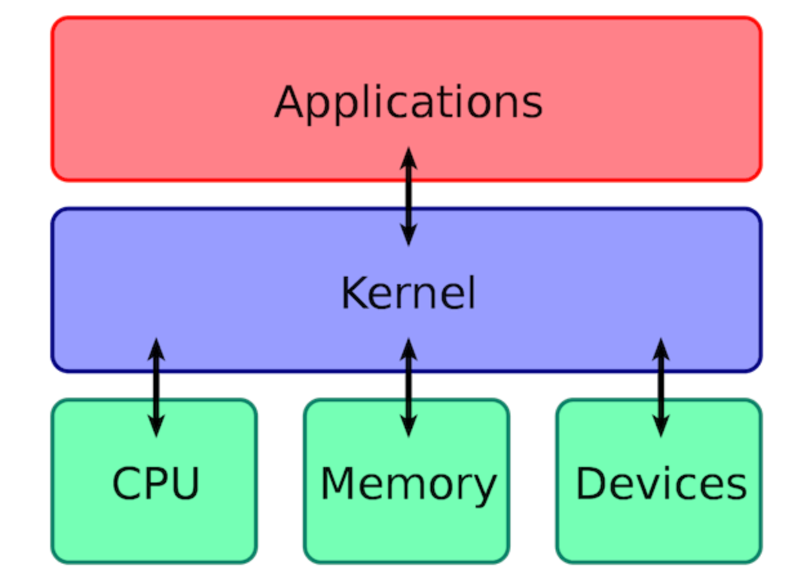
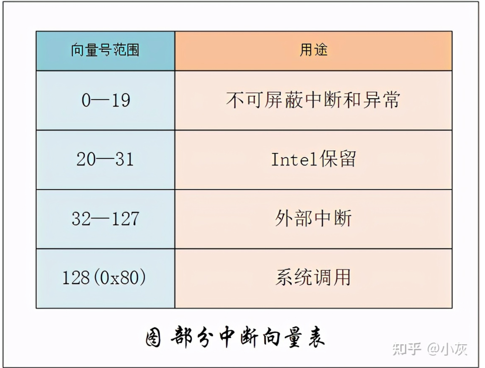
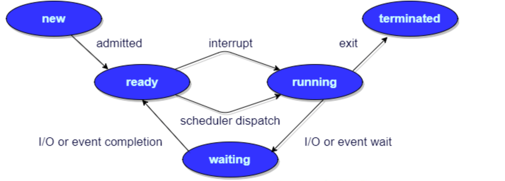
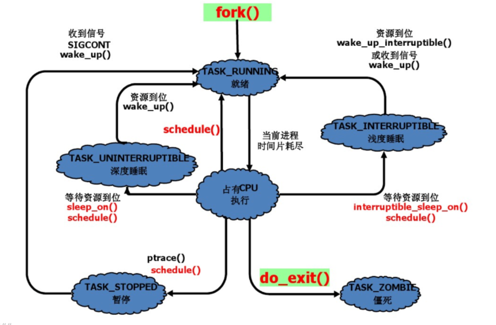

## 一 、操作系统基础
### 1.1 什么是操作系统？

1. **操作系统（Operating System，简称 OS）是管理计算机硬件与软件资源的程序，是计算机的基石。**
2. **操作系统本质上是一个运行在计算机上的软件程序 ，用于管理计算机硬件和软件资源。**
3. **操作系统存在屏蔽了硬件层的复杂性。**
4. **操作系统的内核（Kernel）是操作系统的核心部分，它负责系统的内存管理，硬件设备的管理，文件系统的管理以及应用程序的管理**。


### 1.2 什么是系统调用
系统调用 是内核提供给应用程序使用的功能函数，由于应用程序一般运行在 用户态，而处于用户态的进程有诸多限制（如不能进行 I/O 操作），所以有些功能必须由内核代劳完成。而内核就是通过向应用层提供 系统调用，来完成一些在用户态不能完成的工作。
说白了，系统调用其实就是函数调用，只不过调用的是内核态的函数。与普通的函数调用不同的是，系统调用不能使用 call 指令来调用，而是需要使用 软中断 来调用。

系统调用按功能大致可分为如下几类：

- 进程控制。完成进程的创建、撤销、阻塞及唤醒等功能。
- 进程通信。完成进程之间的消息传递或信号传递等功能。
- 内存管理。完成内存的分配、回收以及获取作业占用内存区大小及地址等功能。
- 文件管理。完成文件的读、写、创建及删除等功能。
- 设备管理。完成设备的请求或释放，以及设备启动等功能。
### 1.3 什么是中断
简单来说就是**CPU停下当前的工作任务，去处理其他事情，处理完后回来继续执行刚才的任务**，这一过程便是中断。



## 二 、进程和线程
### 2.1 进程、线程、协程的概念
进程：
静态程序的运行状态就叫进程。是资源分配的基本单位。
线程：
是进程的一个执行单元，是进程内的调度实体。是CPU调度的独立单位。线程也被称为轻量级进程。
协程：
是一种比线程更加轻量级的存在。一个线程也可以拥有多个协程。其执行过程更类似于子线程，或者说不带返回值的函数调用。

### 2.2 进程和线程的区别

1. 地址空间：

线程共享本进程的地址空间，而进程之间是独立的地址空间。

2. 资源：

线程共享本进程的资源如内存、I/O、CPU等，不利于资源的管理和保护，而进程之间的资源是独立的，能很好的进行资源管理和保护。

3. 健壮性：

多进程要比多线程健壮，一个进程崩溃后，在保护模式下不会对其他进程产生影响，但是一个线程崩溃整个进程都可能死掉。

4. 执行过程：

每个独立的进程有一个程序运行的入口、顺序执行序列和程序入口，执行开销大。
但是线程不能独立执行，必须依存在应用程序中，由应用程序提供多个线程执行控制，执行开销小。

5. 切换时：

进程切换时，消耗的资源大，效率高。所以涉及到频繁的切换时，使用线程要好于进程。同样如果要求同时进行并且又要共享某些变量的并发操作，只能用线程不能用进程。
对于进程，我们需要将状态保存到进程控制块(PCB)中，同样的，线程也有相同作用的线程控制块TCB，但是和进程上下文切换相比，线程在进行上下文切换的时候**地址空间保持不变** ，所以不需要切换当前使用的页表。

6. 其他：

线程是处理器调度的基本单位，但是进程不是。

### 2.3 线程与协程的区别
首先，线程与协程都具有隔离性，拥有自己的上下文。
但是线程在创建的时候需要预先分配MB级别的栈空间，而协程只需要KB。
线程间上下文切换与调度消耗很多资源，例如从用户态切换到内核态，保存当前线程环境，加载目标线程的执行环境，再从内核态切换到用户态，涉及两次上下文切换。而协程是在空户空间下模拟的线程操作。虽然协程在创建的时候也需要动态绑定一个线程，真正执行任务的也是线程。但是协程是在用户级别完成调度切换的，对于内核来说是无感知的，也就是说，协程的调度是基于用户进程空间的，可以避免线程间的切换问题（当然了，如果当前的协程切换是由于时间片到期导致做绑定的线程切换的话，还是会涉及线程的切换）。
线程是抢占式执行，当发生系统调用或者中断的时候，交由OS调度执行；而协程是可以在业务逻辑编写的时候由代码控制主动切换，比如说python 通过yield主动让出cpu所有权，切换到其他协程执行，当然 Go 可以利用 CSP 完成相同功能。
一旦创建完线程，你就无法决定他什么时候获得时间片，什么时候让出时间片了，你把它交给了内核。而协程编写者可以有：可控的切换时机和很小的切换代价。从操作系统有没有调度权上看，协程就是因为不需要进行内核态的切换，所以协程的上下文切换比线程快很多。
### 2.4 何时使用多进程，何时使用多线程？
对资源的管理和保护要求高，不限制开销和效率时，使用多进程。
要求效率高，频繁切换时，资源的保护管理要求不是很高时，使用多线程。
### 2.5 为什么会有线程？
每个进程都有自己的地址空间，即进程空间，当一个服务器通常需要接收大量不确定数量用户的并发请求，为每一个请求都创建一个进程显然行不通（系统开销大响应用户请求效率低），因此操作系统中线程概念被引进。

### 2.6 为什么要有协程
一是节省CPU，避免系统内核级的线程频繁切换，造成的CPU资源浪费。而协程是用户态的线程，用户可以自行控制协程的创建与销毁，极大程度避免了系统级线程上下文切换造成的资源浪费。
二是节约内存，在64位的Linux中，一个线程需要分配8MB栈内存和64MB堆内存，系统内存的制约导致我们无法开启更多线程实现高并发。而在协程编程模式下，可以轻松有十几万协程，这是线程无法比拟的。
三是稳定性，前面提到线程之间通过内存来共享数据，这也导致了一个问题，任何一个线程出错时，进程中的所有线程都会跟着一起崩溃。
四是开发效率，使用协程在开发程序之中，可以很方便的将一些耗时的IO操作异步化，例如写文件、耗时IO请求等。

### 2.7 进程有哪几种状态?
我们一般把进程大致分为 5 种状态。

- **创建状态(new)** ：进程正在被创建，尚未到就绪状态。
- **就绪状态(ready)** ：进程已处于准备运行状态，即进程获得了除了处理器之外的一切所需资源，一旦得到处理器资源(处理器分配的时间片)即可运行。
- **运行状态(running)** ：进程正在处理器上运行(单核 CPU 下任意时刻只有一个进程处于运行状态)。
- **阻塞状态(waiting)** ：又称为等待状态，进程正在等待某一事件而暂停运行如等待某资源为可用或等待 IO 操作完成。即使处理器空闲，该进程也不能运行。
- **结束状态(terminated)** ：进程正在从系统中消失。可能是进程正常结束或其他原因中断退出运行。

订正：下图中 running 状态被 interrupt 向 ready 状态转换的箭头方向反了。
)


### 2.8 进程间的通信方式
进程间的通信方式有两种基本模型：共享内存和消息传递。

> 共享内存模型会建立一块供协作进程共享的内存区域，进程通过向此区域读写数据进行通信。
> 消息传递模型通过协作进程间交换消息来实现通信，通常需要进行系统调用，所以消息传递模型的速度会比共享内存慢。


细分的话，共享内存模型又分：管道，消息队列，共享内存。消息传递模型又分：信号量，信号，socket套接字。

1. 管道
   - 管道有匿名管道和命名管道。匿名管道只能用于父子进程之间通信，而命名管道可以在任意两个进程间通信。不管是匿名管道还是命名管道，进程写入的数据都是缓存在内核中，另一个进程读取数据时候自然也是从内核中获取，同时通信数据都遵循**先进先出**原则。
2. 消息队列
   - **消息队列是保存在内核中的消息链表**，在发送数据时，会分成一个一个独立的数据单元，也就是消息体（数据块），消息体是用户自定义的数据类型，消息的发送方和接收方要约定好消息体的数据类型，所以每个消息体都是固定大小的存储块，不像管道是无格式的字节流数据。如果进程从消息队列中读取了消息体，内核就会把这个消息体删除。
   - 消息队列生命周期随内核，如果没有释放消息队列或者没有关闭操作系统，消息队列会一直存在，而前面提到的匿名管道的生命周期，是随进程的创建而建立，随进程的结束而销毁。
   - **消息队列通信过程中，存在用户态与内核态之间的数据拷贝开销**，因为进程写入数据到内核中的消息队列时，会发生从用户态拷贝数据到内核态的过程，同理另一进程读取内核中的消息数据时，会发生从内核态拷贝数据到用户态的过程。
3. 共享内存
   - **共享内存的机制，就是拿出一块虚拟地址空间来，映射到相同的物理内存中**。这样这个进程写入的东西，另外一个进程马上就能看到了，都不需要拷贝来拷贝去，传来传去，大大提高了进程间通信的速度。
4. 信号量
   - **信号量其实是一个整型的计数器，主要用于实现进程间的互斥与同步，而不是用于缓存进程间通信的数据**。
5. 信号
   - 上面说的进程间通信，都是常规状态下的工作模式。**对于异常情况下的工作模式，就需要用「信号」的方式来通知进程。**
   - 比如说我们常用的 `kill`命令，其实就会产生一个信号，告诉内核，我要终止某个进程。
6. 套接字
   -  前面提到的管道、消息队列、共享内存、信号量和信号都是在同一台主机上进行进程间通信，那要想**跨网络与不同主机上的进程之间通信，就需要 Socket 通信了。**

### 2.9 线程间的同步的方式
**那线程间的同步的方式有哪些呢?**
线程同步是两个或多个共享关键资源的线程的并发执行。应该同步线程以避免关键的资源使用冲突。
操作系统一般有下面三种线程同步的方式：

1. **互斥量(Mutex)**：采用互斥对象机制，只有拥有互斥对象的线程才有访问公共资源的权限。因为互斥对象只有一个，所以可以保证公共资源不会被多个线程同时访问。
2. **信号量(Semphares)** ：它允许同一时刻多个线程访问同一资源，但是需要控制同一时刻访问此资源的最大线程数量。
3. **事件(Event)** :Wait/Notify：通过通知操作的方式来保持多线程同步，还可以方便的实现多线程优先级的比较操作。

### 2.10 进程的调度算法
**你知道操作系统中进程的调度算法有哪些吗?**
#### 先到先服务(FCFS)调度算法 

- 从就绪队列中选择一个最先进入该队列的进程为之分配资源，使它立即执行并一直执行到完成或发生某事件而被阻塞放弃占用 CPU 时再重新调度。
#### 短作业优先(SJF)的调度算法 

- 从就绪队列中选出一个估计运行时间最短的进程为之分配资源，使它立即执行并一直执行到完成或发生某事件而被阻塞放弃占用 CPU 时再重新调度。
#### 时间片轮转调度算法 

- 时间片轮转调度是一种最古老，最简单，最公平且使用最广的算法，又称 RR(Round robin)调度。每个进程被分配一个时间段，称作它的时间片，即该进程允许运行的时间。
#### 多级反馈队列调度算法 

- 前面介绍的几种进程调度的算法都有一定的局限性。如**短进程优先的调度算法，仅照顾了短进程而忽略了长进程** 。多级反馈队列调度算法既能使高优先级的作业得到响应又能使短作业（进程）迅速完成。，因而它是目前**被公认的一种较好的进程调度算法**，UNIX 操作系统采取的便是这种调度算法。
#### 优先级调度 

- 为每个流程分配优先级，首先执行具有最高优先级的进程，依此类推。具有相同优先级的进程以 FCFS 方式执行。可以根据内存要求，时间要求或任何其他资源要求来确定优先级。
#### 高响应比调度算法 
 

### 2.11 cpu 的上下文切换

- 什么是CPU上下文

CPU 寄存器和程序计数器是 CPU 在运行任何任务前，所必须依赖的环境，这些环境就叫做 **CPU 上下文。**
CPU 上下文切换就是先把前一个任务的 CPU 上下文（CPU 寄存器和程序计数器）保存起来，然后加载新任务的上下文到这些寄存器和程序计数器，最后再跳转到程序计数器所指的新位置，重新加载指令数据，运行新任务。
系统内核会存储切换下来的上下文信息，当此任务再次被分配给 CPU 运行时，CPU 会重新加载这些上下文，这样就能保证任务原来的状态不受影响，让任务看起来还是连续运行。
上面说到所谓的「任务」，主要包含进程、线程和中断。所以，可以根据任务的不同，把 CPU 上下文切换分成：**进程上下文切换、线程上下文切换和中断上下文切换**。
### 2.12 协程的上下文切换
与熟悉的进程/线程切换类似，协程是用户自发的上下文切换和管理机制，所以也常被称为“用户态线程”。
而对于运行时的函数来讲，**参数、返回值地址、函数栈、寄存器**四个部分组成了运行时的全部信息，通过这些信息我们可以恢复任意函数的执行现场，我们称之为**协程的上下文(context)。**
**也就是说，协程的上下文切换，本质上就是要保存旧的函数参数、返回值地址、函数栈以及寄存器，并加载新的函数数据，以达到新的协程运行环境跟旧的运行环境隔离，并且旧的运行环境可以恢复的目的。**
### 2.13 线程的上下文切换
首先，线程是依托于进程而存在的，同一个进程内多个线程之间可以共享代码段、数据段以及打开的文件等资源，但每个线程各自都有一套独立的寄存器和栈，这样可以确保线程的控制流是相对独立的。
也就是说，线程的上下文切换主要分两种情况：新旧线程属于同一个进程，以及新旧进程不属于同一进程。
对于属于同一进程的两个线程的上下文切换来说，只需要切换线程私有的数据以及寄存器和栈信息即可。
对于不属于同一进程的线程上下文切换，他等同于进程的上下文切换。
### 2.14 进程的上下文切换
首先，进程的上下文也就是进程的运行时环境，他包含了虚拟内存、栈、全局变量等**用户空间的资源**，以及内核堆栈、寄存器等**内核空间的资源**。
因为进程的运行时环境比较复杂，我们操作系统里面存在一个叫**PCB**(_process control block_)，进程控制块的东西来存储进程的运行时环境。当发生进程上下文切换时，操作系统会保存旧进程的运行时数据到PCB里面，然后加载新的PCB，来达到新旧进程的运行时隔离的目的。

### 2.15 中断上下文切换
为了快速响应硬件的事件，**中断处理会打断进程的正常调度和执行，转而调用中断处理程序，响应设备事件**。而在打断其他进程时，就需要将进程当前的状态保存下来，这样在中断结束后，进程仍然可以从原来的状态恢复运行。
**跟进程上下文不同，中断上下文切换并不涉及到进程的用户态**。所以，即便中断过程打断了一个正处在用户态的进程，也不需要保存和恢复这个进程的虚拟内存、全局变量等用户态资源。中断上下文，其实只包括内核态中断服务程序执行所必需的状态，包括 CPU 寄存器、内核堆栈、硬件中断参数等。
**对同一个 CPU 来说，中断处理比进程拥有更高的优先级**，所以中断上下文切换并不会与进程上下文切换同时发生。同样道理，由于中断会打断正常进程的调度和执行，所以大部分中断处理程序都短小精悍，以便尽可能快的执行结束。
另外，跟进程上下文切换一样，中断上下文切换也需要消耗 CPU，切换次数过多也会耗费大量的 CPU，甚至严重降低系统的整体性能。所以，当你发现中断次数过多时，就需要注意去排查它是否会给你的系统带来严重的性能问题。

### 2.16 什么时候会发生进程的上下文切换
首先，明确一点的是，只有当进程的状态发生改变的时候，才会导致进程的上下文切换。 而导致进程状态发生改变的原因主要有以下三种：

1. 系统调度导致
> 比如说，某操作系统采用时间片轮转法进程进程调度，当当前进程的时间片耗完之后，进程就从运行状态变为就绪状态，系统从就绪队列选择另外一个进程运行；

2. 硬件中断导致
> 发生硬件中断时，CPU 上的进程会被中断挂起，转而执行内核中的中断服务程序；

3. 进程主动挂起
> 当进程通过睡眠函数 sleep 这样的方法将自己主动挂起时，自然也会重新调度；


### 2.17 什么时候会发生线程的上下文切换
线程主要由六种状态，创建、运行、堵塞、等待、超时等待和结束六种状态。当线程状态改变的时候，就会发生上下文的切换。

### 2.18 什么时候会发生协程的上下文切换
因为协程是用户态线程，只运行在用户空间，也就是说，协程的切换并不受系统控制。所以切换由用户自己控制，由当前协程切换到其他协程由当前协程来控制。

### 2.19 为什么会有CPU的上下文切换
CPU上下文切换的本质原因，就是为了利用有限的CPU资源，去运行更多的任务，从而提高系统的吞吐量。
比如说，Linux 是一个多任务操作系统，它支持远大于 CPU 数量的任务同时运行。当然，这些任务实际上并不是真的在同时运行，而是因为系统在很短的时间内，将 CPU 轮流分配给它们，造成多任务同时运行的错觉。
而在每个任务运行前，CPU 都需要知道任务从哪里加载、又从哪里开始运行，也就是说，需要系统事先帮它设置好**CPU 寄存器和程序计数器。**

### 2.20 进程调度、CPU调度以及线程调度之间的关系
首先，**进程是资源分配的基本单位，而线程是CPU调度的独立单位。**
也就是说，由操作系统进行进程调度，决定哪个进程拥有CPU资源，然后由CPU 调度来决定，运行哪个线程。

### 2.21 怎么查看系统的上下文切换情况
在Linux系统中，我们可以使用 `sysstat`工具包里面的 `vmstat`或者 `pidstat`命令查看。
比如说`vmstat`，主要关注以下几项

cs（context switch）是每秒上下文切换的次数。 
in（interrupt）则是每秒中断的次数。 
r（Running or Runnable）是就绪队列的长度，也就是正在运行和等待 CPU 的进程数。 
b（Blocked）则是处于不可中断睡眠状态的进程数
### 2.22 什么是死锁
在多道程序环境下，多个进程可以竞争有限数量的资源。当一个进程申请资源时，如果这时没有可用资源，那么这个进程进入等待状态。有时，如果所申请的资源被其他等待进程占有，那么该等待进程有可能再也无法改变状态。这种情况称为 **死锁**。
### 
2.23 死锁的四个必要条件
如果系统中以下四个条件同时成立，那么就能引起死锁：

- **互斥**：资源必须处于非共享模式，即一次只有一个进程可以使用。如果另一进程申请该资源，那么必须等待直到该资源被释放为止。
- **请求与等待**：一个进程至少应该占有一个资源，并等待另一资源，而该资源被其他进程所占有。
- **不可剥夺**：资源不能被剥夺。只能在持有资源的进程完成任务后，该资源才会被释放。
- **环路等待**：有一组等待进程 {P0, P1,..., Pn}， P0 等待的资源被 P1 占有，P1 等待的资源被 P2 占有，......，Pn-1 等待的资源被 Pn 占有，Pn 等待的资源被 P0 占有。

注意，只有四个条件同时成立时，死锁才会出现。
### 2.24 解决死锁的方法
解决死锁的方法可以从多个角度去分析，一般的情况下，有**预防，避免，检测和解除四种**。

- **预防** 是采用某种策略，**限制并发进程对资源的请求**，从而使得死锁的必要条件在系统执行的任何时间上都不满足。
- **避免**则是系统在分配资源时，根据资源的使用情况**提前做出预测**，从而**避免死锁的发生。**
- **检测**是指系统设有**专门的机构**，当死锁发生时，该机构能够检测死锁的发生，并精确地确定与死锁有关的进程和资源。
- **解除** 是与检测相配套的一种措施，用于**将进程从死锁状态下解脱出来**。

#### 死锁的预防
只要破坏四个必要条件中的任何一个就能够预防死锁的发生。

- 破坏第一个条件 **互斥条件：**使得资源是可以同时访问的，这是种简单的方法，磁盘就可以用这种方法管理，但是我们要知道，有很多资源 **往往是不能同时访问的** ，所以这种做法在大多数的场合是行不通的。
- 破坏第三个条件 **非抢占**：也就是说可以采用 **剥夺式调度算法**，但剥夺式调度方法目前一般仅适用于 **主存资源** 和 **处理器资源** 的分配，并不适用于所有的资源，会导致 **资源利用率下降**。

所以一般比较实用的 **预防死锁的方法**，是通过考虑**破坏占有并等待**和**循环等待**。
**1、静态分配策略**
静态分配策略可以破坏死锁产生的第二个条件（占有并等待）。

- 所谓静态分配策略，就是指一个进程必须在执行前就申请到它所需要的全部资源，并且知道它所要的资源都得到满足之后才开始执行。进程要么占有所有的资源然后开始执行，要么不占有资源，不会出现占有一些资源等待一些资源的情况。
- 静态分配策略逻辑简单，实现也很容易，但这种策略 **严重地降低了资源利用率**，因为在每个进程所占有的资源中，有些资源是在比较靠后的执行时间里采用的，甚至有些资源``是在额外的情况下才是用的，这样就可能造成了一个进程占有了一些 **几乎不用的资源而使其他需要该资源的进程产生等待** 的情况。

**2、层次分配策略**
层次分配策略破坏了产生死锁的第四个条件(循环等待)。

- 在层次分配策略下，所有的资源被分成了多个层次，一个进程得到某一层次的一个资源后，它只能再申请较高一层的资源。
- 当一个进程要释放某层的一个资源时，必须先释放所占用的较高层的资源，按这种策略，是不可能出现循环等待链的，因为那样的话，就出现了已经申请了较高层的资源，反而去申请了较低层的资源，不符合层次分配策略。

#### 死锁的避免
**1、预防死锁与避免死锁的区别**
 	**破坏** 死锁产生的四个必要条件之一就可以成功 **预防系统发生死锁** ，但是会导致 **低效的进程运行** 和 **资源使用率** 。
死锁的避免相反，它的角度是允许系统中**同时存在四个必要条件** ，只要掌握并发进程中与每个进程有关的资源动态申请情况，做出 **明智和合理的选择** ，仍然可以避免死锁，因为四大条件仅仅是产生死锁的必要条件。
**2、如何避免死锁（银行家算法-典型）**
我们将系统的状态分为 **安全状态** 和 **不安全状态** ，每当在未申请者分配资源前先测试系统状态，若把系统资源分配给申请者会产生死锁，则拒绝分配，否则接受申请，并为它分配资源。

- 如果操作系统能够保证所有的进程在有限的时间内得到需要的全部资源，则称系统处于安全状态，否则说系统是不安全的。很显然，系统处于安全状态则不会发生死锁，系统若处于不安全状态则可能发生死锁。

那么如何保证系统保持在安全状态呢？通过算法，其中最具有代表性的 **避免死锁算法** 就是 Dijkstra 的银行家算法。

- 银行家算法用一句话表达就是：当一个进程申请使用资源的时候，**银行家算法** 通过先 **试探** 分配给该进程资源，然后通过 **安全性算法** 判断分配后系统是否处于安全状态，若不安全则试探分配作废，让该进程继续等待，若能够进入到安全的状态，则就 **真的分配资源给该进程。**
- 银行家算法详情可见：[《一句话+一张图说清楚——银行家算法》open in new window](https://blog.csdn.net/qq_33414271/article/details/80245715) 。


死锁的避免(银行家算法)改善解决了 **资源使用率低的问题** ，但是它要不断地检测每个进程对各类资源的占用和申请情况，以及做 **安全性检查** ，需要花费较多的时间。

#### 死锁的检测
对资源的分配加以限制可以 **预防和避免** 死锁的发生，但是都不利于各进程对系统资源的**充分共享**。
解决死锁问题的另一条途径是 **死锁检测和解除** ：

- 感觉死锁的检测和解除就像是 **乐观锁** ，分配资源时不去提前管会不会发生死锁了，等到真的死锁出现了再来解决嘛，而 **死锁的预防和避免** 更像是悲观锁，总是觉得死锁会出现，所以在分配资源的时候就很谨慎。
- 这种方法对资源的分配不加以任何限制，也不采取死锁避免措施，但系统 **定时地运行一个 “死锁检测”** 的程序，判断系统内是否出现死锁，如果检测到系统发生了死锁，再采取措施去解除它。

**1、进程—资源分配图**
操作系统中的每一刻时刻的**系统状态**都可以用**进程-资源分配图**来表示，进程-资源分配图是描述进程和资源申请及分配关系的一种有向图，可用于**检测系统是否处于死锁状态**。

- 用一个方框表示每一个资源类。
- 方框中的黑点表示该资源类中的各个资源。
- 每个键进程用一个圆圈表示。
- 用 **有向边** 来表示**进程申请资源和资源被分配的情况**。


**图中 2-21 是进程-资源分配图的一个例子。**

- 其中共有三个资源类，每个进程的资源占有和申请情况已清楚地表示在图中。
- 在这个例子中，由于存在 **占有和等待资源的环路** ，导致一组进程永远处于等待资源的状态，发生了 **死锁**。

_进程-资源分配图中存在环路并不一定是发生了死锁。因为循环等待资源仅仅是死锁发生的必要条件，而不是充分条件。_
**图 2-22 便是一个有环路而无死锁的例子。**

- 虽然进程 P1 和进程 P3 分别占用了一个资源 R1 和一个资源 R2，并且因为等待另一个资源 R2 和另一个资源 R1 形成了环路，但进程 P2 和进程 P4 分别占有了一个资源 R1 和一个资源 R2，它们申请的资源得到了满足，在有限的时间里会归还资源，于是进程 P1 或 P3 都能获得另一个所需的资源，环路自动解除，系统也就不存在死锁状态了。

**2、死锁监测步骤**

   1. 如果进程-资源分配图中无环路，则此时系统没有发生死锁。
   2. 如果进程-资源分配图中有环路，且每个资源类仅有一个资源，则系统中已经发生了死锁。
   3. 如果进程-资源分配图中有环路，且涉及到的资源类有多个资源，此时系统未必会发生死锁。如果能在进程-资源分配图中找出一个 **既不阻塞又非独立的进程** ，该进程能够在有限的时间内归还占有的资源，也就是把边给消除掉了，重复此过程，直到能在有限的时间内 **消除所有的边** ，则不会发生死锁，否则会发生死锁。(消除边的过程类似于 **拓扑排序**)

#### 死锁的解除
当死锁检测程序检测到存在死锁发生时，应设法让其解除，让系统从死锁状态中恢复过来，常用的解除死锁的方法有以下四种：

1. **立即结束所有进程的执行，重新启动操作系统** ：这种方法简单，但以前所在的工作全部作废，损失很大。
2. **撤销涉及死锁的所有进程，解除死锁后继续运行** ：这种方法能彻底打破**死锁的循环等待**条件，但将付出很大代价，例如有些进程可能已经计算了很长时间，由于被撤销而使产生的部分结果也被消除了，再重新执行时还要再次进行计算。
3. **逐个撤销涉及死锁的进程，回收其资源直至死锁解除。**
4. **抢占资源** ：从涉及死锁的一个或几个进程中抢占资源，把夺得的资源再分配给涉及死锁的进程直至死锁解除。

### 2.25 协程是怎么实现的
#### 1、协程执行
每个线程拥有自己的线程函数，相应，每个协程都拥有一个自己的协程函数。线程函数每次从函数的第一句开始执行，参数，局部变量等都保留在线程栈上，函数返回，清空栈信息。但是协程函数所有信息保留在堆中，协程函数第一次执行，在堆中动态分配一个协程上下文，其中包含，局部变量，参数，以及交出控制权的位置，交出控制权后，堆中信息不会被删除，下一次被执行会从堆中恢复上下文信息。协程函数结束，清空对应堆中的信息。
之前提过协程是基于线程的，在用户层面上维护一个数据结构与多个线程(线程池)。协程函数在一个队列中维护，多个线程(线程池)从队列中取出协程函数执行。
#### 2、协程调度
协程没有cpu权限， 无法使用cpu去完成调度。那么协程如何实现调度的呢？
#### 2.1、有栈协程
创建大量协程，这些协程绑定在一个线程上(主协程)。并且每一个协程保留一个私有栈。协程执行到异步IO处，交出控制权给主协程，由主协程进行调度分配。

- 处于同一线程，协程间不存在竞态关系。
- 带有协程栈，所以可以再任意节点交出控制权

有栈协程保存调用栈信息空间消耗太大，空间使用共享栈来解决这种问题，但是也会带来相应的copy问题。
#### 2.2、无栈协程
封装系统异步IO函数作为协程函数，协程一旦发起异步IO操作后，保留当前信息，控制权交付当前执行函数，线程去队列中拉取另一个协程函数执行。异步IO完成后重新获取控制权，恢复上下文环境继续执行之前协程函数。

- 只有在异步IO操作是才能交出控制权。
- 无需住协程调度
- 线程A执行异步协程B的IO操作，协程B交出控制权，线程C执行，此时协程B恢复操作。因为B不在线程C中。所以可能存在竞态关系。

无栈协程需要标准语言与编译器支持。

> 由于协程必须支持 **挂起/恢复**，因此对于挂起点的状态保存就显得极其关键。我们知道，线程在切换时，它的中断状态会保存在调用栈中。事实上，协程的中断状态也可以通过开辟相应的调用栈来保存。因此，**按照是否开辟相应的调用栈**，我们可以将协程分为两类：
> - **有栈协程**（Stackful Coroutine）：每个协程都有自己的调用栈，类似于线程的调用栈。
> - **无栈协程**（Stackless Coroutine）：协程没有自己的调用栈，挂起点的状态通过状态机或闭包等语法来实现。
> 
类似微信的 libco、阿里的 cooobjc、Golang 中的 goroutine、Lua 中的协程都是有栈协程；类似 ES6、Dart 中的 await/async、Python 的 Generator、Kotlin 中的协程、C++20 中的 cooroutine 都是无栈协程。
> > [初识协程](http://chuquan.me/2021/05/05/getting-to-know-coroutine/)


### 2.26 多线程冲突了怎么办？
多线程冲突，也就是线程安全问题。线程安全，也就是要确保在多线程访问的时候，我们的程序还能按照我们预期的行为去执行，或者说在多线程执行时可以得到我们预期的结果。而导致线程不安全的原因主要有原子性和可见性。
> 如果是原子性导致的，可以通过加锁或者使用互斥信号量来解决。总之，就是对临界区代码进行互斥访问，确保同一时间只有一个线程在执行临界区代码。

那什么是可见性导致呢？比如说，比如说有一个共享变量 i ，开两个线程去处理 i++ ，另外开两个进程去读取 i ，这个时候就会产生意想不到的结果，也就是线程不安全。
那可见性导致的线程不安全怎么去解决呢？
> 可见性导致的线程不安全的例子

```go
// The following code demonstrates a thread safety issue caused by visibility
// 可见性导致的线程安全问题

public class VisibilityIssue {
    private static boolean stop = false;

    public static void main(String[] args) throws InterruptedException {
        Thread backgroundThread = new Thread(() -> {
            int i = 0;
            while (!stop) {
                i++;
            }
            System.out.println("Background thread stopped. Counted up to " + i);
        });
        backgroundThread.start();

        Thread.sleep(1000);
        stop = true;   // 更改了缓存的值，但是由于写时复制，导致线程不可见更改后的值
        System.out.println("Main thread stopped background thread.");
    }
}


// One solution to the visibility issue causing thread safety problems is to use the volatile keyword
// 使用volatile关键字解决可见性导致的线程安全问题

public class VisibilityIssue {
    // 使用 volatile 当值发生变化时直接写回地址
    private static volatile boolean stop = false;

    public static void main(String[] args) throws InterruptedException {
        Thread backgroundThread = new Thread(() -> {
            int i = 0;
            while (!stop) {
                i++;
            }
            System.out.println("Background thread stopped. Counted up to " + i);
        });
        backgroundThread.start();

        Thread.sleep(1000);
        stop = true;
        System.out.println("Main thread stopped background thread.");
    }
}
```
> 这其实是线程同步问题。

### 2.27 孤儿进程与僵尸进程的区别
我们知道在unix/linux中，正常情况下，子进程是通过父进程创建的，子进程在创建新的进程。子进程的结束和父进程的运行是一个异步过程,即父进程永远无法预测子进程 到底什么时候结束。 当一个进程完成它的工作终止之后，它的父进程需要调用wait()或者waitpid()系统调用取得子进程的终止状态。
**孤儿进程：一个父进程退出，而它的一个或多个子进程还在运行，那么这些子进程将成为孤儿进程。孤儿进程将被 init进程(进程号为1) 所收养，并由 init 进程对它们完成状态收集工作。**

**僵尸进程：一个进程使用fork创建子进程，如果子进程退出，而父进程并没有调用wait或waitpid获取子进程的状态信息，那么子进程的进程描述符仍然保存在系统中。这种进程称之为僵尸进程。**

### 2.28 后台进程和守护进程有什么区别
1、守护进程已经完全脱离终端控制台了，而后台程序并未完全脱离终端(在终端未关闭前还是会往终端输出结果);
2、守护进程在关闭终端控制台时不会受影响，而后台程序会随用户退出而停止，需要在以 `nohup command &` 格式运行才能避免影响;
3、守护进程的会话组和当前目录，文件描述符都是独立的。后台运行只是终端进行了一次fork，让程序在后台执行，这些都没改变;
### 2.29 守护进程的特点
守护进程(Daemon)是在后台运行的一种特殊进程，它脱离于终端，从而可避免进程被任何终端所产生的信号打断，它在执行进程中的产生信息也不在任何终端上显示。守护进程周期性地执行某种任务或等待处理某些发生的事件，Linux的大多数服务器就是用守护进程实现的。


### 2.30 操作系统有哪几种锁
在Linux中常见的锁有：互斥锁、读写锁、自旋锁、RCU。
#### 1. **互斥锁：mutex**
互斥锁：mutex，用于保证在任何时刻，都只能有一个线程访问该对象。当获取锁操作失败时，线程会进入睡眠，等待锁释放时被唤醒。
#### 2. 读写锁 rwlock
读写锁：rwlock，分为读锁和写锁。处于读操作时，可以允许多个线程同时获得读操作。但是同一时刻只能有一个线程可以获得写锁。其它获取写锁失败的线程都会进入睡眠状态，直到写锁释放时被唤醒。
> 注意：写锁会阻塞其它读写锁。当有一个线程获得写锁在写时，读锁也不能被其它线程获取；写者优先于读者（一旦有写者，则后续读者必须等待，唤醒时优先考虑写者）。

- 适用于读取数据的频率远远大于写数据的频率的场合。
#### 3. 自旋锁：spinlock
自旋锁：spinlock，在任何时刻同样只能有一个线程访问对象。但是当获取锁操作失败时，不会进入睡眠，而是会在原地自旋，直到锁被释放。这样节省了线程从睡眠状态到被唤醒期间的消耗，在加锁时间短暂的环境下会极大的提高效率。但如果加锁时间过长，则会非常浪费CPU资源。
#### 4. **RCU**
RCU：即read-copy-update，在修改数据时，首先需要读取数据，然后生成一个副本，对副本进行修改。修改完成后，再将老数据update成新的数据。
> 使用RCU时，读者几乎不需要同步开销，既不需要获得锁，也不使用原子指令，不会导致锁竞争，因此就不用考虑死锁问题了。而对于写者的同步开销较大，它需要复制被修改的数据，还必须使用锁机制同步并行其它写者的修改操作。在有大量读操作，少量写操作的情况下效率非常高。

### 2.31 锁相关问题

1. 两个进程访问临界区资源，会不会出现都获得自旋锁的情况？

单核cpu，并且开了抢占可以造成这种情况。

2. 请问就绪状态的进程在等待什么？
被调度使用cpu的运行权
3. 怎么唤醒被阻塞的socket线程？
给阻塞时候缺少的资源。
4. 如何设计server，使得能够接收多个客户端的请求
多线程，线程池，io复用。
5. 死循环+来连接时新建线程的方法效率有点低，怎么改进？

改进死循环：使用select epoll这样的技术。
改进线程：提前创建好一个线程池，用生产者消费者模型，创建一个任务队列，队列作为临界资源，有了新连接，就挂在到任务队列上，队列为空所有线程睡眠。

### 2.32 fork 、vfork 和 clone 有什么区别？
#### 1. fork
> Under  Linux,  fork() is implemented using copy-on-write pages, so the only penalty that it incurs is the time and memory required to duplicate the parent's page tables, and to create a unique task struct for the child.

在Linux下，fork()是使用写时复制页面实现的，因此它带来的惟一损失是复制父节点的页表和为子节点创建惟一的任务结构所需的时间和内存。
> Note the following further points:
>        *  The  child  process  is  created  with a single thread—the one that called fork().  The entire virtual address space of the parent is replicated in the child, including the states of mutexes, condition  variables, and other pthreads objects; the use of pthread_atfork(3) may be helpful for dealing with problems that this can cause.
>        *  The child inherits copies of the parent's set of open file descriptors.  Each file descriptor in the child refers to the same open file description  as the corresponding file descriptor in the parent.  This means that the two file descriptors share open file status flags, file offset, and signal-driven I/O attributes.
>        *  The  child inherits copies of the parent's set of open message queue descriptors.  Each file descriptor in the child refers to the same open message queue description as the corresponding file descriptor in the parent.  This means that the two file descriptors share the same flags .
>        *  The child inherits copies of the parent's set of open directory streams .  POSIX.1 says that the corresponding directory streams in the parent and child may share the  directory  stream .

#### 2. vfork
> -  vfork(), just like fork(2), creates a child process of the calling process. .
> -  vfork()  is  a  special case of clone(2).  It is used to create new processes without copying the page tables of the parent process.  It may be useful in performance-sensitive applications where a child is created which then immediately issues an execve(2).
> - vfork() differs from fork(2) in that the calling thread is suspended until the child terminates, or it makes a call to execve(2).  Until that point, the child shares all memory with its parent, including the stack.  The child must not return from the current function or call exit(3) (which would have the effect of calling exit handlers established by the parent process and flushing the parent's stdio(3) buffers), but may call _exit(2).
> - As with fork(2), the child process created by vfork() inherits copies of various of the caller's process attributes (e.g., file descriptors, signal dispositions, and  current  working  directory); the vfork() call differs only in the treatment of the virtual address space, as described above. Signals sent to the parent arrive after the child releases the parent's memory (i.e., after the child terminates or calls execve(2)).
> 

vfork的好处是在子进程被创建后往往仅仅是为了调用exec执行另一个程序，因为它就不会对父进程的地址空间有任何引用，所以对地址空间的复制是多余的 ，因此通过vfork共享内存可以减少不必要的开销。
#### 3. clone
> - These system calls create a new ("child") process, in a manner similar to fork(2).
> - By  contrast  with  fork(2), these system calls provide more precise control over what pieces of execution context are shared between the calling process and the child process.  For example, using these system calls, the caller can control whether or not the two processes share the virtual address space, the table of file descriptors, and the table of signal handlers.   These  system  calls also allow the new child process to be placed in separate namespaces(7).


系统调用fork()和vfork()是无参数的，而clone()则带有参数。fork()是全部复制，vfork()是共享内存，而clone()是则可以将父进程资源有选择地复制给子进程，而没有复制的数据结构则通过指针的复制让子进程共享，具体要复制哪些资源给子进程，由参数列表中的clone_flags来决定。另外，clone()返回的是子进程的pid。

### 2.33 namespace  和 cgroup 是什么？
简单地讲，namespace 主要是用于进程资源隔离， cgroup （control group ）主要是用于做资源限制的。

### 2.34 fork 的过程


### 2.35 进程的内存空间
Linux 的虚拟地址空间采用 “分段+分页” 结合的方式实现。分段是将内存划分成各个段落（Segment），每个段落的长度可以不同，且虚拟地址空间中未使用的空间不会映射到物理内存中，所以操作系统不会为这段空间分配物理内存。这样的话，内核为刚创建的进程分配的物理内存可以很小，随着进程运行不断使用内存，内核再为进程按需分配物理内存。也就是说，尽管地址空间的范围和物理内存大小一样，但不会将全部空间映射到物理内存。
在 32 操作系统中，其虚拟地址为 32 位长度，因此其虚拟地址空间的范围为 2 ** 32 = 4GB。Linux 系统将地址空间按 3:1 比例划分，其中用户空间（user space）占 3GB，内核空间（kernel space）占 1GB。Linux 系统进程的虚拟内存地址空间布局如下图所示：

各个分段的含义：
#### 文本段（Text）也称代码段：
进程启动时会将程序的代码加载到物理内存中，文本段映射到这片物理内存。
#### 数据段（Data）

- 包含程序显式初始化的全局变量和静态变量，即已初始化且初值不为0的全局变量(也包括静态全局变量)和静态局部变量，这些数据是在程序真正运行前就已经确定的数据，所以可以提前加载到内存保存好。
#### 未初始化数据（BSS）：
未初始化的全局变量和静态变量，这些变量的值是在程序真正运行起来并为其赋值后才能确定的，所以程序加载之初，只需要记录它的内存地址和所需大小。出于历史原因，这段空间也称为 BSS 段。
#### 栈（Stack）：
位于用户空间的顶部，是一个可以动态增长和收缩的内存段落，由栈帧（Stack Frames）组成，进程每调用一次函数，都将为该函数分配一个栈帧，栈帧中保存了该函数的局部变量、参数值和返回值。栈帧会在函数返回时被清理掉。注意，编译器会将函数参数放入寄存器来优化程序，只有寄存器放不下的参数才使用栈帧来保存。由于栈中数据严格的遵守 FIFO 的顺序，这个简单的设计意味着不必使用复杂的数据结构来追踪栈中的内容，只需要一个简单的指针指向栈的顶端即可，因此压栈（pushing）和出栈（popping）过程非常迅速、准确。
#### 堆（Heap）
与栈一样，堆用于运行时内存分配；但不同的是，堆用于存储那些生存期与函数调用无关的数据。如用系统调用 malloc 申请的内存便在堆上，这些申请的内存在不需要时必须手动释放，否则便会出现内存泄漏。
栈的内存地址向下增长，堆得内存地址向上增长。
#### 内存映射段（Memory Mapping）
在栈与堆之间，有一个内存映射端。内核通过这一段将文件的内容直接映射到内存，进程可以通过 mmap 系统调用请求这种映射。内存映射是一种方便高效的文件 I/O 方式，所以它也被用来加载动态库。
#### 内核段（Kernel）
这部分是操作系统内核运行时所占用内存在各进程虚拟地址空间中的映射。所有进程都有，且映射地址相同，因为都映射到内核使用的内存。这段内存只有内核能访问，用户进程无法访问到该段落。
在 64 位系统中，进程地址空间的大小则是不固定的。以 ARMv8-A 为例，它的 Page 大小可以是 4KB, 16KB 或者 64KB，其还可采用多级页表，因此可以有多种组合的形式。以采用 4KB 的页，4 级页表，虚拟地址为 48 位的系统为例（从ARMv8.2架构开始，支持虚拟地址和物理地址的大小最多为 52 位），其虚拟地址空间的范围为 `2 ** 48 = 256TB`，按照 1:1 的比例划分，内核空间和用户空间各占 128TB。其内存空间布局如下所示：

256TB 已经很大很大了，但是面对 64 位系统所具备的 16EB 的地址范围，根本就用不完。为了以后扩展的需要（比如虚拟地址扩大到56位），用户虚拟空间和内核虚拟空间不再是挨着的，但同 32 位系统一样，还是一个占据底部，一个占据顶部，所以这时 user space 和 kernel space 之间偌大的区域就空出来了。
但这段空闲区域也不是一点用都没有，它可以辅助进行地址有效性的检测。如果某个虚拟地址落在这段空闲区域，那就是既不在 user space，也不在 kernel space，肯定是非法访问了。使用 48 位虚拟地址，则 kernel space 的高 16 位都为 1，如果一个试图访问 kernel space 的虚拟地址的高 16 位不全为 1，则可以判断这个访问也是非法的。同理，user space 的高 16 位都为 0。这种高位空闲地址被称为 Canonical。

### 2.36 系统调用的详细流程
Linux 在x86上的系统调用通过 `int 0x80` 实现，用系统调用号来区分入口函数。操作系统实现系统调用的基本过程是：

1. 应用程序调用库函数（API）；
2. API 将系统调用号存入寄存器（EAX），然后通过中断调用使系统进入内核态；
3. 内核中的中断处理函数根据系统调用号，调用对应的内核函数（系统调用）；
4. 系统调用完成相应功能，将返回值存入寄存器（EAX），返回到中断处理函数；
5. 中断处理函数返回到 API 中；
6. API 将 EAX 返回给应用程序。

应用程序调用系统调用的过程是：

1. 把系统调用的编号存入 EAX；
2. 把函数参数存入其它通用寄存器；
3. 触发 0x80 号中断（int 0x80）。

### 2.37 PCB 是什么
**进程的PCB是系统感知进程的唯一实体。**所以说到底，对进程进行操作，也可以理解为对PCB进行操作。 
在创建进程的时候，就是分配一个PCB，里面记录了进程的各种信息，包含进程状态、程序计数器PC、CPU寄存器、内存管理信息等等，所以**PCB是要常驻内存的。**

### 2.38 PCB的存在方式是怎样的呢
一般来说，系统把所有PCB组织在一起,并把他们放在内存的固定区域，构成PCB表。而在这个固定区域里，主要有链接和索引两种方式。
① **链接方式**：把具有同一状态的PCB，链接成一个队列，这样可以形成若干就绪队列、阻塞队列和空白队列等，优先级高的进程的PCB排在前面。

② **索引方式**：系统根据所有进程的状态建立几张索引表，如就绪索引表，阻塞索引表等，并把各索引表在内存的首地址记录在内存的一些专用单元中，在每个索引表的表目中，记录具有相应状态的某个PCB在PCB表中的地址。


### 2.39 创建进程在操作系统来看的具体步骤是怎样的

1. 创建PCB
2. 赋予一个唯一的进程标识符pid
3. 为新进程分配资源，为新进程的程序和数据以及用户栈分配必要的内存空间
4. 初始化PCB（初始化标识信息，将系统分配的标识符和父进程标识符填入新的PCB中；初始化处理机状态息，使程序计数器指向程序的入口地址，使栈指针指向栈顶；初始化处理机控制信息，将进程的状态设置为就绪状态或静止就绪状态。）
5. 将新进程插入到就绪队列


### 2.40 进程撤销的具体过程

1. 根据被终止的进程的标识符，从PCB集合中检索出该进程的PCB，从中读出该进程的状态。
2. 若被终止的进程正处于执行状态，应立即终止该进程的执行，并置调度标志为真，用于指示该进程被终止后应重新进行调度。
3. 若该进程还有子孙进程，还应将其子孙进程予以终止，以防他们成为不可控的进程。
4. 将被终止的进程所拥有的全部资源，或者归还给其父进程，或者归还给操作系统。
5. 将被终止的进程PCB从所在队列或链表中移出，等待其他程序来搜集信息。

### 2.41 Linux 进程生命周期中的系统调用有哪些


### 2.42 PV 操作
PV操作主要是进程间同步的信号量机制中的申请、释放资源的操作原语，执行过程不可中断。
P操作:也称为`down()/wait()`操作，使S=S-1，若S<0，进程暂停执行,放入信号量的等待队列。
V操作:也称为`up()/signal()`操作，使S=S+1，若S<=0，唤醒等待队列中的一个进程。
## 三、操作系统内存管理基础
### 3.0 什么是内存
内存是电脑的一个硬件组成部分。从单片机的组成我们可以看到，CPU、内存和输入输出接口，就组成一个完整的电脑，其他统统属于外设。内存是可以被CPU通过总线进行操作的，也就是与CPU之间有总线相连接的。电脑所有的输入输出，都是要从内存来实现的。内存包括只读内存ROM和读写内存RAM，但在个人电脑（PC）中，我们通常所说的内存，是指读写内存。

### 3.1 内存管理介绍
**操作系统的内存管理主要是做什么？**

- 操作系统的内存管理主要负责内存的分配与回收（malloc 函数：申请内存，free 函数：释放内存）。
- 另外地址转换也就是将逻辑地址转换成相应的物理地址等功能也是操作系统内存管理做的事情。

### 3.2 **操作系统的内存管理机制了解吗？内存管理有哪几种方式?**
简单分为**连续分配管理方式**和**非连续分配管理方式**这两种。

- 连续分配管理方式是指为一个用户程序分配一个连续的内存空间，常见的如 **块式管理** 。
- 同样地，非连续分配管理方式允许一个程序使用的内存分布在离散或者说不相邻的内存中，常见的如**页式管理** 和 **段式管理**。
#### 块式管理 
远古时代的计算机操系统的内存管理方式。将内存分为几个固定大小的块，每个块中只包含一个进程。如果程序运行需要内存的话，操作系统就分配给它一块，如果程序运行只需要很小的空间的话，分配的这块内存很大一部分几乎被浪费了。这些在每个块中未被利用的空间，我们称之为碎片。
#### 页式管理 
把主存分为大小相等且固定的一页一页的形式，页较小，相比于块式管理的划分力度更大，提高了内存利用率，减少了碎片。页式管理通过页表对应逻辑地址和物理地址。
#### 段式管理 
页式管理虽然提高了内存利用率，但是页式管理其中的页实际并无任何实际意义。 段式管理把主存分为一段段的，段是有实际意义的，每个段定义了一组逻辑信息，例如,有主程序段 MAIN、子程序段 X、数据段 D 及栈段 S 等。 段式管理通过段表对应逻辑地址和物理地址。
#### 段页式管理机制 
段页式管理机制结合了段式管理和页式管理的优点。简单来说段页式管理机制就是把主存先分成若干段，每个段又分成若干页，也就是说 **段页式管理机制** 中段与段之间以及段的内部的都是离散的。
简单来说：分页可以有效提高内存利用率，分段可以更好满足用户需求。
### 
3.3 快表和多级页表
页表管理机制中有两个很重要的概念：快表和多级页表，这两个东西分别解决了页表管理中很重要的两个问题。
在分页内存管理中，很重要的两点是：

1. 虚拟地址到物理地址的转换要快。
2. 解决虚拟地址空间大，页表也会很大的问题。
#### 快表
快表，即 TLB( Translation Look-aside Buffer) ，转换表缓冲区。 
为了解决虚拟地址到物理地址的转换速度，操作系统在 **页表方案** 基础之上引入了 **快表** 来加速虚拟地址到物理地址的转换。

- 我们可以把快表理解为一种特殊的高速缓冲存储器（Cache），其中的内容是页表的一部分或者全部内容。
- 作为页表的 Cache，它的作用与页表相似，但是提高了访问速率。由于采用页表做地址转换，读写内存数据时 CPU 要访问两次主存。
- 有了快表，有时只要访问一次高速缓冲存储器，一次主存，这样可加速查找并提高指令执行速度。

使用快表之后的地址转换流程是这样的：

1. 根据虚拟地址中的页号查快表；
2. 如果该页在快表中，直接从快表中读取相应的物理地址；
3. 如果该页不在快表中，就访问内存中的页表，再从页表中得到物理地址，同时将页表中的该映射表项添加到快表中；
4. 当快表填满后，又要登记新页时，就按照一定的淘汰策略淘汰掉快表中的一个页。

#### 多级页表
引入多级页表的主要目的是为了避免把全部页表一直放在内存中占用过多空间，特别是那些根本就不需要的页表就不需要保留在内存中。

- 多级页表如何节约内存：[https://www.polarxiong.com/archives/多级页表如何节约内存.html](https://www.polarxiong.com/archives/%E5%A4%9A%E7%BA%A7%E9%A1%B5%E8%A1%A8%E5%A6%82%E4%BD%95%E8%8A%82%E7%BA%A6%E5%86%85%E5%AD%98.html)
#### 总结
为了提高内存的空间性能，提出了多级页表的概念；但是提到空间性能是以浪费时间性能为基础的，因此为了补充损失的时间性能，提出了快表（即 TLB）的概念。 不论是快表还是多级页表实际上都利用到了程序的局部性原理，局部性原理在后面的虚拟内存这部分会介绍到。
### 3.4 分页机制和分段机制的共同点和区别

1. **共同点** ：
   - 分页机制和分段机制都是为了提高内存利用率，减少内存碎片。
   - 页和段都是离散存储的，所以两者都是离散分配内存的方式。但是，每个页和段中的内存是连续的。
2. **区别** ：
   - 页的大小是固定的，由操作系统决定；而段的大小不固定，取决于我们当前运行的程序。
   - 分页仅仅是为了满足操作系统内存管理的需求，而段是逻辑信息的单位，在程序中可以体现为代码段，数据段，能够更好满足用户的需要。

### 3.5 逻辑(虚拟)地址和物理地址
我们编程一般只有可能和逻辑地址打交道，比如在 C 语言中，指针里面存储的数值就可以理解成为内存里的一个地址，这个地址也就是我们说的逻辑地址，逻辑地址由操作系统决定。物理地址指的是真实物理内存中地址，更具体一点来说就是内存地址寄存器中的地址。物理地址是内存单元真正的地址。

### 3.6 CPU 寻址了解吗?
这部分内容参考了 Microsoft 官网的介绍，地址：[https://docs.microsoft.com/zh-cn/windows-hardware/drivers/gettingstarted/virtual-address-spaces?redirectedfrom=MSDN](https://docs.microsoft.com/zh-cn/windows-hardware/drivers/gettingstarted/virtual-address-spaces?redirectedfrom=MSDN)

现代处理器使用的是一种称为 **虚拟寻址(Virtual Addressing)** 的寻址方式。
**使用虚拟寻址，CPU 需要将虚拟地址翻译成物理地址，这样才能访问到真实的物理内存。**
实际上完成虚拟地址转换为物理地址转换的硬件是 CPU 中含有一个被称为 **内存管理单元（Memory Management Unit, MMU）** 的硬件。**MMU需要借助存放在内存中的页表来动态翻译虚拟地址，该页表由操作系统管理。**如下图所示：
**TLB：转译后备缓冲区**

### 3.7 为什么进程没办法访问不属于它的内存?
这主要跟内存的映射有关，准确地说应该是跟页表的实现方式有关。

1. 如果页表采用一般的实现方式，那么每个进程都会有一个属于它自己的页表，只能映射到进程自己的地址空间。
2. 如果采用的是倒置页表，在映射的时候，由于倒置页表采用物理帧做索引，<pid, p> 进程 id 以及逻辑页作为value，所以进程没办法搜索到不属于自己的物理帧，也就无法访问不属于它的内存。
3. 同理，其他的实现方式，操作系统也会实现相应的地址空间隔离。


### 3.8 一个进程有多少个段表和页表
这主要跟操作系统的内存管理有关。

1. 如果存储器采用基本分页机制，那么操作系统会为每个进程或任务建立一个页表（这个页表可能是一级的也可能是多级的）。整个操作系统中有多个进程在运行，那么系统就会有多个页表。页表在内存中的存储位置由寄存器CR3给出。
2. 如果存储器采用基本分段机制，那么操作系统会为每个进程或任务建立一个段表（一般不用多级），用于记录数据段、代码段等各类段在内存中的具体位置。
3. 如果采用段页式结合的机制，那么一般一个进程或任务，操作系统会给其建立一个段表，而段表中的每个段又会对应一个页表，也就是说，段页式机制的每个进程有一个段表，有多个页表。

### 3.9 为什么使用分段比使用纯分页更容易共享可重入模块？
可重入模块一般需要实现共享以及保护。
#### 代码共享
       因为分段方式中，每个段都是逻辑上的一个整体，比如一个函数、一个子程序等等，并且大小不一。而代码的共享往往就是以函数或子程序为单位的，不管被共享的段有多大，只要为共享代码的进程各设置一个段表项，并让相应段的基址指向同一个内存的位置就可以了，非常容易。
       而在分页方式中，由于页面大小是固定的，被共享的代码可能在多个页面中，比如两个进程，共享代码有40页，就需要让两个页表中的40项都一一对应地指向同一个内存地址，不太方便。

#### 信息保护
       信息保护也是以信息的逻辑单位为基础的，比如函数、文件、子程序等。比如要保护一个函数A，在分段系统中，我们只需要在包含了函数A的段上标志只读、只写、只执行标志就可以了。
       但是在分页系统中，函数A可能要占用多个页面，而且其中的第一个和最后一个页面还可能装有其他程序段的数据，它们可能有着不同的保护属性，难以实施统一的保护。因此，分段管理方式能更加有效和方便地实现对信息的保护功能。

## 四、虚拟内存
### 4.1 什么是虚拟内存(Virtual Memory)?
虚拟内存是计算机系统内存管理的一种技术。它使得应用程序认为它拥有连续的可用的内存（一个连续完整的地址空间），而实际上，它通常是被分隔成多个物理内存碎片，还有部分暂时存储在外部磁盘存储器上，在需要时进行数据交换。与没有使用虚拟内存技术的系统相比，使用这种技术的系统使得大型程序的编写变得更容易，对真正的物理内存（例如RAM）的使用也更有效率。


### 4.2 局部性原理
局部性原理是虚拟内存技术的基础，正是因为程序运行具有局部性原理，才可以只装入部分程序到内存就开始运行。
局部性原理表现在以下两个方面：

1. **时间局部性** ：如果程序中的某条指令一旦执行，不久以后该指令可能再次执行；如果某数据被访问过，不久以后该数据可能再次被访问。产生时间局部性的典型原因，是由于在程序中存在着大量的循环操作。
- 时间局部性是通过将近来使用的指令和数据保存到高速缓存存储器中，并使用高速缓存的层次结构实现。
2. **空间局部性** ：一旦程序访问了某个存储单元，在不久之后，其附近的存储单元也将被访问，即程序在一段时间内所访问的地址，可能集中在一定的范围之内，这是因为指令通常是顺序存放、顺序执行的，数据也一般是以向量、数组、表等形式簇聚存储的。
- 空间局部性通常是使用较大的高速缓存，并将预取机制集成到高速缓存控制逻辑中实现。

虚拟内存技术实际上就是建立了 “内存一外存”的两级存储器的结构，利用局部性原理实现髙速缓存。

### 
4.3 虚拟存储器
**虚拟存储器又叫做虚拟内存，都是 Virtual Memory 的翻译，属于同一个概念。**
基于局部性原理，在程序装入时，可以将程序的一部分装入内存，而将其他部分留在外存，就可以启动程序执行。由于外存往往比内存大很多，所以我们运行的软件的内存大小实际上是可以比计算机系统实际的内存大小大的。在程序执行过程中，当所访问的信息不在内存时，由操作系统将所需要的部分调入内存，然后继续执行程序。另一方面，操作系统将内存中暂时不使用的内容换到外存上，从而腾出空间存放将要调入内存的信息。这样，计算机好像为用户提供了一个比实际内存大的多的存储器——**虚拟存储器**。

实际上，我觉得虚拟内存同样是一种时间换空间的策略，你用 CPU 的计算时间，页的调入调出花费的时间，换来了一个虚拟的更大的空间来支持程序的运行。不得不感叹，程序世界几乎不是时间换空间就是空间换时间。

### 4.4 虚拟内存的技术实现
**虚拟内存的实现需要建立在离散分配的内存管理方式的基础上。** 虚拟内存的实现有以下三种方式：

1. **请求分页存储管理** ：建立在分页管理之上，为了支持虚拟存储器功能而增加了请求调页功能和页面置换功能。请求调页是目前最常用的一种实现虚拟存储器的方法。请求调页存储管理系统中，在作业开始运行之前，仅装入当前要执行的部分页即可运行。假如在作业运行的过程中发现要访问的页面不在内存，则由处理器通知操作系统按照对应的页面置换算法将相应的页面调入到主存，同时操作系统也可以将暂时不用的页面置换到外存中。
2. **请求分段存储管理** ：建立在分段存储管理之上，增加了请求调段功能、分段置换功能。请求分段储存管理方式就如同请求分页储存管理方式一样，在作业开始运行之前，仅装入当前要执行的部分段即可运行；在执行过程中，可使用请求调入中断动态装入要访问但又不在内存的程序段；当内存空间已满，而又需要装入新的段时，根据置换功能适当调出某个段，以便腾出空间而装入新的段。
3. **请求段页式存储管理：**
- 请求段页式存储管理是建立在段页式存储管理基础上的一种段页式虚拟存储管理。
- 根据段页式存储管理的思想，请求段页式存储管理首先按照程序自身的逻辑结构，将其划分为若干个不同的分段，在每个段内则按页的大小划分为不同的页，内存空间则按照页的大小划分为若干个物理块。
- 内存以物理块为单位进行离散分配，不必将进程所有的页装入内存就可启动运行。
- 当进程运行过程中，访问到不在内存的页时，若该页所在的段在内存，则只产生缺页中断，将所缺的页调入内存；若该页所在的段不在内存，则先产生缺段中断再产生缺页中断，将所缺的页调入内存。若进程需要访问的页已在内存，则对页的管理与段页式存储管理相同。

**很多人容易搞混请求分页与分页存储管理，两者有何不同呢？**
它们之间的根本区别在于是否将一作业的全部地址空间同时装入主存。请求分页存储管理不要求将作业全部地址空间同时装入主存。基于这一点，请求分页存储管理可以提供虚存，而分页存储管理却不能提供虚存。
不管是上面那种实现方式，我们一般都需要：

1. 一定容量的内存和外存：在载入程序的时候，只需要将程序的一部分装入内存，而将其他部分留在外存，然后程序就可以执行了；
2. **缺页中断**：如果**需执行的指令或访问的数据尚未在内存**（称为缺页或缺段），则由处理器通知操作系统将相应的页面或段**调入到内存**，然后继续执行程序；
3. **虚拟地址空间** ：逻辑地址到物理地址的变换。

### 4.5 页面置换算法
地址映射过程中，若在页面中发现所要访问的页面不在内存中，则发生缺页中断 。
**缺页中断** 就是要访问的**页**不在主存，需要操作系统将其调入主存后再进行访问。 在这个时候，被内存映射的文件实际上成了一个分页交换文件。
当发生缺页中断时，如果当前内存中并没有空闲的页面，操作系统就必须在内存选择一个页面将其移出内存，以便为即将调入的页面让出空间。用来选择淘汰哪一页的规则叫做页面置换算法，我们可以把页面置换算法看成是淘汰页面的规则。
#### OPT 页面置换算法（最佳页面置换算法） 

- 最佳(Optimal, OPT)置换算法所选择的被淘汰页面将是以后永不使用的，或者是在最长时间内不再被访问的页面,这样可以保证获得最低的缺页率。但由于人们目前无法预知进程在内存下的若千页面中哪个是未来最长时间内不再被访问的，因而该算法无法实现。一般作为衡量其他置换算法的方法。
#### FIFO（First In First Out） 页面置换算法（先进先出页面置换算法） 

- 总是淘汰最先进入内存的页面，即选择在内存中驻留时间最久的页面进行淘汰。
#### LRU （Least Recently Used）页面置换算法（最近最久未使用页面置换算法）

- LRU 算法赋予每个页面一个访问字段，用来记录一个页面自上次被访问以来所经历的时间 T，当须淘汰一个页面时，选择现有页面中其 T 值最大的，即最近最久未使用的页面予以淘汰。
#### LFU （Least Frequently Used）页面置换算法（最少使用页面置换算法） 

- 该置换算法选择在之前时期使用最少的页面作为淘汰页。

### 4.6 为什么要有虚拟地址空间呢？
没有虚拟地址空间的时候，**程序都是直接访问和操作的都是物理内存** 。但是这样存在一些问题：

1. 用户程序可以访问任意内存，寻址内存的每个字节，这样就很容易（有意或者无意）破坏操作系统，造成操作系统崩溃。
2. 想要同时运行多个程序特别困难，比如你想同时运行一个微信和一个 QQ 音乐都不行。为什么呢？举个简单的例子：微信在运行的时候给内存地址 1xxx 赋值后，QQ 音乐也同样给内存地址 1xxx 赋值，那么 QQ 音乐对内存的赋值就会覆盖微信之前所赋的值，这就造成了微信这个程序就会崩溃。

**总结来说：如果直接把物理地址暴露出来的话会带来严重问题，比如可能对操作系统造成伤害以及给同时运行多个程序造成困难。**

**通过虚拟地址访问内存有以下优势：**

- 程序可以使用一系列相邻的虚拟地址来访问物理内存中不相邻的大内存缓冲区。
- 程序可以使用一系列虚拟地址来访问大于可用物理内存的内存缓冲区。当物理内存的供应量变小时，内存管理器会将物理内存页（通常大小为 4 KB）保存到磁盘文件。数据或代码页会根据需要在物理内存与磁盘之间移动。（请求调页）
- 不同进程使用的虚拟地址彼此隔离。一个进程中的代码无法更改正在由另一进程或操作系统使用的物理内存。
## 五、文件管理
### 5.1 磁盘调度算法
#### 1. 先来先服务算法( First Come First Served, FCFS) 算法
顾名思义，先到来的请求，先被服务。
#### 2. 最短寻道时间优先算法( Shortest Seek Time First, SSTF) 算法
最短寻道时间优先（_Shortest Seek First，SSF_）算法的工作方式是，优先选择从当前磁头位置所需寻道时间最短的请求。
#### 3. 扫描算法( SCAN ) 算法
最短寻道时间优先算法会产生饥饿的原因在于：磁头有可能再一个小区域内来回得移动。
为了防止这个问题，可以规定：**磁头在一个方向上移动，访问所有未完成的请求，直到磁头到达该方向上的最后的磁道，才调换方向，这就是扫描（_Scan_）算法**。
这种算法也叫做电梯算法，比如电梯保持按一个方向移动，直到在那个方向上没有请求为止，然后改变方向。
#### 4. 循环扫描算法( Circular Scan, CSCAN ) 算法
循环扫描（_Circular Scan, CSCAN_ ）规定：只有磁头朝某个特定方向移动时，才处理磁道访问请求，而返回时直接快速移动至最靠边缘的磁道，也就是复位磁头，这个过程是很快的，并且**返回中途不处理任何请求**，该算法的特点，就是**磁道只响应一个方向上的请求**。

#### 5. LOOK 与 CLOOK 算法
我们前面说到的扫描算法和循环扫描算法，都是磁头移动到磁盘「最始端或最末端」才开始调换方向。
那这其实是可以优化的，优化的思路就是**磁头在移动到「最远的请求」位置，然后立即反向移动。**
那针对 SCAN 算法的优化则叫 LOOK 算法，它的工作方式，磁头在每个方向上仅仅移动到最远的请求位置，然后立即反向移动，而不需要移动到磁盘的最始端或最末端，**反向移动的途中会响应请求。**
### 5.2 进程写文件时，进程发生了崩溃，已写入的数据会丢失吗？
大概就是，进程写文件（使用缓冲 IO）过程中，写一半的时候，进程发生了崩溃，已写入的数据会丢失吗？
答案，是不会的。

因为进程在执行 write （使用缓冲 IO）系统调用的时候，实际上是将文件数据写到了内核的 page cache，它是文件系统中用于缓存文件数据的缓冲，所以即使进程崩溃了，文件数据还是保留在内核的 page cache，我们读数据的时候，也是从内核的 page cache 读取，因此还是依然读的进程崩溃前写入的数据。
内核会找个合适的时机，将 page cache 中的数据持久化到磁盘。但是如果 page cache 里的文件数据，在持久化到磁盘化到磁盘之前，系统发生了崩溃，那这部分数据就会丢失了。
当然， 我们也可以在程序里调用 fsync 函数，在写文文件的时候，立刻将文件数据持久化到磁盘，这样就可以解决系统崩溃导致的文件数据丢失的问题。
[7.2 进程写文件时，进程发生了崩溃，已写入的数据会丢失吗？](https://xiaolincoding.com/os/6_file_system/pagecache.html#page-cache)

### 5.3 进程写文件时，断电了，文件内容会丢失吗？
写文件的时候，操作系统为了加快写的效率，通常会使用 page cache 技术，也就是先把数据写到内存，然后在某个时机再进行统一刷盘，已到达空间换时间的目的。
如果在写的过程中，断电了，存在内存中的数据是会丢失的，至于丢失多少，主要取决于刷盘的时机，也就是 kernel 的参数（可以使用 `sysctl -a | grep dirty` ）进行查看。

### 5.4 Linux 脏页刷盘的参数有哪些？


- 

- 如上参数分三组，任何一组参数的条件满足即会将脏数据刷新到磁盘
#### 1. 根据脏数据的绝对大小

- `vm.dirty_background_bytes` ： 触发会刷的脏数据大小，单位：byte，默认：0
- `vm.dirty_bytes` ： 触发回刷的脏数据大小（会阻塞应用进程异步写数据到cache），默认：0
#### 2. 根据脏数据占可用内存的比例
`vm.dirty_background_ratio` : 内存中脏数据达到系统可用内存的百分比时，会触发内核会启 flush进程将内存中的脏数据刷新到磁盘。此时应用进程不会被阻塞。默认：10
`vm.dirty_ratio` : 内存中脏数据达到系统可用内存的百分比时，会触发使系统不得不开始处理缓存脏页（因为此时脏页数量已经比较多，为了避免数据丢失需要将一定脏页刷入外存）；在此过程中很多应用进程可能会因为OS处理文件IO而阻塞。默认：20

> PS:XXX_bytes 参数如果设置，则XXX_ratio的参数会被忽略

#### 3. 定时起线程刷新
`vm.dirty_expire_centisecs` ： 脏数据超时回刷时间。下一次刷新线程唤醒时，内存中脏数据的时间超过此间隔的数据将会刷新到磁盘 。单位：1/100s，默认：3000,
`dirty_writeback_centisecs` : 脏数据回刷进程定期唤醒时间，单位：1/100s，默认：500

## 六、 设备管理
### 6.1 键盘敲下字母期间发生了什么？
我们先来看看 CPU 的硬件架构图：

CPU 里面的内存接口，直接和系统总线通信，然后系统总线再接入一个 I/O 桥接器，这个 I/O 桥接器，另一边接入了内存总线，使得 CPU 和内存通信。再另一边，又接入了一个 I/O 总线，用来连接 I/O 设备，比如键盘、显示器等。

- 正文

那当用户输入了键盘字符，**键盘控制器**就会产生扫描码数据，并将其缓冲在键盘控制器的寄存器中，紧接着键盘控制器通过总线给 CPU 发送**中断请求**。
CPU 收到中断请求后，操作系统会**保存被中断进程的 CPU 上下文**，然后调用键盘的**中断处理程序**。
键盘的中断处理程序是在**键盘驱动程序**初始化时注册的，那键盘**中断处理函数**的功能就是从键盘控制器的寄存器的缓冲区读取扫描码，再根据扫描码找到用户在键盘输入的字符，如果输入的字符是显示字符，那就会把扫描码翻译成对应显示字符的 ASCII 码，比如用户在键盘输入的是字母 A，是显示字符，于是就会把扫描码翻译成 A 字符的 ASCII 码。
得到了显示字符的 ASCII 码后，就会把 ASCII 码放到「读缓冲区队列」，接下来就是要把显示字符显示屏幕了，显示设备的驱动程序会定时从「读缓冲区队列」读取数据放到「写缓冲区队列」，最后把「写缓冲区队列」的数据一个一个写入到显示设备的控制器的寄存器中的数据缓冲区，最后将这些数据显示在屏幕里。
显示出结果后，**恢复被中断进程的上下文**。

## 七、输入/输出
### 7.1 DMA 是什么
许多设备都可以临时控制总线。这些设备可以执行涉及主内存和其他设备的数据传送。由于设备执行这些操作的过程中无需借助于 CPU，因此该类型的数据传送称为**直接内存访问** (direct memory access, DMA)。可以执行的 DMA 传送类型如下：

- 两个设备之间
- 设备和内存之间
- 内存和内存之间
