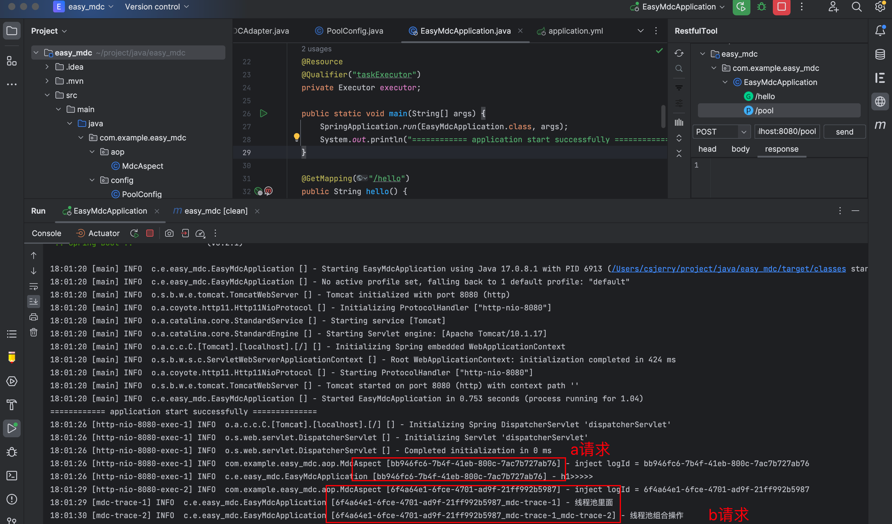

# [SpringAop + Logback +MDC] 现网必备全链路日志追踪

> 缘起：前几天有个粉丝私信，想了解现网环境如果出现问题，怎么快速定位。可能有些小伙伴这时候就会脱口而出，直接去看`log` 呗，有什么好说的。
>
> 但是，众所周知，后端服务面向的前端应用是多种多样的，比如有`web` , `app` ,小程序等等。也就是说后端服务往往是在一个并发环境下工作，如下图所示，所以日志文件并不一定是按顺序持久化打印的，当然这只是一个极其简陋的模型，实际上在互联网公司工作遇到的日志比这复杂很多，日志的采集也特别讲究 …
>
> 所以在一个混乱的日志文件中，有个标识可以将跳跃日志信息，关联起来往往可以决定你是否可以正常下班，这也是本篇文章也要达到的目的～
>
> 话不多说，进入正文

本文将介绍什么是全链路日志追踪，如何使用`Spring AOP`和`Logback` 来实现，以及为什么全链路日志追踪在现网系统中是必备的。

> 环境： `jdk17 + springboot 3` 


在分布式系统中，追踪请求的全链路日志对于故障排查和性能优化非常重要。`Spring AOP` 是常用的`Java` 技术，它可以结合其他技术（比如`logback`）灵活实现各种功能。比如本次结合使用来实现全链路日志追踪。


## 什么是全链路日志追踪？

全链路日志追踪是指在一个分布式系统中追踪请求的完整路径，并记录每个请求在系统中的处理过程中所产生的日志信息。它可以帮助我们了解请求在系统中的每个环节的执行情况，从而更好地排查问题和优化系统性能。

在一个典型的分布式系统中，一个请求可能会经过多个服务组件的处理，每个组件都会产生日志。全链路日志追踪可以将这些日志串联起来，并为每个请求生成一个唯一的标识符，以便在需要时能够方便地查找和分析。

其实说白了，就是在日志文件中加入一个可以标识每个请求的东西，如下所示，可以看到a请求的日志中有一串字符串`bb946fc6-7b4f-41eb-800c-7ac7b727ab76` , b请求也有一串字符串`6f4a64e1-6fce-4701-ad9f-21ff992b5987` 在现网的日志文件，我们就可以通过搜索这个字符串将跳跃的日志文件串联成一个完整的请求上下文，而这个字符串就是后端程序员常说的`trace_id` 分布式追踪`id` 。




## 怎么用？

下面将介绍如何使用`Spring AOP`和`Logback` + `MDC`来实现全链路日志追踪。

首先简单展示一下，`demo` 项目结构


### 1. 配置Logback

首先，我们需要在应用程序中配置`Logback`作为日志框架。可以通过在`resources`下创建`logback.xml`文件来进行配置。

```xml
<!--每隔15s 重新加载日志配置文件-->
<configuration scan="true" scanPeriod="15 seconds">
    <appender name="STDOUT" class="ch.qos.logback.core.ConsoleAppender">
        <encoder>
<!--            %X{var} 注入var变量的内容-->
            <pattern>%d{HH:mm:ss} [%thread] %-5level %logger{36} [%X{logId}] - %msg%n</pattern>
        </encoder>
    </appender>

<!--    定义变量-->
    <property name="LOG_DIR" value="logs" />
    <property name="LOG_FILE" value="detail.log" />

<!--    注意不要用错class -->
    <appender name="FILE" class="ch.qos.logback.core.rolling.RollingFileAppender">
        <file>${LOG_DIR}/${LOG_FILE}</file>
<!--        压缩归档策略-->
        <rollingPolicy class="ch.qos.logback.core.rolling.TimeBasedRollingPolicy">
            <!-- daily rollover -->
          <!-- 按分钟归档 -->
            <fileNamePattern>${LOG_DIR}/${LOG_FILE}.%d{yyyy-MM-dd-HH-mm}.gz</fileNamePattern>
            <!-- keep 30 days' worth of history capped at 3GB total size -->
            <maxHistory>30</maxHistory>
            <totalSizeCap>1GB</totalSizeCap>
        </rollingPolicy>
        <append>true</append>
        <encoder>
            <pattern>%d{HH:mm:ss} [%thread] %-5level %logger{36} [%X{logId}] - %msg%n</pattern>
        </encoder>
    </appender>

    <root level="info">
        <appender-ref ref="STDOUT" />
        <appender-ref ref="FILE" />
    </root>
</configuration>
```

在这个配置文件中，我们定义了日志输出格式、日志文件路径以及日志的归档方式。你可以根据自己的需求进行配置，具体可以简单谷歌一下。

### 2. 编写日志追踪切面

接下来，我们需要使用`Spring AOP` 编写一个切面，来实现日志追踪功能。切面可以拦截请求，并在每个请求的上下文注入追踪id。

```java

@Component
@Aspect
@Order(Ordered.HIGHEST_PRECEDENCE)
@AllArgsConstructor
public class MdcAspect {

    public static final String logIdKey = "logId";

    private static final Logger log = LoggerFactory.getLogger(MdcAspect.class);

    private final HttpServletRequest httpServletRequest;

    @Around(
            "@annotation(org.springframework.web.bind.annotation.GetMapping) " +
            "|| @annotation(org.springframework.web.bind.annotation.PostMapping) " +
            "|| @annotation(org.springframework.web.bind.annotation.PutMapping) " +
            "|| @annotation(org.springframework.web.bind.annotation.DeleteMapping) "
    )
    public Object injectLogId(ProceedingJoinPoint proceedingJoinPoint) throws Throwable{
        String logId = httpServletRequest.getHeader(MdcAspect.logIdKey);
        logId = StringUtils.isNotBlank(logId) ? (logId + "_") : "" + UUID.randomUUID();
        MDC.put(logIdKey, logId);
        log.info("inject logId = {}", logId);
        try {
            return proceedingJoinPoint.proceed();
        } finally {
            MDC.remove(logIdKey);
        }
    }


}

```

在这个切面中，我们使用`@Around`注解来拦截所有的方法调用。这个切面主要是用于拦截请求，然后在每个请求中注入一个唯一字符串作为每个请求的标识。

现在，当应用程序启动时，切面将会拦截所有被注解的方法，然后在请求上下文注入这么一串唯一字符串。

但是有个问题，就是在多线程环境下，这个唯一字符串没办法从父进程传递给子进程，所以我们采用`TaskDecorator`的线程任务装饰器方式为线程池的线程提供traceId的传递操作。

### 3. 定义任务装饰器

```java

public class MDCTaskDecorator implements TaskDecorator {
    @Override
    public @NonNull Runnable decorate(@NonNull Runnable runnable) {
        // 此时获取的是父线程的上下文数据
        Map<String, String> contextMap = MDC.getCopyOfContextMap();
        return () -> {
            try {
                if (!ObjectUtils.isEmpty(contextMap)) {
                    String logId = contextMap.getOrDefault(MdcAspect.logIdKey, UUID.randomUUID().toString());
                    logId += "_" + Thread.currentThread().getName();
                    contextMap.put(MdcAspect.logIdKey, logId);
                    // 内部为子线程的领域范围，所以将父线程的上下文保存到子线程上下文中，而且每次submit/execute调用都会更新为最新的上                     // 下文对象
                    MDC.setContextMap(contextMap);
                }
                runnable.run();
            } finally {
                // 清除子线程的，避免内存溢出，就和ThreadLocal.remove()一个原因
                MDC.clear();
            }
        };
    }
}

```


### 4. 定义线程池

```java

@Configuration
public class PoolConfig {

    @Bean("taskExecutor")
    public Executor taskExecutor() {
        ThreadPoolTaskExecutor executor = new ThreadPoolTaskExecutor();
        //配置核心线程数
        executor.setCorePoolSize(5);
        //配置最大线程数
        executor.setMaxPoolSize(10);
        //配置队列大小
        executor.setQueueCapacity(100);
        //配置线程池中的线程的名称前缀
        executor.setThreadNamePrefix("mdc-trace-");
        // 异步MDC
        executor.setTaskDecorator(new MDCTaskDecorator());
        //执行初始化
        executor.initialize();
        return executor;
    }
}

```


### 5. 使用线程池

```java

  @Resource
  @Qualifier("taskExecutor")
  private Executor executor;

  @PostMapping("/pool")
  public String pool() throws Exception{
      CompletableFuture<String> future = CompletableFuture.supplyAsync(() -> {
          log.info("线程池里面");
          try{
              Thread.sleep(1000);
          } catch (Exception ignored){}

          return "";
      }, executor);
      future.thenApplyAsync( value ->{
          log.info("线程池组合操作");
          try{
              Thread.sleep(1000);
          } catch (Exception ignored) {}
          return value + "1";
      }, executor);
      return future.get();
  }
```


### 6. 完整的`pom.xml` 

```xml
<?xml version="1.0" encoding="UTF-8"?>
<project xmlns="http://maven.apache.org/POM/4.0.0" xmlns:xsi="http://www.w3.org/2001/XMLSchema-instance"
         xsi:schemaLocation="http://maven.apache.org/POM/4.0.0 https://maven.apache.org/xsd/maven-4.0.0.xsd">
    <modelVersion>4.0.0</modelVersion>
    <parent>
        <groupId>org.springframework.boot</groupId>
        <artifactId>spring-boot-starter-parent</artifactId>
        <version>3.2.1</version>
        <relativePath/> <!-- lookup parent from repository -->
    </parent>
    <groupId>com.example</groupId>
    <artifactId>easy_mdc</artifactId>
    <version>0.0.1-SNAPSHOT</version>
    <name>easy_mdc</name>
    <description>easy_mdc</description>
    <properties>
        <java.version>17</java.version>
    </properties>
    <dependencies>
        <dependency>
            <groupId>org.springframework.boot</groupId>
            <artifactId>spring-boot-starter-web</artifactId>
        </dependency>

        <dependency>
            <groupId>org.projectlombok</groupId>
            <artifactId>lombok</artifactId>
            <optional>true</optional>
        </dependency>
        <dependency>
            <groupId>org.springframework.boot</groupId>
            <artifactId>spring-boot-starter-test</artifactId>
            <scope>test</scope>
        </dependency>

        <!-- 引入aop支持 -->
        <dependency>
            <groupId>org.springframework.boot</groupId>
            <artifactId>spring-boot-starter-aop</artifactId>
        </dependency>

        <dependency>
            <groupId>commons-lang</groupId>
            <artifactId>commons-lang</artifactId>
            <version>2.6</version>
        </dependency>
    </dependencies>

    <build>
        <plugins>
            <plugin>
                <groupId>org.springframework.boot</groupId>
                <artifactId>spring-boot-maven-plugin</artifactId>
                <configuration>
                    <excludes>
                        <exclude>
                            <groupId>org.projectlombok</groupId>
                            <artifactId>lombok</artifactId>
                        </exclude>
                    </excludes>
                </configuration>
            </plugin>
        </plugins>
    </build>

</project>

```

## 为什么是必备的？

全链路日志追踪在现网系统中是必备的，原因如下：

1. 故障排查：当系统发生故障时，全链路日志追踪可以帮助我们快速定位问题所在。通过追踪请求的完整路径，我们可以找到导致故障的具体组件或方法，从而更有效地进行故障排查。

2. 性能优化：全链路日志追踪可以帮助我们发现系统中的性能瓶颈。通过分析日志，我们可以了解每个请求在系统中的处理时间和资源消耗，从而找到需要优化的地方，并进行相应的性能优化。

3. 监控和统计：全链路日志追踪可以为系统的监控和统计提供数据支持。通过收集和分析日志信息，我们可以了解系统的运行情况、请求的处理情况和各个组件的性能指标，从而对系统进行实时监控和统计分析。

综上所述，全链路日志追踪是现网系统中必备的工具，它可以帮助我们更好地排查问题、优化性能，并提供对系统的监控和统计能力。

## 总结

本文介绍了全链路日志追踪的概念和重要性，并通过使用Spring AOP和Logback来实现全链路日志追踪的示例。通过配置Logback作为日志框架，在切面中记录请求的开始和结束日志，我们可以实现全链路日志追踪的功能。最后，我们强调了全链路日志追踪在现网系统中的必备性，它可以帮助我们排查问题、优化性能，并提供对系统的监控和统计能力。

> 当然本文只是一个简单参考，实现方法还有很多，仅抛砖引玉～
>
> [源码仓库](https://github.com/csDeng/easy_mdc)

希望本文能够帮助你理解和应用全链路日志追踪。如果你有任何问题或建议，请随时留言。

欢迎关注我们的微信公众号，获取更多有关Java和Spring的技术文章和教程。

