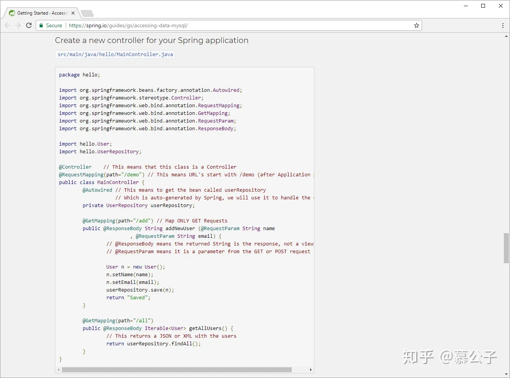

# Autowired 使用指南 

> 来源: https://zhuanlan.zhihu.com/p/92395282

## 1. 说明

最近公司升级框架，由原来的`spring framerwork 3.0`升级到`5.0`，然后写代码的时候突然发现idea在属性注入的**@Autowired**注解上给出警告提示，就像下面这样的，也挺懵逼的，毕竟这么写也很多年了。

> Field injection is not recommended


查阅了相关文档了解了一下，原来这个提示是`spring framerwork 4.0`以后开始出现的，spring 4.0开始就不推荐使用属性注入，改为推荐构造器注入和setter注入。

下面将展示了spring框架可以使用的不同类型的依赖注入，以及每种依赖注入的适用情况。

## 2. 依赖注入的类型

尽管针对`spring framerwork 5.1.3`的[文档](https://link.zhihu.com/?target=https%3A//docs.spring.io/spring/docs/5.1.3.RELEASE/spring-framework-reference/core.html%23beans-factory-collaborators)只定义了两种主要的依赖注入类型，但实际上有三种;

- 基于构造函数的依赖注入
- 基于setter的依赖注入
- 基于字段的依赖注入

其中`基于字段的依赖注入`被广泛使用，但是idea或者其他静态代码分析工具会给出提示信息，不推荐使用。

甚至可以在一些Spring官方指南中看到这种注入方法:



### 2.1 基于构造函数的依赖注入

在基于构造函数的依赖注入中，类构造函数被标注为**@Autowired**，并包含了许多与要注入的对象相关的参数。

```java
@Component
public class ConstructorBasedInjection {

    private final InjectedBean injectedBean;

    @Autowired
    public ConstructorBasedInjection(InjectedBean injectedBean) {
        this.injectedBean = injectedBean;
    }
}
```

然后在spring[官方文档](https://link.zhihu.com/?target=https%3A//docs.spring.io/spring/docs/5.0.3.RELEASE/spring-framework-reference/core.html%23beans-constructor-injection)中，**@Autowired**注解也是可以省去的（只有一个构造器适用时）。

```java
public class SimpleMovieLister {

    // the SimpleMovieLister has a dependency on a MovieFinder
    private MovieFinder movieFinder;

    // a constructor so that the Spring container can inject a MovieFinder
    public SimpleMovieLister(MovieFinder movieFinder) {
        this.movieFinder = movieFinder;
    }

    // business logic that actually uses the injected MovieFinder is omitted...
}
```

基于构造函数注入的主要优点是可以将需要注入的字段声明为**final**， 使得它们会在类实例化期间被初始化，这对于所需的依赖项很方便。


大意是：
从Spring Framework 4.3开始，如果目标bean只定义了一个构造函数，那么这样的构造函数上不再需要@Autowired注释。但是，如果有几个构造函数可用，那么至少必须用@Autowired注释一个构造函数，以便指示容器使用哪个构造函数。


### 2.2 基于Setter的依赖注入

在基于setter的依赖注入中，setter方法被标注为`@Autowired` 。一旦使用无参数构造函数或无参数静态工厂方法实例化Bean，为了注入Bean的依赖项，Spring容器将调用这些setter方法。

```java
@Component
public class SetterBasedInjection {

    private InjectedBean injectedBean;

    @Autowired
    public void setInjectedBean(InjectedBean injectedBean) {
        this.injectedBean = injectedBean;
    }
}
```

和基于构造器的依赖注入一样，在[官方文档](https://docs.spring.io/spring/docs/5.0.3.RELEASE/spring-framework-reference/core.html/beans-setter-injection)中，基于Setter的依赖注入中的`@Autowired` 也可以省去。

```java
public class SimpleMovieLister {

    // the SimpleMovieLister has a dependency on the MovieFinder
    private MovieFinder movieFinder;

    // a setter method so that the Spring container can inject a MovieFinder
    public void setMovieFinder(MovieFinder movieFinder) {
        this.movieFinder = movieFinder;
    }

    // business logic that actually uses the injected MovieFinder is omitted...
}
```


### 2.3 基于属性的依赖注入

在基于属性的依赖注入中，字段/属性被标注为`@Autowired` 。一旦类被实例化，Spring容器将设置这些字段。

```java
@Component
public class FieldBasedInjection {
    @Autowired
    private InjectedBean injectedBean;
}
```

正如所看到的，这是依赖注入最干净的方法，因为它避免了添加样板代码，并且不需要声明类的构造函数。代码看起来很干净简洁，但是正如代码检查器已经向我们暗示的那样，这种方法有一些缺点。

## 3. 基于字段的依赖注入缺陷

### 3.1 不允许声明不可变域

基于字段的依赖注入在声明为`final/immutable` 的字段上不起作用，因为这些字段必须在类实例化时实例化。声明不可变依赖项的惟一方法是使用基于构造器的依赖注入。

### 3.2 容易违反单一职责设计原则

在面向对象的编程中，五大设计原则[SOLID]被广泛应用，（国内一般为六大设计原则），用以提高代码的重用性，可读性，可靠性和可维护性

[S]在**SOLID**中代表单一职责原则，即即一个类应该只负责一项职责，这个类提供的所有服务都应该只为它负责的职责服务。

使用基于字段的依赖注入，高频使用的类随着时间的推移，我们会在类中逐渐添加越来越多的依赖项，我们用着很爽，很容易忽略类中的依赖已经太多了。但是如果使用基于构造函数的依赖注入，随着越来越多的依赖项被添加到类中，构造函数会变得越来越大，我们一眼就可以察觉到哪里不对劲。

有一个有超过10个参数的构造函数是一个明显的信号，表明类已经转变一个大而全的功能合集，需要将类分割成更小、更容易维护的块。

因此，尽管属性注入并不是破坏单一责任原则的直接原因，但它隐藏了信号，使我们很容易忽略这些信号。

### 3.3 与依赖注入容器紧密耦合

使用基于字段的依赖注入的主要原因是为了避免getter和setter的样板代码或为类创建构造函数。最后，这意味着设置这些字段的唯一方法是通过Spring容器实例化类并使用反射注入它们，否则字段将保持null。

依赖注入设计模式将类依赖项的创建与类本身分离开来，并将此责任转移到类注入容器，从而允许程序设计解耦，并遵循单一职责和依赖项倒置原则(同样可靠)。因此，通过自动装配（autowiring）字段来实现的类的解耦，最终会因为再次与类注入容器(在本例中是Spring)耦合而丢失，从而使类在Spring容器之外变得无用。

这意味着，如果您想在应用程序容器之外使用您的类，例如用于单元测试，您将被迫使用Spring容器来实例化您的类，因为没有其他可能的方法(除了反射)来设置自动装配字段。

### 3.4 隐藏依赖关系

在使用依赖注入时，受影响的类应该使用公共接口清楚地公开这些依赖项，方法是在构造函数中公开所需的依赖项，或者使用方法(setter)公开可选的依赖项。当使用基于字段的依赖注入时，实质上是将这些依赖对外隐藏了。

## 4. 总结

我们已经看到，基于字段的注入应该尽可能地避免，因为它有许多缺点，无论它看起来多么优雅。推荐的方法是使用基于构造函数和基于setter的依赖注入。对于必需的依赖，建议使用基于构造函数的注入，设置它们为不可变的，并防止它们为null。对于可选的依赖项，建议使用基于setter的注入。