[[TOC]]


# 数组和切片

内容主要来自[数组Array - 地鼠文档 (topgoer.cn)](https://www.topgoer.cn/docs/golang/chapter03-9)，[切片Slice - 地鼠文档 (topgoer.cn)](https://www.topgoer.cn/docs/golang/chapter03-10)，辅以本人微微的更改。


## 数组

Golang Array和以往认知的数组有很大不同。

1. 数组：是同一种数据类型的固定长度的序列。
2. 数组定义：var a [len]int，比如：var a [5]int，数组长度必须是常量，且是类型的组成部分。一旦定义，长度不能变。
3. 长度是数组类型的一部分，因此，var a[5] int和var a[10]int是不同的类型。
4. 数组可以通过下标进行访问，下标是从0开始，最后一个元素下标是：len-1
for i := 0; i < len(a); i++ {
}
for index, v := range a {
}
5. 访问越界，如果下标在数组合法范围之外，则触发访问越界，会panic
6. 数组是值类型，赋值和传参会复制整个数组，而不是指针。因此改变副本的值，不会改变本身的值。
7.支持 "=="、"!=" 操作符，因为内存总是被初始化过的。
8.指针数组 [n]*T，数组指针 *[n]T。


### 数组初始化

#### 一维数组：

```go
// 全局：
var arr0 [5]int = [5]int{1, 2, 3}
var arr1 = [5]int{1, 2, 3, 4, 5}
var arr2 = [...]int{1, 2, 3, 4, 5, 6}
var str = [5]string{3: "hello world", 4: "tom"}
// 局部：
a := [3]int{1, 2}           // 未初始化元素值为 0。
b := [...]int{1, 2, 3, 4}   // 通过初始化值确定数组长度。
c := [5]int{2: 100, 4: 200} // 使用索引号初始化元素。
d := [...]struct {
    name string
    age  uint8
}{
    {"user1", 10}, // 可省略元素类型。
    {"user2", 20}, // 别忘了最后一行的逗号。
}
```

:::details 查看代码

```go
package main

import (
    "fmt"
)

var arr0 [5]int = [5]int{1, 2, 3}
var arr1 = [5]int{1, 2, 3, 4, 5}
var arr2 = [...]int{1, 2, 3, 4, 5, 6}
var str = [5]string{3: "hello world", 4: "tom"}

func main() {
    a := [3]int{1, 2}           // 未初始化元素值为 0。
    b := [...]int{1, 2, 3, 4}   // 通过初始化值确定数组长度。
    c := [5]int{2: 100, 4: 200} // 使用引号初始化元素。
    d := [...]struct {
        name string
        age  uint8
    }{
        {"user1", 10}, // 可省略元素类型。
        {"user2", 20}, // 别忘了最后一行的逗号。
    }
    fmt.Println(arr0, arr1, arr2, str)
    fmt.Println(a, b, c, d)
}
```

输出结果:

```shell
[1 2 3 0 0] [1 2 3 4 5] [1 2 3 4 5 6] [   hello world tom]
[1 2 0] [1 2 3 4] [0 0 100 0 200] [{user1 10} {user2 20}]
```

:::

#### 多维数组

```go
// 全局
var arr0 [5][3]int
var arr1 [2][3]int = [...][3]int{{1, 2, 3}, {7, 8, 9}}
// 局部：
a := [2][3]int{{1, 2, 3}, {4, 5, 6}}
b := [...][2]int{{1, 1}, {2, 2}, {3, 3}} // 第 2 纬度不能用 "..."。
```

:::details 查看代码：

```go
package main

import (
    "fmt"
)

var arr0 [5][3]int
var arr1 [2][3]int = [...][3]int{{1, 2, 3}, {7, 8, 9}}

func main() {
    a := [2][3]int{{1, 2, 3}, {4, 5, 6}}
    b := [...][2]int{{1, 1}, {2, 2}, {3, 3}} // 第 2 纬度不能用 "..."。
    fmt.Println(arr0, arr1)
    fmt.Println(a, b)
}
```

输出结果：

```
[[0 0 0] [0 0 0] [0 0 0] [0 0 0] [0 0 0]] [[1 2 3] [7 8 9]]
[[1 2 3] [4 5 6]] [[1 1] [2 2] [3 3]]
```

:::

* 值拷贝行为会造成性能问题，通常会建议使用 slice，或数组指针。

:::details 查看代码
```go
package main

import (
    "fmt"
)

func test(x [2]int) {
    fmt.Printf("x: %p\n", &x)
    x[1] = 1000
}

func main() {
    a := [2]int{}
    fmt.Printf("a: %p\n", &a)

    test(a)
    fmt.Println(a)
}
```

输出结果:

```shell
a: 0xc42007c010
x: 0xc42007c030
[0 0]
```

::: 

* 内置函数 len 和 cap 都返回数组长度 (元素数量)。

:::details 查看代码
```go
package main

func main() {
    a := [2]int{}
    println(len(a), cap(a)) 
}
```

输出结果：

```
2 2
```

:::

#### 多维数组遍历：

:::details 查看代码
```go
package main

import (
    "fmt"
)

func main() {

    var f [2][3]int = [...][3]int{{1, 2, 3}, {7, 8, 9}}

    for k1, v1 := range f {
        for k2, v2 := range v1 {
            fmt.Printf("(%d,%d)=%d ", k1, k2, v2)
        }
        fmt.Println()
    }
}
```

输出结果：

```shell
(0,0)=1 (0,1)=2 (0,2)=3 
(1,0)=7 (1,1)=8 (1,2)=9 
```

:::

### 数组拷贝和传参

:::details 查看代码
```go
package main

import "fmt"

func printArr(arr *[5]int) {
    arr[0] = 10
    for i, v := range arr {
        fmt.Println(i, v)
    }
}

func main() {
    var arr1 [5]int
    printArr(&arr1)
    fmt.Println(arr1)
    arr2 := [...]int{2, 4, 6, 8, 10}
    printArr(&arr2)
    fmt.Println(arr2)
}
```

输出结果

```shell
0 10
1 0
2 0
3 0
4 0
[10 0 0 0 0]
0 10
1 4
2 6
3 8
4 10
[10 4 6 8 10]
```

:::

### 数组练习

#### 求数组所有元素之和
:::details 查看代码
```go
package main

import (
    "fmt"
    "math/rand"
    "time"
)

// 求元素和
func sumArr(a [10]int) int {
    var sum int = 0
    for i := 0; i < len(a); i++ {
        sum += a[i]
    }
    return sum
}

func main() {
    // 若想做一个真正的随机数，要种子
    // seed()种子默认是1
    //rand.Seed(1)
    rand.Seed(time.Now().Unix())

    var b [10]int
    for i := 0; i < len(b); i++ {
        // 产生一个0到1000随机数
        b[i] = rand.Intn(1000)
    }
    sum := sumArr(b)
    fmt.Printf("sum=%d\n", sum)
}
```

:::

#### 找出数组中和为给定值的两个元素的下标，例如数组[1,3,5,8,7]，找出两个元素之和等于8的下标分别是（0，4）和（1，2）

:::details 查看代码
<CodeGroup>
<CodeGroupItem title="原文档的代码" active>

```go
package main

import "fmt"

func myTest(a [5]int, target int) {
    // 遍历数组
    for i := 0; i < len(a); i++ {
        other := target - a[i]
        // 继续遍历
        for j := i + 1; j < len(a); j++ {
            if a[j] == other {
                fmt.Printf("(%d,%d)\n", i, j)
            }
        }
    }
}

func main() {
    b := [5]int{1, 3, 5, 8, 7}
    myTest(b, 8)
}
```
</CodeGroupItem>
<CodeGroupItem title='我的代码'>

```go
package main

import "fmt"

func twoSum(a [5]int, target int) {
	// 需要的差值 需要该差值的索引
	need := make(map[int]int, 0)
	ans := make(map[int]int, 0)
	var num int
	for i := 0; i < len(a); i++ {
		num = a[i]
		if v, ok := need[num]; ok {
			ans[i] = v
		} else {
			need[target-num] = i
		}
	}
	fmt.Println(ans)
}

func main() {
	b := [5]int{1, 3, 5, 8, 7}
	twoSum(b, 8)
}

// map[2:1 4:0]
```

</CodeGroupItem>
</CodeGroup>

:::


## 切片


需要说明，slice 并不是数组或数组指针。它通过内部指针和相关属性引用数组片段，以实现变长方案。


1. 切片：切片是数组的一个引用，因此切片是引用类型。但自身是结构体，值拷贝传递。
2. 切片的长度可以改变，因此，切片是一个可变的数组。
3. 切片遍历方式和数组一样，可以用`len()`求长度。表示可用元素数量，读写操作不能超过该限制。 
4. cap可以求出slice最大扩张容量，不能超出数组限制。`0 <= len(slice) <= len(array)`，其中array是slice引用的数组。
5. 切片的定义：`var 变量名 []类型`，比如 `var str []string  `。
6. 如果 `slice == nil`，那么 len、cap 结果都等于 0。


### 创建切片的各种方式

```go
package main

import "fmt"

func main() {
   //1.声明切片
   var s1 []int
   if s1 == nil {
      fmt.Println("是空")
   } else {
      fmt.Println("不是空")
   }
   // 2.:=
   s2 := []int{}
   // 3.make()
   var s3 []int = make([]int, 0)
   fmt.Println(s1, s2, s3)
   // 4.初始化赋值
   var s4 []int = make([]int, 0, 0)
   fmt.Println(s4)
   s5 := []int{1, 2, 3}
   fmt.Println(s5)
   // 5.从数组切片
   arr := [5]int{1, 2, 3, 4, 5}
   var s6 []int
   // 前包后不包
   s6 = arr[1:4]
   fmt.Println(s6)
}
```

#### 利用数组来创建

```go
全局：
var arr = [...]int{0, 1, 2, 3, 4, 5, 6, 7, 8, 9}
var slice0 []int = arr[start:end] 
var slice1 []int = arr[:end]        
var slice2 []int = arr[start:]        
var slice3 []int = arr[:] 
var slice4 = arr[:len(arr)-1]      //去掉切片的最后一个元素
局部：
arr2 := [...]int{9, 8, 7, 6, 5, 4, 3, 2, 1, 0}
slice5 := arr[start:end]
slice6 := arr[:end]        
slice7 := arr[start:]     
slice8 := arr[:]  
slice9 := arr[:len(arr)-1] //去掉切片的最后一个元素
```


:::details 查看代码

```go
package main

import (
    "fmt"
)

var arr = [...]int{0, 1, 2, 3, 4, 5, 6, 7, 8, 9}
var slice0 []int = arr[2:8]
var slice1 []int = arr[0:6]        //可以简写为 var slice []int = arr[:end]
var slice2 []int = arr[5:10]       //可以简写为 var slice[]int = arr[start:]
var slice3 []int = arr[0:len(arr)] //var slice []int = arr[:]
var slice4 = arr[:len(arr)-1]      //去掉切片的最后一个元素
func main() {
    fmt.Printf("全局变量：arr %v\n", arr)
    fmt.Printf("全局变量：slice0 %v\n", slice0)
    fmt.Printf("全局变量：slice1 %v\n", slice1)
    fmt.Printf("全局变量：slice2 %v\n", slice2)
    fmt.Printf("全局变量：slice3 %v\n", slice3)
    fmt.Printf("全局变量：slice4 %v\n", slice4)
    fmt.Printf("-----------------------------------\n")
    arr2 := [...]int{9, 8, 7, 6, 5, 4, 3, 2, 1, 0}
    slice5 := arr[2:8]
    slice6 := arr[0:6]         //可以简写为 slice := arr[:end]
    slice7 := arr[5:10]        //可以简写为 slice := arr[start:]
    slice8 := arr[0:len(arr)]  //slice := arr[:]
    slice9 := arr[:len(arr)-1] //去掉切片的最后一个元素
    fmt.Printf("局部变量： arr2 %v\n", arr2)
    fmt.Printf("局部变量： slice5 %v\n", slice5)
    fmt.Printf("局部变量： slice6 %v\n", slice6)
    fmt.Printf("局部变量： slice7 %v\n", slice7)
    fmt.Printf("局部变量： slice8 %v\n", slice8)
    fmt.Printf("局部变量： slice9 %v\n", slice9)
}
```

输出结果：

```shell
全局变量：arr [0 1 2 3 4 5 6 7 8 9]
全局变量：slice0 [2 3 4 5 6 7]
全局变量：slice1 [0 1 2 3 4 5]
全局变量：slice2 [5 6 7 8 9]
全局变量：slice3 [0 1 2 3 4 5 6 7 8 9]
全局变量：slice4 [0 1 2 3 4 5 6 7 8]
-----------------------------------
局部变量： arr2 [9 8 7 6 5 4 3 2 1 0]
局部变量： slice5 [2 3 4 5 6 7]
局部变量： slice6 [0 1 2 3 4 5]
局部变量： slice7 [5 6 7 8 9]
局部变量： slice8 [0 1 2 3 4 5 6 7 8 9]
局部变量： slice9 [0 1 2 3 4 5 6 7 8]
```

:::

#### 通过make来创建

```go
var slice []type = make([]type, len)
slice  := make([]type, len)
slice  := make([]type, len, cap)
```

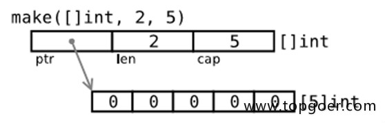

:::details 查看代码

```go
package main

import (
    "fmt"
)

var slice0 []int = make([]int, 10)
var slice1 = make([]int, 10)
var slice2 = make([]int, 10, 10)

func main() {
    fmt.Printf("make全局slice0 ：%v\n", slice0)
    fmt.Printf("make全局slice1 ：%v\n", slice1)
    fmt.Printf("make全局slice2 ：%v\n", slice2)
    fmt.Println("--------------------------------------")
    slice3 := make([]int, 10)
    slice4 := make([]int, 10)
    slice5 := make([]int, 10, 10)
    fmt.Printf("make局部slice3 ：%v\n", slice3)
    fmt.Printf("make局部slice4 ：%v\n", slice4)
    fmt.Printf("make局部slice5 ：%v\n", slice5)
}
```

输出结果：

```
    make全局slice0 ：[0 0 0 0 0 0 0 0 0 0]
    make全局slice1 ：[0 0 0 0 0 0 0 0 0 0]
    make全局slice2 ：[0 0 0 0 0 0 0 0 0 0]
    --------------------------------------
    make局部slice3 ：[0 0 0 0 0 0 0 0 0 0]
    make局部slice4 ：[0 0 0 0 0 0 0 0 0 0]
    make局部slice5 ：[0 0 0 0 0 0 0 0 0 0]
```
:::

#### 直接创建 slice 对象，自动分配底层数组。

```go
package main

import "fmt"

func main() {
    s1 := []int{0, 1, 2, 3, 8: 100} // 通过初始化表达式构造，可使用索引号。
    fmt.Println(s1, len(s1), cap(s1))

    s2 := make([]int, 6, 8) // 使用 make 创建，指定 len 和 cap 值。
    fmt.Println(s2, len(s2), cap(s2))

    s3 := make([]int, 6) // 省略 cap，相当于 cap = len。
    fmt.Println(s3, len(s3), cap(s3))
}
```

输出结果:

```
    [0 1 2 3 0 0 0 0 100] 9 9
    [0 0 0 0 0 0] 6 8
    [0 0 0 0 0 0] 6 6
```

使用 make 动态创建slice，避免了数组必须用常量做长度的麻烦。还可用指针直接访问底层数组，退化成普通数组操作。

::: details 查看代码
```go
package main

import "fmt"

func main() {
    s := []int{0, 1, 2, 3}
    p := &s[2] // *int, 获取底层数组元素指针。
    *p += 100

    fmt.Println(s)
}
```

输出结果:

```
    [0 1 102 3]
```

:::

至于 ` [][]T `，是指元素类型为 ` []T `。

::: details 查看代码
```go
package main

import (
    "fmt"
)

func main() {
    data := [][]int{
        []int{1, 2, 3},
        []int{100, 200},
        []int{11, 22, 33, 44},
    }
    fmt.Println(data)
}
```

输出结果：

```
    [[1 2 3] [100 200] [11 22 33 44]]
```

::: 

可直接修改 struct array/slice 成员。

::: details 查看代码
```go
package main

import (
    "fmt"
)

func main() {
    d := [5]struct {
        x int
    }{}

    s := d[:]

    d[1].x = 10
    s[2].x = 20

    fmt.Println(d)
    fmt.Printf("%p, %p\n", &d, &d[0])

}
```

输出结果:

```
    [{0} {10} {20} {0} {0}]
    0xc4200160f0, 0xc4200160f0
```

::: 

### 切片的内存布局

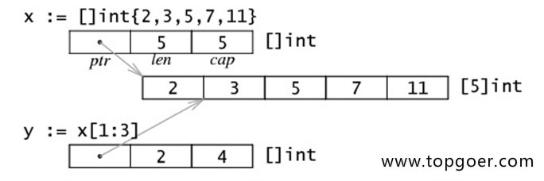

读写操作实际目标是底层数组，只需注意索引号的差别。

::: details 查看代码
```go
package main

import (
    "fmt"
)

func main() {
    data := [...]int{0, 1, 2, 3, 4, 5}

    s := data[2:4]
    s[0] += 100
    s[1] += 200

    fmt.Println(s)
    fmt.Println(data)
}
```

输出:

```shell
    [102 203]
    [0 1 102 203 4 5]
```

::: 

### 查

* 使用索引下标
> 索引下标大于切片的`len`，可以过编译，但是会报**运行时错误**。

:::details 查看代码

```go
package main

import "fmt"

func main() {
	s := []int{1, 2, 3, 4}
	fmt.Println(s)
	fmt.Println(s[0])
	fmt.Println(s[4]) // panic: runtime error: index out of range [4] with length 4

}
```
:::

* 检查一个元素是否在切片中
> `Go`中并没有直接提供函数判断，我们可以使用遍历操作

* 检查切片是否为空
:::details 查看代码
```go
ss := []int{}
if len(ss) == 0 {
    fmt.Println(ss)
}

```
:::


* slice遍历：

:::details 查看代码
```go
package main

import (
    "fmt"
)

func main() {

    data := [...]int{0, 1, 2, 3, 4, 5, 6, 7, 8, 9}
    slice := data[:]
    for index, value := range slice {
        fmt.Printf("index : %v , value : %v\n", index, value)
    }

}
```

输出结果：

```
index : 0 , value : 0
index : 1 , value : 1
index : 2 , value : 2
index : 3 , value : 3
index : 4 , value : 4
index : 5 , value : 5
index : 6 , value : 6
index : 7 , value : 7
index : 8 , value : 8
index : 9 , value : 9
```
:::

### 改

* 普通的改

:::details 查看代码
```go
package main

import "fmt"

func main() {
	s := []int{1, 2, 3, 4}
	fmt.Println(s)
	s[0] = 99
	fmt.Println(s)
}

```
:::


* 切片resize（调整大小）

:::details 查看代码
```go
package main

import (
    "fmt"
)

func main() {
    var a = []int{1, 3, 4, 5}
    fmt.Printf("slice a : %v , len(a) : %v\n", a, len(a))
    b := a[1:2]
    fmt.Printf("slice b : %v , len(b) : %v\n", b, len(b))
    c := b[0:3]
    fmt.Printf("slice c : %v , len(c) : %v\n", c, len(c))
}
```

输出结果：

```
slice a : [1 3 4 5] , len(a) : 4
slice b : [3] , len(b) : 1
slice c : [3 4 5] , len(c) : 3
```

:::

### 删
> `Go`中并没有直接提供函数删除，我们可以直接使用索引下标手动切
:::details 查看代码
```go
package main

import "fmt"

func main() {
	s := []int{1, 2, 3, 4}
	fmt.Println(s)

	s = append(s[:2], s[3:]...) // 删除索引为2的元素
	fmt.Println(s)

	s = s[:len(s)-1] // 删除最后一个元素
	fmt.Println(s)

	s = s[1:] // 删除第一个元素
	fmt.Println(s)
}

```

结果
```shell
[1 2 3 4]
[1 2 4]
[1 2]
[2]
```
:::

### 增


* 用append内置函数操作切片（切片追加）

:::details 查看代码
```go
package main

import (
    "fmt"
)

func main() {

    var a = []int{1, 2, 3}
    fmt.Printf("slice a : %v\n", a)
    var b = []int{4, 5, 6}
    fmt.Printf("slice b : %v\n", b)
    c := append(a, b...)
    fmt.Printf("slice c : %v\n", c)
    d := append(c, 7)
    fmt.Printf("slice d : %v\n", d)
    e := append(d, 8, 9, 10)
    fmt.Printf("slice e : %v\n", e)

}
```

输出结果：

```
    slice a : [1 2 3]
    slice b : [4 5 6]
    slice c : [1 2 3 4 5 6]
    slice d : [1 2 3 4 5 6 7]
    slice e : [1 2 3 4 5 6 7 8 9 10]
```

:::

* append ：向 slice 尾部添加数据，返回新的 slice 对象。

:::details 查看代码
```go
package main

import (
    "fmt"
)

func main() {

    s1 := make([]int, 0, 5)
    fmt.Printf("%p\n", &s1)

    s2 := append(s1, 1)
    fmt.Printf("%p\n", &s2)

    fmt.Println(s1, s2)

}
```

输出结果：

```
0xc42000a060
0xc42000a080
[] [1]
```
:::

* 超出原 slice.cap 限制，就会重新分配底层数组，即便原数组并未填满。

:::details 查看代码
```go
package main

import (
	"fmt"
)

func main() {

	data := [...]int{0, 1, 2, 3, 4, 10: 0}
	fmt.Println(data)
	s := data[:2:3]
	fmt.Printf("len(s) = %d, cap(s) = %d, s = %v \r\n", len(s), cap(s), s)

	s = append(s, 100, 200) // 一次 append 两个值，超出 s.cap 限制。

	fmt.Println(s, data)         // 重新分配底层数组，与原数组无关。
	fmt.Println(&s[0], &data[0]) // 比对底层数组起始指针。
	fmt.Printf("len(s) = %d, cap(s) = %d, s = %v \r\n", len(s), cap(s), s)

}

}
```

输出结果:

```
[0 1 2 3 4 0 0 0 0 0 0]
len(s) = 2, cap(s) = 3, s = [0 1] 
[0 1 100 200] [0 1 2 3 4 0 0 0 0 0 0]
0xc00000a4b0 0xc00001e0c0
len(s) = 4, cap(s) = 6, s = [0 1 100 200]
```

从输出结果可以看出，append 后的 s 重新分配了底层数组，并复制数据。如果只追加一个值，则不会超过 s.cap 限制，也就不会重新分配。
在大批量添加数据时，建议一次性分配足够大的空间，以减少内存分配和数据复制开销。或初始化足够长的 len 属性，改用索引号进行操作。及时释放不再使用的 slice 对象，避免持有过期数组，造成 GC 无法回收。
:::


* slice中cap重新分配规律：

:::details 查看代码
```go
package main

import (
    "fmt"
)

func main() {

    s := make([]int, 0, 1)
    c := cap(s)

    for i := 0; i < 50; i++ {
        s = append(s, i)
        if n := cap(s); n > c {
            fmt.Printf("cap: %d -> %d\n", c, n)
            c = n
        }
    }

}
```

输出结果:

```
cap: 1 -> 2
cap: 2 -> 4
cap: 4 -> 8
cap: 8 -> 16
cap: 16 -> 32
cap: 32 -> 64
```

:::

* 切片拷贝

:::details 查看代码
```go
package main

import (
    "fmt"
)

func main() {

    s1 := []int{1, 2, 3, 4, 5}
    fmt.Printf("slice s1 : %v\n", s1)
    s2 := make([]int, 10)
    fmt.Printf("slice s2 : %v\n", s2)
    copy(s2, s1)
    fmt.Printf("copied slice s1 : %v\n", s1)
    fmt.Printf("copied slice s2 : %v\n", s2)
    s3 := []int{1, 2, 3}
    fmt.Printf("slice s3 : %v\n", s3)
    s3 = append(s3, s2...)
    fmt.Printf("appended slice s3 : %v\n", s3)
    s3 = append(s3, 4, 5, 6)
    fmt.Printf("last slice s3 : %v\n", s3)

}
```

输出结果：

```
slice s1 : [1 2 3 4 5]
slice s2 : [0 0 0 0 0 0 0 0 0 0]
copied slice s1 : [1 2 3 4 5]
copied slice s2 : [1 2 3 4 5 0 0 0 0 0]
slice s3 : [1 2 3]
appended slice s3 : [1 2 3 1 2 3 4 5 0 0 0 0 0]
last slice s3 : [1 2 3 1 2 3 4 5 0 0 0 0 0 4 5 6]
```
:::

* copy ：函数 copy 在两个 slice 间复制数据，复制长度以 len 小的为准。两个 slice 可指向同一底层数组，允许元素区间重叠。
:::details 查看代码

```go
package main

import (
    "fmt"
)

func main() {

    data := [...]int{0, 1, 2, 3, 4, 5, 6, 7, 8, 9}
    fmt.Println("array data : ", data)
    s1 := data[8:]
    s2 := data[:5]
    fmt.Printf("slice s1 : %v\n", s1)
    fmt.Printf("slice s2 : %v\n", s2)
    copy(s2, s1)
    fmt.Printf("copied slice s1 : %v\n", s1)
    fmt.Printf("copied slice s2 : %v\n", s2)
    fmt.Println("last array data : ", data)

}
```

输出结果:

```
array data :  [0 1 2 3 4 5 6 7 8 9]
slice s1 : [8 9]
slice s2 : [0 1 2 3 4]
copied slice s1 : [8 9]
copied slice s2 : [8 9 2 3 4]
last array data :  [8 9 2 3 4 5 6 7 8 9]
```

应及时将所需数据 copy 到较小的 slice，以便释放超大号底层数组内存。

:::

## 扩展

### 字符串和切片（string and slice）

string底层就是一个byte的数组，因此，也可以进行切片操作。

::: details 查看代码
```go
package main

import (
    "fmt"
)

func main() {
    str := "hello world"
    s1 := str[0:5]
    fmt.Println(s1)

    s2 := str[6:]
    fmt.Println(s2)
}
```

输出结果：

```
hello
world
```
:::

string本身是不可变的，因此要改变string中间字符。需要先转化为`[]byte`切片再操作。

::: details 查看代码
```go
package main

import (
    "fmt"
)

func main() {
    str := "Hello world"
    s := []byte(str) //中文字符需要用[]rune(str)
    s[6] = 'G'
    s = s[:8]
    s = append(s, '!')
    str = string(s)
    fmt.Println(str)
}
```

输出结果：

```
    Hello Go!
```
:::

### 含有中文字符串：

```go
package main

import (
    "fmt"
)

func main() {
    str := "你好，世界！hello world！"
    s := []rune(str) 
    s[3] = '够'
    s[4] = '浪'
    s[12] = 'g'
    s = s[:14]
    str = string(s)
    fmt.Println(str)
}
```

输出结果：

```
你好，够浪！hello go
```

### slice `data[:6:8]` 两个冒号的理解

常规slice , `data[6:8]`，从第6位到第8位（返回6， 7），长度len为2， 最大可扩充长度cap为4（6-9）

另一种写法： `data[:6:8]` 每个数字前都有个冒号， slice内容为data从0到第6位，长度len为6，最大扩充项cap设置为8

`a[x:y:z]` 切片内容 `[x:y]` 切片长度:` y-x` 切片容量:`z-x`

::: details 查看代码
```go
package main

import (
    "fmt"
)

func main() {
    slice := []int{0, 1, 2, 3, 4, 5, 6, 7, 8, 9}
    d1 := slice[6:8]
    fmt.Println(d1, len(d1), cap(d1))
    d2 := slice[:6:8]
    fmt.Println(d2, len(d2), cap(d2))
}
```

输出结果
```shell
[6 7] 2 4
[0 1 2 3 4 5] 6 8
```
:::

### 数组or切片转字符串：

:::details 查看代码
```go
package main

import (
	"fmt"
	"strings"
)

func main() {
	a := [...]int{1, 2, 3, 4, 5}
	fmt.Println(a)
	fmt.Println(strings.Trim(fmt.Sprint(a), "[]"))
	fmt.Println(
		// func strings.Replace(s string, old string, new string, n int) string
		strings.Replace(
			strings.Trim(fmt.Sprint(a), "[]"),
			" ", "-", -1))
}

```

输出
```shell
[1 2 3 4 5]
1 2 3 4 5
1-2-3-4-5
```
:::


## slice的源码

[go/slice.go at master · golang/go (github.com)](https://github.com/golang/go/blob/master/src/runtime/slice.go)


## slice的底层实现

切片是 Go 中的一种基本的数据结构，使用这种结构可以用来管理数据集合。切片的设计想法是由动态数组概念而来，为了开发者可以更加方便的使一个数据结构可以自动增加和减少。但是切片本身并不是动态数据或者数组指针。切片常见的操作有 reslice、append、copy。与此同时，切片还具有可索引，可迭代的优秀特性。

### 切片和数组


关于切片和数组怎么选择？接下来好好讨论讨论这个问题。

在 Go 中，与 C 数组变量隐式作为指针使用不同，Go 数组是值类型，赋值和函数传参操作都会复制整个数组数据。

::: details 查看代码

```go
func main() {
    arrayA := [2]int{100, 200}
    var arrayB [2]int

    arrayB = arrayA

    fmt.Printf("arrayA : %p , %v\n", &arrayA, arrayA)
    fmt.Printf("arrayB : %p , %v\n", &arrayB, arrayB)

    testArray(arrayA)
}

func testArray(x [2]int) {
    fmt.Printf("func Array : %p , %v\n", &x, x)
}
```

打印结果：

```
    arrayA : 0xc4200bebf0 , [100 200]
    arrayB : 0xc4200bec00 , [100 200]
    func Array : 0xc4200bec30 , [100 200]
```

:::

::: tip 提示

可以看到，三个内存地址都不同，这也就验证了 Go 中数组赋值和函数传参都是**值传递**的。那这会导致什么问题呢？

:::

假想每次传参都用数组，那么每次数组都要被复制一遍。如果数组大小有 100万，在64位机器上就需要花费大约 800W 字节，即 8MB 内存。这样会消耗掉大量的内存。于是乎有人想到，函数传参用数组的指针。

:::details 查看代码

```go
func main() {
    arrayA := []int{100, 200}
    testArrayPoint(&arrayA)   // 1.传数组指针
    arrayB := arrayA[:]
    testArrayPoint(&arrayB)   // 2.传切片
    fmt.Printf("arrayA : %p , %v\n", &arrayA, arrayA)
}

func testArrayPoint(x *[]int) {
    fmt.Printf("func Array : %p , %v\n", x, *x)
    (*x)[1] += 100
}
```

打印结果：

```shell
    func Array : 0xc4200b0140 , [100 200]
    func Array : 0xc4200b0180 , [100 300]
    arrayA : 0xc4200b0140 , [100 400]
```

:::


这也就证明了数组指针确实到达了我们想要的效果。现在就算是传入10亿的数组，也只需要再栈上分配一个8个字节的内存给指针就可以了。这样更加高效的利用内存，性能也比之前的好。

::: warning  注意 

不过传指针会有一个弊端，从打印结果可以看到，第一行和第三行指针地址都是同一个，万一原数组的指针指向更改了，那么函数里面的指针指向都会跟着更改。

:::

切片的优势也就表现出来了。用切片传数组参数，既可以达到节约内存的目的，也可以达到合理处理好共享内存的问题。打印结果第二行就是切片，切片的指针和原来数组的指针是不同的。

* 由此我们可以得出结论：

> 把第一个大数组传递给函数会消耗很多内存，采用切片的方式传参可以避免上述问题。切片是**引用传递**，所以它们不需要使用额外的内存并且比使用数组更有效率。


但是，依旧有反例。

:::tip 性能测试的温馨提示

`go benchmark`性能测试的文件名需要以`_test.go`结尾，且进行测试的函数名要以`Benchmark`开头。 

:::


::: details 查看细节

```go
package main

import "testing"

func array() [1024]int {
    var x [1024]int
    for i := 0; i < len(x); i++ {
        x[i] = i
    }
    return x
}

func slice() []int {
    x := make([]int, 1024)
    for i := 0; i < len(x); i++ {
        x[i] = i
    }
    return x
}

func BenchmarkArray(b *testing.B) {
    for i := 0; i < b.N; i++ {
        array()
    }
}

func BenchmarkSlice(b *testing.B) {
    for i := 0; i < b.N; i++ {
        slice()
    }
}
```

我们做一次性能测试，并且禁用内联和优化，来观察切片的堆上内存分配的情况。

```shell
go test -bench . -benchmem -gcflags "-N -l"
```

输出结果比较“令人意外”：

```
goos: windows
goarch: amd64
pkg: github.com/csDeng/gostudy/01_study/basic/array_slice/slice/src
cpu: Intel(R) Core(TM) i5-8265U CPU @ 1.60GHz
BenchmarkArray-8          450879              2665 ns/op               0 B/op          0 allocs/op
BenchmarkSlice-8          275074              4085 ns/op            8192 B/op          1 allocs/op
PASS
ok      github.com/csDeng/gostudy/01_study/basic/array_slice/slice/src  3.228s
```

:::


解释一下上述结果，在测试 Array 的时候，用的是8核，循环次数是45_0879，平均每次执行时间是2665 ns，每次执行堆上分配内存总量是0，分配次数也是0 。

而切片的结果就“差”一点，同样也是用的是8核，循环次数是27_5074，平均每次执行时间是4085 ns，但是每次执行一次，堆上分配内存总量是8192，分配次数也是1 。

这样对比看来，并非所有时候都适合用切片代替数组，因为切片底层数组可能会在堆上分配内存，而且小数组在栈上拷贝的消耗也未必比make 消耗大。

### 切片的数据结构

切片本身并不是动态数组或者数组指针。它内部实现的数据结构通过指针引用底层数组，设定相关属性将数据读写操作限定在指定的区域内。切片本身是一个只读对象，其工作机制类似数组指针的一种封装。

切片（slice）是对数组一个连续片段的引用，所以切片是一个引用类型（因此更类似于 C/C++ 中的数组类型，或者 Python 中的 list 类型）。这个片段可以是整个数组，或者是由起始和终止索引标识的一些项的子集。需要注意的是，终止索引标识的项不包括在切片内。切片提供了一个与指向数组的动态窗口。

给定项的切片索引可能比相关数组的相同元素的索引小。和数组不同的是，切片的长度可以在运行时修改，最小为 0 最大为相关数组的长度：切片是一个长度可变的数组。

Slice 的数据结构定义如下:

```go
type slice struct {
    array unsafe.Pointer
    len   int
    cap   int
}
```

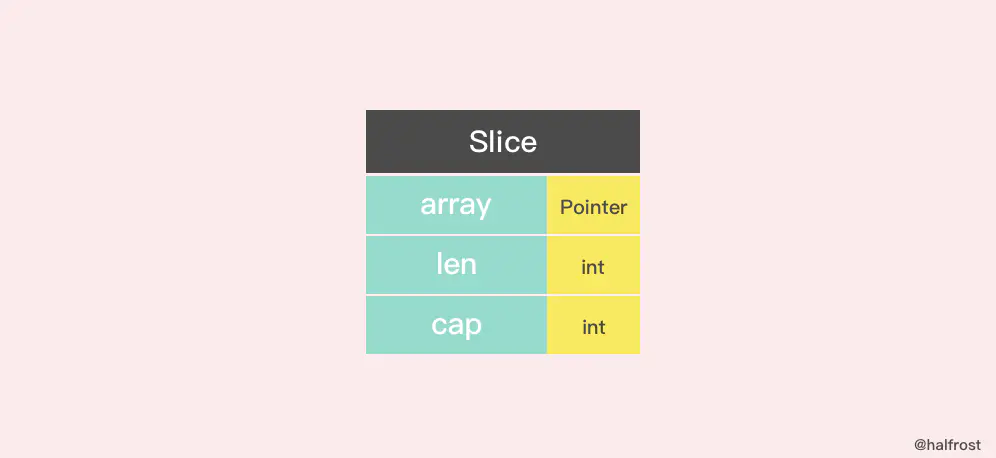

切片的结构体由3部分构成，Pointer 是指向一个数组的指针，len 代表当前切片的长度，cap 是当前切片的容量。cap 总是大于等于 len 的。

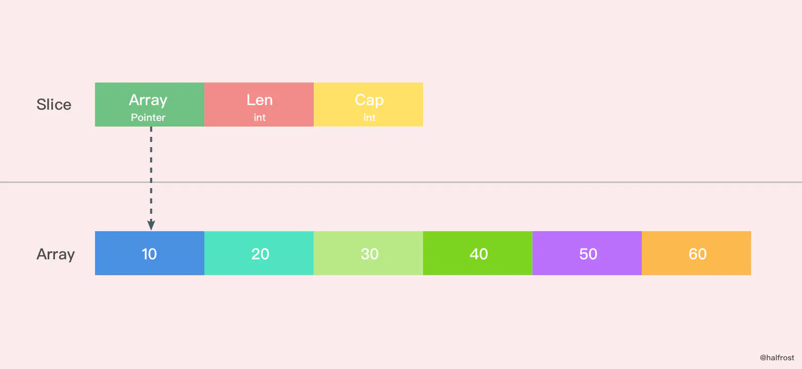

如果想从 slice 中得到一块内存地址，可以这样做：

```go
s := make([]byte, 200)
ptr := unsafe.Pointer(&s[0])
```

如果反过来呢？从 Go 的内存地址中构造一个 slice。

```go
var ptr unsafe.Pointer
var s1 = struct {
    addr uintptr
    len int
    cap int
}{ptr, length, length}
s := *(*[]byte)(unsafe.Pointer(&s1))
```

构造一个虚拟的结构体，把 slice 的数据结构拼出来。

当然还有更加直接的方法，在 Go 的反射中就存在一个与之对应的数据结构 SliceHeader，我们可以用它来构造一个 slice

```go
    var o []byte
    sliceHeader := (*reflect.SliceHeader)((unsafe.Pointer(&o)))
    sliceHeader.Cap = length
    sliceHeader.Len = length
    sliceHeader.Data = uintptr(ptr)
```

### 创建切片

make 函数允许在运行期动态指定数组长度，绕开了数组类型必须使用编译期常量的限制。

创建切片有两种形式，make 创建切片，空切片。

#### make 和切片字面量

```go
func makeslice(et *_type, len, cap int) slice {
    // 根据切片的数据类型，获取切片的最大容量
    maxElements := maxSliceCap(et.size)
    // 比较切片的长度，长度值域应该在[0,maxElements]之间
    if len < 0 || uintptr(len) > maxElements {
        panic(errorString("makeslice: len out of range"))
    }
    // 比较切片的容量，容量值域应该在[len,maxElements]之间
    if cap < len || uintptr(cap) > maxElements {
        panic(errorString("makeslice: cap out of range"))
    }
    // 根据切片的容量申请内存
    p := mallocgc(et.size*uintptr(cap), et, true)
    // 返回申请好内存的切片的首地址
    return slice{p, len, cap}
}
```

还有一个 int64 的版本：

```go
func makeslice64(et *_type, len64, cap64 int64) slice {
    len := int(len64)
    if int64(len) != len64 {
        panic(errorString("makeslice: len out of range"))
    }

    cap := int(cap64)
    if int64(cap) != cap64 {
        panic(errorString("makeslice: cap out of range"))
    }

    return makeslice(et, len, cap)
}
```

实现原理和上面的是一样的，只不过多了把 int64 转换成 int 这一步罢了。

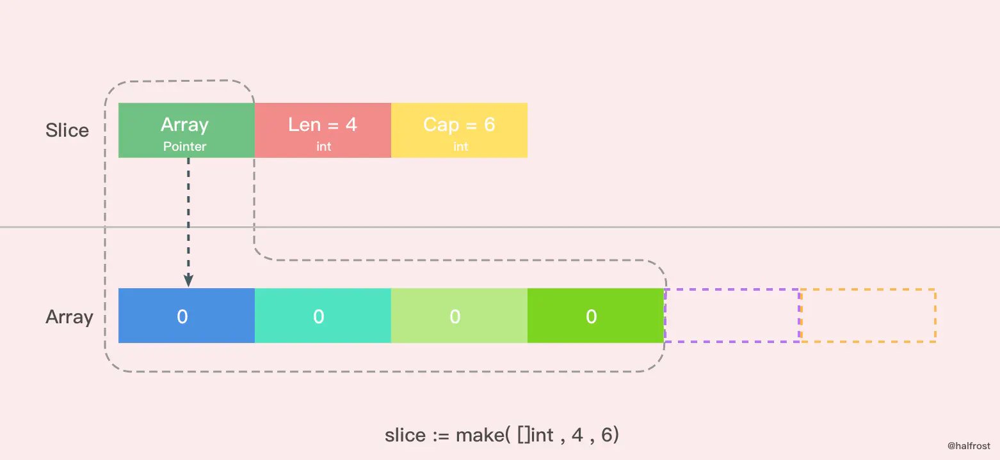

上图是用 make 函数创建的一个 len = 4， cap = 6 的切片。内存空间申请了6个 int 类型的内存大小。由于 len = 4，所以后面2个暂时访问不到，但是容量还是在的。这时候数组里面每个变量都是0 。

除了 make 函数可以创建切片以外，字面量也可以创建切片。

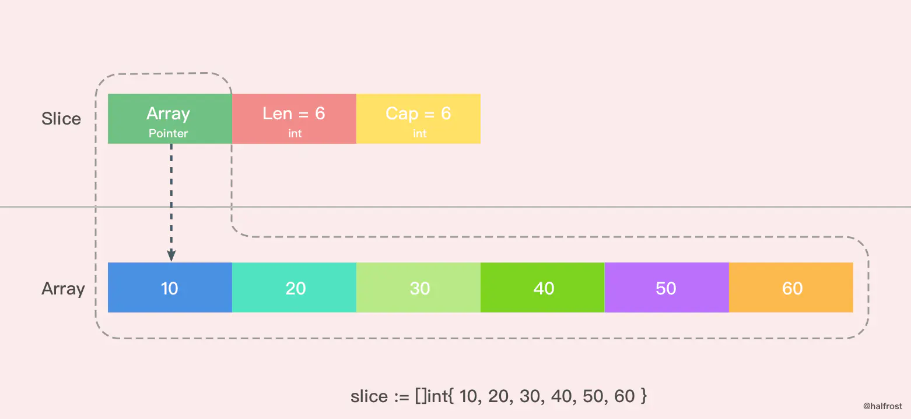

::: tip 温馨提示

这里是用字面量创建的一个 len = 6，cap = 6 的切片，这时候数组里面每个元素的值都初始化完成了。需要注意的是 [ ] 里面不要写数组的容量，因为如果写了个数以后就是数组了，而不是切片了。

:::


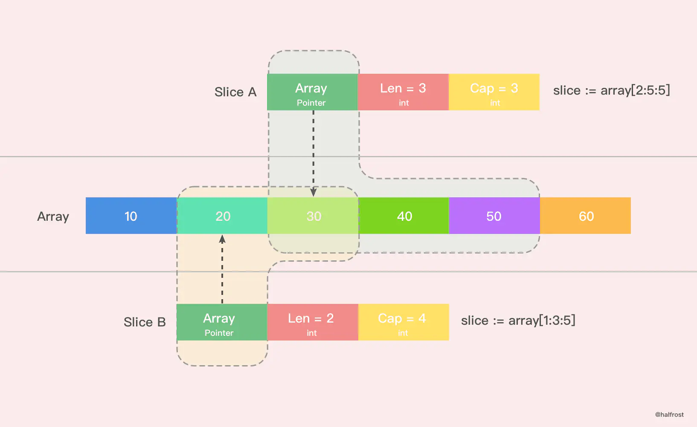

还有一种简单的字面量创建切片的方法。如上图。上图就 Slice A 创建出了一个 len = 3，cap = 3 的切片。从原数组的第二位元素(0是第一位)开始切，一直切到第四位为止(不包括第五位)。同理，Slice B 创建出了一个 len = 2，cap = 4 的切片。

#### nil 和空切片

nil 切片和空切片也是常用的。

```
    var slice []int
```

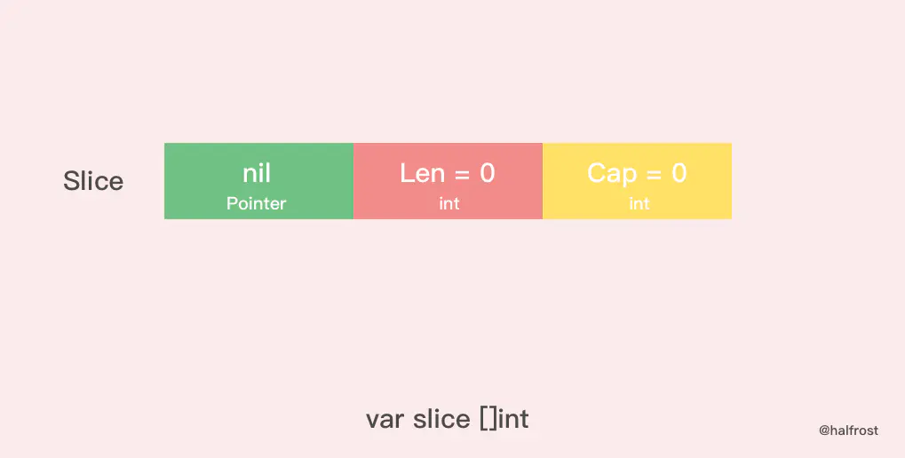

nil 切片被用在很多标准库和内置函数中，描述一个不存在的切片的时候，就需要用到 nil 切片。比如函数在发生异常的时候，返回的切片就是 nil 切片。nil 切片的指针指向 nil。

空切片一般会用来表示一个空的集合。比如数据库查询，一条结果也没有查到，那么就可以返回一个空切片。

```go
    silce := make( []int , 0 )
    slice := []int{ }
```

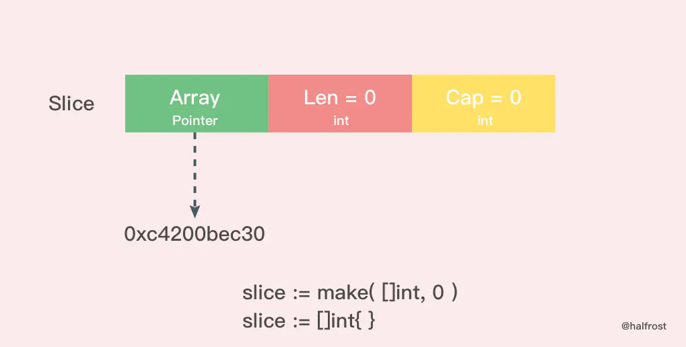

空切片和 nil 切片的区别在于，空切片指向的地址不是nil，指向的是一个内存地址，但是它没有分配任何内存空间，即底层元素包含0个元素。

最后需要说明的一点是。不管是使用 nil 切片还是空切片，对其调用内置函数 append，len 和 cap 的效果都是一样的。

### 切片扩容

:::tip 思考题来了

当一个切片的容量满了，就需要扩容了。怎么扩，策略是什么？

:::

:::details 查看答案

* `Go 1.8/1.9`大同小异

```go
// growslice handles slice growth during append.
// It is passed the slice element type, the old slice, and the desired new minimum capacity,
// and it returns a new slice with at least that capacity, with the old data
// copied into it.
// The new slice's length is set to the old slice's length,
// NOT to the new requested capacity.
// This is for codegen convenience. The old slice's length is used immediately
// to calculate where to write new values during an append.
// TODO: When the old backend is gone, reconsider this decision.
// The SSA backend might prefer the new length or to return only ptr/cap and save stack space.
func growslice(et *_type, old slice, cap int) slice {
    /**  
    @et：切片类型
    @old： 就切片
    @cap: 新的切片容量
    
    **/
    if raceenabled {
        callerpc := getcallerpc(unsafe.Pointer(&et))
        racereadrangepc(old.array, uintptr(old.len*int(et.size)), callerpc, funcPC(growslice))
    }
    if msanenabled {
        msanread(old.array, uintptr(old.len*int(et.size)))
    }
    
    if cap < old.cap {
        // 如果新要扩容的容量比原来的容量还要小，这代表要缩容了，那么可以直接报panic了
           panic(errorString("growslice: cap out of range"))
    }
    if et.size == 0 {
        // 如果当前切片的大小为0，还调用了扩容方法，那么就新生成一个新的容量的切片返回。
        return slice{unsafe.Pointer(&zerobase), old.len, cap}
    }

  // 这里就是扩容的策略
    newcap := old.cap
    doublecap := newcap + newcap
    if cap > doublecap {
        newcap = cap
    } else {
        if old.len < 1024 {
            newcap = doublecap
        } else {
            for newcap < cap {
                newcap += newcap / 4
            } 
        }
    }

    // 计算新的切片的容量，长度。
    var lenmem, newlenmem, capmem uintptr
    const ptrSize = unsafe.Sizeof((*byte)(nil))
    switch et.size {
    case 1:
        lenmem = uintptr(old.len)
        newlenmem = uintptr(cap)
        capmem = roundupsize(uintptr(newcap))
        newcap = int(capmem)
    case ptrSize:
        lenmem = uintptr(old.len) * ptrSize
        newlenmem = uintptr(cap) * ptrSize
        capmem = roundupsize(uintptr(newcap) * ptrSize)
        newcap = int(capmem / ptrSize)
    default:
        lenmem = uintptr(old.len) * et.size
        newlenmem = uintptr(cap) * et.size
        capmem = roundupsize(uintptr(newcap) * et.size)
        newcap = int(capmem / et.size)
    }

    // 判断非法的值，保证容量是在增加，并且容量不超过最大容量
    if cap < old.cap || uintptr(newcap) > maxSliceCap(et.size) {
        panic(errorString("growslice: cap out of range"))
    }

    var p unsafe.Pointer
    
    if et.kind&kindNoPointers != 0 {
        // 在老的切片后面继续扩充容量
        p = mallocgc(capmem, nil, false)
        // 将 lenmem 这个多个 bytes 从 old.array地址 拷贝到 p 的地址处
        memmove(p, old.array, lenmem)
        // 先将 P 地址加上新的容量得到新切片容量的地址，然后将新切片容量地址后面的 capmem-newlenmem 个 bytes 这块内存初始化。为之后继续 append() 操作腾出空间。
        memclrNoHeapPointers(add(p, newlenmem), capmem-newlenmem)
    } else {
        // 重新申请新的数组给新切片
        // 重新申请 capmen 这个大的内存地址，并且初始化为0值
        p = mallocgc(capmem, et, true)
        if !writeBarrier.enabled {
            // 如果还不能打开写锁，那么只能把 lenmem 大小的 bytes 字节从 old.array 拷贝到 p 的地址处
            memmove(p, old.array, lenmem)
        } else {
            // 循环拷贝老的切片的值
            for i := uintptr(0); i < lenmem; i += et.size {
                typedmemmove(et, add(p, i), add(old.array, i))
            }
        }
    }
    // 返回最终新切片，容量更新为最新扩容之后的容量
    return slice{p, old.len, newcap}
}
```

* 最新版`Go2`（2022-4-7）

```go
// growslice handles slice growth during append.
// It is passed the slice element type, the old slice, and the desired new minimum capacity,
// and it returns a new slice with at least that capacity, with the old data
// copied into it.
// The new slice's length is set to the old slice's length,
// NOT to the new requested capacity.
// This is for codegen convenience. The old slice's length is used immediately
// to calculate where to write new values during an append.
// TODO: When the old backend is gone, reconsider this decision.
// The SSA backend might prefer the new length or to return only ptr/cap and save stack space.
func growslice(et *_type, old slice, cap int) slice {
	if raceenabled {
		callerpc := getcallerpc()
		racereadrangepc(old.array, uintptr(old.len*int(et.size)), callerpc, abi.FuncPCABIInternal(growslice))
	}
	if msanenabled {
		msanread(old.array, uintptr(old.len*int(et.size)))
	}
	if asanenabled {
		asanread(old.array, uintptr(old.len*int(et.size)))
	}

	if cap < old.cap {
		panic(errorString("growslice: cap out of range"))
	}

	if et.size == 0 {
		// append should not create a slice with nil pointer but non-zero len.
		// We assume that append doesn't need to preserve old.array in this case.
		return slice{unsafe.Pointer(&zerobase), old.len, cap}
	}

	newcap := old.cap
	doublecap := newcap + newcap
	if cap > doublecap {
		newcap = cap
	} else {
		const threshold = 256
		if old.cap < threshold {
			newcap = doublecap
		} else {
            // Check 0 < newcap to detect overflow
			// and prevent an infinite loop.
			for 0 < newcap && newcap < cap {
				// Transition from growing 2x for small slices
				// to growing 1.25x for large slices. This formula
				// gives a smooth-ish transition between the two.
                // 从小片增长2倍到大片增长1.25倍。这个公式给出了两者之间的平滑过渡。
				newcap += (newcap + 3*threshold) / 4
			}
			// Set newcap to the requested cap when
			// the newcap calculation overflowed.
            // 当newcap计算溢出时，将newcap设置为请求的上限。
			if newcap <= 0 {
				newcap = cap
			}
		}
	}

	var overflow bool
	var lenmem, newlenmem, capmem uintptr
	// Specialize for common values of et.size.
	// For 1 we don't need any division/multiplication.
	// For goarch.PtrSize, compiler will optimize division/multiplication into a shift by a constant.
	// For powers of 2, use a variable shift.
	switch {
	case et.size == 1:
		lenmem = uintptr(old.len)
		newlenmem = uintptr(cap)
		capmem = roundupsize(uintptr(newcap))
		overflow = uintptr(newcap) > maxAlloc
		newcap = int(capmem)
	case et.size == goarch.PtrSize:
		lenmem = uintptr(old.len) * goarch.PtrSize
		newlenmem = uintptr(cap) * goarch.PtrSize
		capmem = roundupsize(uintptr(newcap) * goarch.PtrSize)
		overflow = uintptr(newcap) > maxAlloc/goarch.PtrSize
		newcap = int(capmem / goarch.PtrSize)
	case isPowerOfTwo(et.size):
		var shift uintptr
		if goarch.PtrSize == 8 {
			// Mask shift for better code generation.
			shift = uintptr(sys.Ctz64(uint64(et.size))) & 63
		} else {
			shift = uintptr(sys.Ctz32(uint32(et.size))) & 31
		}
		lenmem = uintptr(old.len) << shift
		newlenmem = uintptr(cap) << shift
		capmem = roundupsize(uintptr(newcap) << shift)
		overflow = uintptr(newcap) > (maxAlloc >> shift)
		newcap = int(capmem >> shift)
	default:
		lenmem = uintptr(old.len) * et.size
		newlenmem = uintptr(cap) * et.size
		capmem, overflow = math.MulUintptr(et.size, uintptr(newcap))
		capmem = roundupsize(capmem)
		newcap = int(capmem / et.size)
	}

	// The check of overflow in addition to capmem > maxAlloc is needed
	// to prevent an overflow which can be used to trigger a segfault
	// on 32bit architectures with this example program:
	//
	// type T [1<<27 + 1]int64
	//
	// var d T
	// var s []T
	//
	// func main() {
	//   s = append(s, d, d, d, d)
	//   print(len(s), "\n")
	// }
	if overflow || capmem > maxAlloc {
		panic(errorString("growslice: cap out of range"))
	}

	var p unsafe.Pointer
	if et.ptrdata == 0 {
        // // 在老的切片后面继续扩充容量
		p = mallocgc(capmem, nil, false)
		// The append() that calls growslice is going to overwrite from old.len to cap (which will be the new length).
		// Only clear the part that will not be overwritten.
		memclrNoHeapPointers(add(p, newlenmem), capmem-newlenmem)
	} else {
		// Note: can't use rawmem (which avoids zeroing of memory), because then GC can scan uninitialized memory.不使用rawmem(这避免了内存归零)，因为这样GC可以扫描未初始化的内存。
		p = mallocgc(capmem, et, true)
		if lenmem > 0 && writeBarrier.enabled {
			// Only shade the pointers in old.array since we know the destination slice p
			// only contains nil pointers because it has been cleared during alloc.
			bulkBarrierPreWriteSrcOnly(uintptr(p), uintptr(old.array), lenmem-et.size+et.ptrdata)
		}
	}
	memmove(p, old.array, lenmem)

	return slice{p, old.len, newcap}
}

```


上述就是扩容的实现。主要需要关注的有两点，一个是扩容时候的策略，还有一个就是扩容是生成全新的内存地址还是在原来的地址后追加。


:::


#### 扩容策略

先看看扩容策略。

```go
func main() {
    slice := []int{10, 20, 30, 40}
    // 扩容
    newSlice := append(slice, 50)
    fmt.Printf("Before slice = %v, Pointer = %p, len = %d, cap = %d\n", slice, &slice, len(slice), cap(slice))
    fmt.Printf("Before newSlice = %v, Pointer = %p, len = %d, cap = %d\n", newSlice, &newSlice, len(newSlice), cap(newSlice))
    
    // 对新切片操作，看看会不会影响原切片
    newSlice[1] += 10
    fmt.Printf("After slice = %v, Pointer = %p, len = %d, cap = %d\n", slice, &slice, len(slice), cap(slice))
    fmt.Printf("After newSlice = %v, Pointer = %p, len = %d, cap = %d\n", newSlice, &newSlice, len(newSlice), cap(newSlice))
}
```

输出结果：

```
    Before slice = [10 20 30 40], Pointer = 0xc4200b0140, len = 4, cap = 4
    Before newSlice = [10 20 30 40 50], Pointer = 0xc4200b0180, len = 5, cap = 8
    After slice = [10 20 30 40], Pointer = 0xc4200b0140, len = 4, cap = 4
    After newSlice = [10 30 30 40 50], Pointer = 0xc4200b0180, len = 5, cap = 8
```

用图表示出上述过程。

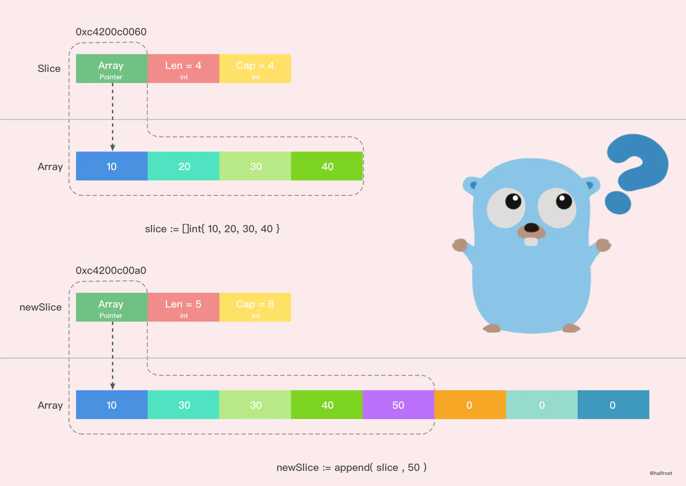

:::tip

从图上我们可以很容易的看出，新的切片和之前的切片已经不同了，因为新的切片更改了一个值，并没有影响到原来的数组，新切片指向的数组是一个全新的数组。并且 cap 容量也发生了变化。这之间究竟发生了什么呢？

:::

Go 中切片扩容的策略是这样的：

如果切片的容量小于 1024 个元素，于是扩容的时候就翻倍增加容量。上面那个例子也验证了这一情况，总容量从原来的4个翻倍到现在的8个。

一旦元素个数超过 1024 个元素，那么增长因子就变成 1.25 ，即每次增加原来容量的四分之一。(小tip:新旧版本基本都是这个意思，只是有点小细节不一致)

注意：扩容扩大的容量都是针对原来的容量而言的，而不是针对原来数组的长度而言的。

#### 新数组 or 老数组 ？

再谈谈扩容之后的数组一定是新的么？这个不一定，分两种情况。

* 情况一：`len < cap`

```go
package main

import "fmt"

func main() {
	array := [4]int{10, 20, 30, 40}
	slice := array[0:2]
	fmt.Printf("init slice = %v, Pointer = %p, len = %d, cap = %d\n\n", slice, &slice, len(slice), cap(slice))

	newSlice := append(slice, 50)

	fmt.Printf("Before slice = %v, Pointer = %p, len = %d, cap = %d\n", slice, &slice, len(slice), cap(slice))
	fmt.Printf("Before newSlice = %v, Pointer = %p, len = %d, cap = %d\n", newSlice, &newSlice, len(newSlice), cap(newSlice))
	fmt.Println("Before array", array, "\n")

	newSlice[1] += 10

	fmt.Printf("After slice = %v, Pointer = %p, len = %d, cap = %d\n", slice, &slice, len(slice), cap(slice))
	fmt.Printf("After newSlice = %v, Pointer = %p, len = %d, cap = %d\n", newSlice, &newSlice, len(newSlice), cap(newSlice))
	fmt.Printf("After array = %v\n", array)
}

```

打印输出：

```shell
init slice = [10 20], Pointer = 0xc000004078, len = 2, cap = 4

Before slice = [10 20], Pointer = 0xc000004078, len = 2, cap = 4
Before newSlice = [10 20 50], Pointer = 0xc0000040a8, len = 3, cap = 4
Before array [10 20 50 40]

After slice = [10 30], Pointer = 0xc000004078, len = 2, cap = 4
After newSlice = [10 30 50], Pointer = 0xc0000040a8, len = 3, cap = 4
After array = [10 30 50 40]
```

把上述过程用图表示出来，如下图。

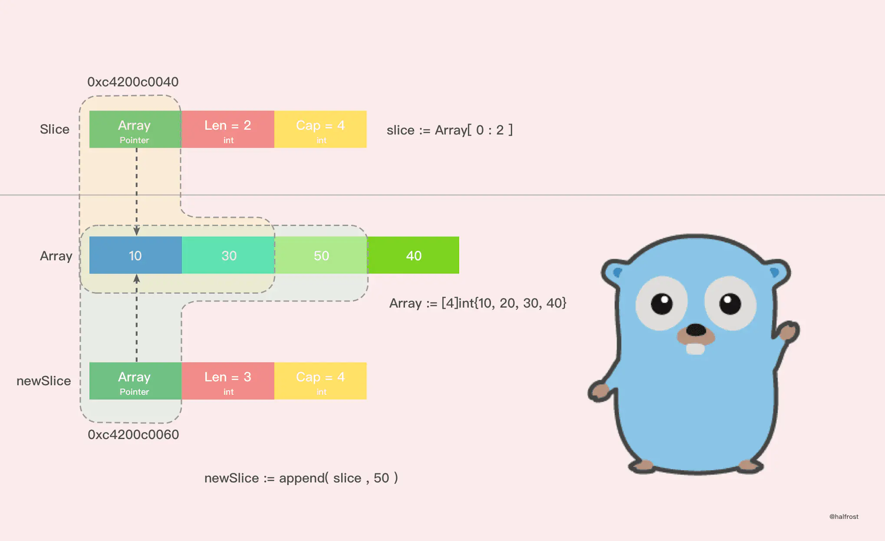

通过打印的结果，我们可以看到，在这种情况下，扩容以后并没有新建一个新的数组，扩容前后的数组都是同一个，这也就导致了新的切片修改了一个值，也影响到了老的切片了。并且 `append() `操作也改变了原来数组里面的值。一个 `append() `操作影响了这么多地方，如果原数组上有多个切片，那么这些切片都会被影响！无意间就产生了莫名的 bug！

这种情况，由于原数组还有容量可以扩容，所以执行 `append()` 操作以后，会在原数组上直接操作，所以这种情况下，扩容以后的数组还是指向原来的数组。

这种情况也极容易出现在字面量创建切片时候，第三个参数 cap 传值的时候，如果用字面量创建切片，cap 并不等于指向数组的总容量，那么这种情况就会发生。

```
    slice := array[1:2:3]
```

上面这种情况非常危险，极度容易产生 bug 。

建议用字面量创建切片的时候，cap 的值一定要保持清醒，避免共享原数组导致的 bug。


* 情况二：`len=cap`

```go
package main

import "fmt"

func main() {
	array := [4]int{10, 20, 30, 40}
	slice := array[0:4]
	fmt.Printf("init slice = %v, Pointer = %p, len = %d, cap = %d\n\n", slice, &slice, len(slice), cap(slice))

	newSlice := append(slice, 50)

	fmt.Printf("Before slice = %v, Pointer = %p, len = %d, cap = %d\n", slice, &slice, len(slice), cap(slice))
	fmt.Printf("Before newSlice = %v, Pointer = %p, len = %d, cap = %d\n", newSlice, &newSlice, len(newSlice), cap(newSlice))
	fmt.Println("Before array", array, "\n")

	newSlice[1] += 10

	fmt.Printf("After slice = %v, Pointer = %p, len = %d, cap = %d\n", slice, &slice, len(slice), cap(slice))
	fmt.Printf("After newSlice = %v, Pointer = %p, len = %d, cap = %d\n", newSlice, &newSlice, len(newSlice), cap(newSlice))
	fmt.Printf("After array = %v\n", array)
}

```

输出

```shell
init slice = [10 20 30 40], Pointer = 0xc000004078, len = 4, cap = 4

Before slice = [10 20 30 40], Pointer = 0xc000004078, len = 4, cap = 4
Before newSlice = [10 20 30 40 50], Pointer = 0xc0000040a8, len = 5, cap = 8
Before array [10 20 30 40]

After slice = [10 20 30 40], Pointer = 0xc000004078, len = 4, cap = 4
After newSlice = [10 30 30 40 50], Pointer = 0xc0000040a8, len = 5, cap = 8
After array = [10 20 30 40]
```


情况二其实就是在扩容策略里面举的例子，在那个例子中之所以生成了新的切片，是因为原来数组的容量已经达到了最大值，再想扩容， Go 默认会先开一片内存区域，把原来的值拷贝过来，然后再执行 append() 操作。这种情况丝毫不影响原数组。

所以建议尽量避免情况一，尽量使用情况二，避免 bug 产生。

* 情况一和二的输出结果对比图

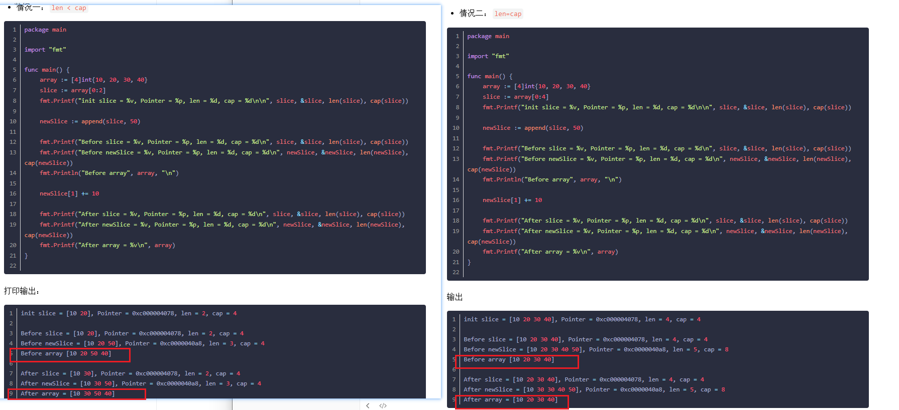

可以看到原数组不受影响，表示扩容后是新数组。

### 切片拷贝

Slice 中拷贝方法有2个。

* `slicecopy`

:::details 查看源码

```go
func slicecopy(to, fm slice, width uintptr) int {
    // 如果源切片或者目标切片有一个长度为0，那么就不需要拷贝，直接 return 
    if fm.len == 0 || to.len == 0 {
        return 0
    }
    // n 记录下源切片或者目标切片较短的那一个的长度
    n := fm.len
    if to.len < n {
        n = to.len
    }
    // 如果入参 width = 0，也不需要拷贝了，返回较短的切片的长度
    if width == 0 {
        return n
    }
    // 如果开启了竞争检测
    if raceenabled {
        callerpc := getcallerpc(unsafe.Pointer(&to))
        pc := funcPC(slicecopy)
        racewriterangepc(to.array, uintptr(n*int(width)), callerpc, pc)
        racereadrangepc(fm.array, uintptr(n*int(width)), callerpc, pc)
    }
    // 如果开启了 The memory sanitizer (msan)
    if msanenabled {
        msanwrite(to.array, uintptr(n*int(width)))
        msanread(fm.array, uintptr(n*int(width)))
    }

    size := uintptr(n) * width
    if size == 1 { 
        // TODO: is this still worth it with new memmove impl?
        // 如果只有一个元素，那么指针直接转换即可
        *(*byte)(to.array) = *(*byte)(fm.array) // known to be a byte pointer
    } else {
        // 如果不止一个元素，那么就把 size 个 bytes 从 fm.array 地址开始，拷贝到 to.array 地址之后
        memmove(to.array, fm.array, size)
    }
    return n
}
```

:::

在这个方法中，`slicecopy `方法会把源切片值(即 fm Slice )中的元素复制到目标切片(即 to Slice )中，并返回被复制的元素个数，copy 的两个类型必须一致。slicecopy 方法最终的复制结果取决于较短的那个切片，当较短的切片复制完成，整个复制过程就全部完成了。

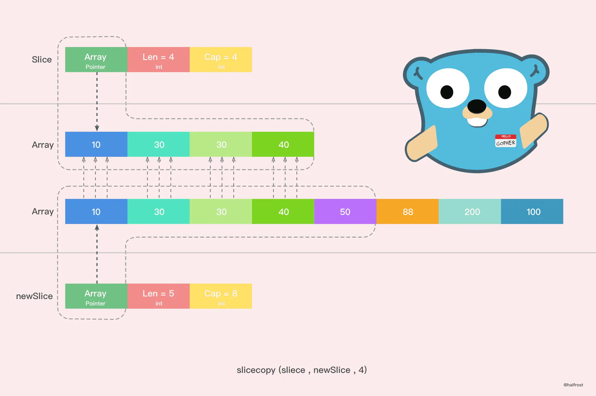

举个例子，比如：

```go
func main() {
    array := []int{10, 20, 30, 40}
    slice := make([]int, 6)
    n := copy(slice, array)
    fmt.Println(n,slice)
}
```

还有一个拷贝的方法，这个方法原理和 slicecopy 方法类似，不在赘述了，注释写在代码里面了。

:::details 查看源码

```go
func slicestringcopy(to []byte, fm string) int {
    // 如果源切片或者目标切片有一个长度为0，那么就不需要拷贝，直接 return 
    if len(fm) == 0 || len(to) == 0 {
        return 0
    }
    // n 记录下源切片或者目标切片较短的那一个的长度
    n := len(fm)
    if len(to) < n {
        n = len(to)
    }
    // 如果开启了竞争检测
    if raceenabled {
        callerpc := getcallerpc(unsafe.Pointer(&to))
        pc := funcPC(slicestringcopy)
        racewriterangepc(unsafe.Pointer(&to[0]), uintptr(n), callerpc, pc)
    }
    // 如果开启了 The memory sanitizer (msan)
    if msanenabled {
        msanwrite(unsafe.Pointer(&to[0]), uintptr(n))
    }
    // 拷贝字符串至字节数组
    memmove(unsafe.Pointer(&to[0]), stringStructOf(&fm).str, uintptr(n))
    return n
}
```

:::


再举个例子，比如：

```go
func main() {
    slice := make([]byte, 3)
    n := copy(slice, "abcdef")
    fmt.Println(n,slice)
}
```

输出：

```
    3 [97,98,99]
```

说到拷贝，切片中有一个需要注意的问题。

```go
func main() {
    slice := []int{10, 20, 30, 40}
    for index, value := range slice {
        fmt.Printf("value = %d , value-addr = %x , slice-addr = %x\n", value, &value, &slice[index])
    }
}
```

输出：

```
    value = 10 , value-addr = c4200aedf8 , slice-addr = c4200b0320
    value = 20 , value-addr = c4200aedf8 , slice-addr = c4200b0328
    value = 30 , value-addr = c4200aedf8 , slice-addr = c4200b0330
    value = 40 , value-addr = c4200aedf8 , slice-addr = c4200b0338
```

从上面结果我们可以看到，如果用 range 的方式去遍历一个切片，拿到的 Value 其实是切片里面的值拷贝。所以每次打印 Value 的地址都不变。

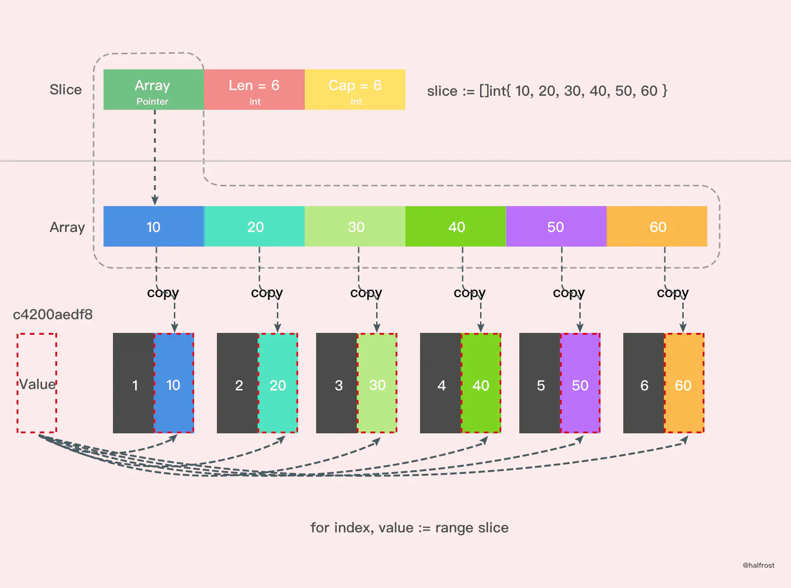

由于 Value 是值拷贝的，并非引用传递，所以直接改 Value 是达不到更改原切片值的目的的，需要通过 `&slice[index]` 获取真实的地址。

:::details 测试代码

```go
package main

import "fmt"

func main() {
	s := []int{1, 2, 3}
	for _, v := range s {
		v += 5
	}
	fmt.Println(s)
	/**
		for range 里面的value是一个值拷贝
	**/
	for i, n := 0, len(s); i < n; i++ {
		s[i] += 5
	}
	fmt.Println(s)
}

```

输出

```shell
[1 2 3]
[6 7 8]
```

:::


