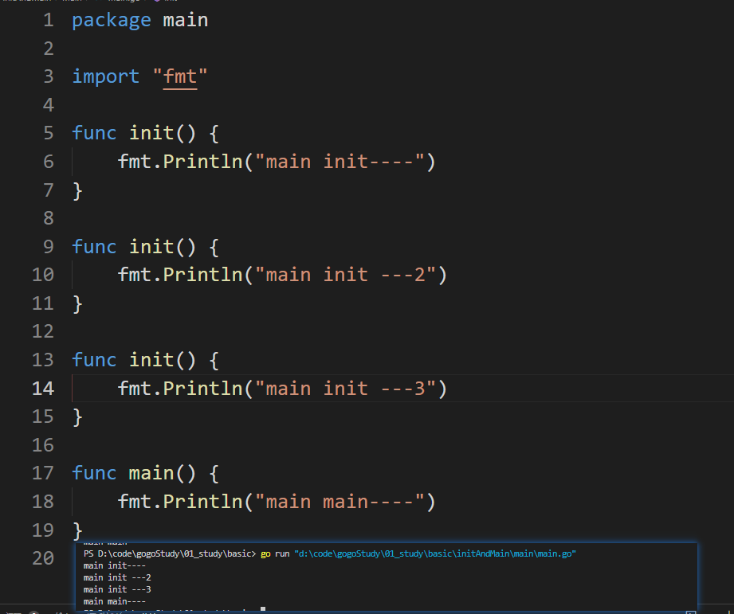
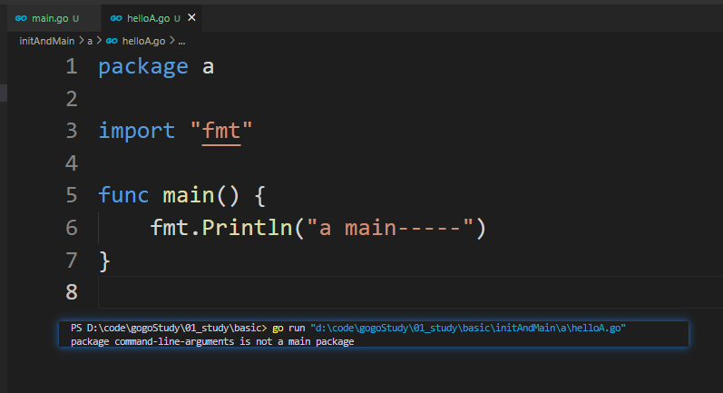
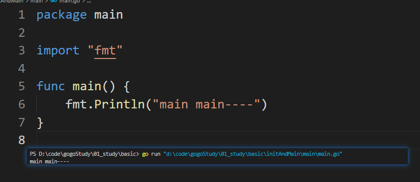

# init函数与main函数

## init函数

`go`语言中`init`函数用于包`(package)`的初始化，该函数是`go`语言的一个重要特性。

有下面的特征：

* `init`函数是用于程序执行前做包的初始化的函数，比如初始化包里的变量等

* 每个包可以拥有多个`init`函数

* 包的每个源文件也可以拥有多个`init`函数

* 同一个包中多个`init`函数的执行顺序`go`语言没有明确的定义(说明)

> 经测试，同一个包内的`init`函数会被按顺序调用！！！
>  ::: details 测试代码
> 
> ::: 

* 不同包的`init`函数按照包导入的依赖关系决定该初始化函数的执行顺序

* `init`函数不能被其他函数调用，而是在`main`函数执行之前，自动被调用

## main函数
Go语言程序的默认入口函数(主函数)：func main()
函数体用｛｝一对括号包裹。

```go
func main(){
    //函数体
}

```

::: tip 

`main`只能在`main`包中被系统自动调用，在其他包定义没有作用哦！！！

* 原因：

>  因为不是`main`包的`main`函数（私有函数）不能被`main`包调用，而且不是`main`包又不能直接运行。


:::
* 在其他包定义main函数时




* 在`main`包定义时




## init函数和main函数的异同

### 相同点：

两个函数在定义时不能有任何的参数和返回值，且Go程序自动调用。

### 不同点：

`init`可以应用于任意包中，且可以重复定义多个。
`main`函数只能用于`main`包中，且只能定义一个。

### 两个函数的执行顺序：

对同一个`go`文件的`init()`调用顺序是从上到下的。

对同一个`package`中不同文件是按文件名字符串比较“从小到大”顺序调用各文件中的`init()`函数。

对于不同的`package`，如果不相互依赖的话，按照main包中”先import的后调用”的顺序调用其包中的`init()`，如果`package`存在依赖，则先调用最早被依赖的`package`中的`init()`，最后调用`main`函数。

如果`init`函数中使用了`println()`或者`print()`你会发现在执行过程中这两个不会按照你想象中的顺序执行。这两个函数官方只推荐在测试环境中使用，对于正式环境不要使用。

