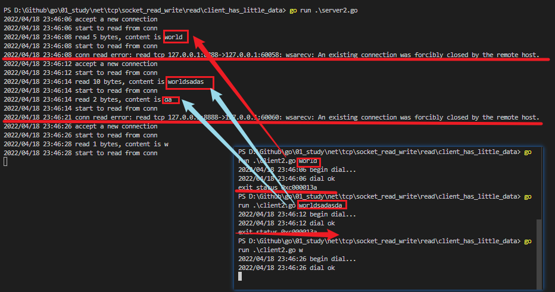
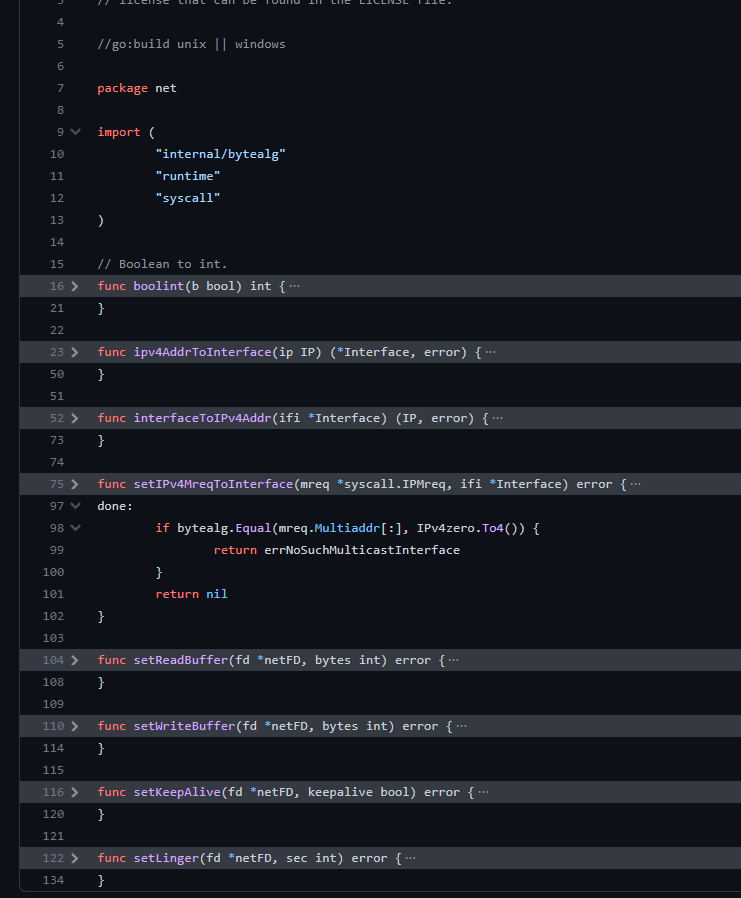

[[TOC]]


# Go语言TCP Socket编程

:::tip 声明

本文源于[Go语言TCP Socket编程 | Tony Bai](https://tonybai.com/2015/11/17/tcp-programming-in-golang/)，可能会有稍微的修改。

:::

`Golang`的主要 设计目标之一就是面向大规模后端服务程序，网络通信这块是服务端 程序必不可少也是至关重要的一部分。在日常应用中，我们也可以看到Go中的net以及其subdirectories下的包均是“高频+刚需”，而TCP socket则是网络编程的主流，即便您没有直接使用到net中有关TCP Socket方面的接口，但net/http总是用到了吧，http底层依旧是用tcp socket实现的。

网络编程方面，我们最常用的就是tcp socket编程了，在posix标准出来后，socket在各大主流OS平台上都得到了很好的支持。关于tcp programming，最好的资料莫过于[W. Richard Stevens](http://en.wikipedia.org/wiki/W._Richard_Stevens) 的网络编程圣经《[UNIX网络 编程 卷1：套接字联网API](http://book.douban.com/subject/4859464/)》 了，书中关于tcp socket接口的各种使用、行为模式、异常处理讲解的十分细致。Go是自带runtime的跨平台编程语言，Go中暴露给语言使用者的tcp socket api是建立OS原生tcp socket接口之上的。由于Go runtime调度的需要，golang tcp socket接口在行为特点与异常处理方面与OS原生接口有着一些差别。这篇博文的目标就是整理出关于Go tcp socket在各个场景下的使用方法、行为特点以及注意事项。

## 一、模型

从tcp socket诞生后，网络编程架构模型也几经演化，大致是：“每进程一个连接” –> “每线程一个连接” –> “Non-Block + I/O多路复用(linux epoll/windows iocp/freebsd darwin kqueue/solaris Event Port)”。伴随着模型的演化，服务程序愈加强大，可以支持更多的连接，获得更好的处理性能。

目前主流web server一般均采用的都是”Non-Block + I/O多路复用”（有的也结合了多线程、多进程）。不过I/O多路复用也给使用者带来了不小的复杂度，以至于后续出现了许多高性能的I/O多路复用框架， 比如[libevent](http://libevent.org/)、[libev](http://software.schmorp.de/pkg/libev.html)、[libuv](https://github.com/joyent/libuv)等，以帮助开发者简化开发复杂性，降低心智负担。不过Go的设计者似乎认为I/O多路复用的这种通过回调机制割裂控制流 的方式依旧复杂，且有悖于“一般逻辑”设计，为此Go语言将该“复杂性”隐藏在`Runtime`中了：Go开发者无需关注socket是否是 non-block的，也无需亲自注册文件描述符的回调，只需在每个连接对应的goroutine中以**“block I/O”**的方式对待socket处理即可，这可以说大大降低了开发人员的心智负担。一个典型的`Go server`端程序大致如下：

:::details 查看代码
```go
//go-tcpsock/server.go
func handleConn(c net.Conn) {
    defer c.Close()
    for {
        // read from the connection
        // ... ...
        // write to the connection
        //... ...
    }
}

func main() {
    l, err := net.Listen("tcp", ":8888")
    if err != nil {
        fmt.Println("listen error:", err)
        return
    }

    for {
        c, err := l.Accept()
        if err != nil {
            fmt.Println("accept error:", err)
            break
        }
        // start a new goroutine to handle
        // the new connection.
        go handleConn(c)
    }
}
```
:::


用户层眼中看到的goroutine中的“block socket”，实际上是通过Go runtime中的netpoller通过Non-block socket + I/O多路复用机制“模拟”出来的，真实的underlying socket实际上是non-block的，只是runtime拦截了底层socket系统调用的错误码，并通过netpoller和goroutine 调度让goroutine“阻塞”在用户层得到的Socket fd上。比如：当用户层针对某个socket fd发起read操作时，如果该socket fd中尚无数据，那么runtime会将该socket fd加入到netpoller中监听，同时对应的goroutine被挂起，直到runtime收到socket fd 数据ready的通知，runtime才会重新唤醒等待在该socket fd上准备read的那个Goroutine。而这个过程从Goroutine的视角来看，就像是read操作一直block在那个socket fd上似的。具体实现细节在后续场景中会有补充描述。

## 二、TCP连接的建立

众所周知，TCP Socket的连接的建立需要经历客户端和服务端的三次握手的过程。连接建立过程中，服务端是一个标准的Listen + Accept的结构(可参考上面的代码)，而在客户端Go语言使用`net.Dial`或`DialTimeout`进行连接建立：

阻塞Dial：

```go
conn, err := net.Dial("tcp", "google.com:80")
if err != nil {
    //handle error
}
// read or write on conn
```

或是带上超时机制的Dial：

```go
conn, err := net.DialTimeout("tcp", ":8080", 2 * time.Second)
if err != nil {
    //handle error
}
// read or write on conn
```

---


### 对于客户端而言，连接的建立会遇到如下几种情形：

------

#### 1、网络不可达或对方服务未启动

如果传给Dial的Addr是可以立即判断出网络不可达，或者Addr中端口对应的服务没有启动，端口未被监听，Dial会几乎立即返回错误，比如：

:::details

```go
//go-tcpsock/conn_establish/client1.go
... ...
func main() {
    log.Println("begin dial...")
    conn, err := net.Dial("tcp", ":8888")
    if err != nil {
        log.Println("dial error:", err)
        return
    }
    defer conn.Close()
    log.Println("dial ok")
}
```

如果本机8888端口未有服务程序监听，那么执行上面程序，Dial会很快返回错误：

```go
$go run client1.go
2015/11/16 14:37:41 begin dial...
2015/11/16 14:37:41 dial error: dial tcp :8888: getsockopt: connection refused
```

:::

#### 2、对方服务的listen backlog满

还有一种场景就是对方服务器很忙，瞬间有大量client端连接尝试向server建立，server端的listen backlog队列满，server accept不及时((即便不accept，那么在backlog数量范畴里面，connect都会是成功的，因为new conn已经加入到server side的listen queue中了，accept只是从queue中取出一个conn而已)，这将导致client端Dial阻塞。我们还是通过例子感受Dial的行为特点：

:::details

服务端代码：

```go
//go-tcpsock/conn_establish/server2.go
... ...
func main() {
    l, err := net.Listen("tcp", ":8888")
    if err != nil {
        log.Println("error listen:", err)
        return
    }
    defer l.Close()
    log.Println("listen ok")

    var i int
    for {
        time.Sleep(time.Second * 10)
        if _, err := l.Accept(); err != nil {
            log.Println("accept error:", err)
            break
        }
        i++
        log.Printf("%d: accept a new connection\n", i)
    }
}
```

客户端代码：

```go
//go-tcpsock/conn_establish/client2.go
... ...
func establishConn(i int) net.Conn {
    conn, err := net.Dial("tcp", ":8888")
    if err != nil {
        log.Printf("%d: dial error: %s", i, err)
        return nil
    }
    log.Println(i, ":connect to server ok")
    return conn
}

func main() {
    var sl []net.Conn
    for i := 1; i < 1000; i++ {
        conn := establishConn(i)
        if conn != nil {
            sl = append(sl, conn)
        }
    }

    time.Sleep(time.Second * 10000)
}
```

从程序可以看出，服务端在listen成功后，每隔10s钟accept一次。客户端则是串行的尝试建立连接。这两个程序在Darwin下的执行 结果：

```go
$go run server2.go
2015/11/16 21:55:41 listen ok
2015/11/16 21:55:51 1: accept a new connection
2015/11/16 21:56:01 2: accept a new connection
... ...

$go run client2.go
2015/11/16 21:55:44 1 :connect to server ok
2015/11/16 21:55:44 2 :connect to server ok
2015/11/16 21:55:44 3 :connect to server ok
... ...

2015/11/16 21:55:44 126 :connect to server ok
2015/11/16 21:55:44 127 :connect to server ok
2015/11/16 21:55:44 128 :connect to server ok

2015/11/16 21:55:52 129 :connect to server ok
2015/11/16 21:56:03 130 :connect to server ok
2015/11/16 21:56:14 131 :connect to server ok
... ...
```

可以看出Client初始时成功地一次性建立了128个连接，然后后续每阻塞近10s才能成功建立一条连接。也就是说在server端 backlog满时(未及时accept)，客户端将阻塞在Dial上，直到server端进行一次accept。至于为什么是128，这与darwin 下的默认设置有关：

```shell
$sysctl -a|grep kern.ipc.somaxconn
kern.ipc.somaxconn: 128
```

如果我在ubuntu 14.04上运行上述server程序，我们的client端初始可以成功建立499条连接。

如果server一直不accept，client端会一直阻塞么？我们去掉accept后的结果是：在Darwin下，client端会阻塞大 约1分多钟才会返回timeout：

```go
2015/11/16 22:03:31 128 :connect to server ok
2015/11/16 22:04:48 129: dial error: dial tcp :8888: getsockopt: operation timed out
```

而如果server运行在ubuntu 14.04上，client似乎一直阻塞，我等了10多分钟依旧没有返回。 阻塞与否看来与server端的网络实现和设置有关。

>  tips: 经测试，确实瞬间连接的成功量不一样，我的是201.

:::

#### 3、网络延迟较大，Dial阻塞并超时

如果网络延迟较大，TCP握手过程将更加艰难坎坷（各种丢包），时间消耗的自然也会更长。Dial这时会阻塞，如果长时间依旧无法建立连接，则Dial也会返回“ getsockopt: operation timed out”错误。

------

在连接建立阶段，多数情况下，Dial是可以满足需求的，即便阻塞一小会儿。但对于某些程序而言，需要有严格的连接时间限定，如果一定时间内没能成功建立连接，程序可能会需要执行一段“异常”处理逻辑，为此我们就需要DialTimeout了。下面的例子将Dial的最长阻塞时间限制在2s内，超出这个时长，Dial将返回timeout error：

:::details 

```go
//go-tcpsock/conn_establish/client3.go
... ...
func main() {
    log.Println("begin dial...")
    conn, err := net.DialTimeout("tcp", "104.236.176.96:80", 2*time.Second)
    if err != nil {
        log.Println("dial error:", err)
        return
    }
    defer conn.Close()
    log.Println("dial ok")
}
```

执行结果如下（需要模拟一个延迟较大的网络环境）：

```go
$go run client3.go
2015/11/17 09:28:34 begin dial...
2015/11/17 09:28:36 dial error: dial tcp 104.236.176.96:80: i/o timeout
```

> 经本人验证，确实是这样的结果。

:::


## 三、Socket读写

连接建立起来后，我们就要在conn上进行读写，以完成业务逻辑。前面说过Go runtime隐藏了I/O多路复用的复杂性。语言使用者只需采用goroutine+Block I/O的模式即可满足大部分场景需求。Dial成功后，方法返回一个net.Conn接口类型变量值，这个接口变量的动态类型为一个`*TCPConn`：

```go
//$GOROOT/src/net/tcpsock_posix.go
type TCPConn struct {
    conn
}
```

TCPConn内嵌了一个`unexported`类型：`conn`，因此TCPConn”继承”了conn的Read和Write方法，后续通过Dial返回值调用的Write和Read方法均是`net.conn`的方法：

```go
//$GOROOT/src/net/net.go
type conn struct {
    fd *netFD
}

func (c *conn) ok() bool { return c != nil && c.fd != nil }

// Implementation of the Conn interface.

// Read implements the Conn Read method.
func (c *conn) Read(b []byte) (int, error) {
    if !c.ok() {
        return 0, syscall.EINVAL
    }
    n, err := c.fd.Read(b)
    if err != nil && err != io.EOF {
        err = &OpError{Op: "read", Net: c.fd.net, Source: c.fd.laddr, Addr: c.fd.raddr, Err: err}
    }
    return n, err
}

// Write implements the Conn Write method.
func (c *conn) Write(b []byte) (int, error) {
    if !c.ok() {
        return 0, syscall.EINVAL
    }
    n, err := c.fd.Write(b)
    if err != nil {
        err = &OpError{Op: "write", Net: c.fd.net, Source: c.fd.laddr, Addr: c.fd.raddr, Err: err}
    }
    return n, err
}
```

### `conn.Read`

下面我们先来通过几个场景来总结一下conn.Read的行为特点。

------

#### 1、Socket中无数据

连接建立后，如果对方未发送数据到socket，接收方(Server)会阻塞在Read操作上，这和前面提到的“模型”原理是一致的。执行该Read操作的goroutine也会被挂起。runtime会监视该socket，直到其有数据才会重新
调度该socket对应的Goroutine完成read。

:::details

<CodeGroup>
<CodeGroupItem title='server.go' active>

```go
package main

import (
	"log"
	"net"
)

func process(con net.Conn) {
	defer con.Close()
	for {
		var buf = make([]byte, 128)
		log.Println("begin--")
		n, err := con.Read(buf)

		if err != nil {
			log.Println("conn read occur error: ", err)
			return
		}
		log.Printf("read %d bytes, content is %s\n", n, string(buf[:n]))
	}
}

func main() {
	listen, err := net.Listen("tcp", ":8000")
	if err != nil {
		log.Fatalln("listen occur error: ", err)
	}

	for {
		c, err := listen.Accept()
		if err != nil {
			log.Println("accept occur error: ", err)
			break
		}
		log.Println("accept a new connection")
		go process(c)
	}
}

```
</CodeGroupItem>
<CodeGroupItem title='client.go'>

```go
package main

import (
	"log"
	"net"
	"time"
)

func main() {
	log.Println("dial begin--")
	con, err := net.Dial("tcp", ":8000")
	if err != nil {
		log.Println("connect occur error: ", err)
		return
	}
	defer con.Close()
	log.Println("dial ok")
	time.Sleep(100 * time.Second)
}

```
</CodeGroupItem>
</CodeGroup>


运行结果：
<CodeGroup>
<CodeGroupItem title='server' active>

```shell
PS> go run .\server1.go
2022/04/18 23:30:19 accept a new connection
2022/04/18 23:30:19 begin--
```
</CodeGroupItem>
<CodeGroupItem title='client'>

```shell
PS> go run .\client1.go
2022/04/18 23:30:19 dial begin--
2022/04/18 23:30:19 dial ok
```
</CodeGroupItem>
</CodeGroup>

可以看到`server`的`process`协程堵塞在`read`操作。

:::

#### 2、Socket中有部分数据

如果socket中有部分数据，且长度小于一次Read操作所期望读出的数据长度，那么Read将会成功读出这部分数据并返回，而不是等待所有期望数据全部读取后再返回。

:::details


<CodeGroup>
<CodeGroupItem title='client2.go' active>


```go

... ...
func main() {
    if len(os.Args) <= 1 {
        fmt.Println("usage: go run client2.go YOUR_CONTENT")
        return
    }
    log.Println("begin dial...")
    conn, err := net.Dial("tcp", ":8888")
    if err != nil {
        log.Println("dial error:", err)
        return
    }
    defer conn.Close()
    log.Println("dial ok")

    time.Sleep(time.Second * 2)
    data := os.Args[1]
    conn.Write([]byte(data))

    time.Sleep(time.Second * 10000)
}
```

</CodeGroupItem>
<CodeGroupItem title='server2.go'>

```go

... ...
func handleConn(c net.Conn) {
    defer c.Close()
    for {
        // read from the connection
        var buf = make([]byte, 10)
        log.Println("start to read from conn")
        n, err := c.Read(buf)
        if err != nil {
            log.Println("conn read error:", err)
            return
        }
        log.Printf("read %d bytes, content is %s\n", n, string(buf[:n]))
    }
}
... ...
```

</CodeGroupItem>
</CodeGroup>
运行结果:



> Client向socket中写入五个字节数据(“`world`”)，Server端创建一个`len = 10`的slice，等待Read将读取的数据放入slice；Server随后读取到那五个字节：”`world`”。Read成功返回，`n =5 ，err = nil`。

:::


#### 3、Socket中有足够数据

如果socket中有数据，且长度大于等于一次Read操作所期望读出的数据长度，那么Read将会成功读出这部分数据并返回。这个情景是最符合我们对Read的期待的了：Read将用Socket中的数据将我们传入的slice填满后返回：n = 10, err = nil。

我们通过client2.go向Server2发送如下内容：`worldsadasda`，则

> client端发送的内容长度为12个字节，Server端Read buffer的长度为10，因此Server Read第一次返回时只会读取10个字节；Socket中还剩余2个字节数据，Server再次Read时会把剩余数据读出。

#### 4、Socket关闭

如果client端主动关闭了socket，那么Server的Read将会读到什么呢？这里分为“有数据关闭”和“无数据关闭”。

“有数据关闭”是指在client关闭时，socket中还有server端未读取的数据，我们在`client3.go`和`server3.go`中模拟这种情况：

:::details

<CodeGroup>
<CodeGroupItem title='server3.go' active>

```go
package main

import (
	"log"
	"net"
	"time"
)

func handleConn(c net.Conn) {
	defer c.Close()
	for {
		// read from the connection
		time.Sleep(10 * time.Second)
		var buf = make([]byte, 10)
		log.Println("start to read from conn")
		n, err := c.Read(buf)
		if err != nil {
			log.Println("conn read error:", err)
			return
		}
		log.Printf("read %d bytes, content is %s\n", n, string(buf[:n]))
	}
}

func main() {
	l, err := net.Listen("tcp", ":8888")
	if err != nil {
		log.Println("listen error:", err)
		return
	}

	for {
		c, err := l.Accept()
		if err != nil {
			log.Println("accept error:", err)
			break
		}
		// start a new goroutine to handle
		// the new connection.
		log.Println("accept a new connection")
		go handleConn(c)
	}
}


```

</CodeGroupItem>
<CodeGroupItem title='client3.go'>

```go
package main

import (
	"fmt"
	"log"
	"net"
	"os"
	"time"
)

func main() {
	if len(os.Args) <= 1 {
		fmt.Println("usage: go run client3.go YOUR_CONTENT")
		return
	}
	log.Println("begin dial...")
	conn, err := net.Dial("tcp", ":8888")
	if err != nil {
		log.Println("dial error:", err)
		return
	}
	defer conn.Close()
	log.Println("dial ok")

	time.Sleep(time.Second * 2)
	data := os.Args[1]
	conn.Write([]byte(data))
}


```

</CodeGroupItem>
</CodeGroup>

输出结果
```shell
> go run .\server3.go
2022/04/18 23:56:11 accept a new connection2022/04/18 23:56:21 start to read from conn
2022/04/18 23:56:21 read 5 bytes, content is hello
2022/04/18 23:56:31 start to read from conn
2022/04/18 23:56:31 conn read error: EOF


...

> go run .\client3.go hello
2022/04/18 23:56:11 begin dial...
2022/04/18 23:56:11 dial ok


```
从输出结果来看，当client端close socket退出后，server3依旧没有开始Read，10s后第一次Read成功读出了5个字节的数据，当第二次Read时，由于client端 socket关闭，Read返回`EOF error`。


:::


通过上面这个例子，我们也可以猜测出“无数据关闭”情形下的结果，那就是Read直接返回EOF error。

#### 5、读取操作超时

有些场合对Read的阻塞时间有严格限制，在这种情况下，Read的行为到底是什么样的呢？在返回超时错误时，是否也同时Read了一部分数据了呢？这个实验比较难于模拟，下面的测试结果也未必能反映出所有可能结果。我们编写了client4.go和server4.go来模拟这一情形。

:::details

<CodeGroup>
<CodeGroupItem title='server4.go' active>

```go
package main

import (
	"log"
	"net"
	"time"
)

func process(c net.Conn) {
	defer c.Close()
	for {
		// read from the connection
		time.Sleep(10 * time.Second)
		var buf = make([]byte, 65536)
		log.Println("start to read from conn")
		c.SetReadDeadline(time.Now().Add(time.Microsecond * 10))
		n, err := c.Read(buf)
		if err != nil {
			log.Printf("conn read %d bytes,  error: %s", n, err)
			if nerr, ok := err.(net.Error); ok && nerr.Timeout() {
				continue
			}
			return
		}
		log.Printf("read %d bytes, content is %s\n", n, string(buf[:n]))
	}
}

func main() {
	listen, err := net.Listen("tcp", ":8001")
	if err != nil {
		log.Println("listen occurs an error", err)
	}
	for {
		con, err := listen.Accept()
		if err != nil {
			log.Println("accept occurs an error: ", err)
		}
		go process(con)
	}
}


```
</CodeGroupItem>
<CodeGroupItem title='client4.go'>

```go
package main

import (
	"log"
	"net"
	"time"
)

func main() {
	log.Println("begin dial...")
	conn, err := net.Dial("tcp", ":8001")
	if err != nil {
		log.Println("dial error:", err)
		return
	}
	defer conn.Close()
	log.Println("dial ok")

	data := make([]byte, 65536)
	conn.Write(data)

	time.Sleep(time.Second * 10000)
}


```
</CodeGroupItem>
</CodeGroup>


在Server端我们通过Conn的SetReadDeadline方法设置了10微秒的读超时时间，Server的执行结果如下：

<CodeGroup>
<CodeGroupItem title='server4' active>

```shell

> go version
go version go1.17 windows/amd64


> go run .\server4.go
2022/04/20 22:26:30 start to read from conn
2022/04/20 22:26:30 read 65536 bytes, content is 
2022/04/20 22:26:40 start to read from conn
2022/04/20 22:26:40 conn read 0 bytes,  error: read tcp 127.0.0.1:8001->127.0.0.1:50548: i/o timeout
2022/04/20 22:26:50 start to read from conn
2022/04/20 22:26:50 conn read 0 bytes,  error: read tcp 127.0.0.1:8001->127.0.0.1:50548: i/o timeout
2022/04/20 22:27:00 start to read from conn
2022/04/20 22:27:00 conn read 0 bytes,  error: read tcp 127.0.0.1:8001->127.0.0.1:50548: i/o timeout
2022/04/20 22:27:10 start to read from conn
2022/04/20 22:27:10 conn read 0 bytes,  error: read tcp 127.0.0.1:8001->127.0.0.1:50548: i/o timeout
2022/04/20 22:27:20 start to read from conn
2022/04/20 22:27:20 conn read 0 bytes,  error: read tcp 127.0.0.1:8001->127.0.0.1:50548: i/o timeout

exit status 0xc000013a

```
</CodeGroupItem>
<CodeGroupItem title='client4'>

```shell
> go run .\client4.go
2022/04/20 22:26:20 begin dial...
2022/04/20 22:26:20 dial ok

```
</CodeGroupItem>
</CodeGroup>
第一次读取所有数据成功，没有超时。后面全是`read 0 bytes ... i/o timeout`,因为`client`仅仅是`sleep`而没有`down`，而`server`一直延时`10us` 在读取。


:::


------

### `conn.Write`

和读相比，Write遇到的情形一样不少，我们也逐一看一下。

------

#### 1、成功写

前面例子着重于Read，client端在Write时并未判断Write的返回值。所谓“成功写”指的就是Write调用返回的n与预期要写入的数据长度相等，且`error == nil`。这是我们在调用Write时遇到的最常见的情形，这里不再举例了。

#### 2、写阻塞

TCP连接通信两端的OS都会为该连接保留数据缓冲，一端调用Write后，实际上数据是写入到OS的协议栈的数据缓冲的。TCP是全双工通信，因此每个方向都有独立的数据缓冲。当发送方将对方的接收缓冲区以及自身的发送缓冲区写满后，Write就会阻塞。我们来看一个例子：client5.go和server.go。

:::details

<CodeGroup>
<CodeGroupItem title='server5.go' active>

```go
package main

import (
	"log"
	"net"
	"time"
)

func handleConn(c net.Conn) {
	defer c.Close()
	time.Sleep(time.Second * 10)
	for {
		// read from the connection
		time.Sleep(5 * time.Second)
		var buf = make([]byte, 60000)
		log.Println("start to read from conn")
		n, err := c.Read(buf)
		if err != nil {
			log.Printf("conn read %d bytes,  error: %s", n, err)
			if nerr, ok := err.(net.Error); ok && nerr.Timeout() {
				continue
			}
		}

		log.Printf("read %d bytes, content is %s\n", n, string(buf[:n]))
	}
}

func main() {
	listen, err := net.Listen("tcp", ":8001")
	if err != nil {
		log.Println("listen occurs an error: ", err)
		return
	}
	for {
		con, err := listen.Accept()
		if err != nil {
			log.Println("accept occurs error: ", err)
			continue
		}
		handleConn(con)
	}
}

```
</CodeGroupItem>
<CodeGroupItem title='client5.go'>

```go
package main

import (
	"log"
	"net"
	"time"
)

func main() {
	log.Println("begin dial...")
	conn, err := net.Dial("tcp", ":8001")
	if err != nil {
		log.Println("dial error:", err)
		return
	}
	defer conn.Close()
	log.Println("dial ok")

	data := make([]byte, 65536)
	var total int
	for {
		n, err := conn.Write(data)
		if err != nil {
			total += n
			log.Printf("write %d bytes, error:%s\n", n, err)
			break
		}
		total += n
		log.Printf("write %d bytes this time, %d bytes in total\n", n, total)
	}

	log.Printf("write %d bytes in total\n", total)
	time.Sleep(time.Second * 10000)
}

```
</CodeGroupItem>
</CodeGroup>

结果
<CodeGroup>
<CodeGroupItem title='server' active>

```go
> go run .\server5.go
2022/04/20 22:46:13 start to read from conn
2022/04/20 22:46:13 read 60000 bytes, content is 
2022/04/20 22:46:18 start to read from conn
2022/04/20 22:46:18 read 60000 bytes, content is 
2022/04/20 22:46:23 start to read from conn
2022/04/20 22:46:23 read 60000 bytes, content is 
2022/04/20 22:46:28 start to read from conn
2022/04/20 22:46:28 read 60000 bytes, content is 
2022/04/20 22:46:33 start to read from conn
2022/04/20 22:46:33 read 60000 bytes, content is 
2022/04/20 22:46:38 start to read from conn
2022/04/20 22:46:38 read 60000 bytes, content is 
2022/04/20 22:46:43 start to read from conn
2022/04/20 22:46:43 read 60000 bytes, content is 
2022/04/20 22:46:48 start to read from conn
2022/04/20 22:46:48 read 60000 bytes, content is 
exit status 0xc000013a

```
</CodeGroupItem>
<CodeGroupItem title='client'>

```go
> go run .\client5.go
2022/04/20 22:45:58 begin dial...
2022/04/20 22:45:58 dial ok
2022/04/20 22:45:58 write 65536 bytes this time, 65536 bytes in total

...


2022/04/20 22:46:18 write 65536 bytes this time, 4390912 bytes in total
2022/04/20 22:46:18 write 65536 bytes this time, 4456448 bytes in total
2022/04/20 22:46:18 write 65536 bytes this time, 4521984 bytes in total
2022/04/20 22:46:18 write 65536 bytes this time, 4587520 bytes in total
2022/04/20 22:46:18 write 65536 bytes this time, 4653056 bytes in total
2022/04/20 22:46:50 write 0 bytes, error:write tcp 127.0.0.1:49307->127.0.0.1:8001: wsasend: An existing connection was forcibly closed by the remote host.
2022/04/20 22:46:50 write 4653056 bytes in total
exit status 0xc000013a
```

</CodeGroupItem>
</CodeGroup>


> Server5在前10s中并不Read数据，因此当client5一直尝试写入时，写到一定量后就会发生阻塞


:::

在Darwin上，这个size大约在`679468`bytes。后续当server5每隔5s进行Read时，OS socket缓冲区腾出了空间，client5就又可以写入了：


#### 3、写入部分数据

Write操作存在写入部分数据的情况，比如上面例子中，当client端输出日志停留在“write 65536 bytes this time, 655360 bytes in total”时，我们杀掉server5，这时我们会看到client5输出以下日志：

```shell
...
> go run .\client5.go
2022/04/20 22:55:03 begin dial...
2022/04/20 22:55:03 dial ok
...

2022/04/20 22:55:03 write 65536 bytes this time, 2293760 bytes in total
2022/04/20 22:55:06 write 0 bytes, error:write tcp 127.0.0.1:50077->127.0.0.1:8001: wsasend: An existing connection was forcibly closed by the remote host.
2022/04/20 22:55:06 write 2293760 bytes in total
```

测试了很多次，并没有出现以下结果，可能是因为版本的问题。

> 显然Write并非在655360这个地方阻塞的，而是后续又写入24108后发生了阻塞，server端socket关闭后，我们看到Wrote返回er != nil且n = 24108，程序需要对这部分写入的24108字节做特定处理。

#### 4、写入超时

如果非要给Write增加一个期限，那我们可以调用SetWriteDeadline方法。

:::details

<CodeGroup>
<CodeGroupItem title='server6.go' active>

```go
package main

import (
	"log"
	"net"
	"time"
)

func handleConn(c net.Conn) {
	defer c.Close()
	time.Sleep(time.Second * 10)
	for {
		// read from the connection
		time.Sleep(5 * time.Second)
		var buf = make([]byte, 60000)
		log.Println("start to read from conn")
		n, err := c.Read(buf)
		if err != nil {
			log.Printf("conn read %d bytes,  error: %s", n, err)
			if nerr, ok := err.(net.Error); ok && nerr.Timeout() {
				continue
			}
		}

		log.Printf("read %d bytes, content is %s\n", n, string(buf[:n]))
	}
}

func main() {
	listen, err := net.Listen("tcp", ":8001")
	if err != nil {
		log.Println("listen occurs an error: ", err)
		return
	}
	for {
		con, err := listen.Accept()
		if err != nil {
			log.Println("accept occurs error: ", err)
			continue
		}
		handleConn(con)
	}
}

```
</CodeGroupItem>
<CodeGroupItem title='client6.go'>

```go
package main

import (
	"log"
	"net"
	"time"
)

func main() {
	log.Println("begin dial...")
	conn, err := net.Dial("tcp", ":8001")
	if err != nil {
		log.Println("dial error:", err)
		return
	}
	defer conn.Close()
	log.Println("dial ok")

	data := make([]byte, 65536)
	var total int
	for {
		// 设置写超时
		conn.SetWriteDeadline(
			time.Now().Add(10 * time.Microsecond))
		n, err := conn.Write(data)
		if err != nil {
			total += n
			log.Printf("write %d bytes, error:%s\n", n, err)
			break
		}
		total += n
		log.Printf("write %d bytes this time, %d bytes in total\n", n, total)
		time.Sleep(100 * time.Millisecond)
	}

	log.Printf("write %d bytes in total\n", total)
}


```
</CodeGroupItem>
</CodeGroup>

:::

启动server6.go，启动client6.go，我们可以看到写入超时的情况下，Write的返回结果：

:::details
<CodeGroup>
<CodeGroupItem title='client' active>

```go
> go run .\client6.go
2022/04/20 23:02:50 begin dial...
2022/04/20 23:02:50 dial ok
2022/04/20 23:02:50 write 65536 bytes this time, 65536 bytes in total
2022/04/20 23:02:50 write 65536 bytes this time, 131072 bytes in total
2022/04/20 23:02:50 write 65536 bytes this time, 196608 bytes in total
...
2022/04/20 23:02:53 write 65536 bytes this time, 2228224 bytes in total
2022/04/20 23:02:53 write 65536 bytes this time, 2293760 bytes in total
2022/04/20 23:02:54 write 0 bytes, error:write tcp 127.0.0.1:50553->127.0.0.1:8001: i/o timeout
2022/04/20 23:02:54 write 2293760 bytes in total
```
</CodeGroupItem>
<CodeGroupItem title='server'>

```go
> go run .\server5.go
2022/04/20 23:03:05 start to read from conn
2022/04/20 23:03:05 read 60000 bytes, content is 
2022/04/20 23:03:10 start to read from conn
2022/04/20 23:03:10 read 60000 bytes, content is 

...

2022/04/20 23:05:05 start to read from conn
2022/04/20 23:05:05 read 60000 bytes, content is 
2022/04/20 23:05:10 start to read from conn
2022/04/20 23:05:10 conn read 0 bytes,  error: read tcp 127.0.0.1:8001->127.0.0.1:50553: wsarecv: An existing connection was forcibly closed by the remote host.
2022/04/20 23:05:10 read 0 bytes, content is 
2022/04/20 23:05:15 start to read from conn

...

2022/04/20 23:06:25 start to read from conn
2022/04/20 23:06:25 conn read 0 bytes,  error: read tcp 127.0.0.1:8001->127.0.0.1:50553: wsarecv: An existing connection was forcibly closed by the remote host.
2022/04/20 23:06:25 read 0 bytes, content is
exit status 0xc000013a

```
</CodeGroupItem>
</CodeGroup>


可以看到在写入超时时，依旧存在部分数据写入的情况。

:::

------

综上例子，虽然`Go`给我们提供了阻塞`I/O`的便利，但在调用 `Read` 和 `Write` 时依旧要综合需要方法返回的`n`和`err`的结果，以做出正确处理。`net.conn`实现了`io.Reader`和`io.Writer`接口，因此可以试用一些wrapper包进行`socket`读写，比如`bufio`包下面的`Writer`和`Reader`、`io/ioutil`下的函数等。

### Goroutine safe

基于goroutine的网络架构模型，存在在不同goroutine间共享conn的情况，那么conn的读写是否是`goroutine safe`的呢？在深入这个问题之前，我们先从应用意义上来看read操作和write操作的goroutine-safe必要性。

对于read操作而言，由于 `TCP` 是面向字节流，`conn.Read` 无法正确区分数据的业务边界，因此多个goroutine对同一个conn进行read的意义不大，goroutine读到不完整的业务包反倒是增加了业务处理的难度。对与 `Write` 操作而言，倒是有多个`goroutine`并发写的情况。

不过conn读写是否goroutine-safe的测试不是很好做，我们先深入一下runtime代码，先从理论上给这个问题定个性：
:::tip
源码位置
 [go/net.go at master · golang/go (github.com)](https://github.com/golang/go/blob/master/src/net/net.go)

:::
:::details 
`net.conn`只是`*netFD`的wrapper结构，最终Write和Read都会落在其中的fd上：

```go
type conn struct {
    fd *netFD
}
```

netFD在不同平台上有着不同的实现，我们以[go/fd_plan9.go at master · golang/go (github.com)](https://github.com/golang/go/blob/master/src/net/fd_plan9.go)中的netFD为例：

```go
// Network file descriptor.
type netFD struct {
	pfd poll.FD

	// immutable until Close
	net               string
	n                 string
	dir               string
	listen, ctl, data *os.File
	laddr, raddr      Addr
	isStream          bool
}

...

func (fd *netFD) ok() bool { return fd != nil && fd.ctl != nil }

func (fd *netFD) destroy() {
	if !fd.ok() {
		return
	}
	err := fd.ctl.Close()
	if fd.data != nil {
		if err1 := fd.data.Close(); err1 != nil && err == nil {
			err = err1
		}
	}
	if fd.listen != nil {
		if err1 := fd.listen.Close(); err1 != nil && err == nil {
			err = err1
		}
	}
	fd.ctl = nil
	fd.data = nil
	fd.listen = nil
}

func (fd *netFD) Read(b []byte) (n int, err error) {
	if !fd.ok() || fd.data == nil {
		return 0, syscall.EINVAL
	}
	n, err = fd.pfd.Read(fd.data.Read, b)
	if fd.net == "udp" && err == io.EOF {
		n = 0
		err = nil
	}
	return
}

func (fd *netFD) Write(b []byte) (n int, err error) {
	if !fd.ok() || fd.data == nil {
		return 0, syscall.EINVAL
	}
	return fd.pfd.Write(fd.data.Write, b)
}

...
```

* `poll.FD` 

  [go/fd_unix.go at master · golang/go (github.com)](https://github.com/golang/go/blob/master/src/internal/poll/fd_unix.go#L18)

```go
// FD is a file descriptor. The net and os packages use this type as a
// field of a larger type representing a network connection or OS file.
type FD struct {
	// Lock sysfd and serialize access to Read and Write methods.
	fdmu fdMutex

	// System file descriptor. Immutable until Close.
	Sysfd int

	// I/O poller.
	pd pollDesc

	// Writev cache.
	iovecs *[]syscall.Iovec

	// Semaphore signaled when file is closed.
	csema uint32

	// Non-zero if this file has been set to blocking mode.
	isBlocking uint32

	// Whether this is a streaming descriptor, as opposed to a
	// packet-based descriptor like a UDP socket. Immutable.
	IsStream bool

	// Whether a zero byte read indicates EOF. This is false for a
	// message based socket connection.
	ZeroReadIsEOF bool

	// Whether this is a file rather than a network socket.
	isFile bool
}
```


我们看到`poll.FD`中包含了`fdMutex`类型字段，从注释上来看，该`fdMutex`用来串行化对该`netFD`对应的`sysfd`的`Write`和`Read`操作。从这个注释上来看，所有对`conn`的`Read`和`Write`操作都是有`fdMutex`互斥的，从netFD的Read和Write方法的实现也证实了这一点：

* `read`

  [go/fd_unix.go at master · golang/go (github.com)](https://github.com/golang/go/blob/master/src/internal/poll/fd_unix.go#L143)

```go

// Read implements io.Reader.
func (fd *FD) Read(p []byte) (int, error) {
	if err := fd.readLock(); err != nil {
		return 0, err
	}
	defer fd.readUnlock()
	if len(p) == 0 {
		// If the caller wanted a zero byte read, return immediately
		// without trying (but after acquiring the readLock).
		// Otherwise syscall.Read returns 0, nil which looks like
		// io.EOF.
		// TODO(bradfitz): make it wait for readability? (Issue 15735)
		return 0, nil
	}
	if err := fd.pd.prepareRead(fd.isFile); err != nil {
		return 0, err
	}
	if fd.IsStream && len(p) > maxRW {
		p = p[:maxRW]
	}
	for {
		n, err := ignoringEINTRIO(syscall.Read, fd.Sysfd, p)
		if err != nil {
			n = 0
			if err == syscall.EAGAIN && fd.pd.pollable() {
				if err = fd.pd.waitRead(fd.isFile); err == nil {
					continue
				}
			}
		}
		err = fd.eofError(n, err)
		return n, err
	}
}


```

* `write`

[go/fd_unix.go at master · golang/go (github.com)](https://github.com/golang/go/blob/master/src/internal/poll/fd_unix.go#L369)

```go

// Write implements io.Writer.
func (fd *FD) Write(p []byte) (int, error) {
	if err := fd.writeLock(); err != nil {
		return 0, err
	}
	defer fd.writeUnlock()
	if err := fd.pd.prepareWrite(fd.isFile); err != nil {
		return 0, err
	}
	var nn int
	for {
		max := len(p)
		if fd.IsStream && max-nn > maxRW {
			max = nn + maxRW
		}
		n, err := ignoringEINTRIO(syscall.Write, fd.Sysfd, p[nn:max])
		if n > 0 {
			nn += n
		}
		if nn == len(p) {
			return nn, err
		}
		if err == syscall.EAGAIN && fd.pd.pollable() {
			if err = fd.pd.waitWrite(fd.isFile); err == nil {
				continue
			}
		}
		if err != nil {
			return nn, err
		}
		if n == 0 {
			return nn, io.ErrUnexpectedEOF
		}
	}
}

```

:::

每次`Write`操作都是受`lock`保护，直到此次数据全部`write`完。因此在应用层面，要想保证多个`Goroutine`在一个`conn`上`write`操作的`Safe`，需要一次`write`完整写入一个“业务包”；一旦将业务包的写入拆分为多次`write`，那就无法保证某个`Goroutine`的某“业务包”数据在`conn`发送的连续性。

同时也可以看出即便是`Read`操作，也是`lock`保护的。多个`Goroutine`对同一`conn`的并发读不会出现读出内容重叠的情况，但内容断点是依 `runtime` 调度来随机确定的。存在一个业务包数据，1/3内容被`goroutine-1`读走，另外2/3被另外一个`goroutine-2`读 走的情况。比如一个完整包：`world`，当goroutine的`read slice size < 5`时，存在可能：一个`goroutine`读到 “`worl`”,另外一个`goroutine`读出”`d`”。

## 四、Socket属性

原生`Socket API`提供了丰富的`socket`设置接口，但`Golang`有自己的网络架构模型，`golang`提供的`socket options`接口也是基于上述模型的必要的属性设置。包括

- SetKeepAlive
- SetKeepAlivePeriod
- SetLinger
- SetNoDelay （默认no delay）
- SetWriteBuffer
- SetReadBuffer

比如`posix 的socket option`,[go/sockopt_posix.go at master · golang/go (github.com)](https://github.com/golang/go/blob/master/src/net/sockopt_posix.go)



不过上面的Method是TCPConn的，而不是Conn的，要使用上面的Method的，需要type assertion：

```go
tcpConn, ok := c.(*TCPConn)
if !ok {
    //error handle
}

tcpConn.SetNoDelay(true)
```

对于listener socket, golang默认采用了 SO_REUSEADDR，这样当你重启 listener程序时，不会因为address in use的错误而启动失败。而`listen backlog`的默认值是通过获取系统的设置值得到的。不同系统不同：mac 128, linux 512等。

比如linux的`backlog`

:::details 

```go
// Linux stores the backlog as:
//
//   - uint16 in kernel version < 4.1,
//   - uint32 in kernel version >= 4.1
//
// Truncate number to avoid wrapping.
//
// See issue 5030 and 41470.
func maxAckBacklog(n int) int {
	major, minor := kernelVersion()
	size := 16
	if major > 4 || (major == 4 && minor >= 1) {
		size = 32
	}

	var max uint = 1<<size - 1
	if uint(n) > max {
		n = int(max)
	}
	return n
}

func maxListenerBacklog() int {
	fd, err := open("/proc/sys/net/core/somaxconn")
	if err != nil {
		return syscall.SOMAXCONN
	}
	defer fd.close()
	l, ok := fd.readLine()
	if !ok {
		return syscall.SOMAXCONN
	}
	f := getFields(l)
	n, _, ok := dtoi(f[0])
	if n == 0 || !ok {
		return syscall.SOMAXCONN
	}

	if n > 1<<16-1 {
		return maxAckBacklog(n)
	}
	return n
}
```

:::

至于`backlog`是啥，可以参考这篇文章，搜索了挺久才找到的。

[使用Go和C实例来探究Linux TCP之listen backlog_Tw!light的博客-CSDN博客](https://blog.csdn.net/qq_31930499/article/details/103051009)

> 简单理解了一下，博客中提到 `backlog`是“操作系统层面的套接字队列长度”，应该就是可以接受的最大连接数吧（但是还没去验证）。

## 五、关闭连接

和前面的方法相比，关闭连接算是最简单的操作了。由于`socket`是全双工的，`client`和`server`端在己方已关闭的`socket`和对方关闭的`socket`上操作的结果有不同。看下面例子：

:::details

<CodeGroup>
<CodeGroupItem title='server' active>

```go
package main

import (
	"log"
	"net"
)

func handleConn(c net.Conn) {
	defer c.Close()

	// read from the connection
	var buf = make([]byte, 10)
	log.Println("start to read from conn")
	n, err := c.Read(buf)
	if err != nil {
		log.Println("conn read error:", err)
	} else {
		log.Printf("read %d bytes, content is %s\n", n, string(buf[:n]))
	}

	n, err = c.Write(buf)
	if err != nil {
		log.Println("conn write error:", err)
	} else {
		log.Printf("write %d bytes, content is %s\n", n, string(buf[:n]))
	}
}

func main() {
	listen, err := net.Listen("tcp", ":8888")
	if err != nil {
		return
	}
	log.Println("start to listen")
	for {
		con, err := listen.Accept()
		if err != nil {
			return
		}
		log.Println("a new connection accept")
		handleConn(con)
	}
}

```
</CodeGroupItem>
<CodeGroupItem title='client'>

```go

package main

import (
	"log"
	"net"
	"time"
)

func main() {
	log.Println("begin dial...")
	conn, err := net.Dial("tcp", ":8888")
	if err != nil {
		log.Println("dial error:", err)
		return
	}
	conn.Close()
	log.Println("close ok")

	var buf = make([]byte, 32)
	n, err := conn.Read(buf)
	if err != nil {
		log.Println("read error:", err)
	} else {
		log.Printf("read % bytes, content is %s\n", n, string(buf[:n]))
	}

	n, err = conn.Write(buf)
	if err != nil {
		log.Println("write error:", err)
	} else {
		log.Printf("write % bytes, content is %s\n", n, string(buf[:n]))
	}

	time.Sleep(time.Second * 1000)
}


```
</CodeGroupItem>
</CodeGroup>

上述例子的执行结果如下：

<CodeGroup>
<CodeGroupItem title='server' active>

```go

> go run .\server.go
2022/04/21 00:29:04 start to listen
2022/04/21 00:29:13 a new connection accept
2022/04/21 00:29:13 start to read from conn
2022/04/21 00:29:13 conn read error: EOF
2022/04/21 00:29:13 write 10 bytes, content is 
2022/04/21 00:29:37 a new connection accept
2022/04/21 00:29:37 start to read from conn
2022/04/21 00:29:37 conn read error: EOF
2022/04/21 00:29:37 write 10 bytes, content is 
exit status 0xc000013a

```
</CodeGroupItem>
<CodeGroupItem title='client'>

```go
> go run .\client.go
2022/04/21 00:29:13 begin dial...
2022/04/21 00:29:13 close ok
2022/04/21 00:29:13 read error: read tcp 127.0.0.1:61459->127.0.0.1:8888: use of closed network connection
2022/04/21 00:29:13 write error: write tcp 127.0.0.1:61459->127.0.0.1:8888: use of closed network connection
exit status 0xc000013a


> go run .\client.go
2022/04/21 00:29:37 begin dial...
2022/04/21 00:29:37 close ok
2022/04/21 00:29:37 read error: read tcp 127.0.0.1:61534->127.0.0.1:8888: use of closed network connection
2022/04/21 00:29:37 write error: write tcp 127.0.0.1:61534->127.0.0.1:8888: use of closed network connection
exit status 0xc000013a
```
</CodeGroupItem>
</CodeGroup>

:::

从client1的结果来看，在己方已经关闭的`socket`上再进行`read`和`write`操作，会得到”`use of closed network connection`” error；
从`server`的执行结果来看，在对方关闭的`socket`上执行`read`操作会得到`EOF error`，但`write`操作会成功，因为数据会成功写入己方的内核`socket`缓冲区中，即便最终发不到对方`socket`缓冲区了，因为己方`socket`并未关闭。因此当发现对方`socket`关闭后，己方应该正确合理处理自己的`socket`，再继续`write`已经无任何意义了。

比如，`EOF`

:::details

<CodeGroup>
<CodeGroupItem title='server.go' active>

```go
package main

import (
	"errors"
	"io"
	"log"
	"net"
)

func handleConn(c net.Conn) {
	defer c.Close()

	// read from the connection
	var buf = make([]byte, 10)
	log.Println("start to read from conn")
	n, err := c.Read(buf)
	if err != nil {
		if errors.Is(err, io.EOF) {
			log.Println("EOF occur----")
			return
		}
		log.Println("conn read error:", err)

	} else {
		log.Printf("read %d bytes, content is %s\n", n, string(buf[:n]))
	}

	n, err = c.Write(buf)
	if err != nil {
		log.Println("conn write error:", err)
	} else {
		log.Printf("write %d bytes, content is %s\n", n, string(buf[:n]))
	}
}

func main() {
	listen, err := net.Listen("tcp", ":8888")
	if err != nil {
		return
	}
	log.Println("start to listen")
	for {
		con, err := listen.Accept()
		if err != nil {
			return
		}
		log.Println("a new connection accept")
		handleConn(con)
	}
}


```
</CodeGroupItem>
<CodeGroupItem title='client.go'>

```go
package main

import (
	"log"
	"net"
	"time"
)

func main() {
	log.Println("begin dial...")
	conn, err := net.Dial("tcp", ":8888")
	if err != nil {
		log.Println("dial error:", err)
		return
	}
	conn.Close()
	log.Println("close ok")

	var buf = make([]byte, 32)
	n, err := conn.Read(buf)
	if err != nil {
		log.Println("read error:", err)
	} else {
		log.Printf("read % bytes, content is %s\n", n, string(buf[:n]))
	}

	n, err = conn.Write(buf)
	if err != nil {
		log.Println("write error:", err)
	} else {
		log.Printf("write % bytes, content is %s\n", n, string(buf[:n]))
	}

	time.Sleep(time.Second * 1000)
}

```
</CodeGroupItem>
</CodeGroup>


输出结果

<CodeGroup>
<CodeGroupItem title='server' active>

```go
> go run .\server.go
2022/04/21 00:53:18 start to listen
2022/04/21 00:53:24 a new connection accept
2022/04/21 00:53:24 start to read from conn
2022/04/21 00:53:24 EOF occur----
```
</CodeGroupItem>
<CodeGroupItem title='client'>

```go
> go run .\client.go
2022/04/21 00:53:24 begin dial...
2022/04/21 00:53:24 close ok
2022/04/21 00:53:24 read error: read tcp 127.0.0.1:63470->127.0.0.1:8888: use of closed network connection
2022/04/21 00:53:24 write error: write tcp 127.0.0.1:63470->127.0.0.1:8888: use of closed network connection
exit status 0xc000013a
```
</CodeGroupItem>
</CodeGroup>

从输出结果来看，在遭遇`EOF`之后，`server`不再`write`，避免了`server buf` 的浪费。

:::


## 六、小结

本文比较基础，但却很重要，毕竟golang是面向大规模服务后端的，对通信环节的细节的深入理解会大有裨益。另外Go的goroutine+阻塞通信的网络通信模型降低了开发者心智负担，简化了通信的复杂性，这点尤为重要。


