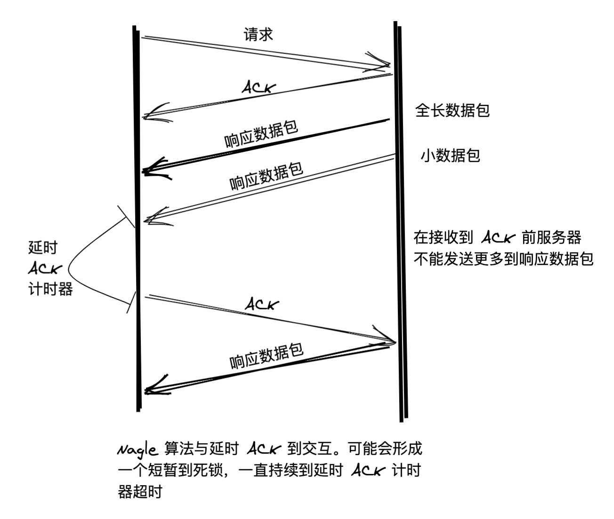

[[TOC]]


# TCP粘包

:::tip 主要参考

* [RFC 896 - IP/TCP 互联网络中的拥塞控制 (ietf.org)](https://datatracker.ietf.org/doc/html/rfc896)

* [翻译版：rfc.ac.cn/cn/rfc896.txt](http://rfc.ac.cn/cn/rfc896.txt)
* [Go语言基础之网络编程 | 李文周的博客 (liwenzhou.com)](https://www.liwenzhou.com/posts/Go/15_socket/#autoid-2-2-3)
* [【TCP/IP】Nagle 算法以及所谓 TCP 粘包 - 周二鸭 - 博客园 (cnblogs.com)](https://www.cnblogs.com/jojop/p/14376423.html)

:::


什么是粘包呢，讲人话就是，本来应该分开的东西，连在了一起。

`talk is cheap, show me the code and the answer`.

<CodeGroup>
<CodeGroupItem title='server.go' active>

```go
package main

import (
	"bufio"
	"fmt"
	"io"
	"net"
)

func process(conn net.Conn) {
	defer conn.Close()
	reader := bufio.NewReader(conn)
	var buf [1024]byte
	for {
		n, err := reader.Read(buf[:])
		if err == io.EOF {
			break
		}
		if err != nil {
			fmt.Println("read from client failed, err:", err)
			break
		}
		recvStr := string(buf[:n])
		fmt.Println("收到client发来的数据：", recvStr)
	}
}

func main() {
	listen, err := net.Listen("tcp", "127.0.0.1:30000")
	if err != nil {
		fmt.Println("listen failed, err:", err)
		return
	}
	defer listen.Close()
	for {
		conn, err := listen.Accept()
		if err != nil {
			fmt.Println("accept failed, err:", err)
			continue
		}
		go process(conn)
	}
}

```

</CodeGroupItem>
<CodeGroupItem title='client.go'>

```go
package main

import (
	"fmt"
	"net"
	"time"
)

func main() {
	conn, err := net.Dial("tcp", "127.0.0.1:30000")
	if err != nil {
		fmt.Println("dial failed, err", err)
		return
	}
	defer conn.Close()
	for i := 0; i < 20; i++ {
		msg := `Hello, Hello. How are you?`
		conn.Write([]byte(msg))
	}
}

```

</CodeGroupItem>
</CodeGroup>

:::details 查看答案之前可以先想一下会输出什么
将上面的代码保存后，分别编译。先启动服务端再启动客户端，可以看到服务端输出结果如下：

> 每个人的结果都不一样，取决于`io`的速度。

```go
收到client发来的数据： Hello, Hello. How are you?Hello, Hello. How are you?Hello, Hello. How are you?Hello, Hello. How are you?Hello, Hello. How are you?Hello, Hello. How are you?Hello, Hello. How are you?Hello, Hello. How are you?Hello, Hello. How are you?Hello, Hello. How are you?Hello, Hello. How are you?Hello, Hello. How are you?Hello, Hello. How are you?Hello, Hello. How are you?
收到client发来的数据： Hello, Hello. How are you?Hello, Hello. How are you?Hello, Hello. How are you?Hello, Hello. How are you?Hello, Hello. How are you?Hello, Hello. How are you?
```

客户端分20次发送的数据，在服务端并没有成功的输出20次，而是多条数据“粘”到了一起。

* 那么怎么让服务端输出20条信息呢？

首先最粗暴的解决办法，就是给客户端加上延时，避免tcp的数据包粘连。

例如加个`1us`,当然时间还可以是其他。


:::

## 为什么会出现粘包

主要原因就是tcp数据传递模式是流模式，在保持长连接的时候可以进行多次的收和发。

“粘包”可发生在发送端也可发生在接收端：

1. 由Nagle算法造成的发送端的粘包：Nagle算法是一种改善网络传输效率的算法。简单来说就是当我们提交一段数据给TCP发送时，TCP并不立刻发送此段数据，而是等待一小段时间看看在等待期间是否还有要发送的数据，若有则会一次把这两段数据发送出去。
2. 接收端接收不及时造成的接收端粘包：TCP会把接收到的数据存在自己的缓冲区中，然后通知应用层取数据。当应用层由于某些原因不能及时的把TCP的数据取出来，就会造成TCP缓冲区中存放了几段数据。 


:::details Nagle算法

* wiki

> **Nagle's algorithm** is a means of improving the efficiency of [TCP/IP](https://en.wikipedia.org/wiki/TCP/IP) networks by reducing the number of packets that need to be sent over the network. It was defined by John Nagle while working for [Ford Aerospace](https://en.wikipedia.org/wiki/Ford_Aerospace). It was published in 1984 as a [Request for Comments](https://en.wikipedia.org/wiki/Request_for_Comments) (RFC) with title *Congestion Control in IP/TCP Internetworks* in [RFC](https://en.wikipedia.org/wiki/RFC_(identifier)) [896](https://datatracker.ietf.org/doc/html/rfc896).

> The RFC describes what he called the "small-packet problem", where an application repeatedly emits data in small chunks, frequently only 1 [byte](https://en.wikipedia.org/wiki/Byte) in size. Since [TCP](https://en.wikipedia.org/wiki/Transmission_Control_Protocol) packets have a 40-byte header (20 bytes for TCP, 20 bytes for [IPv4](https://en.wikipedia.org/wiki/IPv4)), this results in a 41-byte packet for 1 byte of useful information, a huge overhead. This situation often occurs in [Telnet](https://en.wikipedia.org/wiki/Telnet) sessions, where most keypresses generate a single byte of data that is transmitted immediately. Worse, over slow links, many such packets can be in transit at the same time, potentially leading to [congestion collapse](https://en.wikipedia.org/wiki/Congestion_collapse).

> Nagle's algorithm works by combining a number of small outgoing messages and sending them all at once. Specifically, as long as there is a sent packet for which the sender has received no acknowledgment, the sender should keep buffering its output until it has a full packet's worth of output, thus allowing output to be sent all at once.


* 总的来说，就是一种减少在广域网传输的数据包的一种方法。

:::


## 粘包的本质

从上面结果我们也看到了，上层通过 TCP 传递的数据好像被胶水黏在了一起，所以有了所谓的 TCP 粘包问题。但是在这里我们需要纠正的一个点是：TCP 是流协议，根本不存在所谓的粘包一说。

> send(2) Upon successful completion, the number of types which were send is returned.
>
> Otherwise, -1 is returned and the global variable errno is set to indicate the error.
>
> recv(2) These calls return the number of bytes received, or -1 if an error occurred.

文档中已提及：`send` 和 `recv` 的返回值表示成功发送/接收端字节数。所以对于应用层来说，黏包确实是个伪命题，TCP 本来就是一个基于字节流的协议而不是消息包的协议，它只会将你的数据编程字节流发到对面去，而且保证顺序不会乱，而对于字节流的解析，就需要我们自己来搞定了。

## 解决办法

解决黏包问题的最关键一步就是**确定消息边界**。首先我们需要明白什么是消息，在我认为，消息就是一段有意义的信息报文，例如一次 HTTP 请求或者像我们上面代码中所要发送的 `Hello World! This is a test demo.`。

所以我们要找到消息边界，这并不难理解，确定消息边界就是确定消息的开始或者结束。简单地说，就三个办法：

- 定长消息：协议提前约定好包的长度为多少，每当接收端接收到固定长度的字节就确定一个包；
- 消息分隔符：利用特殊符号标志着消息的开始或者结束，例如 HTTP 协议中的换行符；
- 长度前缀：先发送N个字节代表包的大小（注意大端和小端问题），后续解析也按长度读取解析。

:::tip

总结一下这三个方法，其实就是一个**封包**问题。

> 封包就是给一段数据加上包头，这样一来数据包就分为包头和包体两部分内容了(过滤非法包时封包会加入”包尾”内容)。包头部分的长度是固定的，并且它存储了包体的长度，根据包头长度固定以及包头中含有包体长度的变量就能正确的拆分出一个完整的数据包。

:::

### 基于长度前缀进行封包。

我们可以自己定义一个协议，比如数据包的前4个字节为包头，里面存储的是发送的数据的长度。
:::details

<CodeGroup>
<CodeGroupItem title='proto/main.go' active>

```go
package proto

import (
	"bufio"
	"bytes"
	"encoding/binary"
)

// Encode 将消息编码
func Encode(message string) ([]byte, error) {
	// 读取消息的长度，转换成int32类型（占4个字节）
	var length = int32(len(message))
	var pkg = new(bytes.Buffer)
	// 写入消息头
	err := binary.Write(pkg, binary.LittleEndian, length)
	if err != nil {
		return nil, err
	}
	// 写入消息实体
	err = binary.Write(pkg, binary.LittleEndian, []byte(message))
	if err != nil {
		return nil, err
	}
	return pkg.Bytes(), nil
}

// Decode 解码消息
func Decode(reader *bufio.Reader) (string, error) {
	// 读取消息的长度
	lengthByte, _ := reader.Peek(4) // 读取前4个字节的数据
	lengthBuff := bytes.NewBuffer(lengthByte)
	var length int32
	err := binary.Read(lengthBuff, binary.LittleEndian, &length)
	if err != nil {
		return "", err
	}
	// Buffered返回缓冲中现有的可读取的字节数。
	if int32(reader.Buffered()) < length+4 {
		return "", err
	}

	// 读取真正的消息数据
	pack := make([]byte, int(4+length))
	_, err = reader.Read(pack)
	if err != nil {
		return "", err
	}
	return string(pack[4:]), nil
}


```
</CodeGroupItem>
<CodeGroupItem title='server.go'>

```go
package main

import (
	"bufio"
	"fmt"
	"io"
	"net"

	"github.com/csDeng/gostudy/01_study/net/tcp/sticky/solution/proto"
)

func process(conn net.Conn) {
	defer conn.Close()
	reader := bufio.NewReader(conn)
	for {
		// 使用自定义的协议解包
		msg, err := proto.Decode(reader)
		if err == io.EOF {
			return
		}
		if err != nil {
			fmt.Println("decode msg failed, err:", err)
			return
		}
		fmt.Println("收到client发来的数据：", msg)
	}
}

func main() {

	listen, err := net.Listen("tcp", "127.0.0.1:30000")
	if err != nil {
		fmt.Println("listen failed, err:", err)
		return
	}
	defer listen.Close()
	for {
		conn, err := listen.Accept()
		if err != nil {
			fmt.Println("accept failed, err:", err)
			continue
		}
		go process(conn)
	}
}

```
</CodeGroupItem>

<CodeGroupItem title='client.go'>

```go
package main

import (
	"fmt"
	"net"

	"github.com/csDeng/gostudy/01_study/net/tcp/sticky/solution/proto"
)

func main() {
	conn, err := net.Dial("tcp", "127.0.0.1:30000")
	if err != nil {
		fmt.Println("dial failed, err", err)
		return
	}
	defer conn.Close()
	for i := 0; i < 20; i++ {
		msg := `Hello, Hello. How are you?`

		// 使用自定义的协议封包
		data, err := proto.Encode(msg)
		if err != nil {
			fmt.Println("encode msg failed, err:", err)
			return
		}
		conn.Write(data)
	}
}

```

</CodeGroupItem>

</CodeGroup>

输出结果

client没有任何的延时，server正确接收消息。

```go
> go run .\server.go
收到client发来的数据： Hello, Hello. How are you?
收到client发来的数据： Hello, Hello. How are you?
收到client发来的数据： Hello, Hello. How are you?
收到client发来的数据： Hello, Hello. How are you?
收到client发来的数据： Hello, Hello. How are you?
收到client发来的数据： Hello, Hello. How are you?
收到client发来的数据： Hello, Hello. How are you?
收到client发来的数据： Hello, Hello. How are you?
收到client发来的数据： Hello, Hello. How are you?
收到client发来的数据： Hello, Hello. How are you?
收到client发来的数据： Hello, Hello. How are you?
收到client发来的数据： Hello, Hello. How are you?
收到client发来的数据： Hello, Hello. How are you?
收到client发来的数据： Hello, Hello. How are you?
收到client发来的数据： Hello, Hello. How are you?
收到client发来的数据： Hello, Hello. How are you?
收到client发来的数据： Hello, Hello. How are you?
收到client发来的数据： Hello, Hello. How are you?
收到client发来的数据： Hello, Hello. How are you?
收到client发来的数据： Hello, Hello. How are you?
```


:::


## 扩展

### 延时 ACK 与 Nagle 算法结合

延时 ACK 是指接收端不会每个包都发送一次 ACK 确认，而是当接收到一个包后延迟一段时间，以期望这段时间内仍有包被接收到，这是就可以只发送一次 ACK 确认之前收到的数据包，以减少网络带宽压力。

但若将延时 ACK 与 Nagle 算法直接结合使用，得到的效果可能不尽如人意。考虑以下情景，客户端使用延时 ACK 方法发送一个对服务器的请求，而服务端的响应数据并不适合在同一个包中传输，如下图所示：



从图中可以看到，在接收到来自服务器端端两个包以后，客户端并不立即发送 ACK，而是处于等待状态，希望有数据一同捎带发送。通常情况下，TCP 在接收到两个全长的数据包后就应返回一个 ACK，但这里并非如此。在服务器端，由于使用了 Nagle 算法，直到收到 ACK 前都不能发送新数据，因为任一时刻只允许至多一个小数据包在传。因此延时 ACK 与 Nagle 算法的结合导致了某种程度的死锁（两端互相等待对方作出行动），当然这种死锁并不是永久的，在延时 ACK 计时器或者响应端超时之后，将会得到解除。
