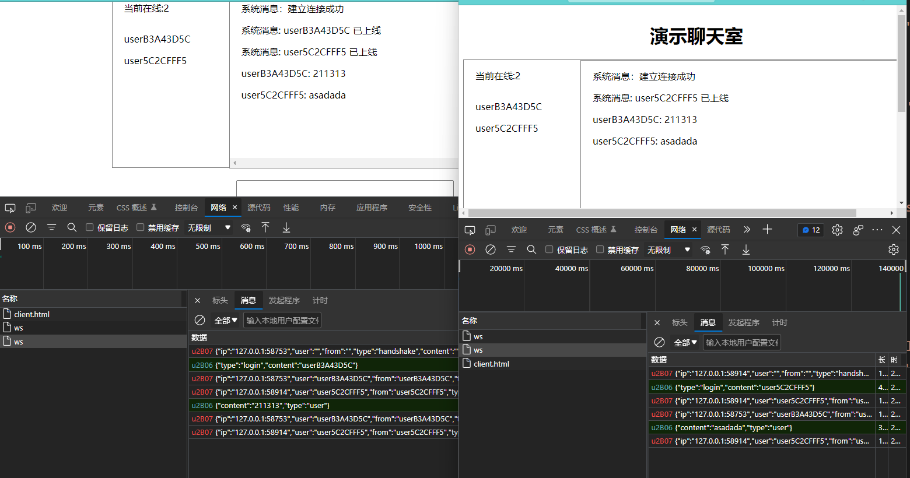
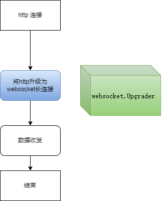

# Websocket 编程

:::tip 本章主要参考

* [WebSocket - 维基百科，自由的百科全书 (wikipedia.org)](https://zh.wikipedia.org/wiki/WebSocket)
* [WebSocket编程 · Go语言中文文档 (topgoer.com)](https://www.topgoer.com/网络编程/WebSocket编程.html)
* [GO实现千万级WebSocket消息推送服务技术分析 - 知乎 (zhihu.com)](https://zhuanlan.zhihu.com/p/100770431)

* [websocket - 云+社区 - 腾讯云 (tencent.com)](https://cloud.tencent.com/developer/article/1835078)

:::


## 是什么

1. WebSocket是一种在单个TCP连接上进行全双工通信的协议

2. WebSocket使得客户端和服务器之间的数据交换变得更加简单，允许服务端主动向客户端推送数据

3. 在WebSocket API中，浏览器和服务器只需要完成一次握手，两者之间就直接可以创建持久性的连接，并进行双向数据传输

## 出现的背景

:::details

早期，很多网站为了实现[推送技术](https://zh.wikipedia.org/wiki/推送技术)，所用的技术都是[轮询](https://zh.wikipedia.org/wiki/輪詢)。轮询是指由浏览器每隔一段时间（如每秒）向服务器发出HTTP请求，然后服务器返回最新的数据给客户端。这种传统的模式带来很明显的缺点，即浏览器需要不断的向服务器发出请求，然而HTTP请求与回复可能会包含较长的[头部](https://zh.wikipedia.org/wiki/HTTP头字段)，其中真正有效的数据可能只是很小的一部分，所以这样会消耗很多带宽资源。

比较新的轮询技术是[Comet](https://zh.wikipedia.org/wiki/Comet_(web技术))。这种技术虽然可以实现双向通信，但仍然需要反复发出请求。而且在Comet中普遍采用的[HTTP长连接](https://zh.wikipedia.org/wiki/HTTP持久链接)也会消耗服务器资源。

在这种情况下，[HTML5](https://zh.wikipedia.org/wiki/HTML5)定义了WebSocket协议，能更好的节省服务器资源和带宽，并且能够更实时地进行通讯。

Websocket使用`ws`或`wss`的[统一资源标志符](https://zh.wikipedia.org/wiki/统一资源标志符)（URI）。其中`wss`表示使用了[TLS](https://zh.wikipedia.org/wiki/TLS)的Websocket。如：

```
ws://example.com/wsapi
wss://secure.example.com/wsapi
```

Websocket与HTTP和HTTPS使用相同的TCP[端口](https://zh.wikipedia.org/wiki/TCP/UDP端口列表)，可以绕过大多数[防火墙](https://zh.wikipedia.org/wiki/防火墙)的限制。默认情况下，Websocket协议使用80端口；运行在TLS之上时，默认使用443端口。

:::

## 主要应用场景

`websocket`主要应用于前端页面实时刷新的场景，比如说聊天室，视频直播，实体轨迹等等。

而在`websocket`出现之前，如果想要实时刷新，一般是通过前端不停地轮询后端接口，以获取实时数据。

这样的形式有什么问题呢？

> 设想后端是一个事件触发型服务，也就是说它的数据只会在某一个事件触发之后才会发生变化，此时前端在一直轮询的过程，将会获得大量相同的数据包也就是无效包，导致了大量的资源损耗。

为了解决类似问题，`websocket`应运而生，它允许后端通过连接主动向前端推送数据，前端不再需要大量的轮询，只需要维护与后端的一个长连接即可，一定程度上避免了资源损耗。


## websocket的优点

:::details

- 较少的控制开销。在连接创建后，服务器和客户端之间交换数据时，用于协议控制的数据包头部相对较小。在不包含扩展的情况下，对于服务器到客户端的内容，此头部大小只有2至10[字节](https://zh.wikipedia.org/wiki/字节)（和数据包长度有关）；对于客户端到服务器的内容，此头部还需要加上额外的4字节的[掩码](https://zh.wikipedia.org/wiki/掩码)。相对于HTTP请求每次都要携带完整的头部，此项开销显著减少了。

- 更强的实时性。由于协议是全双工的，所以服务器可以随时主动给客户端下发数据。相对于HTTP请求需要等待客户端发起请求服务端才能响应，延迟明显更少；即使是和Comet等类似的[长轮询](https://zh.wikipedia.org/w/index.php?title=长轮询&action=edit&redlink=1)比较，其也能在短时间内更多次地传递数据。

- 保持连接状态。与HTTP不同的是，Websocket需要先创建连接，这就使得其成为一种有状态的协议，之后通信时可以省略部分状态信息。而HTTP请求可能需要在每个请求都携带状态信息（如身份认证等）。

- 更好的二进制支持。Websocket定义了[二进制](https://zh.wikipedia.org/wiki/二进制)帧，相对HTTP，可以更轻松地处理二进制内容。

- 可以支持扩展。Websocket定义了扩展，用户可以扩展协议、实现部分自定义的子协议。如部分浏览器支持[压缩](https://zh.wikipedia.org/wiki/数据压缩)等。

- 更好的压缩效果。相对于[HTTP压缩](https://zh.wikipedia.org/wiki/HTTP压缩)，Websocket在适当的扩展支持下，可以沿用之前内容的[上下文](https://zh.wikipedia.org/wiki/上下文)，在传递类似的数据时，可以显著地提高压缩率。[[14\]](https://zh.wikipedia.org/wiki/WebSocket#cite_note-14)

:::


## websocket的协议切换

WebSocket 是独立的、创建在TCP上的协议。

Websocket 通过 [HTTP](https://zh.wikipedia.org/wiki/HTTP)/1.1 协议的101[状态码](https://zh.wikipedia.org/wiki/HTTP状态码)进行握手。

为了创建Websocket连接，需要通过浏览器发出请求，之后服务器进行回应，这个过程通常称为“[握手](https://zh.wikipedia.org/wiki/握手_(技术))”（Handshaking）。

一个典型的Websocket握手请求如下[[15\]](https://zh.wikipedia.org/wiki/WebSocket#cite_note-15)：

:::details 

客户端请求：

```shell
GET /chat HTTP/1.1
Host: server.example.com
Upgrade: websocket
Connection: Upgrade
Sec-WebSocket-Key: dGhlIHNhbXBsZSBub25jZQ==
Origin: http://example.com
Sec-WebSocket-Protocol: chat, superchat
Sec-WebSocket-Version: 13
```

服务器回应：

```shell
HTTP/1.1 101 Switching Protocols
Upgrade: websocket
Connection: Upgrade
Sec-WebSocket-Accept: s3pPLMBiTxaQ9kYGzzhZRbK+xOo=
Sec-WebSocket-Protocol: chat
```

字段说明

- `Connection`必须设置`Upgrade`，表示客户端希望连接升级。
- `Upgrade`字段必须设置`Websocket`，表示希望升级到Websocket协议。
- `Sec-WebSocket-Key`是随机的字符串，服务器端会用这些数据来构造出一个SHA-1的信息摘要。把“`Sec-WebSocket-Key`”加上一个特殊字符串“`258EAFA5-E914-47DA-95CA-C5AB0DC85B11`”，然后计算[SHA-1](https://zh.wikipedia.org/wiki/SHA-1)摘要，之后进行[Base64](https://zh.wikipedia.org/wiki/Base64)编码，将结果做为“`Sec-WebSocket-Accept`”头的值，返回给客户端。如此操作，可以尽量避免普通HTTP请求被误认为Websocket协议。
- `Sec-WebSocket-Version` 表示支持的Websocket版本。RFC6455要求使用的版本是13，之前草案的版本均应当弃用。
- `Origin`字段是必须的。如果缺少`origin`字段，`WebSocket`服务器需要回复HTTP 403 状态码（禁止访问）。[[16\]](https://zh.wikipedia.org/wiki/WebSocket#cite_note-16)
- 其他一些定义在HTTP协议中的字段，如[Cookie](https://zh.wikipedia.org/wiki/Cookie)等，也可以在Websocket中使用。

:::


---


需要安装第三方包：
cmd中：`go get -u -v github.com/gorilla/websocket`

## 举个聊天室的小例子

:::details

<CodeGroup>
<CodeGroupItem title='server.go' active>

```go
package main

import (
	"encoding/json"
	"fmt"
	"net/http"

	"github.com/gorilla/websocket"
)

type Data struct {
	Ip       string   `json:"ip"`
	User     string   `json:"user"`
	From     string   `json:"from"`
	Type     string   `json:"type"`
	Content  string   `json:"content"`
	UserList []string `json:"user_list"`
}

func main() {

	http.HandleFunc("/ws", myws)

	go h.run()

	if err := http.ListenAndServe("127.0.0.1:8080", nil); err != nil {
		fmt.Println("err:", err)
	}
}

type hub struct {
	c map[*connection]bool
	b chan []byte
	r chan *connection
	u chan *connection
}

var h = hub{
	c: make(map[*connection]bool),
	u: make(chan *connection),
	b: make(chan []byte),
	r: make(chan *connection),
}

func (h *hub) run() {
	for {
		select {
		case c := <-h.r:
			h.c[c] = true
			c.data.Ip = c.ws.RemoteAddr().String()
			c.data.Type = "handshake"
			c.data.UserList = user_list
			data_b, _ := json.Marshal(c.data)
			c.sc <- data_b
		case c := <-h.u:
			if _, ok := h.c[c]; ok {
				delete(h.c, c)
				close(c.sc)
			}
		case data := <-h.b:
			for c := range h.c {
				select {
				case c.sc <- data:
				default:
					delete(h.c, c)
					close(c.sc)
				}
			}
		}
	}
}

/**
连接
**/
type connection struct {
	ws   *websocket.Conn
	sc   chan []byte
	data *Data
}

/**
将http协议升级到websocket协议
**/
var wu = &websocket.Upgrader{
	HandshakeTimeout: 0,
	ReadBufferSize:   512,
	WriteBufferSize:  512,
	WriteBufferPool:  nil,
	Subprotocols:     []string{},
	Error: func(w http.ResponseWriter, r *http.Request, status int, reason error) {
	},
	CheckOrigin: func(r *http.Request) bool {
		return true
	},
	EnableCompression: false,
}

/**
http 的handleFunc
**/
func myws(w http.ResponseWriter, r *http.Request) {
	ws, err := wu.Upgrade(w, r, nil)
	if err != nil {
		return
	}
	c := &connection{sc: make(chan []byte, 256), ws: ws, data: &Data{}}
	h.r <- c
	go c.writer()
	c.reader()
	defer func() {
		c.data.Type = "logout"
		user_list = del(user_list, c.data.User)
		c.data.UserList = user_list
		c.data.Content = c.data.User
		data_b, _ := json.Marshal(c.data)
		h.b <- data_b
		h.r <- c
	}()
}

func (c *connection) writer() {
	for message := range c.sc {
		c.ws.WriteMessage(websocket.TextMessage, message)
	}
	c.ws.Close()
}

var user_list = []string{}

func (c *connection) reader() {
	for {
		_, message, err := c.ws.ReadMessage()
		if err != nil {
			h.r <- c
			break
		}
		json.Unmarshal(message, &c.data)
		switch c.data.Type {
		case "login":
			c.data.User = c.data.Content
			c.data.From = c.data.User
			user_list = append(user_list, c.data.User)
			c.data.UserList = user_list
			data_b, _ := json.Marshal(c.data)
			h.b <- data_b
		case "user":
			c.data.Type = "user"
			data_b, _ := json.Marshal(c.data)
			h.b <- data_b
		case "logout":
			c.data.Type = "logout"
			user_list = del(user_list, c.data.User)
			data_b, _ := json.Marshal(c.data)
			h.b <- data_b
			h.r <- c
		default:
			fmt.Print("========default================")
		}
	}
}

func del(slice []string, user string) []string {
	count := len(slice)
	if count == 0 {
		return slice
	}
	if count == 1 && slice[0] == user {
		return []string{}
	}
	var n_slice = []string{}
	for i := range slice {
		if slice[i] == user && i == count {
			return slice[:count]
		} else if slice[i] == user {
			n_slice = append(slice[:i], slice[i+1:]...)
			break
		}
	}
	fmt.Println(n_slice)
	return n_slice
}


```

</CodeGroupItem>
<CodeGroupItem title='client.html'>

```html
<!DOCTYPE html>
<html>
<head>
    <title></title>
    <meta http-equiv="content-type" content="text/html;charset=utf-8">
    <style>
        p {
            text-align: left;
            padding-left: 20px;
        }
    </style>
</head>
<body>
<div style="width: 800px;height: 600px;margin: 30px auto;text-align: center">
    <h1>www.5lmh.comy演示聊天室</h1>
    <div style="width: 800px;border: 1px solid gray;height: 300px;">
        <div style="width: 200px;height: 300px;float: left;text-align: left;">
            <p><span>当前在线:</span><span id="user_num">0</span></p>
            <div id="user_list" style="overflow: auto;">
            </div>
        </div>
        <div id="msg_list" style="width: 598px;border:  1px solid gray; height: 300px;overflow: scroll;float: left;">
        </div>
    </div>
    <br>
    <textarea id="msg_box" rows="6" cols="50" onkeydown="confirm(event)"></textarea><br>
    <input type="button" value="发送" onclick="send()">
</div>
</body>
</html>
<script type="text/javascript">
    var uname = prompt('请输入用户名', 'user' + uuid(8, 16));
    var ws = new WebSocket("ws://127.0.0.1:8080/ws");
    ws.onopen = function () {
        var data = "系统消息：建立连接成功";
        listMsg(data);
    };
    ws.onmessage = function (e) {
        var msg = JSON.parse(e.data);
        var sender, user_name, name_list, change_type;
        switch (msg.type) {
            case 'system':
                sender = '系统消息: ';
                break;
            case 'user':
                sender = msg.from + ': ';
                break;
            case 'handshake':
                var user_info = {'type': 'login', 'content': uname};
                sendMsg(user_info);
                return;
            case 'login':
            case 'logout':
                user_name = msg.content;
                name_list = msg.user_list;
                change_type = msg.type;
                dealUser(user_name, change_type, name_list);
                return;
        }
        var data = sender + msg.content;
        listMsg(data);
    };
    ws.onerror = function () {
        var data = "系统消息 : 出错了,请退出重试.";
        listMsg(data);
    };
    function confirm(event) {
        var key_num = event.keyCode;
        if (13 == key_num) {
            send();
        } else {
            return false;
        }
    }
    function send() {
        var msg_box = document.getElementById("msg_box");
        var content = msg_box.value;
        var reg = new RegExp("\r\n", "g");
        content = content.replace(reg, "");
        var msg = {'content': content.trim(), 'type': 'user'};
        sendMsg(msg);
        msg_box.value = '';
    }
    function listMsg(data) {
        var msg_list = document.getElementById("msg_list");
        var msg = document.createElement("p");
        msg.innerHTML = data;
        msg_list.appendChild(msg);
        msg_list.scrollTop = msg_list.scrollHeight;
    }
    function dealUser(user_name, type, name_list) {
        var user_list = document.getElementById("user_list");
        var user_num = document.getElementById("user_num");
        while(user_list.hasChildNodes()) {
            user_list.removeChild(user_list.firstChild);
        }
        for (var index in name_list) {
            var user = document.createElement("p");
            user.innerHTML = name_list[index];
            user_list.appendChild(user);
        }
        user_num.innerHTML = name_list.length;
        user_list.scrollTop = user_list.scrollHeight;
        var change = type == 'login' ? '上线' : '下线';
        var data = '系统消息: ' + user_name + ' 已' + change;
        listMsg(data);
    }
    function sendMsg(msg) {
        var data = JSON.stringify(msg);
        ws.send(data);
    }
    function uuid(len, radix) {
        var chars = '0123456789ABCDEFGHIJKLMNOPQRSTUVWXYZabcdefghijklmnopqrstuvwxyz'.split('');
        var uuid = [], i;
        radix = radix || chars.length;
        if (len) {
            for (i = 0; i < len; i++) uuid[i] = chars[0 | Math.random() * radix];
        } else {
            var r;
            uuid[8] = uuid[13] = uuid[18] = uuid[23] = '-';
            uuid[14] = '4';
            for (i = 0; i < 36; i++) {
                if (!uuid[i]) {
                    r = 0 | Math.random() * 16;
                    uuid[i] = chars[(i == 19) ? (r & 0x3) | 0x8 : r];
                }
            }
        }
        return uuid.join('');
    }
</script>

```
</CodeGroupItem>
</CodeGroup>

运行
`go run server.go`
运行之后执行local.html文件

运行结果




:::

* 整体流程



## 关于websocket的一些疑问

有疑问才能学得更好哦


### 1. 如何保证webscket的高可用


### 2. 怎么判断某个连接是否有效


### 3. 如何及时关闭无效连接


## 扩展

### 拉模式与推模式的区别

* 拉模式（定时轮询访问接口获取数据）

  1. 数据更新频率低，则大多数的数据请求时无效的

  2. 在线用户数量多，则服务端的查询负载很高

  3. 定时轮询拉取，无法满足时效性要求

* 推模式（向客户端进行数据的推送）

  1. 仅在数据更新时，才有推送

  2. 需要维护大量的在线长连接

  3. 数据更新后，可以立即推送
