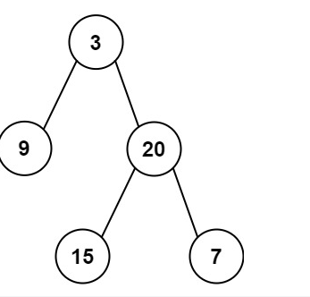
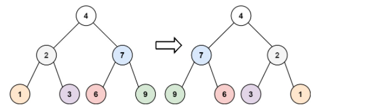

# 二叉树

## 1. 左叶子之和

:::details

> 给定二叉树的根节点 root ，返回所有左叶子之和。
>
>  
>
> 示例 1：
>
> 
>
> 输入: root = [3,9,20,null,null,15,7] 
> 输出: 24 
> 解释: 在这个二叉树中，有两个左叶子，分别是 9 和 15，所以返回 24
> 示例 2:
>
> 输入: root = [1]
> 输出: 0
>
>
> 提示:
>
> 节点数在 [1, 1000] 范围内
> -1000 <= Node.val <= 1000
>
> 来源：力扣（LeetCode）
> 链接：https://leetcode.cn/problems/sum-of-left-leaves
> 著作权归领扣网络所有。商业转载请联系官方授权，非商业转载请注明出处。


```go
/**
 * Definition for a binary tree node.
 * type TreeNode struct {
 *     Val int
 *     Left *TreeNode
 *     Right *TreeNode
 * }
 */
func sumOfLeftLeaves(root *TreeNode) int {
    if root == nil {
        return 0
    }
    left := sumOfLeftLeaves(root.Left)
    right := sumOfLeftLeaves(root.Right)
    mid := 0
    if root.Left != nil && root.Left.Left == nil && root.Left.Right == nil  {
        // 叶子
        mid = root.Left.Val
    } 
    return left + right + mid

}


```


:::


## 2. 翻转二叉树 E

:::details

> 给你一棵二叉树的根节点 root ，翻转这棵二叉树，并返回其根节点。
>
>  
>
> 示例 1：
>
> 
>
> 输入：root = [4,2,7,1,3,6,9]
> 输出：[4,7,2,9,6,3,1]
> 示例 2：
>
> 
>
> 输入：root = [2,1,3]
> 输出：[2,3,1]
> 示例 3：
>
> 输入：root = []
> 输出：[]
>
> 来源：力扣（LeetCode）
> 链接：https://leetcode.cn/problems/invert-binary-tree
> 著作权归领扣网络所有。商业转载请联系官方授权，非商业转载请注明出处。


```go
/**
 * Definition for a binary tree node.
 * type TreeNode struct {
 *     Val int
 *     Left *TreeNode
 *     Right *TreeNode
 * }
 */
func invertTree(root *TreeNode) *TreeNode {
    dfs(root)
    return root
}

func dfs(root *TreeNode) {
    if root == nil {
        return 
    }
    reg := root.Left
    root.Left = root.Right
    root.Right = reg
    dfs(root.Left)
    dfs(root.Right)
}
```


:::