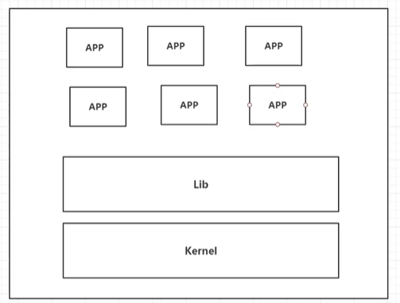
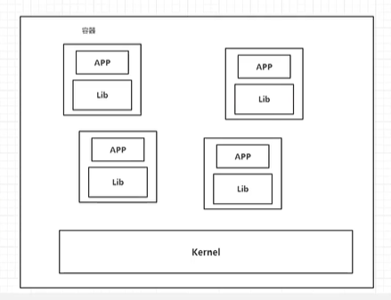

# Docker为什么出现

一款产品： 开发--上线 -->两套环境 | 应用配置

开发即运维！

环境配置十分麻烦，每一个机器都要部署环境（Redis, ES, Hadoop） 费时费力

项目带上配置环境安装打包。

传统： 开发`jar`， 运维来做

现在： 开发打包部署上线，一套流程做完！

> java -- apk --发布 （应用商店） --张三使用apk-- 安装即可用
>
> java -- jar(环境) ---打包项目带上环境(镜像) -- `Docker`仓库（商店）--下载我们发布的镜像--直接运行即可

`Docker` 给以上问题，提出了解决方案。

`Docker`的思想就来自于集装箱

>  JRE -- 多个应用（端口冲突） --- 原来都是交叉的

* `Docker`的核心思想--> ==隔离==

# Docker 是基于GO开发的，开源项目

# 虚拟机的技术

* 虚拟机的缺点

1. 启动慢
2. 占用资源多
3. 启动慢

# 容器化技术

>  ==容器化技术模拟的不是一个完整的操作系统==

# 比较Docker与虚拟机

* 传统的虚拟机，虚拟出一套硬件，运行一个完整的操作系统，然后在这个系统上安装运行软件

* 容器内的应用直接运行在宿主的内容，容器没有自己的内核，也没有虚拟化的硬件，所以轻便

* 每个容器件相互隔离，每个容器内都有一个属于自己的文件系统，互不影响。

* `Docker`是跨平台的

  

> DevOps(开发。运维)
>
> 更快地交付和部署

传统： 一堆帮助文档、安装程序

Docker: 打包镜像发布测试，一键运行

> 更便捷的升级和扩缩容

* 使用Docker之后，我们部署应用就和搭积木一样

> 更简单的系统运维

在容器化之后，我们的开发，测试环境是高度一致的。

> 更高效的计算资源利用

Docker 是内核级别的虚拟化，可以在一个物理机上运行很多的容器实例，服务器的性能可以杯压榨到极致

