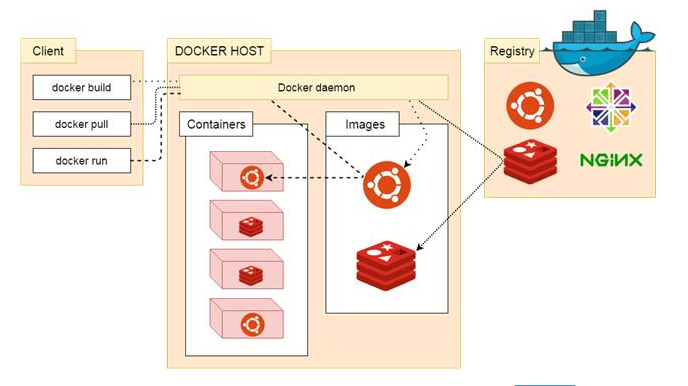
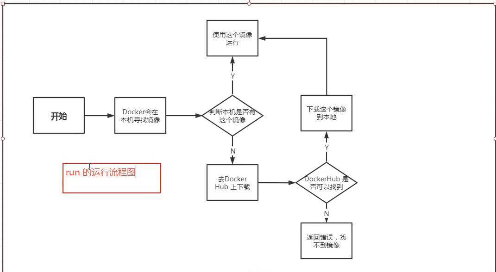
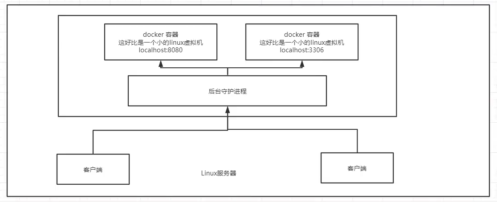
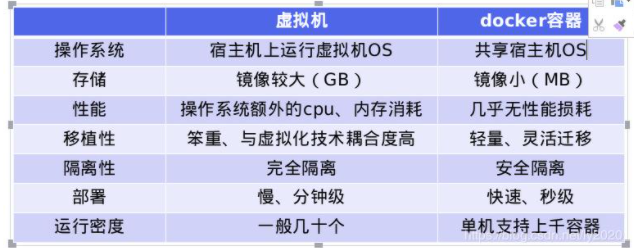

# Docker的基本名词



* 镜像(iamge)：

`Docker` 镜像就好比是一个模板，可以通过这个模板来创建容器服务，

* 容器（container）:

`Docker`利用容器技术，独立运行一个或则多个应用，通过镜像来创建的。

启动，停止，删除，基本命令！

目前可以把这个容器理解为一个简易的`linux`系统

* 仓库(repository):

仓库就是存放镜像的地方。

仓库分为公有仓库和私有仓库。

`Docker Hub` (默认是国外的)。

利用阿里云容器服务器(进行镜像加速)。

 

# 安装Docker

> 环境准备

1. 需要会一点点`linux`命令
2. CentOS 7
3. 利用`Xshell` 链接远程服务器进行操作


# 基本命令

1. 环境查看

   查看`uname`

   ```shell
   cat /etc/os-release
   ```

   

   > NAME="Ubuntu"
   > VERSION="20.04.2 LTS (Focal Fossa)"
   > ID=ubuntu
   > ID_LIKE=debian
   > PRETTY_NAME="Ubuntu 20.04.2 LTS"
   > VERSION_ID="20.04"
   > HOME_URL="https://www.ubuntu.com/"
   > SUPPORT_URL="https://help.ubuntu.com/"
   > BUG_REPORT_URL="https://bugs.launchpad.net/ubuntu/"
   > PRIVACY_POLICY_URL="https://www.ubuntu.com/legal/terms-and-policies/privacy-policy"
   > VERSION_CODENAME=focal
   > UBUNTU_CODENAME=focal

2. 帮助文档

   ```shel
   https://docs.docker.com/engine/install/
   ```

   

# 阿里云镜像加速

1. 登录阿里云
2. 找到镜像加速
3. 配置使用


# Run 的流程以及Docker原理



* Docker的底层

  > Docker 是怎么工作的？

  Docker是一个CS结构的系统，Docker的守护进程运行在主机上，通过Socket从客户端访问

  DockerServer 接收到DockerClient 的指令，就会执行这个指令

* 

# Docker为什么比VM快？

* 1. Docker有着比虚拟机更少的抽象层。
  2. Docker利用的是宿主机的内核，`VM`需要的是`Guest OS`.


* 所以说，新建一个容器的时候， docker不需要像虚拟机一样重新加载一个操作系统的内核，避免引导。虚拟机加载`GuestOS` ，分钟级别，而`Docker` 是利用宿主的操作系统，省略了这个复杂的过程，秒级。

  