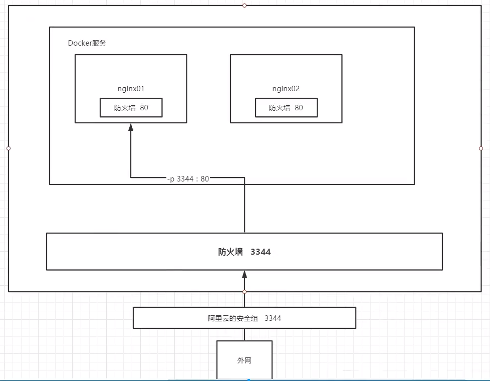

## 基本步骤

1. 搜索

   > root@DESKTOP-GC42A9O:/home# docker search nginx
   > NAME                               DESCRIPTION                                     STARS     OFFICIAL   AUTOMATED
   > nginx                              Official build of Nginx.                        14613     [OK]

2. 下载`Nginx`

> root@DESKTOP-GC42A9O:/home# docker pull nginx
>
> Using default tag: latest
> latest: Pulling from library/nginx
> 6f28985ad184: Already exists
> 29f7ebf60efd: Pull complete
> 879a7c160ac6: Pull complete
> de58cd48a671: Pull complete
> be704f37b5f4: Pull complete
> 158aac73782c: Pull complete
> Digest: sha256:d2925188effb4ddca9f14f162d6fba9b5fab232028aa07ae5c1dab764dca8f9f
> Status: Downloaded newer image for nginx:latest
> docker.io/library/nginx:latest

3. 启动`Nginx`

> # 后台启动nginx, 宿主机端口为3344, 容器端口为80 
>
> root@DESKTOP-GC42A9O:/home# docker run -d --name nginx01 -p 3344:80 nginx
> 535688ee3bd57ba85f08f76e36d3cb924030b68ab8266c48489f40e262106f9b
> root@DESKTOP-GC42A9O:/home# docker ps
> CONTAINER ID   IMAGE     COMMAND                  CREATED          STATUS          PORTS                  NAMES
> 535688ee3bd5   nginx     "/docker-entrypoint.…"   32 seconds ago   Up 31 seconds   0.0.0.0:3344->80/tcp   nginx01
> ef95968ca93c   centos    "/bin/bash"              39 minutes ago   Up 39 minutes                          strange_shirley

4. 可以通过局域网`ip` 访问容器内服务
5. 图解



6. 测试代码

```js


root@DESKTOP-GC42A9O:/home# curl localhost:3344
<!DOCTYPE html>
<html>
<head>
<title>Welcome to nginx!</title>
<style>
    body {
        width: 35em;
        margin: 0 auto;
        font-family: Tahoma, Verdana, Arial, sans-serif;
    }
</style>
</head>
<body>
<h1>Welcome to nginx!</h1>
<p>If you see this page, the nginx web server is successfully installed and
working. Further configuration is required.</p>

<p>For online documentation and support please refer to
<a href="http://nginx.org/">nginx.org</a>.<br/>
Commercial support is available at
<a href="http://nginx.com/">nginx.com</a>.</p>

<p><em>Thank you for using nginx.</em></p>
</body>
</html>


root@DESKTOP-GC42A9O:/home# ifconfig

docker0: flags=4163<UP,BROADCAST,RUNNING,MULTICAST>  mtu 1500
        inet 172.17.0.1  netmask 255.255.0.0  broadcast 172.17.255.255
        inet6 fe80::42:71ff:feda:e70e  prefixlen 64  scopeid 0x20<link>
        ether 02:42:71:da:e7:0e  txqueuelen 0  (Ethernet)
        RX packets 7  bytes 1174 (1.1 KB)
        RX errors 0  dropped 0  overruns 0  frame 0
        TX packets 30  bytes 2518 (2.5 KB)
        TX errors 0  dropped 0 overruns 0  carrier 0  collisions 0

eth0: flags=4163<UP,BROADCAST,RUNNING,MULTICAST>  mtu 1500
        inet 192.168.85.37  netmask 255.255.255.240  broadcast 192.168.85.47
        inet6 fe80::215:5dff:feff:257c  prefixlen 64  scopeid 0x20<link>
        ether 00:15:5d:ff:25:7c  txqueuelen 1000  (Ethernet)
        RX packets 341653  bytes 503148016 (503.1 MB)
        RX errors 0  dropped 0  overruns 0  frame 0
        TX packets 108759  bytes 7822709 (7.8 MB)
        TX errors 0  dropped 0 overruns 0  carrier 0  collisions 0


root@DESKTOP-GC42A9O:/home# docker ps
CONTAINER ID   IMAGE     COMMAND                  CREATED          STATUS          PORTS                  NAMES
535688ee3bd5   nginx     "/docker-entrypoint.…"   4 minutes ago    Up 4 minutes    0.0.0.0:3344->80/tcp   nginx01
ef95968ca93c   centos    "/bin/bash"              43 minutes ago   Up 43 minutes                          strange_shirley
root@DESKTOP-GC42A9O:/home# docker exec 535688ee3bd5
"docker exec" requires at least 2 arguments.
See 'docker exec --help'.

Usage:  docker exec [OPTIONS] CONTAINER COMMAND [ARG...]

Run a command in a running container


root@DESKTOP-GC42A9O:/home# docker exec -it 535688ee3bd5 /bin/bash
root@535688ee3bd5:/# ls
bin   dev                  docker-entrypoint.sh  home  lib64  mnt  proc  run   srv  tmp  var
boot  docker-entrypoint.d  etc                   lib   media  opt  root  sbin  sys  usr


root@535688ee3bd5:/# whereis nginx
nginx: /usr/sbin/nginx /usr/lib/nginx /etc/nginx /usr/share/nginx

root@535688ee3bd5:/# cd  /etc/nginx /usr/share/nginx

root@535688ee3bd5:/# ls
bin   dev                  docker-entrypoint.sh  home  lib64  mnt  proc  run   srv  tmp  var
boot  docker-entrypoint.d  etc                   lib   media  opt  root  sbin  sys  usr
root@535688ee3bd5:/# cd  /etc/nginx/usr/share/nginx
bash: cd: /etc/nginx/usr/share/nginx: No such file or directory
root@535688ee3bd5:/# cd  /etc/nginx
root@535688ee3bd5:/etc/nginx# ls
conf.d  fastcgi_params  koi-utf  koi-win  mime.types  modules  nginx.conf  scgi_params  uwsgi_params  win-utf
```

