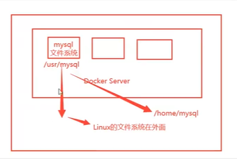
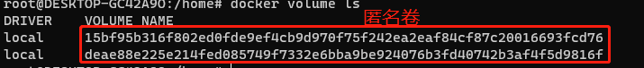
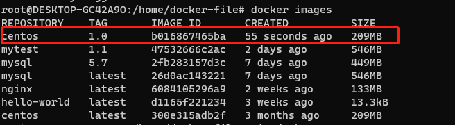
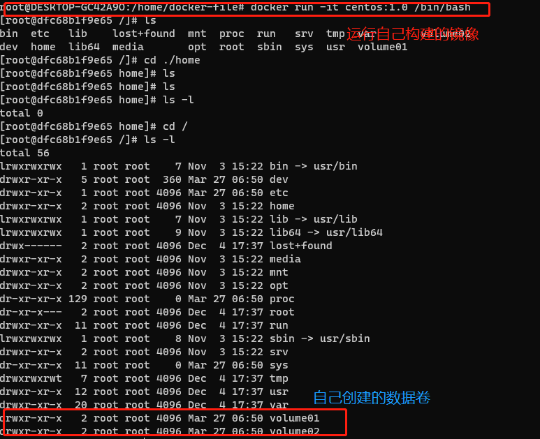
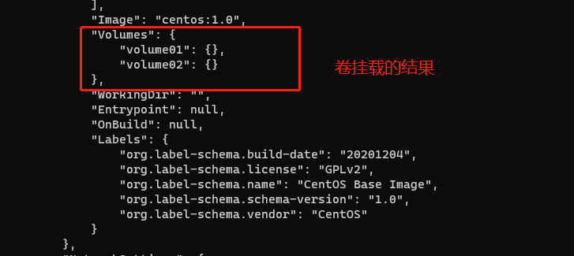
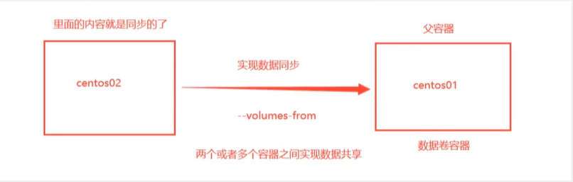
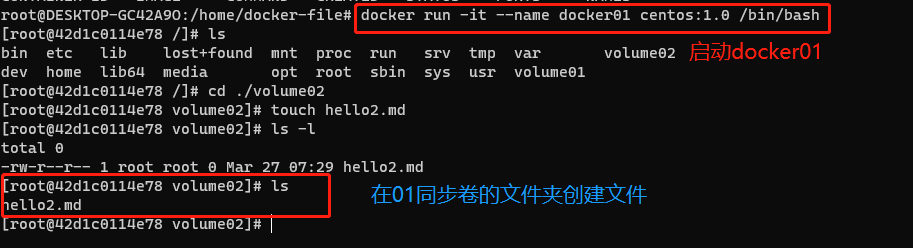
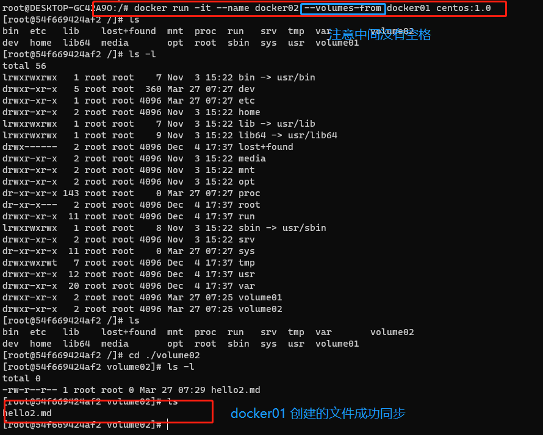

[TOC]


# 1、 什么是容器卷

`docker` 的理念回顾

> 将应用和环境打包成一个镜像！


数据？ 如果数据都在容器中，那么如果容器被删除，就会导致数据丢失！！！

> 需求：数据可以持久化

`MySQL` ，容器被删除，容器删了，数据库也没了。 ---> 相当于删库跑路

> 需求： 容器之间可以有一个数据共享的技术！Docker 容器中产生的数据，同步到本地

这些就需要卷技术！！`目录挂载`， 将我们的容器内的目录，挂载到`linux`上面！



> 总结一句话，容器的持久化和同步操作！ 荣期间也是可以数据共享的！！！

# 2、使用数据卷

## 方式一：直接使用命令来进行挂载

```shell
docker run -it -v  主机目录: 容器内目录

## 查看是否成功挂载
docker inspect 容器id
```

> 挂载成功的结果如下

```shell
 "Mounts": [
            {
                "Type": "bind",
                "Source": "/home",
                "Destination": "/home",
                "Mode": "",
                "RW": true,
                "Propagation": "rprivate"
            }
        ],
```

> 成功之后，主机目录与容器目录将会实现双向绑定，实现同步数据！！！


* 好处：以后只需要在本地修改文件，即可在容器内自动同步！！！

## 具名挂载与匿名挂载

```shell
# 匿名挂载
-v 容器内路径
docker run -d -p --name ngix01 -v /etc/ngix ngix


# 查看所有的卷的信息
docker volume ls

```



> 匿名挂载，我们在 `-v` 只写了容器内的路径， 没有写容器外的路径


# 3、dockersDockerfile

> Dockerfile就是用来构建docker镜像的文件； 一段命令脚本
>
> 通过这个脚本可以生曾镜像。
>
> 镜像是一层层的，脚本一个个的命令，每个命令都是一层。

* 命令脚本

```shell
  1 FROM centos
  2
  3 VOLUME ["volume01","volume02"]
  4
  5 CMD echo "----------end-------"
  6 CMD /bin/bash
```

* 构建镜像

  ```shell
   docker build -f /home/docker-file/dockerfile1 -t centos:1.0 .
   # docker build -f 脚本路径 -t 镜像:tag  .
   # . 表示当前路径
   
  ```

* 构建结果

```shell
root@DESKTOP-GC42A9O:/home/docker-file# docker build -f /home/docker-file/dockerfile1 -t centos:1.0 .


Sending build context to Docker daemon  3.072kB
Step 1/4 : FROM centos
 ---> 300e315adb2f
Step 2/4 : VOLUME ["volume01","volume02"]
 ---> Running in 838bce845a20
Removing intermediate container 838bce845a20
 ---> 1b7f36e95795
Step 3/4 : CMD echo "----------end-------"
 ---> Running in 3f0249a626be
Removing intermediate container 3f0249a626be
 ---> 054e1810afbe
Step 4/4 : CMD /bin/bash
 ---> Running in cfa10d35a91a
Removing intermediate container cfa10d35a91a
 ---> b016867465ba
Successfully built b016867465ba
Successfully tagged centos:1.0
```








* 这种方式的构建，我们会经常用，因为我们要构建自己的镜像
* 假设构建的时候没有挂载卷，要手动镜像挂在` - v 卷名:容器内路径`

# 4、数据卷容器

> 多个`mySQL `同步数据



* docker 01



* docker 02




# 5、总结

容器之间配置信息的传递，数据卷容器的生命周期一直持续到没有容器使用为止

但是一旦持久化了本地，本地的数据就不会删除


