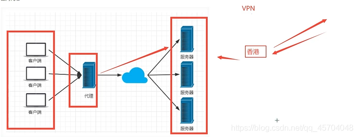
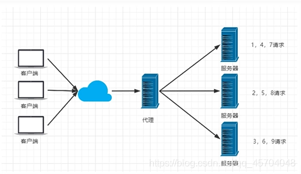
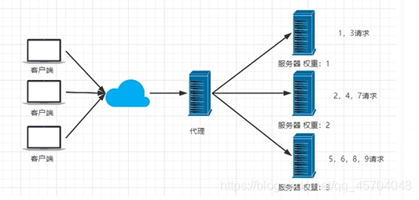
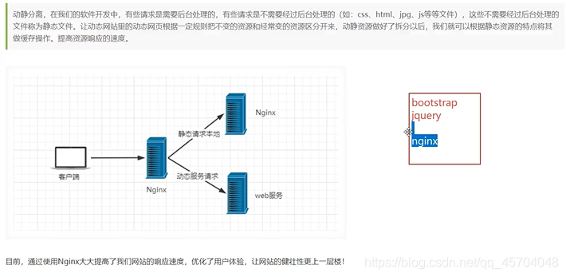
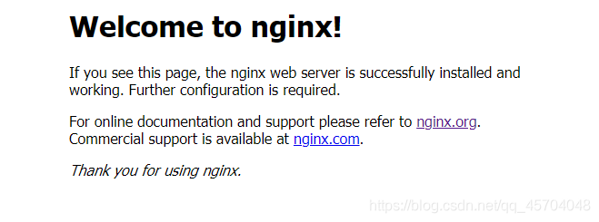
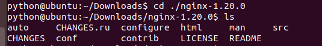
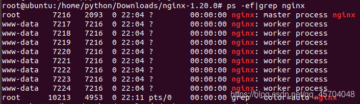
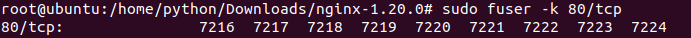
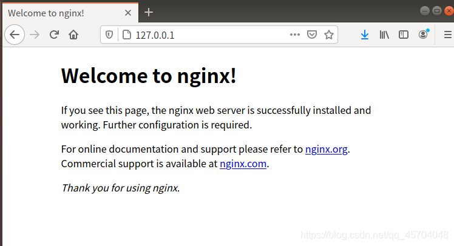

==遇见狂神说的Nginx视频学习笔记==

# 1、什么是`Nginx`

Nginx("engine x")是一款是由俄罗斯的程序设计师Igor Sysoev所开发高性能的 Web和 反向代理 服务器，也是一个 IMAP/POP3/SMTP 代理服务器。

在高连接并发的情况下，Nginx是Apache服务器不错的替代品。
> Nginx代码完全用C从头写成，官方数据测试表明能够支撑高达`5w`个并发链接数的响应。
* 特点
1. 占用内存少，并发能力强
2. 安装简单、配置简洁
3. 启动简单，可以`7*24`不间断运行


# 2、Nginx的作用

## 2.1 正向代理
> 代理客户端
> 
---

## 2.2 反向代理
> 代理服务器
> 
---

## 2.3、负载均衡
> `Nginx`提供的负载均衡策略有两种：内置策略和扩展策略。
* 内置策略
1. 轮询
> 轮询策略比较简单，就是将每个前端请求按顺序（时间顺序或者排列次序）逐一分配到不同的后端节点上，对于出现问题的后端节点自动排除。
> 


2. 加权轮询
> 加权轮询策略，顾名思义，就是在基本的轮询策略上考虑各后端节点接受请求的权重，指定各后端节点被轮询到的几率。加权轮询策略主要用于后端节点性能不均的情况。根据后端节点性能的实际情况，我们可以在Nginx服务器的配置文件中调整权值，使得整个网络对前端请求达到最佳的响应能力。
> 

4. `ip hash`
> `iphash`对客户端请求的ip进行`hash`操作，然后根据hash结果将同一个客户端ip的请求分发到同一个服务器进行处理，可以解决`session`不共享的问题。
> 
---

* 扩展均衡

## 2.4、动静分离


# 3、`Nginx`安装
## 3.1 `Windows`
1. [下载](http://nginx.org/en/download.html)
2. 解压

3. 启动`Nginx`
方法：
> 1. 双击启动（不推荐，因为会一闪而过）
> 2. 使用命令行启动 `cmd 进入Nginx 文件夹，打开nginx.exe`
> 
> 3. 进入浏览器打开`127.0.0.1:80`
> 4. 启动成功的结果
> 5. 退出 `nginx.exe -s stop`

## 3.2 `linuix`
1. [下载](http://nginx.org/en/download.html)
2. 解压
```shell

tar -zxvf nginx文件名

```


3. 启动`Nginx` `127.0.0.1:80`
```shell
cd ./nginx
```


> 1.  配置nginx 
> 
> 2.  启动`nginx`
* 如果报以下类似错误,说明端口被占用。百度一下如何解决。
```shell
nginx: [emerg] bind() to 0.0.0.0:80 failed (98: Address already in use)
nginx: [emerg] bind() to [::]:80 failed (98: Address already in use)
nginx: [emerg] bind() to 0.0.0.0:80 failed (98: Address already in use)
nginx: [emerg] bind() to [::]:80 failed (98: Address already in use)
nginx: [emerg] bind() to 0.0.0.0:80 failed (98: Address already in use)
nginx: [emerg] bind() to [::]:80 failed (98: Address already in use)
nginx: [emerg] bind() to 0.0.0.0:80 failed (98: Address already in use)
nginx: [emerg] bind() to [::]:80 failed (98: Address already in use)
nginx: [emerg] bind() to 0.0.0.0:80 failed (98: Address already in use)
nginx: [emerg] bind() to [::]:80 failed (98: Address already in use)
nginx: [emerg] still could not bind()

```
* * 解决方法
> [推荐博客](https://www.cnblogs.com/xpybsh/p/13694748.html)
> 
> 关闭80端口进程
> 
> 重启nginx
> 成功启动的结果
> 
4. 关闭服务
```shell
nginx -s stop

# 或者

nginx -s quit

```


# 4、`Nginx`常用命令
> `cd` 到nginx所在目录
```shell
./nginx          # 启动nginx

./nginx -s stop 	# 停止nginx服务

./nginx -s quit  # 安全退出

./nginx -s reload  # 重新加载配置文件


ps aux|grep nginx  # linuix查看nginx进程

```

# 5、`Nginx`的实战


# 6. 注

> 如果不在nginx目录下的话，服务器可以通过`service nginx start 启动`


# 7. 常见问题

1. `service nginx start`启动发生`Job for nginx.service failed because the control process exited with error code.
   See "systemctl status nginx.service" and "journalctl -xe" for details.`


----
* 技术参考
[菜鸟教程](https://www.runoob.com/linux/nginx-install-setup.html)
[遇见狂神说](https://www.bilibili.com/video/BV1F5411J7vK?p=2&spm_id_from=pageDriver)

----