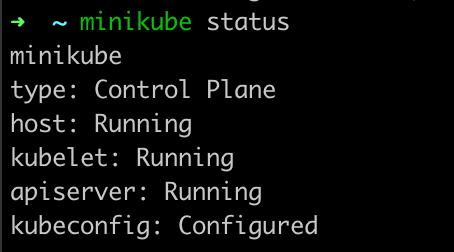

# minikube 简单入门

操作环境： `mac m1 pro`

::: tips 参考 

* https://minikube.sigs.k8s.io/docs/start/

* https://kubernetes.io/zh-cn/docs/tutorials/hello-minikube/

:::

## 安装

> 注意换源，不然会浪费比较多梯子流量。

```shell
brew install minikube
```


## 启动

```shell
minikube start
```

* 检查是否运行成功

```shell
minikube status
```



成功如上所示，其他再行谷歌～


## 注意事项

